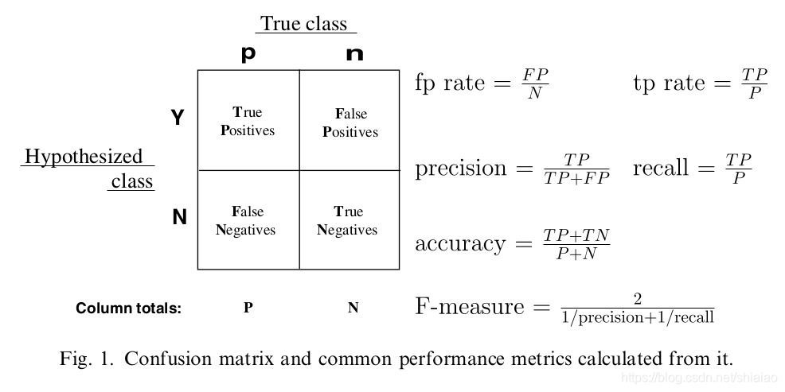

# 2.9 模型性能的评价
当我们经过前面的学习之后，我们已经学会了关于模型的基本操作，并且能够得到一个模型。那么，我们得到的模型性能怎么样，能否达到我们的预期和标准，就需要一些评价指标。

经过本节的学习，你将收获：

- 混淆矩阵的定义
- Acc（准确度）的定义
- 利用sklearn库表达混淆矩阵


## 2.9.1 什么是混淆矩阵
在机器学习领域，混淆矩阵（confusion matrix），又称为可能性表格或是错误矩阵。它是一种特定的矩阵用来呈现算法性能的可视化效果，通常是监督学习（非监督学习，通常用匹配矩阵：matching matrix）。其每一列代表预测值，每一行代表的是实际的类别。这个名字来源于它可以非常容易的表明多个类别是否有混淆（也就是一个class被预测成另一个class）。

下面可以用一张图来形象地介绍以下混淆矩阵。

（图源：[机器学习常用评价指标：ACC、AUC、ROC曲线](https://blog.csdn.net/shiaiao/article/details/108936801)）

在上图中，我们可以看到，混淆矩阵中存在TP（True Positives）、FP（False Positives）、FN（False Negatives）、TN（True Negatives）四种情况,它们分别是指：
TP(True Positive):样本预测值与真实值相符且均为正，即**真阳性**
FP(False Positive):样本预测值为正而真实值为负，即**假阳性**
FN(False Negative):样本预测值为负而真实值为正，即**假阴性**
TN(True Negative):样本预测值与真实值相符且均为负，即**真阴性**

所以，混淆矩阵为我们列出的，就是我们训练的模型在预测时会出现的四种情况。基于这四种情况，我们给出Acc的定义。

## 2.9.2 Acc(准确度)
准确度，字面意思就是用来衡量模型预测的准确程度。基于上一节的TP、FP、FN和TN，我们给出Acc的定义式。
**Acc的定义如下：**
$
Acc=\frac{TP+TN}{TP+FP+FN+TN}
$
也就是真阳性加真阴性除以所有样本数，说白了，就是**预测正确的样本数除以总样本数**。

## 2.9.3 利用sklearn库表达混淆矩阵
调用sklearn表达和求解混淆矩阵时，需要调用如下的库
```py
from sklearn.metrics import confusion_matrix
```
然后分别给出真实标签和预测结果，就可以求解混淆矩阵。

我们举一个简单的例子，并对于所得结果进行说明。
```py
from sklearn.metrics import confusion_matrix  # 导入混淆矩阵函数

y_label = ["lion", "tiger", "lion", "cat", "cat", "tiger"]  # 真实标签列表
y_pred = ["lion", "cat", "lion", "cat", "lion", "tiger"]  # 预测标签列表

# 调用confusion_matrix函数，计算混淆矩阵
C = confusion_matrix(y_label, y_pred, labels=["lion", "tiger", "cat"])

print("The confusion matrix for this model is")  # 打印提示信息
print(C)  # 打印混淆矩阵结果
```
这段代码使用了scikit-learn库中的confusion_matrix函数来计算混淆矩阵。

**参数说明：**

- y_label: 真实标签的列表，包含了样本的真实分类结果。
- y_pred: 预测标签的列表，包含了模型对样本的预测结果。
- labels: 可选参数，指定分类标签的顺序。默认情况下，它将根据y_label和y_pred中出现的标签自动排序。
  
**代码逻辑：**
- 导入了sklearn.metrics模块中的confusion_matrix函数。
- 定义了一个包含真实标签和预测标签的示例数据。
- 调用confusion_matrix函数，传入真实标签y_label、预测标签y_pred和可选参数labels。
- 该函数将计算混淆矩阵，即将真实标签和预测标签进行比较并生成一个二维矩阵，用于评估模型的性能。
- 使用print函数输出"The_confusion matrix for this model is"的提示信息。
- 使用print函数输出计算得到的混淆矩阵C。

**注意事项：**
- 确保导入了sklearn.metrics模块，否则会导致代码运行失败。
- 确保y_label和y_pred的长度相同，以便正确计算混淆矩阵。
- labels参数可选，如果不指定，将根据y_label和y_pred中出现的标签自动排序。

**结果说明**:
```py
The confusion matrix for this model is
[[2 0 0]
 [0 1 1]
 [1 0 1]]
```
其中，**每一列的表头是预测值，而每一行的表头是真实值**。例如第一行第一列的2就代表有两个被预测为狮子的样本真实标签也是狮子，而第二行第三列的1就代表一个被预测为猫的样本真实标签是老虎。**主对角线之和除以矩阵所有元素之和就是预测的准确率**。


## 参考资料
1. [sklearn中混淆矩阵（confusion_matrix函数）的理解与使用](https://blog.csdn.net/SartinL/article/details/105844832)
2. [机器学习常用评价指标：ACC、AUC、ROC曲线](https://blog.csdn.net/shiaiao/article/details/108936801)
3. chatGPT