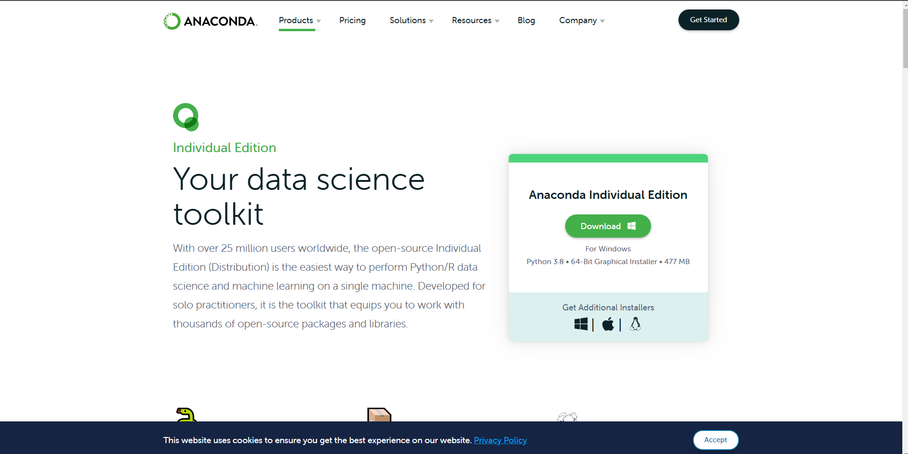
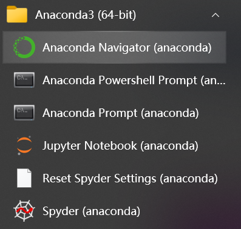

# PyTorch简介

PyTorch是由Meta AI(Facebook)人工智能研究小组开发的一种基于Lua编写的Torch库的Python实现的深度学习库，目前被广泛应用于学术界和工业界，相较于其他的深度学习框架，PyTorch在API的设计上更加简洁、优雅和易懂。因此本课程我们选择PyTorch来进行开源学习。

经过本节的学习，你将收获：

- 了解PyTorch的发展流程
- 了解PyTorch相较于其他框架的优势
- 动手实现Anaconda/Miniconda的安装
- 动手实现PyTorch的安装

## 1.1 PyTorch

PyTorch是一种深度学习框架，由Meta AI (前Facebook)的人工智能研究小组开发。它基于Lua编程语言构建的Torch库，是Torch库的Python实现版本。PyTorch的设计理念强调简洁性和易用性，其API的设计更直观，使得深度学习模型的开发和理解变得更为容易。这些特性使得许多学术界和工业界的研究者和开发者都选择使用PyTorch，因此本课程我们也选择PyTorch来进行开源学习。

PyTorch自发布以来，受到了广大研究者和开发者的热烈欢迎和广泛关注。根据[Paper with code](https://paperswithcode.com/trends)网站的数据，截至2021年6月，使用PyTorch实现的论文公开代码库的数量已经是使用TensorFlow实现的四倍。这一趋势表明，PyTorch正在逐渐成为学术界的主流深度学习框架。

在2022年的PyTorch Conference上，研发团队介绍了PyTorch 2.0的新特性。PyTorch 2.0在多个方面都有所改进和提升，包括模型训练速度的提高，注意力机制的增强，以及推理性能的优化。这些改进和提升，使得PyTorch在深度学习框架中的地位更加稳固，也进一步加强了其在学术界和工业界中的应用。


总的来说，PyTorch相较于现有的深度学习框架有着以下的优势

+ **动态计算图**：与TensorFlow等框架的静态计算图不同，PyTorch使用的是动态计算图。这意味着你可以在运行时更改你的图形，这使得更容易进行调试和优化。
+ **易于使用**：PyTorch的API设计得很简单易懂，这使得开发和理解深度学习模型变得更容易。
+ **优秀的文档和强大社区支持**：作者亲自维护的论坛供用户交流和求教问题。Meta AI(Facebook AI)对PyTorch提供了强力支持，作为当今排名前三的深度学习研究机构，MAIR的支持足以确保PyTorch获得持续的开发更新。
+ **Pythonic**：PyTorch非常符合Python的风格，如果你熟悉Python的话，那么你可以很快地学会PyTorch。
+ **丰富的工具集**：PyTorch提供了一套完整的工具和库，包括用于图像处理的TorchVision，用于自然语言处理的TorchText等。

## 1.2 PyTorch的安装

PyTorch的安装是我们学习PyTorch的第一步，也是经常出错的一步。在安装PyTorch时，我们通常使用的是**Anaconda/miniconda+Pytorch**的流程。

### 1.2.1 Anaconda/Miniconda的安装

在数据科学和最近很火的深度学习中，要用到大量成熟的package。我们一个个安装 package 很麻烦，而且很容易出现包之间的依赖不适配的问题。而 Anaconda/miniconda的出现很好的解决了我们的问题，它集成了常用于科学分析（机器学习， 深度学习）的大量package，并且借助于conda我们可以实现对虚拟Python环境的管理。

#### Step 1：安装Anaconda/miniconda

登陆[Anaconda | Individual Edition](https://www.anaconda.com/products/individual)，选择相应系统DownLoad，此处以Windows为例（Linux可以点击[链接](https://docs.conda.io/en/latest/miniconda.html)选择合适的版本进行下载或者通过官方提供的shell脚本进行下载）：



官方源的安装下载速度可能比较慢，因此我们建议从清华源的[镜像](https://mirrors.tuna.tsinghua.edu.cn/anaconda/miniconda/)上安装Anaconda/miniconda。Linux的用户，可以执行如下的命令进行安装：

```bash
# 下载安装脚本
wget -c https://mirrors.tuna.tsinghua.edu.cn/anaconda/miniconda/Miniconda3-latest-Linux-x86_64.sh  

# 修改权限
chmod 777 Miniconda3-latest-Linux-x86_64.sh  

# 执行安装脚本
bash Miniconda3-latest-Linux-x86_64.sh

# 删除安装脚本
rm Miniconda3-latest-Linux-x86_64.sh  

# 刷新环境变量
source ~/.bashrc
```

#### Step 2：检验是否安装成功

在开始页找到Anaconda Prompt，一般在Anaconda3的文件夹下。



Linux用户可以在Terminal中输入`conda -V`或者`conda -h`检验是否安装成功。如果安装成功，会出现下面的输出

```bash
conda -V
conda 23.3.1 # conda的版本号

conda -h # 查看conda的参数
usage: conda [-h] [-V] command ...

conda is a tool for managing and deploying applications, environments and packages.

Options:

positional arguments:
  command
    clean             Remove unused packages and caches.
    compare           Compare packages between conda environments.
    config            Modify configuration values in .condarc. This is modeled after the git config command. Writes to the user .condarc file (/home/v-zhikangniu/.condarc) by default.
                      Use the --show-sources flag to display all identified configuration locations on your computer.
    create            Create a new conda environment from a list of specified packages.
    info              Display information about current conda install.
    init              Initialize conda for shell interaction.
    install           Installs a list of packages into a specified conda environment.
    list              List installed packages in a conda environment.
    package           Low-level conda package utility. (EXPERIMENTAL)
    remove (uninstall)
                      Remove a list of packages from a specified conda environment. Use `--all` flag to remove all packages and the environment itself.
    rename            Renames an existing environment.
    run               Run an executable in a conda environment.
    search            Search for packages and display associated information.The input is a MatchSpec, a query language for conda packages. See examples below.
    update (upgrade)  Updates conda packages to the latest compatible version.
    notices           Retrieves latest channel notifications.

options:
  -h, --help          Show this help message and exit.
  -V, --version       Show the conda version number and exit.

conda commands available from other packages (legacy):
  content-trust
  env
```

#### Step 3：创建虚拟环境

在上一步成功安装完后，我们就可以使用conda管理我们的虚拟环境了。conda可以帮助我们在不同的虚拟环境里面安装不同版本的Python，PyTorch，解决一些有着强版本依赖问题的项目。

**创建虚拟环境**

```bash
conda create -n env_name python==version 
# 注：将env_name 替换成你的环境的名称，version替换成对应的版本号，eg：3.8
# conda create -n torch python==3.9 # 新建的虚拟环境叫torch，python版本是3.9
```

**Conda 常见的命令**

关于更多的命令，我们可以查看Anaconda/miniconda官方提供的命令，[官网链接](https://docs.conda.io/projects/conda/en/latest/commands.html#conda-general-commands)

```bash
# 安装包
conda install package_name # 注：package_name 替换成对应的包的名称，eg: pandas

# 卸载包
conda remove package_name # 注：package_name 替换成对应的包的名称，eg: pandas

# 显示安装的所有包
conda list

# 删除虚拟环境
conda remove -n env_name --all # 注：env_name 替换成对应的环境的名称

# 
conda env list 

# 激活虚拟环境
conda activate env_name # 注：env_name 替换成对应的环境的名称

# 退出当前环境
conda deactivate
```

### 1.2.2 安装PyTorch

#### Step 0 : 查看设备显卡型号[安装CUDA版本的PyTorch]

**windows：**

我们可以通过在`cmd/terminal中`输入`nvidia-smi/nvcc -V`、使用NVIDIA控制面板和使用任务管理器查看自己是否有NVIDIA的独立显卡及其型号


**linux：**


我们需要看下版本号，看自己可以兼容的CUDA版本，等会安装PyTorch时是可以向下兼容的。具体适配表如下图所示。


#### Step 1 : 在线下载

在查看完我们的设备要求后，我们可以登录[PyTorch官网](https://pytorch.org/)点击Get Started选择符合自己设备的PyTorch版本，如果没有找到符合当前设备的PyTorch版本，我们可以查看[PyTorch previous version](https://pytorch.org/get-started/previous-versions/)选择符合自己设备的PyTorch安装命令。


在找到符合我们设备的PyTorch安装命令后，我们可以通过下面的示例完成安装。

```shell
# 激活创建的虚拟环境，env_name改成自己的环境名称
conda activate env_name 

# 复制符合设备的命令
# conda install pytorch==2.0.0 torchvision==0.15.0 torchaudio==2.0.0 pytorch-cuda=11.7 -c pytorch -c nvidia 
```

如果发现自己的下载PyTorch速度很慢，可以查看FAQ文档，进行conda的换源，使用清华源进行PyTorch的安装。

#### Step 2 : 离线下载

在安装的过程中，我们可能会因为网络波动的问题，导致在线下载不成功，这时候我们可以使用**离线下载**的方法进行。我们可以通过[官方](https://download.pytorch.org/whl/torch/)的下载地址下载好对应版本的pytorch和 torchvision 包，然后按照下面的步骤安装离线包。

```bash
# 进入离线安装包的下载的地方
cd package_location

# 激活虚拟环境
conda activate env_name
```

接下来输入以下命令安装两个包

```bash
conda install --offline 离线下载好的包的全称

pip install 离线下载好的包的全称
```

### 1.2.3 ：检验安装是否成功

进入所在的**虚拟环境**，紧接着输入`python`，在输入下面的代码。

```python
import torch
# 如果我们安装的是CPU版本的，该函数返回False，如果是GPU版本，返回True
torch.cuda.is_available()
```

```bash
True
```

这条命令意思是检验是否可以调用cuda，如果我们**安装的是CPU版本的话会返回False，能够调用GPU的会返回True**。一般这个命令不报错的话就证明安装成功。

## 1.3 PyTorch相关资源

1. [Awesome-pytorch-list](https://github.com/bharathgs/Awesome-pytorch-list)：目前已获12K Star，包含了NLP,CV,常见库，论文实现以及Pytorch的其他项目。
2. [PyTorch官方文档](https://pytorch.org/docs/stable/index.html)：官方发布的文档，十分丰富。
3. [Pytorch-handbook](https://github.com/zergtant/pytorch-handbook)：GitHub上已经收获14.8K，pytorch手中书。
4. [PyTorch官方社区](https://discuss.pytorch.org/)：PyTorch拥有一个活跃的社区，在这里你可以和开发pytorch的人们进行交流。
5. [PyTorch官方tutorials](https://pytorch.org/tutorials/)：官方编写的tutorials，可以结合colab边动手边学习
6. [动手学深度学习](https://zh.d2l.ai/)：动手学深度学习是由李沐老师主讲的一门深度学习入门课，拥有成熟的书籍资源和课程资源，在B站，Youtube均有回放。
7. [Awesome-PyTorch-Chinese](https://github.com/INTERMT/Awesome-PyTorch-Chinese)：常见的中文优质PyTorch资源
8. [labml.ai Deep Learning Paper Implementations](https://github.com/labmlai/annotated_deep_learning_paper_implementations)：手把手实现经典网络代码
9. [YSDA course in Natural Language Processing](https://github.com/yandexdataschool/nlp_course):YSDA course in Natural Language Processing
10. [PyTorch examples](https://github.com/pytorch/examples): A set of examples around pytorch in Vision, Text, Reinforcement Learning, etc.
11. [huggingface](https://huggingface.co/): hugging face
12. [ModelScope](https://modelscope.cn/models): 魔搭社区

除此之外，在b站，stackoverflow，知乎还有很多pytorch的资源，但是我们还是建议大家多看PyTorch官方的examples,tutorials和官方文档。我们希望大家可以在查阅文档的过程中不断学习。
