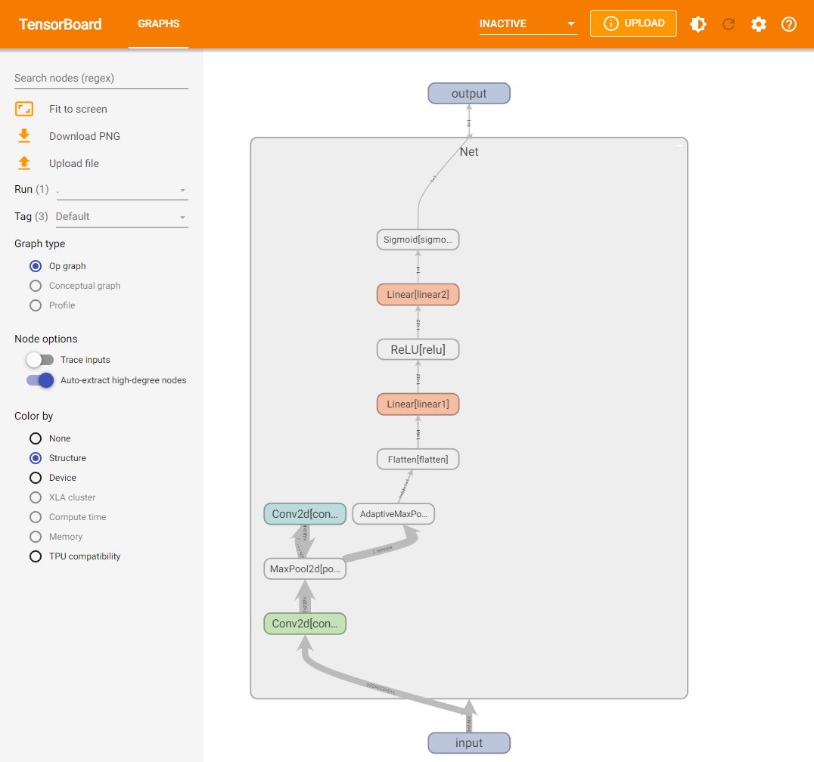
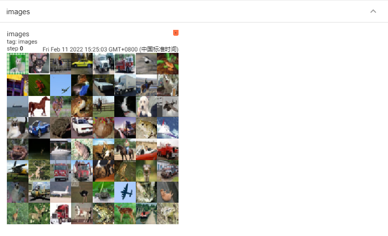
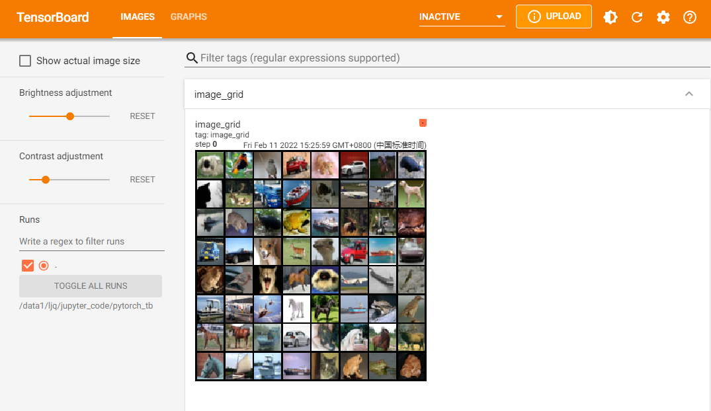
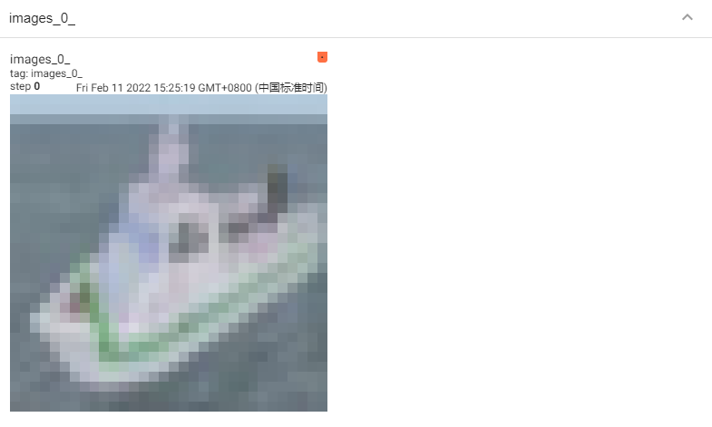
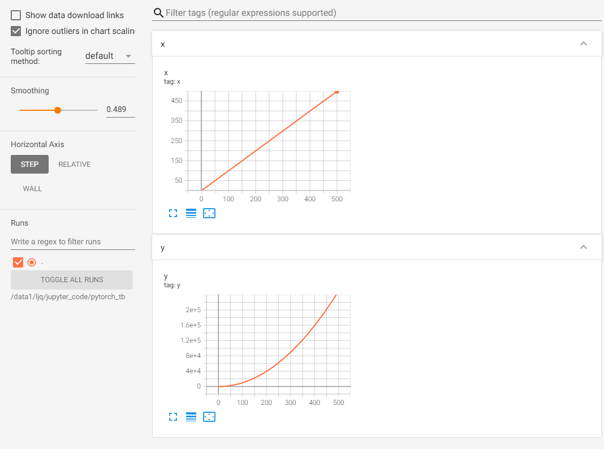
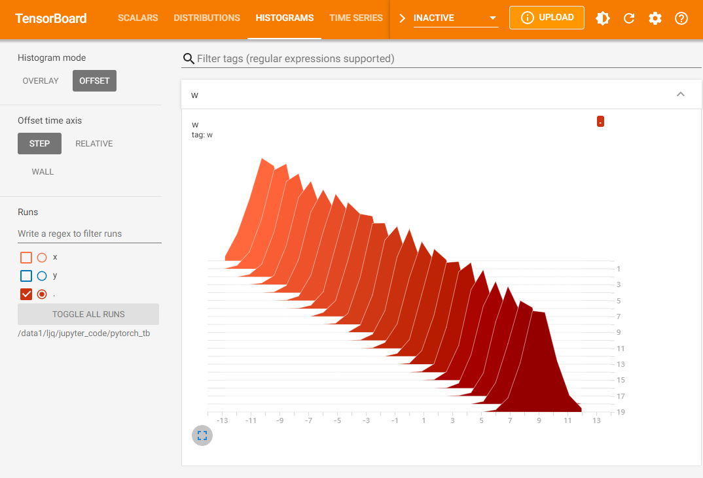
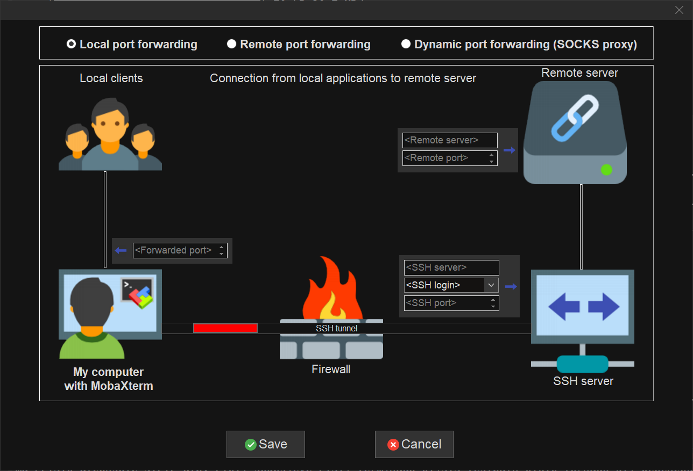
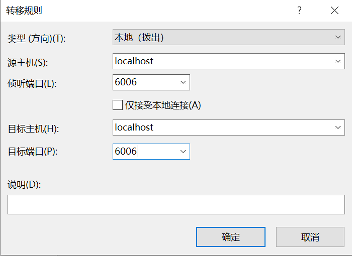

# 7.3 使用TensorBoard可视化训练过程

训练过程的可视化在深度学习模型训练中扮演着重要的角色。学习的过程是一个优化的过程，我们需要找到最优的点作为训练过程的输出产物。一般来说，我们会结合训练集的损失函数和验证集的损失函数，绘制两条损失函数的曲线来确定训练的终点，找到对应的模型用于测试。那么除了记录训练中每个epoch的loss值，能否实时观察损失函数曲线的变化，及时捕捉模型的变化呢？

此外，我们也希望可视化其他内容，如输入数据（尤其是图片）、模型结构、参数分布等，这些对于我们在debug中查找问题来源非常重要（比如输入数据和我们想象的是否一致）。

TensorBoard作为一款可视化工具能够满足上面提到的各种需求。TensorBoard由TensorFlow团队开发，最早和TensorFlow配合使用，后来广泛应用于各种深度学习框架的可视化中来。本节我们探索TensorBoard的强大功能，希望帮助读者“从入门到精通”。

经过本节的学习，你将收获：

- 安装TensorBoard工具
- 了解TensorBoard可视化的基本逻辑
- 掌握利用TensorBoard实现训练过程可视化
- 掌握利用TensorBoard完成其他内容的可视化


## 7.3.1 TensorBoard安装

在已安装PyTorch的环境下使用pip安装即可：

```bash
pip install tensorboardX
```

也可以使用PyTorch自带的tensorboard工具，此时不需要额外安装tensorboard。

## 7.3.2 TensorBoard可视化的基本逻辑

我们可以将TensorBoard看做一个记录员，它可以记录我们指定的数据，包括模型每一层的feature map，权重，以及训练loss等等。TensorBoard将记录下来的内容保存在一个用户指定的文件夹里，程序不断运行中TensorBoard会不断记录。记录下的内容可以通过网页的形式加以可视化。

## 7.3.3 TensorBoard的配置与启动

在使用TensorBoard前，我们需要先指定一个文件夹供TensorBoard保存记录下来的数据。然后调用tensorboard中的SummaryWriter作为上述“记录员”

```python
from tensorboardX import SummaryWriter

writer = SummaryWriter('./runs')
```

上面的操作实例化SummaryWritter为变量writer，并指定writer的输出目录为当前目录下的"runs"目录。也就是说，之后tensorboard记录下来的内容都会保存在runs。

如果使用PyTorch自带的tensorboard，则采用如下方式import：

```python
from torch.utils.tensorboard import SummaryWriter
```

这里聪明的你可能发现了，是否可以手动往runs文件夹里添加数据用于可视化，或者把runs文件夹里的数据放到其他机器上可视化呢？答案是可以的。只要数据被记录，你可以将这个数据分享给其他人，其他人在安装了tensorboard的情况下就会看到你分享的数据。

启动tensorboard也很简单，在命令行中输入

```bash
tensorboard --logdir=/path/to/logs/ --port=xxxx
```

其中“path/to/logs/"是指定的保存tensorboard记录结果的文件路径（等价于上面的“./runs"，port是外部访问TensorBoard的端口号，可以通过访问ip:port访问tensorboard，这一操作和jupyter notebook的使用类似。如果不是在服务器远程使用的话则不需要配置port。

有时，为了tensorboard能够不断地在后台运行，也可以使用nohup命令或者tmux工具来运行tensorboard。大家可以自行搜索，这里不展开讨论了。

下面，我们将模拟深度学习模型训练过程，来介绍如何利用TensorBoard可视化其中的各个部分。

## 7.3.4 TensorBoard模型结构可视化

首先定义模型：

```python
import torch.nn as nn

class Net(nn.Module):
    def __init__(self):
        super(Net, self).__init__()
        self.conv1 = nn.Conv2d(in_channels=3,out_channels=32,kernel_size = 3)
        self.pool = nn.MaxPool2d(kernel_size = 2,stride = 2)
        self.conv2 = nn.Conv2d(in_channels=32,out_channels=64,kernel_size = 5)
        self.adaptive_pool = nn.AdaptiveMaxPool2d((1,1))
        self.flatten = nn.Flatten()
        self.linear1 = nn.Linear(64,32)
        self.relu = nn.ReLU()
        self.linear2 = nn.Linear(32,1)
        self.sigmoid = nn.Sigmoid()

    def forward(self,x):
        x = self.conv1(x)
        x = self.pool(x)
        x = self.conv2(x)
        x = self.pool(x)
        x = self.adaptive_pool(x)
        x = self.flatten(x)
        x = self.linear1(x)
        x = self.relu(x)
        x = self.linear2(x)
        y = self.sigmoid(x)
        return y

model = Net()
print(model)
```

输出如下：

```
Net(
  (conv1): Conv2d(3, 32, kernel_size=(3, 3), stride=(1, 1))
  (pool): MaxPool2d(kernel_size=2, stride=2, padding=0, dilation=1, ceil_mode=False)
  (conv2): Conv2d(32, 64, kernel_size=(5, 5), stride=(1, 1))
  (adaptive_pool): AdaptiveMaxPool2d(output_size=(1, 1))
  (flatten): Flatten(start_dim=1, end_dim=-1)
  (linear1): Linear(in_features=64, out_features=32, bias=True)
  (relu): ReLU()
  (linear2): Linear(in_features=32, out_features=1, bias=True)
  (sigmoid): Sigmoid()
)
```

可视化模型的思路和7.1中介绍的方法一样，都是给定一个输入数据，前向传播后得到模型的结构，再通过TensorBoard进行可视化，使用add_graph：

```python
writer.add_graph(model, input_to_model = torch.rand(1, 3, 224, 224))
writer.close()
```

展示结果如下（其中框内部分初始会显示为“Net"，需要双击后才会展开）：



## 7.3.5 TensorBoard图像可视化

当我们做图像相关的任务时，可以方便地将所处理的图片在tensorboard中进行可视化展示。

- 对于单张图片的显示使用add_image
- 对于多张图片的显示使用add_images
- 有时需要使用torchvision.utils.make_grid将多张图片拼成一张图片后，用writer.add_image显示

这里我们使用torchvision的CIFAR10数据集为例：

```python
import torchvision
from torchvision import datasets, transforms
from torch.utils.data import DataLoader

transform_train = transforms.Compose(
    [transforms.ToTensor()])
transform_test = transforms.Compose(
    [transforms.ToTensor()])

train_data = datasets.CIFAR10(".", train=True, download=True, transform=transform_train)
test_data = datasets.CIFAR10(".", train=False, download=True, transform=transform_test)
train_loader = DataLoader(train_data, batch_size=64, shuffle=True)
test_loader = DataLoader(test_data, batch_size=64)

images, labels = next(iter(train_loader))
 
# 仅查看一张图片
writer = SummaryWriter('./pytorch_tb')
writer.add_image('images[0]', images[0])
writer.close()
 
# 将多张图片拼接成一张图片，中间用黑色网格分割
# create grid of images
writer = SummaryWriter('./pytorch_tb')
img_grid = torchvision.utils.make_grid(images)
writer.add_image('image_grid', img_grid)
writer.close()
 
# 将多张图片直接写入
writer = SummaryWriter('./pytorch_tb')
writer.add_images("images",images,global_step = 0)
writer.close()
```

依次运行上面三组可视化（注意不要同时在notebook的一个单元格内运行），得到的可视化结果如下（最后运行的结果在最上面）：







另外注意上方menu部分，刚刚只有“GRAPHS"栏对应模型的可视化，现在则多出了”IMAGES“栏对应图像的可视化。左侧的滑动按钮可以调整图像的亮度和对比度。

此外，除了可视化原始图像，TensorBoard提供的可视化方案自然也适用于我们在Python中用matplotlib等工具绘制的其他图像，用于展示分析结果等内容。

## 7.3.6 TensorBoard连续变量可视化

TensorBoard可以用来可视化连续变量（或时序变量）的变化过程，通过add_scalar实现：

```python
writer = SummaryWriter('./pytorch_tb')
for i in range(500):
    x = i
    y = x**2
    writer.add_scalar("x", x, i) #日志中记录x在第step i 的值
    writer.add_scalar("y", y, i) #日志中记录y在第step i 的值
writer.close()
```

可视化结果如下：



如果想在同一张图中显示多个曲线，则需要分别建立存放子路径（使用SummaryWriter指定路径即可自动创建，但需要在tensorboard运行目录下），同时在add_scalar中修改曲线的标签使其一致即可：

```python
writer1 = SummaryWriter('./pytorch_tb/x')
writer2 = SummaryWriter('./pytorch_tb/y')
for i in range(500):
    x = i
    y = x*2
    writer1.add_scalar("same", x, i) #日志中记录x在第step i 的值
    writer2.add_scalar("same", y, i) #日志中记录y在第step i 的值
writer1.close()
writer2.close()
```


这里也可以用一个writer，但for循环中不断创建SummaryWriter不是一个好选项。此时左下角的Runs部分出现了勾选项，我们可以选择我们想要可视化的曲线。曲线名称对应存放子路径的名称（这里是x和y）。

这部分功能非常适合损失函数的可视化，可以帮助我们更加直观地了解模型的训练情况，从而确定最佳的checkpoint。左侧的Smoothing滑动按钮可以调整曲线的平滑度，当损失函数震荡较大时，将Smoothing调大有助于观察loss的整体变化趋势。

## 7.3.7 TensorBoard参数分布可视化

当我们需要对参数（或向量）的变化，或者对其分布进行研究时，可以方便地用TensorBoard来进行可视化，通过add_histogram实现。下面给出一个例子：

```python
import torch
import numpy as np

# 创建正态分布的张量模拟参数矩阵
def norm(mean, std):
    t = std * torch.randn((100, 20)) + mean
    return t
 
writer = SummaryWriter('./pytorch_tb/')
for step, mean in enumerate(range(-10, 10, 1)):
    w = norm(mean, 1)
    writer.add_histogram("w", w, step)
    writer.flush()
writer.close()
```

结果如下：



## 7.3.8 服务器端使用TensorBoard
一般情况下，我们会连接远程的服务器来对模型进行训练，但由于服务器端是没有浏览器的（纯命令模式），因此，我们需要进行相应的配置，才可以在本地浏览器，使用tensorboard查看服务器运行的训练过程。
本文提供以下几种方式进行，其中前两种方法都是建立SSH隧道，实现远程端口到本机端口的转发，最后一种方法适用于没有下载Xshell等SSH连接工具的用户
- MobaXterm
	1. 在MobaXterm点击Tunneling
	2. 选择New SSH tunnel，我们会出现以下界面。

    
	3. 对新建的SSH通道做以下设置，第一栏我们选择`Local port forwarding`，`< Remote Server>`我们填写**localhost**，`< Remote port>`填写6006，tensorboard默认会在6006端口进行显示，我们也可以根据 **tensorboard --logdir=/path/to/logs/ --port=xxxx**的命令中的port进行修改，`< SSH server>` 填写我们连接服务器的ip地址，`<SSH login>`填写我们连接的服务器的用户名，`<SSH port>`填写端口号（通常为22），`< forwarded port>`填写的是本地的一个端口号，以便我们后面可以对其进行访问。
	4. 设定好之后，点击Save，然后Start。在启动tensorboard，这样我们就可以在本地的浏览器输入`http://localhost:6006/`对其进行访问了
- Xshell 
	1. Xshell的连接方法与MobaXterm的连接方式本质上是一样的，具体操作如下：
	2. 连接上服务器后，打开当前会话属性，会出现下图，我们选择隧道，点击添加
	
	3. 按照下方图进行选择，其中目标主机代表的是服务器，源主机代表的是本地，端口的选择根据实际情况而定。
	
	4. 启动tensorboard，在本地127.0.0.1:6006 或者 localhost:6006进行访问。
- SSH
	1. 该方法是将服务器的6006端口重定向到自己机器上来，我们可以在本地的终端里输入以下代码：其中16006代表映射到本地的端口，6006代表的是服务器上的端口。
	```shell
      ssh -L 16006:127.0.0.1:6006 username@remote_server_ip
	```
	2. 在服务上使用默认的6006端口正常启动tensorboard
	```shell
	tensorboard --logdir=xxx --port=6006
	```
	3. 在本地的浏览器输入地址
	```shell
	127.0.0.1:16006 或者 localhost:16006
	```
## 7.3.9 总结

对于TensorBoard来说，它的功能是很强大的，可以记录的东西不只限于本节所介绍的范围。

主要的实现方案是构建一个SummaryWriter，然后通过`add_XXX()`函数来实现。

其实TensorBoard的逻辑还是很简单的，它的**基本逻辑就是文件的读写逻辑**，写入想要可视化的数据，然后TensorBoard自己会读出来。

## 参考资料

1. https://blog.csdn.net/Python_Ai_Road/article/details/107704530


