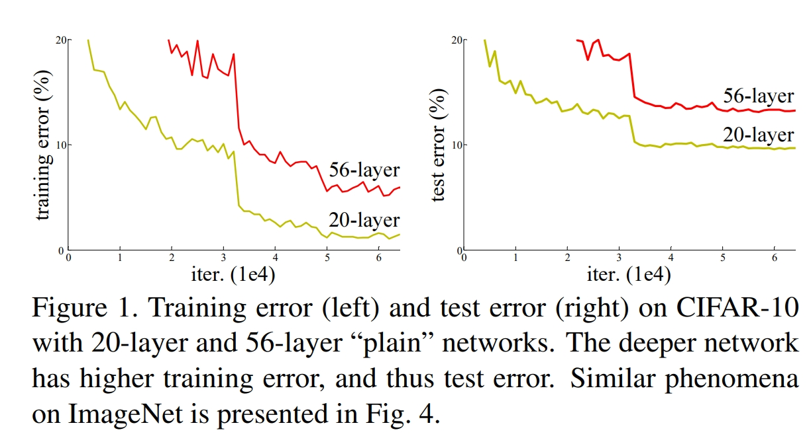

# 3.1 ResNet简介

在上一章中，我们使用了PyTorch来创建一个简单的神经网络，并在Fashion Mnist数据集上进行了训练和评估。在本章中，我们将讨论如何构建一个更高效的模型来处理Fashion Mnist数据集。同时，我们还将分享一些关于PyTorch的实用技巧，帮助大家更好地理解和应用这个工具。

在这篇文章中，我们将介绍一个叫做残差神经网络（ResNet）的模型。ResNet是由何恺明、张祥雨、任少卿、孙剑等人在微软研究院提出的。这个模型的主要贡献在于他们发现当网络层数增加时，训练精度会逐渐趋于饱和。而当继续增加层数时，训练精度反而会下降，这并不是过拟合引起的问题。他们将这个问题称为“退化现象（Degradation）”，并通过引入“快捷连接（Shortcut connection）”来解决这个问题，从而极大地缓解了深度神经网络训练的困难。这使得神经网络的深度首次突破了100层，甚至有些最大的神经网络超过了1000层。这篇论文提出的解决方案使我们能够构建更深的神经网络。这篇文章中介绍的shortcut connection也在一些著名网络模型中得到了应用，比如AlphaGo、AlphaFold和Transformer。

在这篇文章中，你将学习以下内容：

- 梯度消失和梯度爆炸的基本概念
- 快捷连接(Shortcut connection)的原理
- ResNet的整体结构

## 3.1.1 基本介绍

AlexNet的出现掀起了第三次人工智能的浪潮，人们利用神经网络去解决以前遇到的问题，人们发现多层卷积或者全连接网络的效果大于单层卷积或者全连接网络，堆叠多层神经网络有助于模型拥有更强大的能力。于是很多人潜意识认为网络的层数越多，其效果就会越好。但是当时在微软研究院的何恺明、张祥雨、任少卿、孙剑等人发现加深网络的深度后，整个网络的效果反而变差了许多，我们可以从下图看出，在相同的设置下，更深的网络(56-layer)反而比浅层的网络(20-layer)效果更差，他们将这种现象称之为**退化现象**。他们认为这个问题出现的原因网络在信息传递的时候或多或少会存在信息丢失，损耗等问题。

同时随着神经网络的加深，训练时还可能出现**梯度消失**或者**梯度爆炸**现象。接下来我们详细的解释一下**梯度消失**和**梯度爆炸**。

梯度消失和梯度爆炸的根源主要是因为目前神经网络的参数优化的工程都是基于梯度反向传播的思想，即根据损失函数计算的误差通过反向传播的方式，指导深度网络权值的更新。但是随着网络结构越来越深，误差梯度在更新中不断累积，变成非常大的梯度， **网络层之间的梯度（值大于 1.0）重复相乘将会导致的指数级增长会产生梯度爆炸。**在极端情况下，权重的值变得非常大，以至于溢出，导致 NaN 值；同时，模型梯度不断的积累也会导致网络权重的大幅更新，这样可能会导致模型不能很好的收敛。

同理，在某些情况下，当我们**网络层之间的梯度（值小于 1.0）重复相乘这将导致的梯度指数级变小产生梯度消失**。在最坏的情况下，这可能会导致神经网络的权重更新的步伐变得非常缓慢，导致模型性能下降。具体来说，梯度消失可能会导致模型欠拟合，也就是模型无法学习到数据的真实分布。

针对这个问题，他们提出了ResNet以期望解决这个问题。ResNet最大的贡献在于添加了`shortcut connection`，即就是添加了一个支路，将输入直接连接到后面的层，这种看似简单的方法一定程度缓解了模型退化、梯度消失和梯度爆炸的问题，因为模型可以自己去选择是学习支路还是继续学习中间的网络层，保证了信号的流通。

## 3.1.2 关键思想

ResNet的关键思想在于解决深度神经网络中的梯度消失和梯度爆炸问题，从而允许构建更深层次的神经网络。通过引入残差学习（Residual Learning）来解决梯度问题，于是提出以下方案：

**快捷连接**： 在每个残差块中，引入了一个快捷连接（shortcut connection），将输入直接连接到后续层，形成了残差路径。模型在训练的过程中学习残差，即网络的实际输出与输入之间的差异。通过将输入与残差相加的方式实现。
**模块堆叠** ：模型不断的堆叠，当我们引入了快捷连接（shortcut connection）后，我们就可以不断堆叠最基础的模型块然后加深我们的网络。不同堆叠的次数对应着不同的ResNet结构，包括ResNet18，ResNet34，ResNet101，ResNet152.

残差连接使得梯度可以直接通过跳过层的方式传播，缓解了梯度消失和梯度爆炸问题。即使在非常深的网络中，梯度仍能够有效地传播至较早的层次。 通过堆叠多个残差块，ResNet实现了构建非常深的网络，而不会遇到传统网络中的梯度问题，从而提高了网络性能。

### 残差连接（shortcut connection）

shortcut connection也就是所谓的“抄近道”，它有两种方式，其一为同等维度的映射，即输入输出直接相加（即上图中的$F(x) + x$），另一种为不同维度之间的映射，这时候就需要给$x$补充一个线性映射来匹配维度。

比如下面这个图：

左：VGG-19模型，作为参考。 中：一个有34个参数层的普通网络。 右：一个有34个参数层的残差网络（即resnet34）

在上图最右侧的路径中，我们可以很明显的看到shortcut connection加入了网络之中，同时，图中也很明显的可以看到，实线部分就是进行了单纯的$F(x)+x$操作，而虚线部分，第一个卷积层的stride是2（那个/2的意思就是stride是2）；同时注意到深度也发生了变换，channel数目增加一倍（扩大两倍），这样F(x)的分辨率比x小一半，厚度比x大一倍。在这样的shortcut connection中，就需要补充线性映射来增加维度。在ResNet中，作者使用了1 x 1的卷积核来达到这个目的。

### 模块堆叠

在ResNet中，模块堆叠是构建深度神经网络的关键步骤。基本的构建单元是残差块，它包含两个卷积层和一个残差连接。通过多次堆叠这些残差块，形成了深度不同的ResNet模型。

ResNet在设计时针对不同大小的网络，引入了两种基本模块：BasicBlock 和 BottleNeck。

- BasicBlock模块： 用于构建较小的ResNet，如ResNet-18和ResNet-34。其结构如下：

在BasicBlock中，两个卷积层的结构相对简单，适用于构建相对浅层的ResNet模型。

- BottleNeck模块： 用于构建较大的ResNet，如ResNet-50、ResNet-101和ResNet-152。其结构如下：

BottleNeck模块在结构上引入了更多的参数，具有更高的维度，适用于构建深层的ResNet模型。

模块化的设计使得ResNet网络更易于理解、调整和扩展。不同深度的网络可以通过简单地调整模块的堆叠方式而得到，为后续的扩展微调提供更大的灵活性。

## 3.1.3 总结

ResNet是深度学习领域的一个里程碑式的工作，值得每一个有志于人工智能研究的人认真研究。ResNet（残差神经网络）的贡献可以概括为以下几点。

1. 通过引入快捷连接（shortcut connection）解决了随着网络加深出现的模型退化现象。快捷连接直接将输入特征映射添加到网络的后续层中，允许信息在网络中直接流动，避免了信息的丢失。这种设计使得深度神经网络可以更容易地训练和优化，同时允许网络层数的增加。

2. 支持更深的网络：ResNet的引入使得神经网络的深度首次突破了100层，甚至有些最大的网络超过了1000层。通过解决退化现象，ResNet为研究人员提供了构建更深层次的神经网络的能力。深层网络具有更强大的表示能力，可以更好地捕捉和学习复杂的特征和模式。

3. 实用于多个领域：ResNet的贡献不仅限于深度学习理论，还扩展到多个领域和任务。它在计算机视觉任务中取得了显著的成果，如图像分类、目标检测和图像分割。此外，ResNet的思想也被应用于自然语言处理和语音识别等领域，取得了很好的效果。

4. 启发了后续研究：ResNet的成功启发了后续研究者对网络架构设计的思考。许多基于ResNet的改进网络模型被提出，如Wide ResNet、DenseNet等。这些模型在不同的任务和领域中表现出色，推动了深度学习的发展。

总的来说，ResNet通过解决退化现象和支持更深的神经网络，为深度学习领域带来了重要的突破。它的设计思想和成功应用对于后续研究和实践都产生了深远的影响。我们也将会在接下来的章节里为大家介绍ResNet具体的代码细节和训练过程。

## 参考资料
1. [Deep Residual Learning for Image Recognition](https://arxiv.org/abs/1512.03385)
1. ChatGPT
