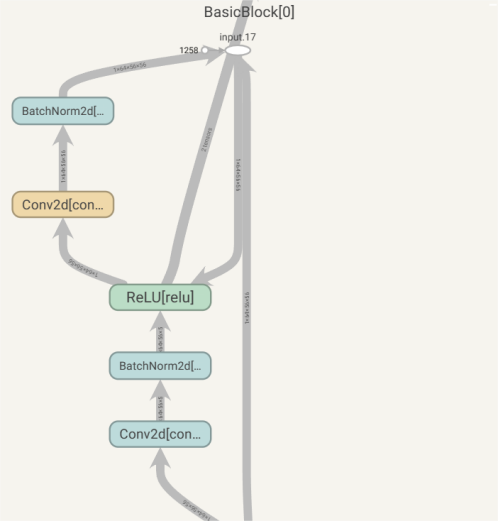
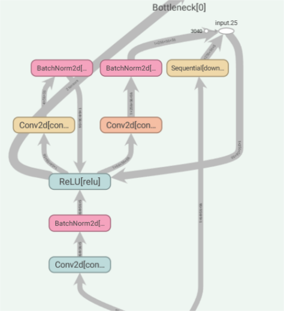

# 3.1 ResNet简介

在上一章节里，我们使用PyTorch搭建了一个最简单的神经网络，并且在Fashion Mnist数据集上进行了训练和模型指标的评测，在本章节我们将会继续围绕如何在Fashion Mnist数据集构建一个效果更好的模型开展。同时，我们也会在本章节带来更多关于PyTorch的使用技巧，帮助大家更好的理解和使用PyTorch。本文我们会带大家了解残差神经网络（ResNet），残差神经网络是由何恺明、张祥雨、任少卿、孙剑等人在微软研究院的提出的模型。它的主要贡献是发现了在增加网络层数的过程中，‎随着训练精度(Training accuracy)‎逐渐趋于饱和，继续增加层数，training accuracy 就会出现下降的现象，而这种下降不是由过拟合造成的。他们将这一现象称之为“退化现象（Degradation）”，并针对退化现象发明了 “快捷连接（Shortcut connection）”，极大的消除了深度过大的神经网络训练困难问题。神经网络的“深度”首次突破了100层、最大的神经网络甚至超过了1000层。

通过本文你将学习到：

- 梯度消失/爆炸的简介
- 残差链接
- ResNet整体结构

## 3.1.1 基本介绍

随着卷积神经网络的出现，人们发现多层卷积或者全连接网络的效果大于单层卷积或者全连接网络。于是很多人潜意识认为网络的层数越多，其效果就会越好。但是当时在微软研究院的何恺明、张祥雨、任少卿、孙剑等人发现加深网络的深度后，整个网络的效果反而变差了许多。他们认为很深的网络无法训练的原因可能是网络在信息传递的时候或多或少会存在信息丢失，损耗等问题，同时还可能出现梯度消失或者梯度爆炸现象。针对这个问题，他们提出了ResNet以期望解决这个问题，ResNet的出现也让神经网络逐渐真正走向深度神经网络，在大家耳熟能详的AlphaGo，AlphaFold和Transformer这些网络中都有用到。ResNet最大的贡献在于添加了shortcut connection将输入直接连接到后面的层，一定程度缓解了梯度消失和梯度爆炸并提高了深度神经网络的效果。接下来我们详细的解释一下**梯度消失**和**梯度爆炸**。

梯度消失和梯度爆炸的根源主要是因为深度神经网络结构以及反向传播算法，目前优化神经网络的方法都是基于梯度反向传播的思想，即根据损失函数计算的误差通过反向传播的方式，指导深度网络权值的更新。误差梯度是神经网络训练过程中计算的方向和数量，用于以正确的方向和合适的量更新网络权重。 在深层网络或循环神经网络中，误差梯度可在更新中累积，变成非常大的梯度，然后导致网络权重的大幅更新，并因此使网络变得不稳定。在极端情况下，权重的值变得非常大，以至于溢出，导致 NaN 值。 **网络层之间的梯度（值大于 1.0）重复相乘导致的指数级增长会产生梯度爆炸。** 在深度多层感知机网络中，梯度爆炸会引起网络不稳定，最好的结果是无法从训练数据中学习，而最坏的结果是出现无法再更新的 NaN 权重值。

而在某些情况下，梯度会变得非常小， **网络层之间的梯度（值小于 1.0）重复相乘导致的指数级变小会产生梯度消失**。在最坏的情况下，这可能会完全停止神经网络的进一步训练。例如，传统的激活函数(如双曲正切函数)具有范围(0,1)内的梯度，反向传播通过链式法则计算梯度。这样做的效果是，用这些小数字的n乘以n来计算n层网络中“前端”层的梯度，这意味着梯度(误差信号)随n呈指数递减，而前端层的训练非常缓慢。最终导致更新停滞。
## 3.1.2 关键思想

ResNet的关键思想在于解决深度神经网络中的梯度消失和梯度爆炸问题，从而允许构建更深层次的神经网络。通过引入残差学习（Residual Learning）来解决梯度问题，于是提出以下方案：

**残差连接**： 在每个残差块中，引入了一个直接连接（shortcut connection），将输入直接连接到后续层，形成了残差路径。模型在训练的过程中学习残差，即网络的实际输出与输入之间的差异。通过将输入与残差相加的方式实现。
**模块堆叠** ：【TODO】

残差连接使得梯度可以直接通过跳过层的方式传播，缓解了梯度消失和梯度爆炸问题。即使在非常深的网络中，梯度仍能够有效地传播至较早的层次。 通过堆叠多个残差块，ResNet实现了构建非常深的网络，而不会遇到传统网络中的梯度问题，从而提高了网络性能。

### 残差连接（shortcut connection）

shortcut connection也就是所谓的“抄近道”，它有两种方式，其一为同等维度的映射，即输入输出直接相加（即上图中的F(x) + x），另一种为不同维度的映射，这时候就需要给x补充一个线性映射来匹配维度。

比如下面这个图：

左：VGG-19模型，作为参考。 中：一个有34个参数层的普通网络。 右：一个有34个参数层的残差网络（即resnet34）

在上图最右侧的路径中，我们可以很明显的看到shortcut connection加入了网络之中，同时，图中也很明显的可以看到，实线部分就是进行了单纯的F(x)+x操作，而虚线部分，第一个卷积层的stride是2（那个/2的意思就是stride是2）；同时注意到深度也发生了变换，channel数目增加一倍（扩大两倍），这样F(x)的分辨率比x小一半，厚度比x大一倍。在这样的shortcut connection中，就需要补充线性映射来增加维度。在ResNet中，作者使用了1 x 1的卷积核来达到这个目的。

### 3.1.3 模块堆叠
在ResNet中，模块堆叠是构建深度神经网络的关键步骤。基本的构建单元是残差块，它包含两个卷积层和一个残差连接。通过多次堆叠这些残差块，形成了深度不同的ResNet模型。

ResNet在设计时针对不同大小的网络，引入了两种基本模块：BasicBlock 和 BottleNeck。

- BasicBlock模块： 用于构建较小的ResNet，如ResNet-18和ResNet-34。其结构如下：

在BasicBlock中，两个卷积层的结构相对简单，适用于构建相对浅层的ResNet模型。

- BottleNeck模块： 用于构建较大的ResNet，如ResNet-50、ResNet-101和ResNet-152。其结构如下：

BottleNeck模块在结构上引入了更多的参数，具有更高的维度，适用于构建深层的ResNet模型。

模块化的设计使得ResNet网络更易于理解、调整和扩展。不同深度的网络可以通过简单地调整模块的堆叠方式而得到，为后续的扩展微调提供更大的灵活性。

## 3.1.4 总结

ResNet的出现，在一定程度上解决了卷积神经网络随深度的增加，但是模型效果却变差的问题，用作者的话说，就是: “Our deep residual nets can easily enjoy accuracy gains from greatly increased depth, producing results substantially better than previous networks.”。原始的ResNet对于训练卷积神经网路做出了很大的贡献，但是同样也有着许多可以改进的地方。随着时代的发展，原版的ResNet在一次又一次的研究中得到了丰富和完善，衍生出了丰富的改进的模型。总而言之，ResNet是深度学习领域的一个里程碑式的工作，值得每一个有志于人工智能研究的人认真研究。我们也将会在下面的章节介绍Resnet的代码细节和训练过程。

## 参考资料
1. [Deep Residual Learning for Image Recognition](https://arxiv.org/abs/1512.03385)
