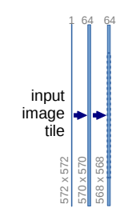
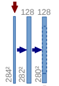
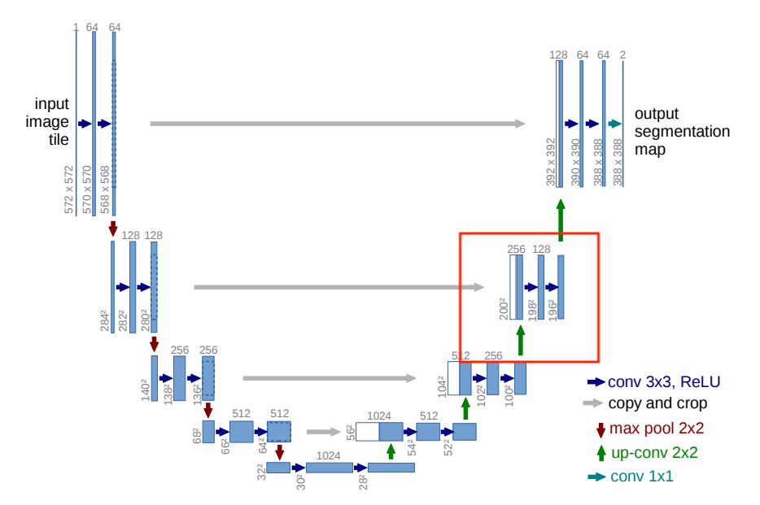

# 3.10 U-Net的构建

在上一节中，我们深入了解了U-Net的整体架构，理解了其独特的编码-解码结构和跳跃连接的设计。本文将进一步深入研究U-Net源码，对其中的各个模块进行详细解读，从而揭示U-Net是如何被构建和实现的。与ResNet相似，U-Net采用了模块化的设计，通过逐模块的分析，我们将揭示U-Net的构建细节和实现原理。

通过本文你将学习到：

- U-Net的构建细节
- U-Net的实现原理

## 3.10.1 DoubleConv模块

<div align=center></div>

观察上图，我们可以看到U-Net中包含大量类似的模块，这些模块被称为DoubleConv模块。DoubleConv模块由两次卷积操作组成，及两个蓝色箭头。第一个卷积核用来将输入特征图的通道数增加，第二个卷积核用来进一步提取每个通道中的特征。

```python
class DoubleConv(nn.Module):
    """(convolution => [BN] => ReLU) * 2"""

    def __init__(self, in_channels, out_channels, mid_channels=None):
        super().__init__()
        if not mid_channels:
            mid_channels = out_channels
        self.double_conv = nn.Sequential(
            nn.Conv2d(in_channels, mid_channels, kernel_size=3, padding=1, bias=False),
            nn.BatchNorm2d(mid_channels),
            nn.ReLU(inplace=True),
            nn.Conv2d(mid_channels, out_channels, kernel_size=3, padding=1, bias=False),
            nn.BatchNorm2d(out_channels),
            nn.ReLU(inplace=True)
        )

    def forward(self, x):
        return self.double_conv(x)
```

<div align=center></div>

## 3.10.2 Down模块

Down模块的作用是下采样，其由一个最大池化层和DoubleConv模块组成，及一个红色箭头和两个蓝色箭头。其中最大池化层用来对输入特征图进行下采样，使其通道数不变，尺寸缩小为原来的一半。然后经过DoubleConv模块提取当前分辨率的特征。
```python
class Down(nn.Module):
    """Downscaling with maxpool then double conv"""

    def __init__(self, in_channels, out_channels):
        super().__init__()
        self.maxpool_conv = nn.Sequential(
            nn.MaxPool2d(2),
            DoubleConv(in_channels, out_channels)
        )

    def forward(self, x):
        return self.maxpool_conv(x)
```
<div align=center></div>

## 3.10.3 Up模块

Up模块的作用是上采样并对编码器与解码器的结果进行跳跃连接，其由一个反卷积层或线性插值层和DoubleConv模块组成，及一个红色箭头、两个蓝色箭头和一个灰色箭头。其中反卷积层或线性插值层用来对输入特征图进行上采样，使通道数不变，尺寸扩大为原来的一倍。然后与解码器的结果进行跳跃连接。最后经过DoubleConv模块提取当前分辨率的特征。

```python
class Up(nn.Module):
    """Upscaling then double conv"""

    def __init__(self, in_channels, out_channels, bilinear=True):
        super().__init__()

        # 通过bilinear参数控制模型使用线性插值或者反卷积进行上采样
        if bilinear:
            self.up = nn.Upsample(scale_factor=2, mode='bilinear', align_corners=True)
            self.conv = DoubleConv(in_channels, out_channels, in_channels // 2)
        else:
            self.up = nn.ConvTranspose2d(in_channels, in_channels // 2, kernel_size=2, stride=2)
            self.conv = DoubleConv(in_channels, out_channels)

    def forward(self, x1, x2):
        x1 = self.up(x1)
        # input is CHW
        diffY = x2.size()[2] - x1.size()[2] # 计算编码器与解码器的尺寸差值
        diffX = x2.size()[3] - x1.size()[3]

        x1 = F.pad(x1, [diffX // 2, diffX - diffX // 2,
                        diffY // 2, diffY - diffY // 2]) # 将上采样特征图大小填充至编码后特征图尺寸

        x = torch.cat([x2, x1], dim=1)
        return self.conv(x)
```
<div align=center></div>

## 3.10.4 OutConv模块

OutConv模块用来将特征图转换为最终分割的输出，其由一个1x1的卷积层构成。
```python
class OutConv(nn.Module):
    def __init__(self, in_channels, out_channels):
        super(OutConv, self).__init__()
        self.conv = nn.Conv2d(in_channels, out_channels, kernel_size=1)

    def forward(self, x):
        return self.conv(x)
```

## 3.10.5 完整模型

现在我们将上述的模块进行组装，得到完整的UNet模型。
```python
class UNet(nn.Module):
    def __init__(self, n_channels, n_classes, bilinear=False):
        super(UNet, self).__init__()
        self.n_channels = n_channels
        self.n_classes = n_classes
        self.bilinear = bilinear

        self.inc = (DoubleConv(n_channels, 64))
        self.down1 = (Down(64, 128))
        self.down2 = (Down(128, 256))
        self.down3 = (Down(256, 512))
        factor = 2 if bilinear else 1
        self.down4 = (Down(512, 1024 // factor))
        self.up1 = (Up(1024, 512 // factor, bilinear))
        self.up2 = (Up(512, 256 // factor, bilinear))
        self.up3 = (Up(256, 128 // factor, bilinear))
        self.up4 = (Up(128, 64, bilinear))
        self.outc = (OutConv(64, n_classes))

    def forward(self, x):
        x1 = self.inc(x)
        x2 = self.down1(x1)
        x3 = self.down2(x2)
        x4 = self.down3(x3)
        x5 = self.down4(x4)
        x = self.up1(x5, x4)
        x = self.up2(x, x3)
        x = self.up3(x, x2)
        x = self.up4(x, x1)
        logits = self.outc(x)
        return logits
```

在上述代码中，我们观察到了U-Net的整体结构。U-Net由一个初始的卷积层（self.inc）、4个由Down函数构建的下采样层、4个由Up函数构建的上采样层和一个输出层（self.outc）组成。

UNet类的初始化函数接收输入通道数（n_channels）、输出类别数（n_classes）以及是否使用双线性插值（bilinear）的参数。通过组合各个模块，U-Net实现了编码-解码结构，并通过跳跃连接的方式将底层特征与高层特征相融合。

## 参考资料
1. [U-Net: Convolutional Networks for Biomedical Image Segmentation](https://arxiv.org/abs/1505.04597)
2. [Pytorch-UNet](https://github.com/milesial/Pytorch-UNet/tree/master)