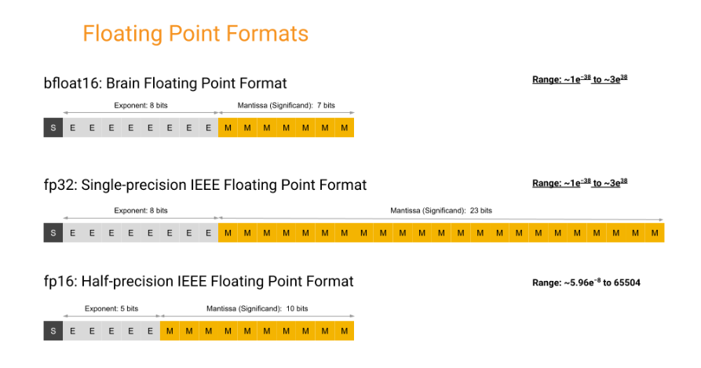

# 3.11 混合精度训练

在上一节中，我们介绍了U-Net的构建和实现，了解了它的编码-解码结构和跳跃连接的作用。但是，U-Net的训练还有一个重要的问题，那就是如何提高训练效率和稳定性。在训练大规模的神经网络时，我们通常会遇到内存不足、计算速度慢、数值溢出等问题，这些问题会影响模型的收敛和性能。为了解决这些问题，一种常用的方法是使用混合精度训练，即在训练过程中使用不同的浮点数格式，如bf16和fp16，来减少内存占用和加速计算，同时保持较高的精度和范围。在本节中，我们将详细介绍混合精度训练的原理。

通过本文你将学习到：
- 什么是混合精度训练
- bf16和fp16的区别
- 混合精度训练的实现


## 3.11.1 单精度浮点数（fp32）简介
在浮点数表示中，一个浮点数通常由三部分组成：符号位（Sign bit）、指数位（Exponent）、小数位（Fraction/Mantissa）。

- 符号位（Sign bit）：这是一个二进制位，用于表示浮点数的正负。0表示正数，1表示负数。

- 指数位（Exponent）：这部分表示浮点数的指数，控制浮点数的数量级。通常使用偏置表示法，即指数值减去一个偏置值，以支持表示负指数。在IEEE754规定中, 单精度浮点数中指数位用于表示[-127, 128]范围内的指数，偏置值为+127，总共有8位。

- 小数位（Fraction/Mantissa）：这是浮点数的小数部分，也称为尾数。通常去除隐藏部分，也就是将二进制数规格化后的整数部分。只用小数部分作为小数位。在IEEE754规定中有23位，不足的用0填充。
  
### 实例：

以 **+3.125** 为例，我们要将其转换为fp32的存储格式。

- 符号位：因为是正数，所以符号位为0。

- 指数位：先将 **3.125** 转为二进制数： **11.001** 。将其正规化：**1.1001 x 2^1** 。得到指数为1，再加上127得到指数位：**128**。转换成二进制数： **1000 0000**。

- 小数位：将上述正规化结果的小数部分提取出来： **1001** ，用0填充至23位得到小数位：**100 1000 0000 0000 0000 0000**

最后整合得到fp32的结果为：**0 1000000 10010000000000000000000**


## 3.11.2 单精度浮点数取值范围
在IEEE754规定中,当指数位全部被1填充, 即指数位表示的值为255时, 用于表示这个浮点数处在一种非正常数(non-number)的状态: 即这个数可能是±infinity或NaN。当指数为全部被0填充，则表示非规格数（subnormal number）。所以在计算范围时，实际上是计算在这两个状态直接的规格数（normal number）范围。

- 指数位：去除了全0和全1状态，所以可以表示的指数部分为：[-126, 127]。
- 小数位：对于规格数, 小数位前隐藏的整数部分始终保持为 **1.** 所以小数位（含隐藏的整数部分）所表示的值的范围是 [1.00...00, 1.11...11],对于范围的下界 **1.11...11** 无限接近于 **10**，所以可以将范围近似于[1.00...00, 2),转换为十进制就为[1, 2)。
  
得出小数位和指数位的范围后，可以得出单精度浮点数的范围为：± [1, 2) x 2 ^ [-126, 127]。也就是
(-2 x 2 ^ 127, -1 x 2 ^ -126] ∪ [1 x 2 ^ -126, 2 x 2 ^ 127) 将其转换为十进制则为：(-3.4... x 10 ^ 38, -1.175... x 10 ^ -38] ∪ [1.175... x 10 ^ -38, 3.4... x 10 ^ 38)

动态范围则是从所能表示的最小正数到最大正数：
及从 0.000 0000 0000 0000 0000 0001 x 2 ^ 0000 0000 到 1.111 1111 1111 1111 1111 1111 x 2 ^ 1111 1111转换为十进制为：（1.4E-45 ~ 3.40E38）

## 3.11.3 半精度浮点数简介

半精度浮点数（Half-precision floating-point）是一种计算机编程中的数据类型，通常用于节省存储空间或提高计算速度。相比于单精度浮点数，只需要占用16位。目前拥有两种半精度浮点数格式：bf16和fp16。但是它们的指数位和小数位的分配不同。bf16用8位表示指数，7位表示小数；fp16用5位表示指数，10位表示小数。

与单精度浮点数范围计算相同，可以计算出：

- bf16范围约为：(-3.4 x 10 ^ 38, -1 x 10 ^ -38] ∪ [1 x 10 ^ -38, 3.4 x 10 ^ 38)
- fp16范围约为：[-65504，-6.1 x 10 ^ -5] ∪ [6.1 x 10 ^ -5, 65504]

bf16和fp16的适用场景不同。bf16可以表示的整数范围更广泛，但是小数部分的精度较低；fp16可以表示的小数范围更广泛，但是整数部分的范围较小。因此，bf16更适合于需要处理大量整数的场景，如自然语言处理；fp16更适合于需要处理大量小数的场景，如计算机视觉。

## 3.11.4 混合精度训练简介

混合精度训练是一种在深度学习模型训练中同时使用不同的浮点数格式，及16位和32位，来提高训练效率和性能的方法。混合精度训练的主要优势是可以减少内存占用和计算时间，从而使模型可以使用更大的批量大小或更复杂的网络结构。

<div align=center></div>

如果我们将单精度全部替换成半精度则会造成数据溢出和舍入误差。

### 数据溢出
对比它们的动态范围：
```
fp16（5.96E−8~ 65504）

fp32（1.4E-45 ~ 3.40E38）

bf16（9.2E−41~3.38E38）
```
可以看到，半精度跟单精度比，数据范围小了1000倍，如果将单精度全部替换成半精度容易出现数据的上溢和下溢。其中在模型训练过程中，更有可能出现的是过小的梯度导致数据下溢。

### 舍入误差
这三种精度它们的“间隔单位”也是不一样的，我们计算的最小正值就是它们的间隔单位，而间隔单位的大小决定了一个小值是否会被舍弃。比如说fp32和bf16虽然有大致一样的取值范围，但是它们的精度（间隔单位）是不一样的，当一个fp32的值+1.4E-45时，这个小值会被看到，原值会发生变动，但如果是一个bf16的值+1.4E-45，由于bf16的间隔单位为9.2E−41，这个小值就会被舍弃，原值不发生变动，这也就导致了舍入误差。

所以我们采用混合精度训练，以此来避免上述的问题出现。
### 原理
利用不同的浮点数格式的特点，将模型的不同部分分配给不同的精度。一般来说，模型的权重和梯度使用16位的半精度（float16）或者bfloat16来存储和计算，以节省内存和加速运算。但是，为了防止数值不稳定，模型的某些部分，如损失函数和权重更新，仍然使用32位的单精度（float32）来进行。这样，既可以利用16位的性能优势，又可以保持32位的数值稳定性


## 3.11.6 混合精度训练实现

在pytorch中我们可以使用`torch.cuda.amp`（Automatic Mixed Precision，自动混合精度）模块来实现
```python
from torch.cuda.amp import autocast, GradScaler
# 在默认精度下创建模型和优化器
model = Net().cuda()
optimizer = optim.SGD(model.parameters(), ...)

# 在训练开始时创建一个GradScaler
scaler = GradScaler()

for epoch in epochs:
    for input, target in data:
        optimizer.zero_grad()

        # 使用autocasting进行前向传播
        with autocast(device_type='cuda', dtype=torch.float16):
            output = model(input)
            loss = loss_fn(output, target)

        # 缩放损失。在缩放的损失上调用backward()以创建缩放的梯度。
        # 不建议在autocast下运行backward操作。
        # 在相应的前向操作中，backward操作以与autocast选择的dtype相同的dtype运行。
        scaler.scale(loss).backward()

        # scaler.step()首先对优化器的指定参数的梯度进行解调。
        # 如果这些梯度不包含无穷大或NaN，则调用optimizer.step()，
        # 否则跳过optimizer.step()。
        scaler.step(optimizer)

        # 更新下一次迭代的缩放因子。
        scaler.update()

```

- `autocast`: 控制上下文中的自动混合精度。在`with autocast`块内，模型前向和反向传播的计算将以指定的浮点数类型进行，这里是torch.float16，即fp16。

- `GradScaler`: 用于缩放梯度，以防止在fp16精度下出现梯度下溢问题。`scale`方法用于缩放损失。

## 参考资料
1. [torch.Tensor.bfloat16](https://pytorch.org/docs/stable/generated/torch.Tensor.bfloat16.html)
2. [amp_examples](https://pytorch.org/docs/stable/notes/amp_examples.html)
3. [半精度浮点数](https://zh.wikipedia.org/wiki/%E5%8D%8A%E7%B2%BE%E5%BA%A6%E6%B5%AE%E7%82%B9%E6%95%B0)
4. [IEEE-754 浮点转换器](https://www.h-schmidt.net/FloatConverter/IEEE754.html)