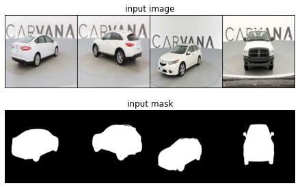
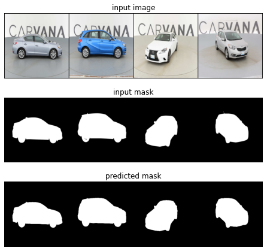
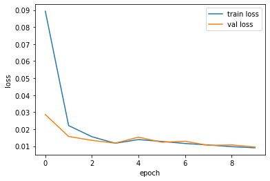
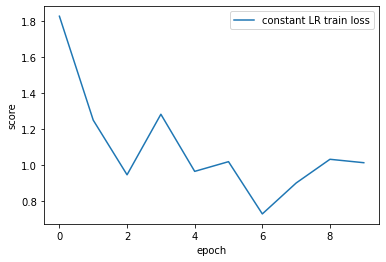

# 3.12 图像语义分割实战
经过前三节的学习，我们了解了U-Net网络的基本原理，并分析了U-Net的构建。同时我们学习了混合精度训练。在本节我们将使用U-Net网络结合混合精度训练来完成一个语义分割任务。

通过本文你将学习到：
- U-Net模型训练
- 模型评估
  
我们这里的任务是对汽车图像进行语义分割，使用[Carvana](https://www.kaggle.com/competitions/carvana-image-masking-challenge/data)数据集。
下图给出数据集中的部分样例。

<div align=center style="background-color:white;"></div>

## 导入需要的库
```python
import numpy as np
import pandas as pd
import random

import torch
import torch.nn as nn
import torch.optim as optim
import torchvision
import torchvision.utils as vutils
from torch.cuda.amp import autocast, GradScaler
from torch.utils.data import Dataset, DataLoader
from torchvision import transforms as T, datasets as dset
from matplotlib import pyplot as plt

from glob import glob
from PIL import Image
```

## 3.12.1 数据加载
首先构建DataSet及transforms模块
```python
class MyDataset(Dataset):
    def __init__(self, images, masks, transforms=None):
        super(MyDataset, self).__init__()
        
        self.transforms = transforms

        self.images = images
        self.image_mask = masks
        
        
    def __getitem__(self, index: int):
        image = Image.open(self.images[index]).convert('RGB')
        image_mask = Image.open(self.image_mask[index]).convert('L')

        
        if self.transforms:
            image = self.transforms(image)
            image_mask = self.transforms(image_mask)
                        
        return image, image_mask
    
    def __len__(self):
        return len(self.images)
    

transforms = T.Compose([
    T.Resize((256, 256)),
    T.ToTensor(),
])
```
获取数据路径，并创建Dataloader
```python
file_path =  'train/*.*'
file_mask_path = 'train_masks/*.*'
        
# 读取路径下所有文件路径，并进行排序
images = sorted(glob(file_path)) 
image_mask = sorted(glob(file_mask_path))

split_ratio = int(len(images) * 0.7) # 划分训练集和验证集数量

train_x = images[:split_ratio]
train_y = image_mask[:split_ratio]

val_x = images[split_ratio:]
val_y = image_mask[split_ratio:]

train_dataset = MyDataset(train_x, train_y, transforms=transforms)
val_dataset = MyDataset(val_x, val_y, transforms=transforms)

train_dataset_loader = DataLoader(dataset=train_dataset, batch_size=batch_size, shuffle=True, num_workers=n_workers)
val_dataset_loader = DataLoader(dataset=val_dataset, batch_size=batch_size, shuffle=True, num_workers=n_workers)
```
查看读入的数据
```python
x,y = next(iter(train_dataset_loader))

fig, (ax1, ax2) = plt.subplots(nrows=2, ncols=1, figsize=(12, 4))
fig.tight_layout()


ax1.axis('off')
ax1.set_title('input image')
ax1.imshow(np.transpose(vutils.make_grid(x, padding=2).numpy(),
                       (1, 2, 0)))

ax2.axis('off')
ax2.set_title('input mask')
ax2.imshow(np.transpose(vutils.make_grid(y, padding=2).numpy(),
                       (1, 2, 0)), cmap='gray')

plt.show()
```
<div align=center style="background-color:white;"></div>

## 3.12.3 定义评估指标
对于Carvana图像分割挑战赛，官方给出的评估方案为平均Dice系数（Dice Score）。
### 平均Dice系数（Dice Score）:

- 定义: Dice系数是预测分割与真实标签之间空间重叠的度量。它定义为预测区域和真实区域的交集的两倍与它们的总和之比。
- 公式: Dice系数 = (2 * |A ∩ B|) / (|A| + |B|)，其中A是预测区域，B是真实区域，|A|表示A的体积，|B|表示B的体积。
- 解释: Dice系数为1表示预测和真实区域完全重叠，值为0表示没有重叠。

```python
def dice_score(pred, mask):
    dice = (2 * (pred * mask).sum()) / (pred + mask).sum()
    return np.mean(dice.cpu().numpy())
```
## 3.12.4 定义训练及验证函数
定义可视化模块，显示每一轮训练过后的模型在验证集上第一批数据的预测结果。
```python
def plot_pred_img(x, y, pred):
    fig, (ax1, ax2, ax3) = plt.subplots(nrows=3, ncols=1, figsize=(12, 6))
    fig.tight_layout()
    ax1.axis('off')
    ax1.set_title('input image')
    ax1.imshow(np.transpose(vutils.make_grid(x, padding=2).numpy(),
                           (1, 2, 0)))

    ax2.axis('off')
    ax2.set_title('input mask')
    ax2.imshow(np.transpose(vutils.make_grid(y, padding=2).numpy(),
                           (1, 2, 0)), cmap='gray')
    
    ax3.axis('off')
    ax3.set_title('predicted mask')
    ax3.imshow(np.transpose(vutils.make_grid(pred, padding=2).cpu().numpy(),
                           (1, 2, 0)), cmap='gray')

    plt.show()
    
    
def plot_train_progress(model):

    x,y = next(iter(val_dataset_loader))
    val_img = x.to(device)
    val_mask = y.to(device)
    pred = model(val_img)
    plot_pred_img(x, y, pred.detach())
```
我们将训练函数与验证函数封装到一个函数中，并返回训练日志。
```python
def train(model, optimizer, criterion, epochs, save_path='best_model.pth'):
    train_losses = []   # 记录每个epoch训练集的损失
    val_lossess = []    # 记录每个epoch验证集的损失
    dice_scores = []    # 记录每个epoch验证集的得分
    scaler = GradScaler()

    best_dice_score = 0  # 记录最佳的Dice得分

    for epoch in range(epochs):
        model.train()   # 设置模型为训练模式
        train_total_loss = 0
        train_iterations = 0
        train_scores = 0

        for img, mask in train_dataset_loader:
            train_iterations += 1
            train_img = img.to(device)
            train_mask = mask.to(device)

            optimizer.zero_grad()
            # 启用混合精度训练
            with torch.autocast(device_type='cuda', dtype=torch.float16):
                train_output_mask = model(train_img)
                train_loss = criterion(train_output_mask, train_mask)
                train_total_loss += train_loss.item()

            scaler.scale(train_loss).backward()
            scaler.step(optimizer)
            scaler.update()

        train_epoch_loss = train_total_loss / train_iterations
        train_losses.append(train_epoch_loss) # 记录训练集损失

        model.eval()   # 设置模型为评估模式
        with torch.no_grad():
            val_total_loss = 0
            val_iterations = 0
            scores = 0

            for img, mask in val_dataset_loader:
                val_iterations += 1
                val_img = img.to(device)
                val_mask = mask.to(device)

                with torch.autocast(device_type='cuda'):
                    pred = model(val_img)
                    val_loss = criterion(pred, val_mask)
                    val_total_loss += val_loss.item()
                    scores += dice_score(pred, val_mask)

            val_epoch_loss = val_total_loss / val_iterations
            dice_coef_score = abs(scores / val_iterations)
            dice_scores.append(dice_coef_score) # 记录验证集得分
            val_lossess.append(val_epoch_loss) # 记录验证集损失

            # 根据验证集的得分，保存得分最高的模型
            if dice_coef_score > best_dice_score:
                best_dice_score = dice_coef_score
                torch.save(model.state_dict(), save_path)

            plot_train_progress(model) # 可视化当前轮次的结果
            print('epochs - {}/{} , dice score: {}, train loss: {}, val loss: {}'.format(
                epoch+1, epochs,
                dice_coef_score, train_epoch_loss, val_epoch_loss
            )) 
    # 返回日志
    return {
        'train_loss': train_losses,
        'valid_loss': val_lossess,
        'dice_scores': dice_scores,
    }

```
定义模型，损失函数及优化器
```python
model = UNet(n_channels=3, n_classes=1).to(device) # 使用3.10节构建的模型
criterion = nn.BCEWithLogitsLoss()
optimizer = torch.optim.Adam(model.parameters(), lr=learning_rate)

# 开始训练并记录日志
history = train(model, optimizer, criterion, epochs=10, save_path='model.pth')
```
训练结果
```
epochs - 1/10 , dice score: 1.8249463428065416, train loss: 0.0893550109093137, val loss: 0.028593411240044064
epochs - 2/10 , dice score: 1.2495381354661512, train loss: 0.022108020692620547, val loss: 0.01570428493895924
epochs - 3/10 , dice score: 0.9468892051287346, train loss: 0.015554314023500474, val loss: 0.013407932489583786
epochs - 4/10 , dice score: 1.2821826156209277, train loss: 0.011695408160922637, val loss: 0.011755413055195625
epochs - 5/10 , dice score: 0.9658303889616622, train loss: 0.013863864959992141, val loss: 0.015278386890751686
epochs - 6/10 , dice score: 1.019559569539824, train loss: 0.012758530061232088, val loss: 0.012312261348697527
epochs - 7/10 , dice score: 0.7302293133829276, train loss: 0.01156620804416946, val loss: 0.01288147188274492
epochs - 8/10 , dice score: 0.9014104478334257, train loss: 0.010684877412976941, val loss: 0.010455930980985389
epochs - 9/10 , dice score: 1.0327838607795576, train loss: 0.009698539117286369, val loss: 0.010719151793203818
epochs - 10/10 , dice score: 1.013805051124533, train loss: 0.009036124524515118, val loss: 0.009485048139516596
```
<div align=center style="background-color:white;"></div>

绘制日志
```python
plt.plot(history['train_loss'], label='train loss')
plt.plot(history['valid_loss'], label='val loss')


plt.xlabel('epoch')
plt.ylabel('loss')
plt.legend()
plt.show()
```
<div align=center style="background-color:white;"></div>

```python
plt.plot(history['dice_scores'], label='constant LR train loss')


plt.xlabel('epoch')
plt.ylabel('score')
plt.legend()
plt.show()
```
<div align=center style="background-color:white;"></div>

## 参考资料
1. [Carvana Image Masking Challenge](https://www.kaggle.com/competitions/carvana-image-masking-challenge/overview)
2. [BCEWITHLOGITSLOSS](https://pytorch.org/docs/stable/generated/torch.nn.BCEWithLogitsLoss.html)