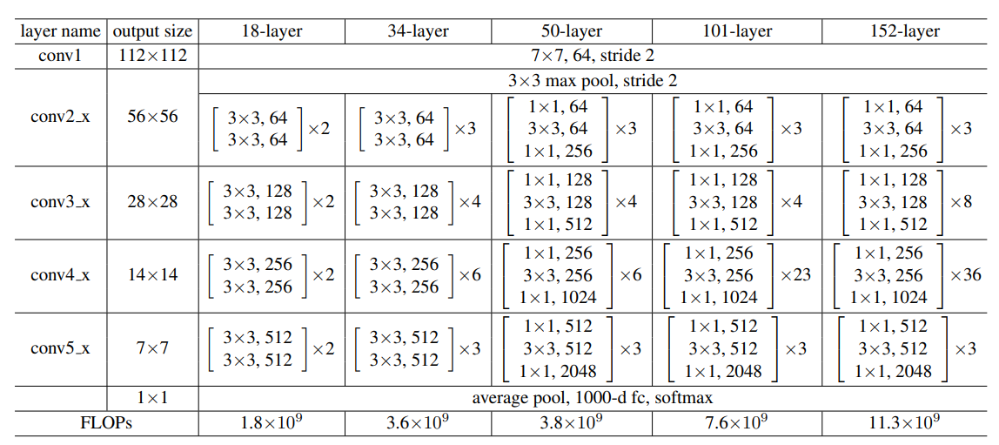
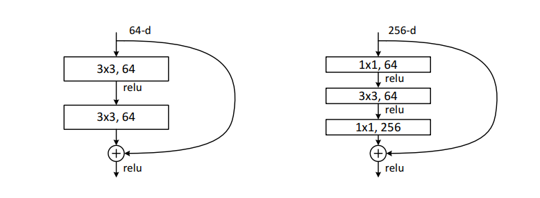

# 3.2 ResNet的构建

承接上节的整体架构，本文将继续基于[torchvision的ResNet源码](https://github.com/pytorch/vision/blob/master/torchvision/models/resnet.py)对其中的各个模块进行详细解读。并介绍模型块的概念，以及如何实现。

通过本文你将学习到：

- BasicBlock和Bottleneck两种结构
- 代码里面的expansion作用
- 基本模块设计 

## 3.2.1 ResNet中卷积核的封装
在代码的开始，首先封装了3x3和1x1的卷积核，这样可以增加代码的可读性。除了这种代码写法外，还有许多深度学习代码在开始也会将卷积层，激活函数层和BN层封装在一起，同样是为了增加代码的可读性。

```python
def conv3x3(in_planes: int, out_planes: int, stride: int = 1, groups: int = 1, dilation: int = 1) -> nn.Conv2d:
    """3x3 convolution with padding"""
    return nn.Conv2d(
        in_planes,
        out_planes,
        kernel_size=3,
        stride=stride,
        padding=dilation,
        groups=groups,
        bias=False,
        dilation=dilation,
    )


def conv1x1(in_planes: int, out_planes: int, stride: int = 1) -> nn.Conv2d:
    """1x1 convolution"""
    return nn.Conv2d(in_planes, out_planes, kernel_size=1, stride=stride, bias=False)
```
## 3.2.2 ResNet中的模块设计
ResNet网络是由很多相同的模块堆叠起来的，为了保证代码具有可读性和可扩展性，ResNet在设计时采用了模块化设计，针对不同大小的ResNet，书写了BasicBlock和BottleNeck两个基本模块。这种模块化的设计在现在许多常见的深度学习代码中我们可以经常看到。

ResNet常见的大小有下图的ResNet-18，ResNet-34，ResNet-50、ResNet-101和ResNet-152，其中网络后面的数字代表的是网络的层数。

<div align=center></div>


为了帮助大家更好的理解，我们以ResNet101为例。

<center>

| layer_name | 次数                            |
| ---------- | ------------------------------- |
| conv1      | 卷积1次                         |
| conv2_x    | 卷积3 x 3 = 9次                 |
| conv3_x    | 卷积4 x 3 = 12次                |
| conv4_x    | 卷积23 x 3 = 69次               |
| conv5_x    | 卷积3 x 3 = 9次                 |
| fc         | average pool 1次                |
| 合计       | 1 + 9 + 12 + 69 + 9 + 1 = 101次 |

</center>


观察上面各个ResNet的模块，我们可以发现ResNet-18和ResNet-34每一层内，数据的大小不会发生变化，但是ResNet-50、ResNet-101和ResNet-152中的每一层内输入和输出的channel数目不一样，输出的channel扩大为输入channel的4倍，除此之外，每一层的卷积的大小也变换为1，3，1的结构。基于这个发现，我们可以将ResNet-18和ResNet-34的构成模块当作一类，ResNet-50、ResNet-101和ResNet-152这三类网络的构成模块当作一类。事实上，torchvision的源码也是基于这种设计思想，使用如下图的BasicBlock（左）和BottleNeck（右）模块，并且为了控制输入和输出的通道数目的变化，在代码中输出的通道维度也通过expansion进行控制，两个block类输入一个通道为in_planes维的度特征图，输出一个planes\*block.expansion维的特征图，其中planes的数目大小等于in_planes。除此以外，代码右侧的曲线就是本文最重要的shortcut支路，该支路上的downsample操作是为了对shortcut支路进行大小或维度上的调整，以希望执行相加操作。

<div align=center></div>

 ### 3.2.2.1 BasicBlock

 BasicBlock模块用来构建resnet18和resnet34

```python
class BasicBlock(nn.Module):
    expansion: int = 1

    def __init__(
        self,
        inplanes: int,
        planes: int,
        stride: int = 1,
        downsample: Optional[nn.Module] = None,
        groups: int = 1,
        base_width: int = 64,
        dilation: int = 1,
        norm_layer: Optional[Callable[..., nn.Module]] = None,
    ) -> None:
        super().__init__()
        if norm_layer is None:
            norm_layer = nn.BatchNorm2d
        if groups != 1 or base_width != 64:
            raise ValueError("BasicBlock only supports groups=1 and base_width=64")
        if dilation > 1:
            raise NotImplementedError("Dilation > 1 not supported in BasicBlock")
        # Both self.conv1 and self.downsample layers downsample the input when stride != 1
        self.conv1 = conv3x3(inplanes, planes, stride)
        self.bn1 = norm_layer(planes)
        self.relu = nn.ReLU(inplace=True)
        self.conv2 = conv3x3(planes, planes)
        self.bn2 = norm_layer(planes)
        self.downsample = downsample
        self.stride = stride

    def forward(self, x: Tensor) -> Tensor:
        identity = x  # x  给自己先备份一份

        out = self.conv1(x)  # 对x做卷积 
        out = self.bn1(out)  # 对x归一化 
        out = self.relu(out)  # 对x用激活函数

        out = self.conv2(out)  # 对x做卷积
        out = self.bn2(out)  # 归一化

        if self.downsample is not None:
            identity = self.downsample(x)

        out += identity  # 进行downsample
        out = self.relu(out)

        return out
```

### 3.2.2.2 BottleNeck

BottleNeck模块用来构建resnet50，resnet101和resnet152

```python
class Bottleneck(nn.Module):
    # Bottleneck in torchvision places the stride for downsampling at 3x3 convolution(self.conv2)
    # while original implementation places the stride at the first 1x1 convolution(self.conv1)
    # according to "Deep residual learning for image recognition"https://arxiv.org/abs/1512.03385.
    # This variant is also known as ResNet V1.5 and improves accuracy according to
    # https://ngc.nvidia.com/catalog/model-scripts/nvidia:resnet_50_v1_5_for_pytorch.

    expansion: int = 4  # 对输出通道进行倍增

    def __init__(
        self,
        inplanes: int,
        planes: int,
        stride: int = 1,
        downsample: Optional[nn.Module] = None,
        groups: int = 1,
        base_width: int = 64,
        dilation: int = 1,
        norm_layer: Optional[Callable[..., nn.Module]] = None,
    ) -> None:
        super().__init__()
        if norm_layer is None:
            norm_layer = nn.BatchNorm2d
        width = int(planes * (base_width / 64.0)) * groups
        # Both self.conv2 and self.downsample layers downsample the input when stride != 1
        self.conv1 = conv1x1(inplanes, width)
        self.bn1 = norm_layer(width)
        self.conv2 = conv3x3(width, width, stride, groups, dilation)
        self.bn2 = norm_layer(width)
        self.conv3 = conv1x1(width, planes * self.expansion)
        self.bn3 = norm_layer(planes * self.expansion)
        self.relu = nn.ReLU(inplace=True)
        self.downsample = downsample
        self.stride = stride

        # Bottleneckd forward函数和BasicBlock类似，不再额外注释
    def forward(self, x: Tensor) -> Tensor:
        identity = x

        out = self.conv1(x)
        out = self.bn1(out)
        out = self.relu(out)

        out = self.conv2(out)
        out = self.bn2(out)
        out = self.relu(out)

        out = self.conv3(out)
        out = self.bn3(out)

        if self.downsample is not None:
            identity = self.downsample(x)

        out += identity
        out = self.relu(out)

        return out
```

我们在这里再对代码中**expansion**的作用做一个说明，我们可以重新回顾一下下面这张图。


expansion简单来说就是对输出通道的倍乘。在BasicBlock和BottleNeck中，“\_\_init\_\_”函数中有三个比较关键的参数：inplanes,planes和stride，这三者分别表示输入的通道数，输出的通道数和步幅。在两个模块中，\_\_init__传入的planes都是64,128,156,512，但我们观察上面的表格，会发现对于ResNet-50，ResNet-101和ResNet-152而言，它们需要的输出通道应该为256,512,1024,2048才对。因此在这里设置expansion=4，对应上面BottleNeck代码中的30行和31行，将每一个planes都乘上这个expansion，就得到了需要的通道数；而对于ResNet-18和ResNet-34而言，输入通道和输出通道的维度上没有发生变化，因此expansion也设置为1。

当我们定义完以上模型块后，便可以使用他们快速的搭建起ResNet网络
```python
class ResNet(nn.Module):
    def __init__(
        self,
        block: Type[Union[BasicBlock, Bottleneck]], # 选择基本模块
        layers: List[int], # 每一层block的数目构成 -> [3,4,6,3]
        num_classes: int = 1000, # 分类数目
        zero_init_residual: bool = False, # 初始化
        
        #######其他卷积构成，与本文ResNet无关######
        groups: int = 1,
        width_per_group: int = 64,
        replace_stride_with_dilation: Optional[List[bool]] = None,
        #########################################
        
        norm_layer: Optional[Callable[..., nn.Module]] = None, # norm层
    ) -> None:
        super().__init__()
        _log_api_usage_once(self)
        if norm_layer is None:
            norm_layer = nn.BatchNorm2d
        self._norm_layer = norm_layer
		
        self.inplanes = 64 # 输入通道
        
        #######其他卷积构成，与本文ResNet无关######
        self.dilation = 1 # 空洞卷积
        if replace_stride_with_dilation is None:
            # each element in the tuple indicates if we should replace
            # the 2x2 stride with a dilated convolution instead
            replace_stride_with_dilation = [False, False, False]
        if len(replace_stride_with_dilation) != 3:
            raise ValueError(
                "replace_stride_with_dilation should be None "
                f"or a 3-element tuple, got {replace_stride_with_dilation}"
            )
        self.groups = groups
        self.base_width = width_per_group
        #########################################
        
        self.conv1 = nn.Conv2d(3, self.inplanes, kernel_size=7, stride=2, padding=3, bias=False)
        self.bn1 = norm_layer(self.inplanes)
        self.relu = nn.ReLU(inplace=True)
        self.maxpool = nn.MaxPool2d(kernel_size=3, stride=2, padding=1)
        # 通过_make_layer带到层次化设计的效果
        self.layer1 = self._make_layer(block, 64, layers[0])  # 对应着conv2_x
        self.layer2 = self._make_layer(block, 128, layers[1], stride=2, dilate=replace_stride_with_dilation[0])  # 对应着conv3_x
        self.layer3 = self._make_layer(block, 256, layers[2], stride=2, dilate=replace_stride_with_dilation[1])  # 对应着conv4_x
        self.layer4 = self._make_layer(block, 512, layers[3], stride=2, dilate=replace_stride_with_dilation[2])  # 对应着conv5_x
        # 分类头
        self.avgpool = nn.AdaptiveAvgPool2d((1, 1))
        self.fc = nn.Linear(512 * block.expansion, num_classes)
		
        # 模型初始化
        for m in self.modules():
            if isinstance(m, nn.Conv2d):
                nn.init.kaiming_normal_(m.weight, mode="fan_out", nonlinearity="relu")
            elif isinstance(m, (nn.BatchNorm2d, nn.GroupNorm)):
                nn.init.constant_(m.weight, 1)
                nn.init.constant_(m.bias, 0)

        # Zero-initialize the last BN in each residual branch,
        # so that the residual branch starts with zeros, and each residual block behaves like an identity.
        # This improves the model by 0.2~0.3% according to https://arxiv.org/abs/1706.02677
        if zero_init_residual:
            for m in self.modules():
                if isinstance(m, Bottleneck) and m.bn3.weight is not None:
                    nn.init.constant_(m.bn3.weight, 0)  # type: ignore[arg-type]
                elif isinstance(m, BasicBlock) and m.bn2.weight is not None:
                    nn.init.constant_(m.bn2.weight, 0)  # type: ignore[arg-type]
	# 层次化设计
    def _make_layer(
        self,
        block: Type[Union[BasicBlock, Bottleneck]], # 基本构成模块选择
        planes: int,  # 输入的通道
        blocks: int, # 模块数目
        stride: int = 1, # 步长
        dilate: bool = False, # 空洞卷积，与本文无关
    ) -> nn.Sequential:
        norm_layer = self._norm_layer
        downsample = None # 是否采用下采样
        ####################无关#####################
        previous_dilation = self.dilation 
        if dilate:
            self.dilation *= stride
            stride = 1
        #############################################
        if stride != 1 or self.inplanes != planes * block.expansion:
            downsample = nn.Sequential(
                conv1x1(self.inplanes, planes * block.expansion, stride),
                norm_layer(planes * block.expansion),
            )
		
        # 使用layers存储每个layer
        layers = []
        layers.append(
            block(
                self.inplanes, planes, stride, downsample, self.groups, self.base_width, previous_dilation, norm_layer
            )
        )
        self.inplanes = planes * block.expansion
        for _ in range(1, blocks):
            layers.append(
                block(
                    self.inplanes,
                    planes,
                    groups=self.groups,
                    base_width=self.base_width,
                    dilation=self.dilation,
                    norm_layer=norm_layer,
                )
            )
		# 将layers通过nn.Sequential转化为网络
        return nn.Sequential(*layers)

    def _forward_impl(self, x: Tensor) -> Tensor:
        # See note [TorchScript super()]
        x = self.conv1(x)  # conv1   x shape [1 64 112 112]
        x = self.bn1(x)   # 归一化处理   
        x = self.relu(x)  # 激活函数
        x = self.maxpool(x)  # conv2_x的3x3 maxpool        x shape [1 64 56 56]

        x = self.layer1(x) # layer 1
        x = self.layer2(x) # layer 2
        x = self.layer3(x) # layer 3
        x = self.layer4(x) # layer 4

        x = self.avgpool(x) # 自适应池化
        x = torch.flatten(x, 1) 
        x = self.fc(x) # 分类

        return x

    def forward(self, x: Tensor) -> Tensor:
        return self._forward_impl(x) 
```

在上述代码中，我们观察到ResNet的整体结构，它由一个初始的卷积层、4个由_make_layer函数构建的layer层和一个全局平均池化层组成。其中，_make_layer函数负责构建每个layer层，而每个layer层中由多个基本块（block）堆叠而成。这里的基本块有两种类型，即BasicBlock和BottleNeck。

_make_layer函数的参数包括block类型、每个layer中堆叠的block数目（blocks）、输出维度（planes），以及卷积步幅（stride）。其中，block的选择决定了基本块的类型，而blocks则表示每个layer中有多少个这样的基本块。planes参数与最终输出的维度有关，最终输出维度为planes乘以block的扩展系数（block.expansion）。

对于每个layer层，首先根据stride和维度是否匹配进行downsample操作，确保输入和输出的维度一致。然后通过循环添加block，其中第一个block可能包含downsample支路。这个特殊处理保证了第一个block的输出维度为planes乘以block.expansion，并更新了self.inplanes的值，作为后续block的输入维度。

总体而言，_make_layer函数的作用是生成一个layer，该layer由多个基本块堆叠而成，保证了输入和输出的维度一致。这种结构的设计使得ResNet能够有效地训练深层网络，同时通过残差连接（residual connection）帮助梯度的流动，缓解了梯度消失问题。基本块的概念在ResNet中起到了关键作用，通过合理设计块的结构，成功构建了一个深层网络架构。

## 3.2.3 模型块

模型块（Block）是指由多个相同或相似结构的基本单元组成的部分。在ResNet中，这些基本单元可以是BasicBlock或Bottleneck。通过堆叠这些模型块，我们构建出整个深度神经网络。在这一部分，我们将介绍模型块的概念，并探讨如何使用nn.Sequential和nn.ModuleList来构建更复杂的网络结构。

### 3.2.3.1 模型块

在深度学习中，这种模块化的设计有助于构建深度神经网络，使网络结构更加清晰、易于理解，并且方便了网络的复用和修改。

模型块的设计目的是将神经网络划分为一些相对独立的部分，每个部分执行特定的功能。这些部分可以是相同的，也可以是不同的，取决于网络的结构和任务需求。通过堆叠不同类型的模型块，可以构建出复杂的深度神经网络。通常我们可以使用`nn.Sequential()`和`nn.ModuleList()`方法来构建一个模型块。

### 3.2.3.2 Sequential

对应模块为`nn.Sequential()`。

当模型的前向计算为简单串联各个层的计算时， `Sequential` 类可以通过更加简单的方式定义模型。它可以接收一个子模块的有序字典(OrderedDict) 或者一系列子模块作为参数来逐一添加 `Module` 的实例，⽽模型的前向计算就是将这些实例按添加的顺序逐⼀计算。我们结合`Sequential`和定义方式加以理解：

```python
from collections import OrderedDict
class MySequential(nn.Module):
    def __init__(self, *args):
        super(MySequential, self).__init__()
        if len(args) == 1 and isinstance(args[0], OrderedDict): # 如果传入的是一个OrderedDict
            for key, module in args[0].items():
                self.add_module(key, module)  
                # add_module方法会将module添加进self._modules(一个OrderedDict)
        else:  # 传入的是一些Module
            for idx, module in enumerate(args):
                self.add_module(str(idx), module)
    def forward(self, input):
        # self._modules返回一个 OrderedDict，保证会按照成员添加时的顺序遍历成
        for module in self._modules.values():
            input = module(input)
        return input
```

下面来看下如何使用`Sequential`来定义模型。只需要将模型的层按序排列起来即可，根据层名的不同，排列的时候有两种方式：

- 直接排列 

```python
import torch.nn as nn
net = nn.Sequential(
        nn.Linear(784, 256),
        nn.ReLU(),
        nn.Linear(256, 10), 
        )
print(net)
```

```
Sequential(
  (0): Linear(in_features=784, out_features=256, bias=True)
  (1): ReLU()
  (2): Linear(in_features=256, out_features=10, bias=True)
)
```

- 使用OrderedDict：

```python
import collections
import torch.nn as nn
net2 = nn.Sequential(collections.OrderedDict([
          ('fc1', nn.Linear(784, 256)),
          ('relu1', nn.ReLU()),
          ('fc2', nn.Linear(256, 10))
          ]))
print(net2)
```

```
Sequential(
  (fc1): Linear(in_features=784, out_features=256, bias=True)
  (relu1): ReLU()
  (fc2): Linear(in_features=256, out_features=10, bias=True)
)
```

可以看到，使用`Sequential`定义模型的好处在于简单、易读，同时使用`Sequential`定义的模型不需要再写`forward`，因为顺序已经定义好了。但使用`Sequential`也会使得模型定义丧失灵活性，比如需要在模型中间加入一个外部输入时就不适合用`Sequential`的方式实现。使用时需根据实际需求加以选择。

### 3.2.3.3 ModuleList
对应模块为`nn.ModuleList()`。

`ModuleList` 接收一个子模块（或层，需属于`nn.Module`类）的列表作为输入，然后也可以类似`List`那样进行append和extend操作。同时，子模块或层的权重也会自动添加到网络中来。

```python
net = nn.ModuleList([nn.Linear(784, 256), nn.ReLU()])
net.append(nn.Linear(256, 10)) # # 类似List的append操作
print(net[-1])  # 类似List的索引访问
print(net)
```

```
Linear(in_features=256, out_features=10, bias=True)
ModuleList(
  (0): Linear(in_features=784, out_features=256, bias=True)
  (1): ReLU()
  (2): Linear(in_features=256, out_features=10, bias=True)
)
```

要特别注意的是，`nn.ModuleList` 并没有定义一个网络，它只是将不同的模块储存在一起。`ModuleList`中元素的先后顺序并不代表其在网络中的真实位置顺序，需要经过forward函数指定各个层的先后顺序后才算完成了模型的定义。具体实现时用for循环即可完成：

```python
class model(nn.Module):
  def __init__(self, ...):
    super().__init__()
    self.modulelist = ...
    ...
    
  def forward(self, x):
    for layer in self.modulelist:
      x = layer(x)
    return x
```
### 3.2.3.4 两种方式的对比

`Sequential`适用于快速验证结果，因为已经明确了要用哪些层，直接写一下就好了，不需要同时写`__init__`和`forward`；

ModuleList在某个完全相同的层需要重复出现多次时，非常方便实现，可以”一行顶多行“；

当我们需要之前层的信息的时候，比如 ResNets 中的残差计算，当前层的结果需要和之前层中的结果进行融合，一般使用 ModuleList 比较方便。

## 参考资料

1. [ModuleList](https://pytorch.org/docs/stable/generated/torch.nn.ModuleList.html)
2. [Sequential](https://pytorch.org/docs/stable/generated/torch.nn.Sequential.html)
3. [PyTorch ResNet](https://pytorch.org/hub/pytorch_vision_resnet/)
