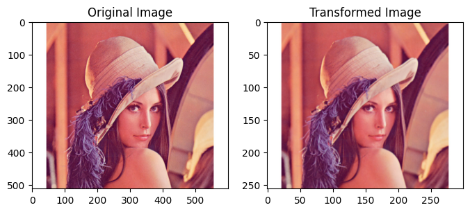
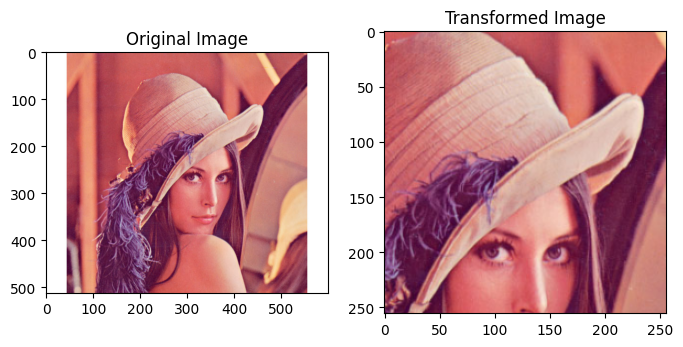
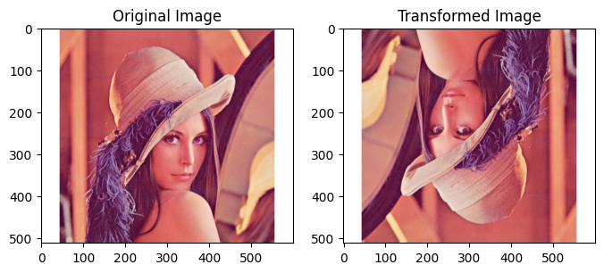
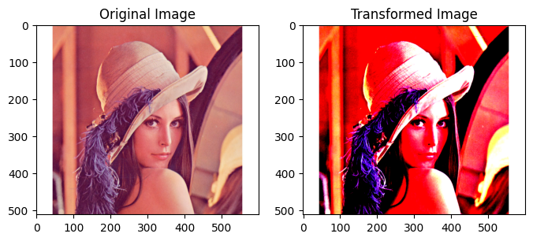
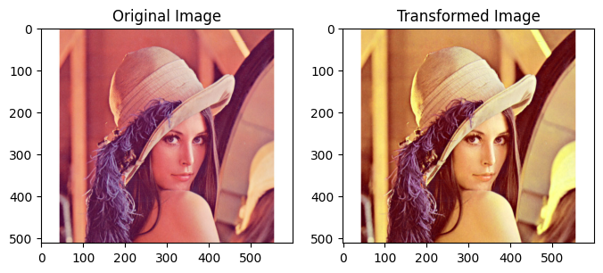
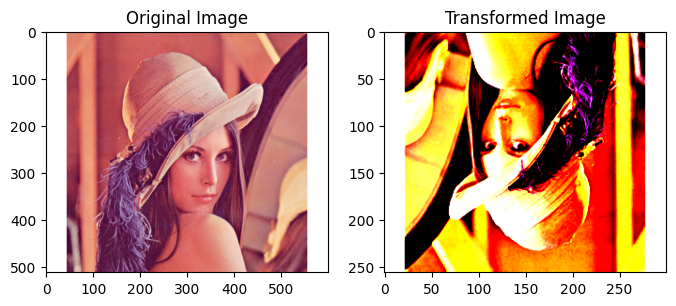
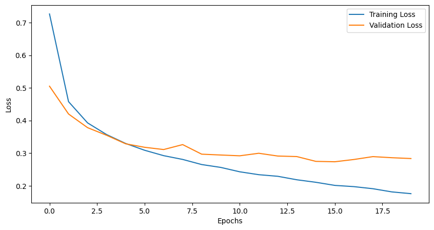
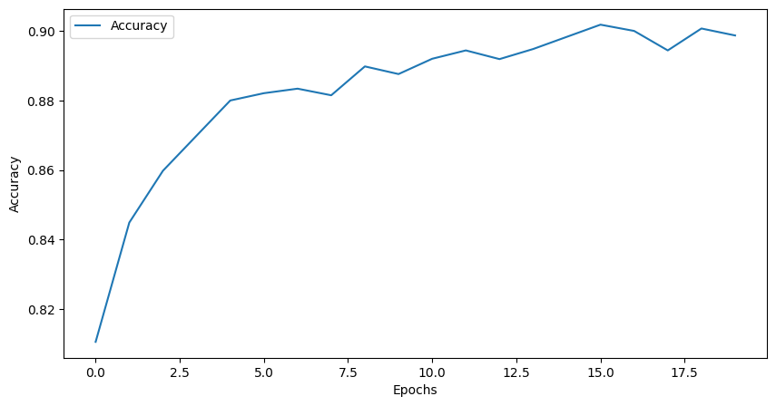

# 3.4 数据增强
在机器学习/深度学习中，我们经常会遇到模型过拟合的问题，为了解决过拟合问题，我们可以通过加入正则项或者减少模型学习参数来解决，但是最简单的避免过拟合的方法是增加数据，但是在许多场景我们无法获得大量数据，例如医学图像分析。数据增强技术的存在是为了解决这个问题，这是针对有限数据问题的解决方案。数据增强一套技术，可提高训练数据集的大小和质量，以便我们可以使用它们来构建更好的深度学习模型。

在计算视觉领域，生成增强图像相对容易。即使引入噪声或裁剪图像的一部分，模型仍可以对图像进行分类，数据增强有一系列简单有效的方法可供选择，有一些机器学习库来进行计算视觉领域的数据增强，比如：imgaug [官网](https://github.com/aleju/imgaug)它封装了很多数据增强算法，给开发者提供了方便。通过本章内容，您将学会以下内容：

- torchvision.transforms的介绍与使用

- imgaug的简介和安装

- 使用imgaug对数据进行增强
  
## 3.4.1 `torchvision.transforms`
`torchvision.transforms` 是 PyTorch 的一个模块，用于处理图像数据的各种变换。它提供了一系列的图像处理函数，可以在加载数据时进行实时的图像增强。这对于训练深度学习模型时，特别是在数据集相对较小的情况下，是非常有用的。

`torchvision.transforms` 中包含的常用操作有：

- 随机裁剪、缩放和翻转
- 亮度、对比度和饱和度调整
- 随机旋转和仿射变换
- 标准化和归一化等
  
### 3.4.1.1 `torchvision.transforms`  的使用
**对于单张图片的处理**

我们仅以常用的几种数据增强操作为例子，以此体现数据增强后图像与原始图像的差异性，以及教会大家如何使用。

**先介绍单个图像增强方式的使用，及其增强后的效果**
#### ToTensor : `transforms.ToTensor()`

将PIL Image或者numpy.ndarray转换为Tensor。如果图像是多通道的，则将通道维度移到最前面。

#### Resize : `transforms.Resize(size, interpolation=2)`

- size: 期望的输出大小。可以是int、tuple或者list。如果是int，则将图像的较小边缩放到这个大小，保持宽高比。如果是tuple或者list，则应该是(h, w)格式，表示输出图像的高和宽。

- interpolation: 插值方法，可选参数，默认为2（Bilinear）。

  
```python
transform = transforms.Compose([
    transforms.Resize(256, interpolation=2),
    transforms.ToTensor(),
])
```
<div align=center></div>


#### RandomResizedCrop : `transforms.RandomResizedCrop(size, scale=(0.08, 1.0), ratio=(0.75, 1.34), interpolation=2)`
- size: 期望的输出大小，可以是int或tuple。
- scale: 随机裁剪的比例范围，用于计算裁剪面积。默认是(0.08, 1.0)。
- ratio: 裁剪的长宽比范围。默认是(0.75, 1.34)。
- interpolation: 插值方法，同上。
  
```python
transform = transforms.Compose([
    transforms.RandomResizedCrop(256, interpolation=2),
    transforms.ToTensor(),
])
```
<div align=center></div>


#### RandomHorizontalFlip : `transforms.RandomHorizontalFlip(p=0.5)`  
- p: 水平翻转的概率，默认是0.5。
#### RandomVerticalFlip : `transforms.RandomVerticalFlip(p=0.5)`
- p: 垂直翻转的概率，默认是0.5。
  
```python
transform = transforms.Compose([
    transforms.RandomHorizontalFlip(p=0.5),
    transforms.RandomVerticalFlip(p=0.5),
    transforms.ToTensor(),
])
```
<div align=center></div>

#### Normalize : `transforms.Normalize(mean, std)`
对图像进行标准化，即减去均值然后除以标准差。需要为每一个通道设置其均值和标准差。

- mean: 平均值，可以是单个值或者是一个长度为通道数的列表或元组。
- std: 标准差，格式同上。

```python
transform = transforms.Compose([
    transforms.ToTensor(),
    transforms.Normalize(mean=[0.485, 0.456, 0.406], std=[0.229, 0.224, 0.225]),
])
```
<div align=center></div>


#### ColorJitter ：`transforms.ColorJitter(brightness=0, contrast=0, saturation=0, hue=0)`
对图像进行亮度、对比度、饱和度、色相的随机调整。

- brightness: 亮度调整的参数，0表示无调整。
- contrast: 对比度调整的参数，0表示无调整。
- saturation: 饱和度调整的参数，0表示无调整。
- hue: 色相调整的参数，0表示无调整。
  
```python
transform = transforms.Compose([
    transforms.ColorJitter(brightness=0.1, contrast=0.1, saturation=0.1, hue=0.1),
    transforms.ToTensor(),
])
```
<div align=center></div>

#### 混合使用以上的图像增强方式
只需要在 `transforms.Compose` 模块中，按顺序添加需要的增强方式。
```python
transform = transforms.Compose([
    transforms.Resize(28), # 先将图像进行缩放
    transforms.RandomHorizontalFlip(p=0.5), # 设置水平翻转，概率为50%
    transforms.RandomVerticalFlip(p=0.5), # 设置垂直翻转，概率为50%
    transforms.RandomApply([transforms.ColorJitter(brightness=0.2, contrast=0.2, saturation=0.2, hue=0.2)], p=0.5), # 设置图像色彩调整，概率为50%
    transforms.ToTensor(), # 将类型转为tensor
    transforms.Normalize(mean=[0.485, 0.456, 0.406], std=[0.229, 0.224, 0.225]), # 对图像归一化
])
```
<div align=center></div>

### 3.4.1.2 `torchvision.transforms`  在pytorch中的使用

在上一节的例子中，我们修改`torchvision.transforms` 中的 `Compose` 模块，将更多图像增强方式添加进去。
```python
image_size = 28
data_transform = transforms.Compose([
    transforms.ToPILImage(),  
    transforms.Resize(28),
    transforms.RandomHorizontalFlip(p=0.5), 
    transforms.RandomVerticalFlip(p=0.5),
    transforms.RandomApply([transforms.ColorJitter(brightness=0.2, contrast=0.2, saturation=0.2, hue=0.2)], p=0.5), 
    transforms.ToTensor(), 
    transforms.Normalize(mean=[0.485, 0.456, 0.406], std=[0.229, 0.224, 0.225]), 
])

```
定义dataset
```python
class FMDataset(Dataset):
    def __init__(self, df, transform=None):
        self.df = df
        self.transform = transform
        self.images = df.iloc[:,1:].values.astype(np.uint8)
        self.labels = df.iloc[:, 0].values
        
    def __len__(self):
        return len(self.images)
    
    def __getitem__(self, idx):
        image = self.images[idx].reshape(28,28,1)
        label = int(self.labels[idx])
        if self.transform is not None:
            image = self.transform(image)
        else:
            image = torch.tensor(image/255., dtype=torch.float)
        label = torch.tensor(label, dtype=torch.long)
        return image, label

```
在dataset实例化中使用它
```python
train_data = FMDataset(train_df, data_transform)
```


## 3.4.2 imgaug简介
`imgaug`是计算机视觉任务中常用的一个数据增强的包，相比于`torchvision.transforms`，它提供了更多的数据增强方法，因此在各种竞赛中，人们广泛使用`imgaug`来对数据进行增强操作。除此之外，imgaug官方还提供了许多例程让我们学习，本章内容仅是简介，希望起到抛砖引玉的功能。
1. Github地址：[imgaug](https://github.com/aleju/imgaug)
2. Readthedocs：[imgaug](https://imgaug.readthedocs.io/en/latest/source/examples_basics.html)
3. 官方提供notebook例程：[notebook](https://github.com/aleju/imgaug-doc/tree/master/notebooks)
### 3.4.2.1 imgaug的安装
imgaug的安装方法和其他的Python包类似，我们可以通过以下两种方式进行安装
#### conda
```shell
conda config --add channels conda-forge
conda install imgaug
```
#### pip
```shell
#  install imgaug either via pypi

pip install imgaug

#  install the latest version directly from github

pip install git+https://github.com/aleju/imgaug.git
```
### 3.4.2.2 imgaug的使用
imgaug仅仅提供了图像增强的一些方法，但是并未提供图像的IO操作，因此我们需要使用一些库来对图像进行导入，建议使用imageio进行读入，如果使用的是opencv进行文件读取的时候，需要进行手动改变通道，将读取的BGR图像转换为RGB图像。除此以外，当我们用PIL.Image进行读取时，因为读取的图片没有shape的属性，所以我们需要将读取到的img转换为np.array()的形式再进行处理。因此官方的例程中也是使用imageio进行图片读取。
#### 单张图片处理
在该单元，我们仅以几种数据增强操作为例，主要目的是教会大家如何使用imgaug来对数据进行增强操作。
```python
import imageio
import imgaug as ia
%matplotlib inline

# 图片的读取
img = imageio.imread("./Lenna.jpg")

# 可视化图片
ia.imshow(img)
```
<div align=center></div>

现在我们已经得到了需要处理的图片，`imgaug`包含了许多从`Augmenter`继承的数据增强的操作。在这里我们以`Affine`为例子。
```python
from imgaug import augmenters as iaa

# 设置随机数种子
ia.seed(4)

# 实例化方法
rotate = iaa.Affine(rotate=(-4,45))
img_aug = rotate(image=img)
ia.imshow(img_aug)
```
<div align=center></div>

这是对一张图片进行一种操作方式，但实际情况下，我们可能对一张图片做多种数据增强处理。这种情况下，我们就需要利用`imgaug.augmenters.Sequential()`来构造我们数据增强的pipline，该方法与`torchvison.transforms.Compose()`相类似。
```python
iaa.Sequential(children=None, # Augmenter集合
               random_order=False, # 是否对每个batch使用不同顺序的Augmenter list
               name=None,
               deterministic=False,
               random_state=None)
```

```python
# 构建处理序列
aug_seq = iaa.Sequential([
    iaa.Affine(rotate=(-25,25)),
    iaa.AdditiveGaussianNoise(scale=(10,60)),
    iaa.Crop(percent=(0,0.2))
])
# 对图片进行处理，image不可以省略，也不能写成images
image_aug = aug_seq(image=img)
ia.imshow(image_aug)
```
<div align=center></div>
总的来说，对单张图片处理的方式基本相同，我们可以根据实际需求，选择合适的数据增强方法来对数据进行处理。
#### 对批次图片进行处理
在实际使用中，我们通常需要处理更多份的图像数据。此时，可以将图形数据按照NHWC的形式或者由列表组成的HWC的形式对批量的图像进行处理。主要分为以下两部分，对批次的图片以同一种方式处理和对批次的图片进行分部分处理。
##### 对批次的图片以同一种方式处理
对一批次的图片进行处理时，我们只需要将待处理的图片放在一个`list`中，并将函数的image改为images即可进行数据增强操作，具体实际操作如下：
```python
images = [img,img,img,img,]
images_aug = rotate(images=images)
ia.imshow(np.hstack(images_aug))
```
我们就可以得到如下的展示效果：


在上述的例子中，我们仅仅对图片进行了仿射变换，同样的，我们也可以对批次的图片使用多种增强方法，与单张图片的方法类似，我们同样需要借助`Sequential`来构造数据增强的pipline。
```python
aug_seq = iaa.Sequential([
    iaa.Affine(rotate=(-25, 25)),
    iaa.AdditiveGaussianNoise(scale=(10, 60)),
    iaa.Crop(percent=(0, 0.2))
])

# 传入时需要指明是images参数
images_aug = aug_seq.augment_images(images = images)
#images_aug = aug_seq(images = images) 
ia.imshow(np.hstack(images_aug))
```
##### 对批次的图片分部分处理
imgaug相较于其他的数据增强的库，有一个很有意思的特性，即就是我们可以通过`imgaug.augmenters.Sometimes()`对batch中的一部分图片应用一部分Augmenters,剩下的图片应用另外的Augmenters。
```python
iaa.Sometimes(p=0.5,  # 代表划分比例
              then_list=None,  # Augmenter集合。p概率的图片进行变换的Augmenters。
              else_list=None,  #1-p概率的图片会被进行变换的Augmenters。注意变换的图片应用的Augmenter只能是then_list或者else_list中的一个。
              name=None,
              deterministic=False,
              random_state=None)
```

##### 对不同大小的图片进行处理
上面提到的图片都是基于相同的图像。以下的示例具有不同图像大小的情况，我们从维基百科加载三张图片，将它们作为一个批次进行扩充，然后一张一张地显示每张图片。具体的操作跟单张的图片都是十分相似，因此不做过多赘述。
```python
# 构建pipline
seq = iaa.Sequential([
    iaa.CropAndPad(percent=(-0.2, 0.2), pad_mode="edge"),  # crop and pad images
    iaa.AddToHueAndSaturation((-60, 60)),  # change their color
    iaa.ElasticTransformation(alpha=90, sigma=9),  # water-like effect
    iaa.Cutout()  # replace one squared area within the image by a constant intensity value
], random_order=True)

# 加载不同大小的图片
images_different_sizes = [
    imageio.imread("https://upload.wikimedia.org/wikipedia/commons/e/ed/BRACHYLAGUS_IDAHOENSIS.jpg"),
    imageio.imread("https://upload.wikimedia.org/wikipedia/commons/c/c9/Southern_swamp_rabbit_baby.jpg"),
    imageio.imread("https://upload.wikimedia.org/wikipedia/commons/9/9f/Lower_Keys_marsh_rabbit.jpg")
]

# 对图片进行增强
images_aug = seq(images=images_different_sizes)

# 可视化结果
print("Image 0 (input shape: %s, output shape: %s)" % (images_different_sizes[0].shape, images_aug[0].shape))
ia.imshow(np.hstack([images_different_sizes[0], images_aug[0]]))

print("Image 1 (input shape: %s, output shape: %s)" % (images_different_sizes[1].shape, images_aug[1].shape))
ia.imshow(np.hstack([images_different_sizes[1], images_aug[1]]))

print("Image 2 (input shape: %s, output shape: %s)" % (images_different_sizes[2].shape, images_aug[2].shape))
ia.imshow(np.hstack([images_different_sizes[2], images_aug[2]]))
```

#### 3.4.2.3 imgaug在PyTorch的应用
关于PyTorch中如何使用imgaug每一个人的模板是不一样的，我在这里也仅仅给出imgaug的issue里面提出的一种解决方案，大家可以根据自己的实际需求进行改变。
具体链接：[how to use imgaug with pytorch](https://github.com/aleju/imgaug/issues/406)
```python
import numpy as np
from imgaug import augmenters as iaa
from torch.utils.data import DataLoader, Dataset
from torchvision import transforms

# 构建pipline
tfs = transforms.Compose([
    iaa.Sequential([
        iaa.flip.Fliplr(p=0.5),
        iaa.flip.Flipud(p=0.5),
        iaa.GaussianBlur(sigma=(0.0, 0.1)),
        iaa.MultiplyBrightness(mul=(0.65, 1.35)),
    ]).augment_image,
    # 不要忘记了使用ToTensor()
    transforms.ToTensor()
])

train_data = FMDataset(train_df, data_transform)
```
## 3.4.3 使用多种数据增强后的训练和验证
我们将使用 `transforms` 中的多种数据增强方法来训练和验证我们的模型。
在重新训练中，只修改以下模块，并采用预训练模型全参数训练来进行消融实验
```python
from torchvision import transforms

image_size = 28
data_transform = transforms.Compose([
    transforms.ToPILImage(),
    transforms.Resize(image_size, interpolation=2),
    transforms.RandomHorizontalFlip(p=0.5),
    transforms.RandomVerticalFlip(p=0.5),
    transforms.RandomApply([transforms.ColorJitter(brightness=0.2, contrast=0.2, saturation=0.2, hue=0.2)], p=0.5),
    transforms.ToTensor(),
    transforms.Normalize(mean=[0.485], std=[0.229]),
])
```
训练及验证结果：
```
Epoch: 1 	Training Loss: 0.726633
Epoch: 1 	Validation Loss: 0.505151, Accuracy: 0.810600
Epoch: 2 	Training Loss: 0.457831
Epoch: 2 	Validation Loss: 0.419953, Accuracy: 0.844900
Epoch: 3 	Training Loss: 0.392717
Epoch: 3 	Validation Loss: 0.378064, Accuracy: 0.859800
Epoch: 4 	Training Loss: 0.356905
Epoch: 4 	Validation Loss: 0.354671, Accuracy: 0.869900
Epoch: 5 	Training Loss: 0.329638
Epoch: 5 	Validation Loss: 0.328572, Accuracy: 0.880000
Epoch: 6 	Training Loss: 0.308723
Epoch: 6 	Validation Loss: 0.317850, Accuracy: 0.882100
Epoch: 7 	Training Loss: 0.292179
Epoch: 7 	Validation Loss: 0.310922, Accuracy: 0.883400
Epoch: 8 	Training Loss: 0.280620
Epoch: 8 	Validation Loss: 0.326087, Accuracy: 0.881500
Epoch: 9 	Training Loss: 0.264930
Epoch: 9 	Validation Loss: 0.296730, Accuracy: 0.889800
Epoch: 10 	Training Loss: 0.256158
Epoch: 10 	Validation Loss: 0.294171, Accuracy: 0.887600
Epoch: 11 	Training Loss: 0.242704
Epoch: 11 	Validation Loss: 0.291740, Accuracy: 0.892000
Epoch: 12 	Training Loss: 0.233833
Epoch: 12 	Validation Loss: 0.299502, Accuracy: 0.894400
Epoch: 13 	Training Loss: 0.228900
Epoch: 13 	Validation Loss: 0.291015, Accuracy: 0.891900
Epoch: 14 	Training Loss: 0.218248
Epoch: 14 	Validation Loss: 0.289377, Accuracy: 0.894800
Epoch: 15 	Training Loss: 0.210534
Epoch: 15 	Validation Loss: 0.274672, Accuracy: 0.898300
Epoch: 16 	Training Loss: 0.200986
Epoch: 16 	Validation Loss: 0.273480, Accuracy: 0.901800
Epoch: 17 	Training Loss: 0.197214
Epoch: 17 	Validation Loss: 0.280418, Accuracy: 0.900000
Epoch: 18 	Training Loss: 0.190820
Epoch: 18 	Validation Loss: 0.289249, Accuracy: 0.894400
Epoch: 19 	Training Loss: 0.181037
Epoch: 19 	Validation Loss: 0.285873, Accuracy: 0.900700
Epoch: 20 	Training Loss: 0.175639
Epoch: 20 	Validation Loss: 0.283357, Accuracy: 0.898700
```



### 结果对比
| 模型                         | loss             | acc             |
| --------------------------- | ----------------- |---------------  |
| ResNet18+pretrain           | 0.323650          |0.893000         |
| ResNet18+pretrain+transform | 0.273480          |0.901800         |

## 总结

在这一小节中，我们讨论了数据增强的重要性以及在深度学习中解决过拟合问题的方法之一。我们介绍了torchvision.transforms和imgaug两个库来进行图像数据的增强。

并且我们将这些数据增强的方法应用于深度学习模型的训练和验证。通过对比实验结果，我们发现使用数据增强可以显著提高模型的性能，减缓过拟合现象。在相同的ResNet18预训练模型下，加入了数据增强操作后，模型的验证准确性得到了提升。

## 参考
1. [torchvision.transforms](https://pytorch.org/vision/0.11/transforms.html)

2. [imgaug](https://github.com/aleju/imgaug)
