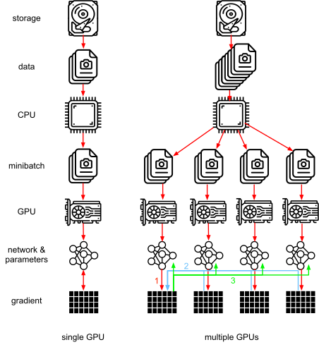
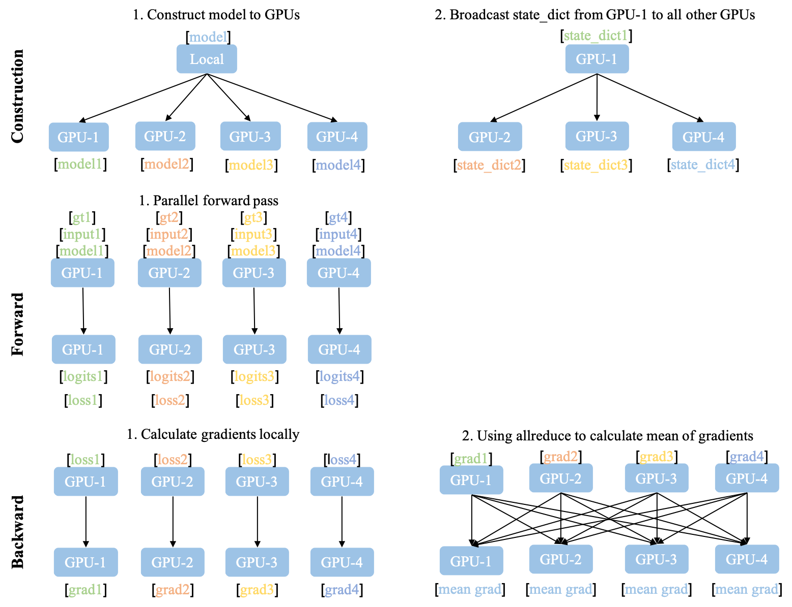
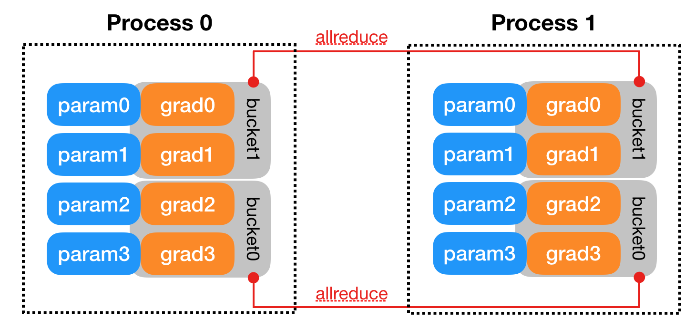
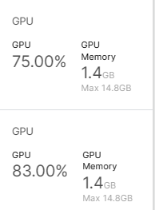

# 3.6 分布式多卡训练
在利用PyTorch做深度学习的过程中，可能会遇到数据量较大无法在单块GPU上完成，或者需要提升计算速度的场景，这时就需要用到并行计算。完成本节内容时，请你确保至少安装了一个NVIDIA GPU并安装了相关的驱动。

经过本节的学习，你将收获：
- 单卡训练

- 多卡训练

- 多卡训练结果保存与加载


## 3.6.1 单卡训练
在PyTorch框架下，CUDA的使用变得非常简单，我们只需要显式的将数据和模型通过.cuda()方法转移到GPU上就可加速我们的训练。如下：
```python
model = Net()
model.cuda() # 模型显示转移到CUDA上

for image,label in dataloader:
    # 图像和标签显示转移到CUDA上
    image = image.cuda() 
    label = label.cuda()
```
注意：`.cuda()`默认使用第一张GPU卡，如果需要使用其他GPU卡，可以修改 **os.environ['CUDA_VISIBLE_DEVICE']='1'** ，其中1表示使用第2张GPU卡。或者使用：
```python
device = "cuda" if torch.cuda.is_available() else "cpu"
model.to(device)

for image,label in dataloader:
    # 图像和标签显示转移到CUDA上
    image = image.to(device)
    label = label.to(device)
```

## 3.6.2 多卡训练
由于数据量的庞大，或者模型的复杂度高，导致训练时间缓慢。如果我们拥有多张显卡，可以将数据和模型分散到不同的GPU上，这样就可以充分利用多张显卡的计算能力，从而提升训练速度。
PyTorch提供了两种多卡训练的方式，分别为DataParallel和DistributedDataParallel（以下我们分别简称为DP和DDP）。这两种方法中官方更推荐我们使用DDP，因为它的性能更好。但是DDP的使用比较复杂，而DP经需要改变几行代码既可以实现，所以我们这里先介绍DP，再介绍DDP。

### 单机多卡DP


首先我们来看单机多卡DP，通常使用一种叫做数据并行 (Data parallelism) 的策略，即将计算任务划分成多个子任务并在多个GPU卡上同时执行这些子任务。主要使用到了`nn.DataParallel`函数，它的使用非常简单，一般我们只需要加几行代码即可实现

```python
model = Net()
model.cuda() # 模型显示转移到CUDA上

if torch.cuda.device_count() > 1: # 含有多张GPU的卡
	model = nn.DataParallel(model) # 单机多卡DP训练
```

除此之外，我们也可以指定GPU进行并行训练，一般有两种方式

- `nn.DataParallel`函数传入`device_ids`参数，可以指定了使用的GPU编号

  ```python
  model = nn.DataParallel(model, device_ids=[0,1]) # 使用第0和第1张卡进行并行训练
  ```

- 要**手动指定对程序可见的GPU设备**

  ```python
  os.environ["CUDA_VISIBLE_DEVICES"] = "1,2"
  ```

当我们使用DP开始训练后，查看当前GPU显存占用情况可以发现，在两张GPU中的占用量有所不同。
<div align=center></div>
通过DP进行分布式多卡训练的方式容易造成负载不均衡，第一块GPU显存占用更多，因为输出默认都会被gather到第一块GPU上。

#### DP原理
DP 是基于单机多卡，所有设备都负责计算和训练网络，除此之外， device[0] (并非 GPU 真实标号而是输入参数 device_ids 首位) 还要负责整合梯度，更新参数。下图即为 GPU 0 作为 device[0] 的例子。从图中我们可以看出，有三个主要过程：

- 过程一（图中红色部分）：各卡分别计算损失和梯度
- 过程二（图中蓝色部分）：所有梯度整合到 device[0]
- 过程三（图中绿色部分）：device[0] 进行参数更新，其他卡拉取 device[0] 的参数进行更新
所有卡都并行运算（图中红色），将梯度收集到 device[0]（图中浅蓝色）和 device[0] 分享模型参数给其他 GPU（图中绿色）三个主要过程。
<div align=center style="background-color:white;"></div>

### 多机多卡DDP

为解决DP的缺陷Pytorch提供了`torch.nn.parallel.DistributedDataParallel`（DDP）方法。

<div align=center style="background-color:white;"></div><br>

DDP的流程如图所示，其中包括一个独特的建立进程组阶段（Construction）。在这个阶段，需要明确通信协议和总进程数。而总进程数指的是参与并行计算的独立进程数量，也称为worldsize。每个进程可以独立占用一个或多个GPU，但建议避免多个进程共享一个GPU，以免造成性能损失。

进程组建立后，每个GPU将独立构建模型。随后，GPU-1中的模型状态会被广播到其他所有进程中，以确保所有模型具有相同的初始状态。值得注意的是，Construction阶段仅在训练开始前执行，训练过程中仅涉及前向和后向过程的迭代，因此不会带来额外延迟。

与DataParallel相比，DDP的前向和后向过程更为简洁。推理、损失函数计算和梯度计算都是并行独立完成的。DDP实现并行训练的核心在于梯度同步。梯度在模型间的同步采用allreduce通信操作，每个GPU都会获得完全相同的梯度。如图中后向过程的步骤2所示，GPU间的通信在梯度计算完成后被触发（hook函数）。通常，每个GPU还会建立独立的优化器。由于模型具有相同的初始状态和梯度，每轮迭代后不同进程间的模型完全相同，保证了DDP的数理一致性。

为优化性能，DDP对allreduce操作进行了深入设计。梯度计算过程和进程间通信过程均需消耗时间。等待所有模型参数计算完梯度再进行通信显然不是最优解。如下图所示，DDP的设计是将所有模型参数划分为无数个小bucket，在bucket级别进行allreduce。当所有进程中bucket0的梯度计算完成后立即开始通信，此时bucket1中的梯度仍在计算。这样可以实现计算和通信过程的时间重叠，提高DDP的训练效率。

<div align=center style="background-color:white;"></div>


### DDP的基本用法 (代码编写流程)

#### 参数设置
我们构造`prepare`函数用来读取训练的参数，并且配置DDP的参数

```python 
def prepare():
    parser = argparse.ArgumentParser()
    parser.add_argument('--gpu', default='0,1')
    parser.add_argument('-e',
                        '--epochs',
                        default=3,
                        type=int,
                        metavar='N',
                        help='number of total epochs to run')
    parser.add_argument('-b',
                        '--batch_size',
                        default=32,
                        type=int,
                        metavar='N',
                        help='number of batchsize')
    args = parser.parse_args()
    
    os.environ['MASTER_ADDR'] = 'localhost'  # 第一台机器的IP
    os.environ['MASTER_PORT'] = '2023'  # 设置机器的端口号
    os.environ['CUDA_VISIBLE_DEVICES'] = args.gpu  # 使用的GPU
    world_size = torch.cuda.device_count() # GPU 数量
    os.environ['WORLD_SIZE'] = str(world_size)
    return args
```
#### DDP初始化
```python
def init_ddp(local_rank):
    torch.cuda.set_device(local_rank) # 设置当前 CUDA 设备为给定的本地 GPU 索引 
    os.environ['RANK'] = str(local_rank) # 将本地 GPU 索引设置为环境变量 'RANK'
    dist.init_process_group(backend='nccl', init_method='env://') # 使用 NCCL 作为分布式后端，并通过环境变量初始化进程组
```
在完成了该初始化后，可以很轻松地在需要时获得local_rank、world_size，而不需要作为额外参数从main中一层一层往下传。
```pythpn
import torch.distributed as dist
local_rank = dist.get_rank()
world_size = dist.get_world_size()
```
#### 训练
训练时，需要使用 DDP 的sampler，并且在num_workers > 1时需要传入generator，否则对于同一个worker，所有进程的augmentation相同，减弱训练的随机性。详细分析[参见](https://zhuanlan.zhihu.com/p/618639620)。

```python
def get_ddp_generator(seed=42):
    local_rank = dist.get_rank()
    g = torch.Generator() # 创建一个 PyTorch 生成器对象
    g.manual_seed(seed + local_rank) # 使用种子初始化生成器，确保每个进程有不同的随机数流
    return g

train_sampler = torch.utils.data.distributed.DistributedSampler(
        train_dataset)  # 使用分布式采样器，确保在 DDP 环境下数据采样一致
g = get_ddp_generator()  # 获取用于 DDP 环境的 PyTorch 生成器
train_dloader = torch.utils.data.DataLoader(dataset=train_dataset,
                                            batch_size=args.batch_size,
                                            shuffle=False,  # 通过分布式采样器完成数据的 shuffle
                                            num_workers=4,
                                            pin_memory=True,
                                            sampler=train_sampler,
                                            generator=g)  # 添加额外的生成器，用于确保每个进程有不同的随机数流
```
`train`函数
```python
def train(model, train_dloader, criterion, optimizer, epoch):
    model.train()
    train_loss = 0
    local_rank = dist.get_rank()
    for images, labels in train_dloader:
        images = images.cuda()
        labels = labels.cuda()
        outputs = model(images)
        loss = criterion(outputs, labels)
        optimizer.zero_grad()
        loss.backward()
        optimizer.step()
        train_loss += loss.item() * images.size(0)
    if local_rank == 0: # 仅在主进程（local_rank == 0）上输出训练损失信息
        train_loss = train_loss / len(train_loader.dataset)
        print('Epoch: {} \tTraining Loss: {:.6f}'.format(epoch+1, train_loss))
```
#### 测试/验证

测试时，我们需要将多个进程的数据reduce到一张卡上。注意，在test函数的外面加上if local_rank == 0，否则多个进程会彼此等待而陷入死锁。

```python
def test(model, test_dloader):
    local_rank = dist.get_rank()
    model.eval()
    size = torch.tensor(0.).cuda()
    correct = torch.tensor(0.).cuda()
    for images, labels in test_dloader:
        images = images.cuda()
        labels = labels.cuda()
        with torch.no_grad():
            outputs = model(images)
            size += images.size(0)
        correct += (outputs.argmax(1) == labels).type(torch.float).sum()
    # 在所有进程中汇总总样本数和正确预测的样本数
    dist.reduce(size, 0, op=dist.ReduceOp.SUM)  
    dist.reduce(correct, 0, op=dist.ReduceOp.SUM)  
    # 仅在主进程（local_rank == 0）上输出准确率信息
    if local_rank == 0:
        acc = correct / size
        print(f'Accuracy is {acc:.2%}')
```
#### 主函数
我们已经完成了所有函数部分的定义，现在开始完成主函数。以`3.3节`任务为例
```python
def main(local_rank, args):
    init_ddp(local_rank)  # 进程初始化
    model = resnet18(True)  
    num_ftrs = model.fc.in_features
    model.fc = nn.Linear(in_features=num_ftrs, out_features=10, bias=True)
    model.cuda()
    model = nn.SyncBatchNorm.convert_sync_batchnorm(model)  # 转换模型的 BN 层
    model = nn.parallel.DistributedDataParallel(model,
                                                device_ids=[local_rank
                                                            ])  # 使用DDP
    criterion = nn.CrossEntropyLoss().cuda()
    optimizer = torch.optim.AdamW(model.parameters(), 1e-4)
    

    image_size = 28
    data_transform = transforms.Compose([
        transforms.Grayscale(num_output_channels=3),
        transforms.Resize(image_size),
        transforms.ToTensor()
    ])
    train_dataset = torchvision.datasets.FashionMNIST(root='./', train=True, download=True, transform=data_transform)
    test_dataset = torchvision.datasets.FashionMNIST(root='./', train=False, download=True, transform=data_transform)
    g = get_ddp_generator()
    
    train_sampler = torch.utils.data.distributed.DistributedSampler(train_dataset)  
    train_dloader = torch.utils.data.DataLoader(
        dataset=train_dataset,
        batch_size=args.batch_size,
        shuffle=False,  
        num_workers=4,
        pin_memory=True,
        sampler=train_sampler,
        generator=g) 
    
    test_sampler = torch.utils.data.distributed.DistributedSampler(
        test_dataset)  
    test_dloader = torch.utils.data.DataLoader(dataset=test_dataset,
                                               batch_size=args.batch_size,
                                               shuffle=False,
                                               num_workers=2,
                                               pin_memory=True,
                                               sampler=test_sampler)
    
    for epoch in range(args.epochs):
        if local_rank == 0:  # 防止每个进程都输出一次
            print(f'begin training of epoch {epoch + 1}/{args.epochs}')
        train_dloader.sampler.set_epoch(epoch) 
        train(model, train_dloader, criterion, optimizer, epoch)
        if local_rank == 0:
            print(f'begin testing')
        test(model, test_dloader)
    if local_rank == 0:  # 防止每个进程都保存一次
        torch.save({
            'model': model.state_dict(),
        }, 'ddp_checkpoint.pt')
    dist.destroy_process_group()
```

#### 启动DDP训练
目前有两种启动方式：
1. mp.spawn
2. torchrun

mp.spawn 提供了更灵活的编程接口，适用于需要更多自定义控制的场景。torchrun 则更注重简便性，适用于简单的分布式训练场景，特别是对于那些不想编写复杂启动脚本的用户。

##### mp.spawn

###### **入口**
```python
if __name__ == '__main__':
    args = prepare()  # 初始化
    mp.spawn(main, args=(args, ), nprocs=torch.cuda.device_count()) 
```
###### **启动**
```
python ddp.py --gpu 0,1 -b 256 -e 20
```

##### torchrun
###### **入口**
```python
if __name__ == '__main__':
    args = prepare()
    main(args)
```
###### **启动**
相比mp.spawn启动，torchrun自动控制一些环境变量的设置，因而更为方便。我们只需要设置os.environ['CUDA_VISIBLE_DEVICES']即可（不设置默认为该机器上的所有GPU），而无需设置os.environ['MASTER_ADDR']等。此外，main函数不再需要local_rank参数。
```
torchrun --standalone --nproc_per_node=2 ddp.py --gpu 0,1 -b 256 -e 20
```
在训练中查看当前GPU显存占用情况：
<div align=center></div>
占用了相同的显存。


### DP 与 DDP 的优缺点

#### DP 的优势

`nn.DataParallel`没有改变模型的输入输出，因此其他部分的代码不需要做任何更改，非常方便，一行代码即可搞定。

#### DP 的缺点

`DP`进行分布式多卡训练的方式容易造成负载不均衡，第一块GPU显存占用更多，因为输出默认都会被gather到第一块GPU上，也就是后续的loss计算只会在`cuda:0`上进行，没法并行。

除此之外`DP`只能在单机上使用，且`DP`是单进程多线程的实现方式，比`DDP`多进程多线程的方式会效率低一些。

#### DDP的优势

**1. 每个进程对应一个独立的训练过程，且只对梯度等少量数据进行信息交换。**

**`DDP`** 在每次迭代中，每个进程具有自己的 `optimizer` ，并独立完成所有的优化步骤，进程内与一般的训练无异。

在各进程梯度计算完成之后，各进程需要将**梯度**进行汇总平均，然后再由 `rank=0` 的进程，将其 `broadcast` 到所有进程。之后，各进程用该梯度来独立的更新参数。而 `DP`是**梯度汇总到主** `GPU`，**反向传播更新参数**，再广播参数给其他的 GPU。

**`DDP`** 中由于各进程中的模型，初始参数一致 (初始时刻进行一次 `broadcast`)，而每次用于更新参数的梯度也一致，因此，各进程的模型参数始终保持一致。

而在`DP` 中，全程维护一个 `optimizer`，对各 `GPU` 上梯度进行求和，而在主 `GPU` 进行参数更新，之后再将模型参数 `broadcast` 到其他 `GPU`。

相较于 **`DP`**，**`DDP`** 传输的数据量更少，因此速度更快，效率更高。

**2. 每个进程包含独立的解释器和 GIL。**

一般使用的 `Python` 解释器 `CPython`：是用 `C` 语言实现 `Pyhon`，是目前应用最广泛的解释器。全局锁使 `Python` 在多线程效能上表现不佳，全局解释器锁（`Global Interpreter Lock`）是 `Python` 用于同步线程的工具，使得任何时刻仅有一个线程在执行。

由于每个进程拥有独立的解释器和 `GIL`，消除了来自单个 `Python` 进程中的多个执行线程，模型副本或 `GPU` 的额外解释器开销和 `GIL-thrashing` ，因此可以减少解释器和 `GIL` 使用冲突。这对于严重依赖 `Python runtime` 的 `models` 而言，比如说包含 `RNN` 层或大量小组件的 `models` 而言，这尤为重要。

#### DDP 的缺点

暂时来说，`DDP`是采用多进程多线程的方式，并且训练速度较高，他的缺点主要就是，需要修改比较多的代码，比`DP`的一行代码较为繁琐许多。


## 3.6.3 单卡/多卡训练模型的保存和加载


对于单卡和多卡模型训练的模型，我们把`model`对应的`layer`名称打印出来看一下，可以观察到差别在于多卡并行的模型每层的名称前多了一个“module”。

- 单卡模型的层名：

<div align=center></div>

- 多卡模型的层名：

<div align=center></div>

这种模型表示的不同可能会导致模型保存和加载过程中需要处理一些矛盾点，下面对各种可能的情况做分类讨论。


- **单卡保存+单卡加载**

在使用os.envision命令指定使用的GPU后，即可进行模型保存和读取操作。注意这里即便保存和读取时使用的GPU不同也无妨。

```python
import os
import torch
from torchvision import models

os.environ['CUDA_VISIBLE_DEVICES'] = '0'   #这里替换成希望使用的GPU编号
model = models.resnet152(pretrained=True)
model.cuda()

save_dir = 'resnet152.pt'   #保存路径

# 保存+读取整个模型
torch.save(model, save_dir)
loaded_model = torch.load(save_dir)
loaded_model.cuda()

# 保存+读取模型权重
torch.save(model.state_dict(), save_dir)
loaded_model = models.resnet152()   #注意这里需要对模型结构有定义
loaded_model.load_state_dict(torch.load(save_dir))
loaded_model.cuda()
```

- **单卡保存+多卡加载**

这种情况的处理比较简单，读取单卡保存的模型后，使用`nn.DataParallel`函数进行分布式训练设置即可（相当于3.1代码中.cuda()替换一下）：

```python
import os
import torch
from torchvision import models

os.environ['CUDA_VISIBLE_DEVICES'] = '0'   #这里替换成希望使用的GPU编号
model = models.resnet152(pretrained=True)
model.cuda()

# 保存+读取整个模型
torch.save(model, save_dir)

os.environ['CUDA_VISIBLE_DEVICES'] = '1,2'   #这里替换成希望使用的GPU编号
loaded_model = torch.load(save_dir)
loaded_model = nn.DataParallel(loaded_model).cuda()

# 保存+读取模型权重
torch.save(model.state_dict(), save_dir)

os.environ['CUDA_VISIBLE_DEVICES'] = '1,2'   #这里替换成希望使用的GPU编号
loaded_model = models.resnet152()   #注意这里需要对模型结构有定义
loaded_model.load_state_dict(torch.load(save_dir))
loaded_model = nn.DataParallel(loaded_model).cuda()
```

- **多卡保存+单卡加载**

这种情况下的核心问题是：如何去掉权重字典键名中的"module"，以保证模型的统一性。

对于加载整个模型，直接提取模型的module属性即可：

```python
import os
import torch
from torchvision import models

os.environ['CUDA_VISIBLE_DEVICES'] = '1,2'   #这里替换成希望使用的GPU编号

model = models.resnet152(pretrained=True)
model = nn.DataParallel(model).cuda()

# 保存+读取整个模型
torch.save(model, save_dir)

os.environ['CUDA_VISIBLE_DEVICES'] = '0'   #这里替换成希望使用的GPU编号
loaded_model = torch.load(save_dir).module
```

对于加载模型权重，有以下几种思路：
**保存模型时保存模型的module属性对应的权重**
```python
import os
os.environ['CUDA_VISIBLE_DEVICES'] = '0,1,2'   #这里替换成希望使用的GPU编号
import torch
from torchvision import models

save_dir = 'resnet152.pth'   #保存路径
model = models.resnet152(pretrained=True)
model = nn.DataParallel(model).cuda()

# 保存权重
torch.save(model.module.state_dict(), save_dir)
```
这样保存下来的模型参数就和单卡保存的模型参数一样了，可以直接加载。也是比较推荐的一种方法。
**去除字典里的module麻烦，往model里添加module简单**

```python
import os
os.environ['CUDA_VISIBLE_DEVICES'] = '0,1,2'   #这里替换成希望使用的GPU编号
import torch
from torchvision import models

model = models.resnet152(pretrained=True)
model = nn.DataParallel(model).cuda()

# 保存+读取模型权重
torch.save(model.state_dict(), save_dir)

os.environ['CUDA_VISIBLE_DEVICES'] = '0'   #这里替换成希望使用的GPU编号
loaded_model = models.resnet152()   #注意这里需要对模型结构有定义
loaded_model.load_state_dict(torch.load(save_dir))
loaded_model = nn.DataParallel(loaded_model).cuda()
loaded_model.state_dict = loaded_dict
```

这样即便是单卡，也可以开始训练了（相当于分布到单卡上）

**遍历字典去除module**

```python
from collections import OrderedDict
os.environ['CUDA_VISIBLE_DEVICES'] = '0'   #这里替换成希望使用的GPU编号

loaded_dict = torch.load(save_dir)

new_state_dict = OrderedDict()
for k, v in loaded_dict.items():
    name = k[7:] # module字段在最前面，从第7个字符开始就可以去掉module
    new_state_dict[name] = v #新字典的key值对应的value一一对应

loaded_model = models.resnet152()   #注意这里需要对模型结构有定义
loaded_model.state_dict = new_state_dict
loaded_model = loaded_model.cuda()
```

**使用replace操作去除module**

```python
loaded_model = models.resnet152()    
loaded_dict = torch.load(save_dir)
loaded_model.load_state_dict({k.replace('module.', ''): v for k, v in loaded_dict.items()})
```


- **多卡保存+多卡加载**

由于是模型保存和加载都使用的是多卡，因此不存在模型层名前缀不同的问题。但多卡状态下存在一个device（使用的GPU）匹配的问题，即**保存整个模型**时会同时保存所使用的GPU id等信息，读取时若这些信息和当前使用的GPU信息不符则可能会报错或者程序不按预定状态运行。具体表现为以下两点：

**读取整个模型再使用nn.DataParallel进行分布式训练设置**

这种情况很可能会造成保存的整个模型中GPU id和读取环境下设置的GPU id不符，训练时数据所在device和模型所在device不一致而报错。

**读取整个模型而不使用nn.DataParallel进行分布式训练设置**

这种情况可能不会报错，测试中发现程序会自动使用设备的前n个GPU进行训练（n是保存的模型使用的GPU个数）。此时如果指定的GPU个数少于n，则会报错。在这种情况下，只有保存模型时环境的device id和读取模型时环境的device id一致，程序才会按照预期在指定的GPU上进行分布式训练。

相比之下，读取模型权重，之后再使用nn.DataParallel进行分布式训练设置则没有问题。因此**多卡模式下建议使用权重的方式存储和读取模型**：

```python
import os
import torch
from torchvision import models

os.environ['CUDA_VISIBLE_DEVICES'] = '0,1,2'   #这里替换成希望使用的GPU编号

model = models.resnet152(pretrained=True)
model = nn.DataParallel(model).cuda()

# 保存+读取模型权重，强烈建议！！
torch.save(model.state_dict(), save_dir)
loaded_model = models.resnet152()   #注意这里需要对模型结构有定义
loaded_model.load_state_dict(torch.load(save_dir)))
loaded_model = nn.DataParallel(loaded_model).cuda()
```

如果只有保存的整个模型，也可以采用提取权重的方式构建新的模型：

```python
# 读取整个模型
loaded_whole_model = torch.load(save_dir)
loaded_model = models.resnet152()   #注意这里需要对模型结构有定义
loaded_model.state_dict = loaded_whole_model.state_dict
loaded_model = nn.DataParallel(loaded_model).cuda()
```

另外，上面所有对于loaded_model修改权重字典的形式都是通过赋值来实现的，在PyTorch中还可以通过"load_state_dict"函数来实现。因此在上面的所有示例中，我们使用了两种实现方式。

```python
loaded_model.load_state_dict(loaded_dict)
```

## 参考资料
1. [PyTorch DDP](https://pytorch.org/docs/stable/notes/ddp.html)
2. [GETTING STARTED WITH DISTRIBUTED DATA PARALLEL](https://pytorch.org/tutorials/intermediate/ddp_tutorial.html#basic-use-case)
3. [example code](https://github.com/LianShuaiLong/CV_Applications/blob/master/classification/classification-pytorch/train_distribution.py)
4. [PyTorch单卡/多卡下模型保存/加载](https://zhuanlan.zhihu.com/p/371090724)
