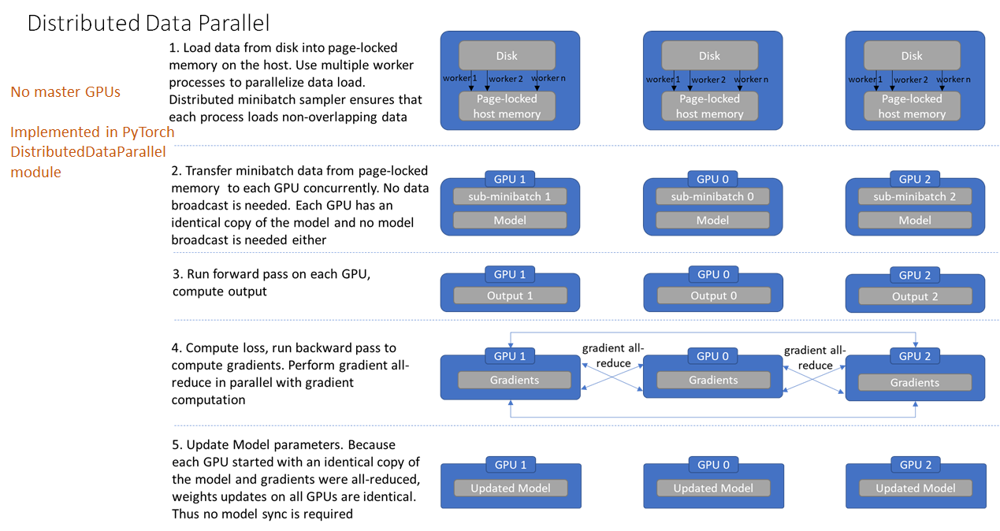
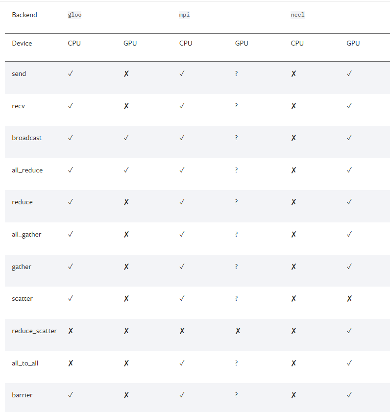

# 3.6 分布式多卡训练
在利用PyTorch做深度学习的过程中，可能会遇到数据量较大无法在单块GPU上完成，或者需要提升计算速度的场景，这时就需要用到并行计算。完成本节内容时，请你确保至少安装了一个NVIDIA GPU并安装了相关的驱动。

经过本节的学习，你将收获：
- 单卡训练

- 多卡训练

- 多卡训练结果保存与加载


## 3.6.1 单卡训练
在PyTorch框架下，CUDA的使用变得非常简单，我们只需要显式的将数据和模型通过.cuda()方法转移到GPU上就可加速我们的训练。如下：
```python
model = Net()
model.cuda() # 模型显示转移到CUDA上

for image,label in dataloader:
    # 图像和标签显示转移到CUDA上
    image = image.cuda() 
    label = label.cuda()
```
注意：`.cuda()`默认使用第一张GPU卡，如果需要使用其他GPU卡，可以修改 **os.environ['CUDA_VISIBLE_DEVICE']='1'** ，其中1表示使用第2张GPU卡。或者使用：
```python
device = "cuda" if torch.cuda.is_available() else "cpu"
model.to(device)

for image,label in dataloader:
    # 图像和标签显示转移到CUDA上
    image = image.to(device)
    label = label.to(device)
```

## 3.6.2 多卡训练
由于数据量的庞大，或者模型的复杂度高，导致训练时间缓慢。如果我们拥有多张显卡，可以将数据和模型分散到不同的GPU上，这样就可以充分利用多张显卡的计算能力，从而提升训练速度。
PyTorch提供了两种多卡训练的方式，分别为DataParallel和DistributedDataParallel（以下我们分别简称为DP和DDP）。这两种方法中官方更推荐我们使用DDP，因为它的性能更好。但是DDP的使用比较复杂，而DP经需要改变几行代码既可以实现，所以我们这里先介绍DP，再介绍DDP。

### 单机多卡DP


首先我们来看单机多卡DP，通常使用一种叫做数据并行 (Data parallelism) 的策略，即将计算任务划分成多个子任务并在多个GPU卡上同时执行这些子任务。主要使用到了`nn.DataParallel`函数，它的使用非常简单，一般我们只需要加几行代码即可实现

```python
model = Net()
model.cuda() # 模型显示转移到CUDA上

if torch.cuda.device_count() > 1: # 含有多张GPU的卡
	model = nn.DataParallel(model) # 单机多卡DP训练
```

除此之外，我们也可以指定GPU进行并行训练，一般有两种方式

- `nn.DataParallel`函数传入`device_ids`参数，可以指定了使用的GPU编号

  ```python
  model = nn.DataParallel(model, device_ids=[0,1]) # 使用第0和第1张卡进行并行训练
  ```

- 要**手动指定对程序可见的GPU设备**

  ```python
  os.environ["CUDA_VISIBLE_DEVICES"] = "1,2"
  ```

### 多机多卡DDP



不过通过DP进行分布式多卡训练的方式容易造成负载不均衡，有可能第一块GPU显存占用更多，因为输出默认都会被gather到第一块GPU上。为此Pytorch也提供了`torch.nn.parallel.DistributedDataParallel`（DDP）方法来解决这个问题。

针对每个GPU，启动一个进程，然后这些进程在最开始的时候会保持一致（模型的初始化参数也一致，每个进程拥有自己的优化器），同时在更新模型的时候，梯度传播也是完全一致的，这样就可以保证任何一个GPU上面的模型参数就是完全一致的，所以这样就不会出现`DataParallel`那样显存不均衡的问题。不过相对应的，会比较麻烦，接下来介绍一下多机多卡DDP的使用方法。

开始之前需要先熟悉几个概念，这些还是有必要提一下的

**进程组的相关概念**

- **GROUP**：进程组，默认情况下，只有一个组，一个 job 即为一个组，也即一个 world。（当需要进行更加精细的通信时，可以通过 new_group 接口，使用 world 的子集，创建新组，用于集体通信等。）
- **WORLD_SIZE**：表示全局进程个数。如果是多机多卡就表示机器数量，如果是单机多卡就表示 GPU 数量。
- **RANK**：表示进程序号，用于进程间通讯，表征进程优先级。rank = 0 的主机为 master 节点。 如果是多机多卡就表示对应第几台机器，如果是单机多卡，由于一个进程内就只有一个 GPU，所以 rank 也就表示第几块 GPU。
- **LOCAL_RANK**：表示进程内，GPU 编号，非显式参数，由 torch.distributed.launch 内部指定。例如，多机多卡中 rank = 3，local_rank = 0 表示第 3 个进程内的第 1 块 GPU。


**DDP的基本用法 (代码编写流程)**

- 在使用 `distributed` 包的任何其他函数之前，需要使用 `init_process_group` **初始化进程组**，同时初始化 `distributed` 包。
- 使用 `torch.nn.parallel.DistributedDataParallel` 创建 **分布式模型** `DDP(model, device_ids=device_ids)`
- 使用 `torch.utils.data.distributed.DistributedSampler` 创建 **DataLoader**
- 使用启动工具 `torch.distributed.launch` 在每个主机上执行一次脚本，开始训练

首先是对代码进行修改，添加参数  --local_rank

```python
import argparse
parser = argparse.ArgumentParser()
parser.add_argument("--local_rank", type=int) # 这个参数很重要
args = parser.parse_args()
```

这里的local_rank参数，可以理解为`torch.distributed.launch`在给一个GPU创建进程的时候，给这个进程提供的GPU号，这个是程序自动给的，**不需要手动在命令行中指定这个参数。**

```python
local_rank = int(os.environ["LOCAL_RANK"]) #也可以自动获取
```
然后在所有和GPU相关代码的前面添加如下代码，如果不写这句代码，所有的进程都默认在你使用`CUDA_VISIBLE_DEVICES`参数设定的0号GPU上面启动

```python
torch.cuda.set_device(args.local_rank) # 调整计算的位置
```

接下来我们得初始化`backend`，也就是俗称的后端，pytorch介绍了以下后端：



可以看到，提供了`gloo`，`nccl`，`mpi`，那么如何进行选择呢，官网中也给了以下建议

- 经验之谈
  - 如果是使用`cpu`的分布式计算, 建议使用`gloo`，因为表中可以看到 `gloo`对`cpu`的支持是最好的
  - 如果使用`gpu`进行分布式计算, 建议使用`nccl`。

- GPU主机
  - InfiniBand连接，建议使用`nccl`，因为它是目前唯一支持 InfiniBand 和 GPUDirect 的后端。
  - Ethernet连接，建议使用`nccl`，因为它的分布式GPU训练性能目前是最好的，特别是对于多进程单节点或多节点分布式训练。 如果在使用 `nccl`时遇到任何问题，可以使用`gloo` 作为后备选项。 （不过注意，对于 GPU，`gloo` 目前的运行速度比 `nccl` 慢。）
- CPU主机
  - InfiniBand连接，如果启用了IP over IB，那就使用`gloo`，否则使用`mpi`
  - Ethernet连接，建议使用`gloo`，除非有不得已的理由使用`mpi`。

当后端选择好了之后, 我们需要设置一下网络接口, 因为多个主机之间肯定是使用网络进行交换, 那肯定就涉及到IP之类的, 对于`nccl`和`gloo`一般会自己寻找网络接口，不过有时候如果网卡比较多的时候，就需要自己设置，可以利用以下代码

```python
import os
# 以下二选一, 第一个是使用gloo后端需要设置的, 第二个是使用nccl需要设置的
os.environ['GLOO_SOCKET_IFNAME'] = 'eth0'
os.environ['NCCL_SOCKET_IFNAME'] = 'eth0'
```

> 可以通过以下操作知道自己的网络接口，输入`ifconfig`, 然后找到自己IP地址的就是, 一般就是`em0`, `eth0`, `esp2s0`之类的, 

从以上介绍我们可以看出， 当使用GPU的时候, `nccl`的效率是高于`gloo`的，我们一般还是会选择`nccl`后端，设置GPU之间通信使用的后端和端口：

```python
# ps 检查nccl是否可用
# torch.distributed.is_nccl_available ()
torch.distributed.init_process_group(backend='nccl') # 选择nccl后端，初始化进程组
```


之后，使用 `DistributedSampler` 对数据集进行划分。它能帮助我们将每个 batch 划分成几个 partition，在当前进程中只需要获取和 rank 对应的那个 partition 进行训练：

 ```python
 # 创建Dataloader
 train_sampler = torch.utils.data.distributed.DistributedSampler(train_dataset)
 train_loader = torch.utils.data.DataLoader(train_dataset, batch_size=16, sampler=train_sampler)
 ```

注意： testset不用sampler

然后使用`torch.nn.parallel.DistributedDataParallel`包装模型：

```python
# DDP进行训练
model = torch.nn.parallel.DistributedDataParallel(model, device_ids=[args.local_rank])
```

**如何启动DDP**

那么如何启动DDP，这不同于DP的方式，需要使用torch.distributed.launch启动器，对于单机多卡的情况：

  ```python
  CUDA_VISIBLE_DEVICES=0,1,2,3 python -m torch.distributed.launch --nproc_per_node=4 main.py
  # nproc_per_node: 这个参数是指你使用这台服务器上面的几张显卡
  ```

  > 有时候虽然说，可以简单使用DP，但是DDP的效率是比DP高的，所以很多时候单机多卡的情况，我们还是会去使用DDP

### DP 与 DDP 的优缺点

#### DP 的优势

`nn.DataParallel`没有改变模型的输入输出，因此其他部分的代码不需要做任何更改，非常方便，一行代码即可搞定。

#### DP 的缺点

`DP`进行分布式多卡训练的方式容易造成负载不均衡，第一块GPU显存占用更多，因为输出默认都会被gather到第一块GPU上，也就是后续的loss计算只会在`cuda:0`上进行，没法并行。

除此之外`DP`只能在单机上使用，且`DP`是单进程多线程的实现方式，比`DDP`多进程多线程的方式会效率低一些。

#### DDP的优势

**1. 每个进程对应一个独立的训练过程，且只对梯度等少量数据进行信息交换。**

**`DDP`** 在每次迭代中，每个进程具有自己的 `optimizer` ，并独立完成所有的优化步骤，进程内与一般的训练无异。

在各进程梯度计算完成之后，各进程需要将**梯度**进行汇总平均，然后再由 `rank=0` 的进程，将其 `broadcast` 到所有进程。之后，各进程用该梯度来独立的更新参数。而 `DP`是**梯度汇总到主** `GPU`，**反向传播更新参数**，再广播参数给其他的 GPU。

**`DDP`** 中由于各进程中的模型，初始参数一致 (初始时刻进行一次 `broadcast`)，而每次用于更新参数的梯度也一致，因此，各进程的模型参数始终保持一致。

而在`DP` 中，全程维护一个 `optimizer`，对各 `GPU` 上梯度进行求和，而在主 `GPU` 进行参数更新，之后再将模型参数 `broadcast` 到其他 `GPU`。

相较于**`DP`**，**`DDP`**传输的数据量更少，因此速度更快，效率更高。

**2. 每个进程包含独立的解释器和 GIL。**

一般使用的 `Python` 解释器 `CPython`：是用 `C` 语言实现 `Pyhon`，是目前应用最广泛的解释器。全局锁使 `Python` 在多线程效能上表现不佳，全局解释器锁（`Global Interpreter Lock`）是 `Python` 用于同步线程的工具，使得任何时刻仅有一个线程在执行。

由于每个进程拥有独立的解释器和 `GIL`，消除了来自单个 `Python` 进程中的多个执行线程，模型副本或 `GPU` 的额外解释器开销和 `GIL-thrashing` ，因此可以减少解释器和 `GIL` 使用冲突。这对于严重依赖 `Python runtime` 的 `models` 而言，比如说包含 `RNN` 层或大量小组件的 `models` 而言，这尤为重要。

#### DDP 的缺点

暂时来说，`DDP`是采用多进程多线程的方式，并且训练速度较高，他的缺点主要就是，需要修改比较多的代码，比`DP`的一行代码较为繁琐许多。

