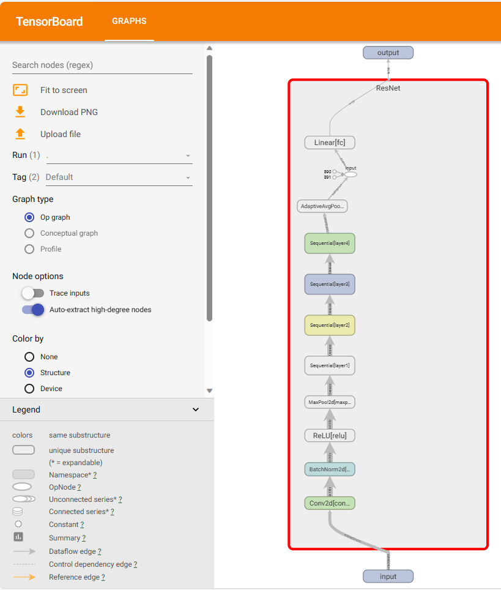
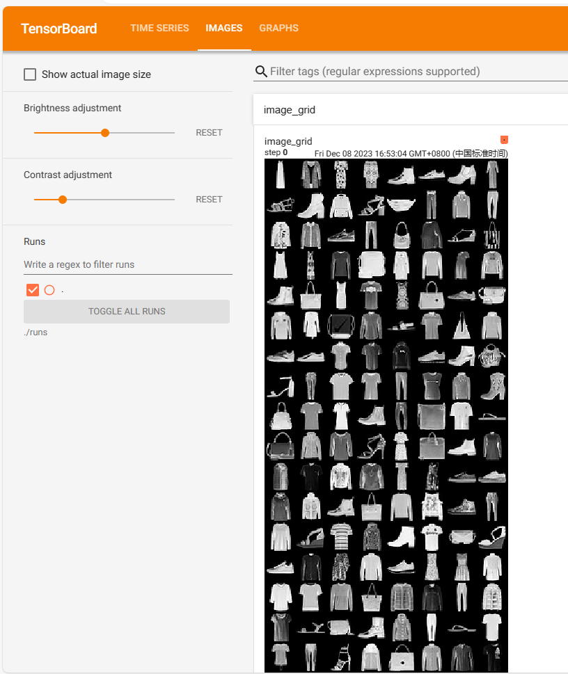
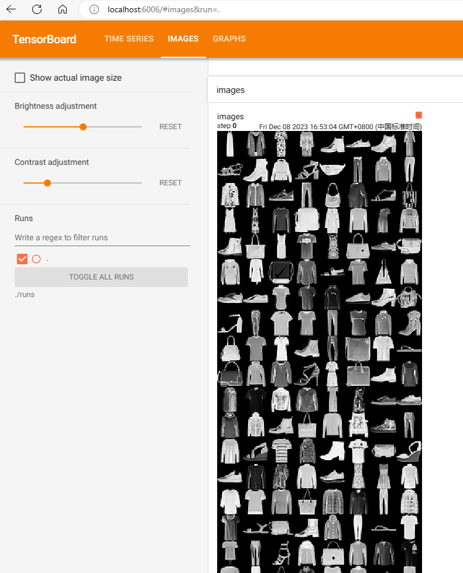
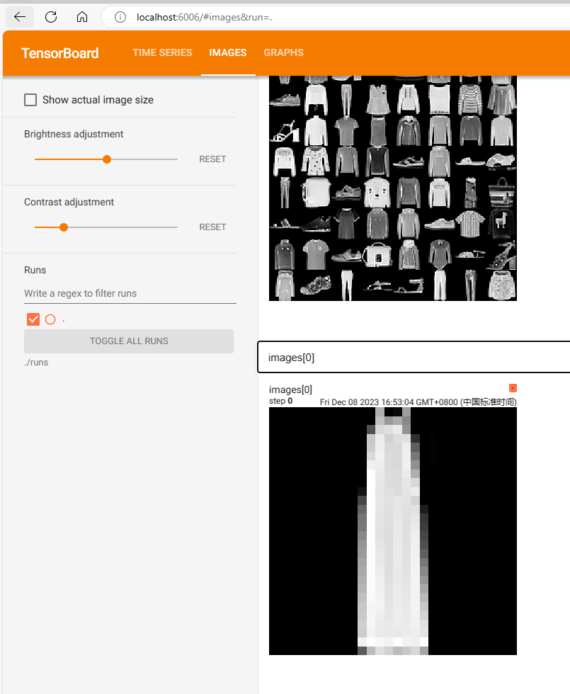
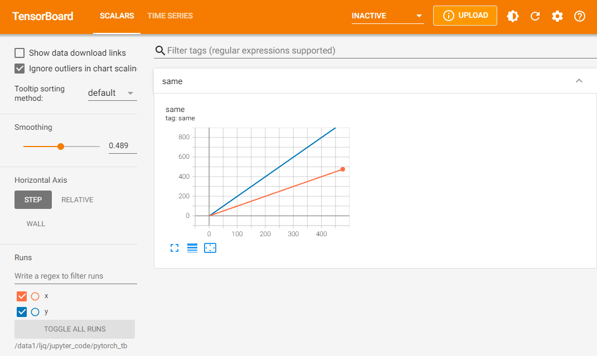
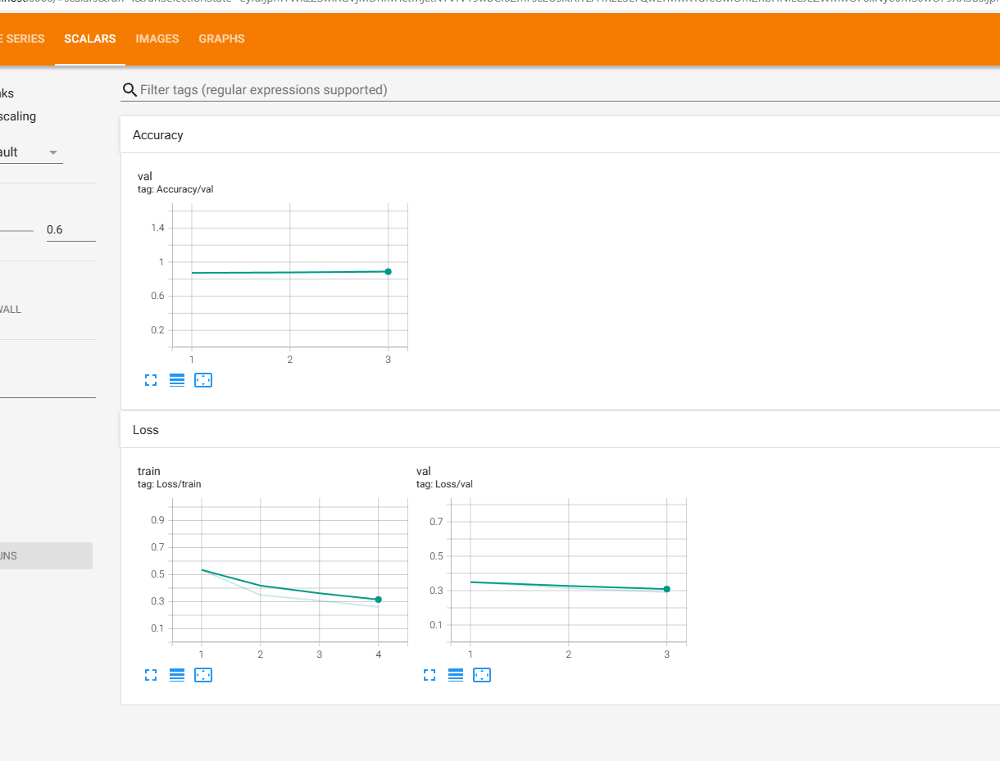
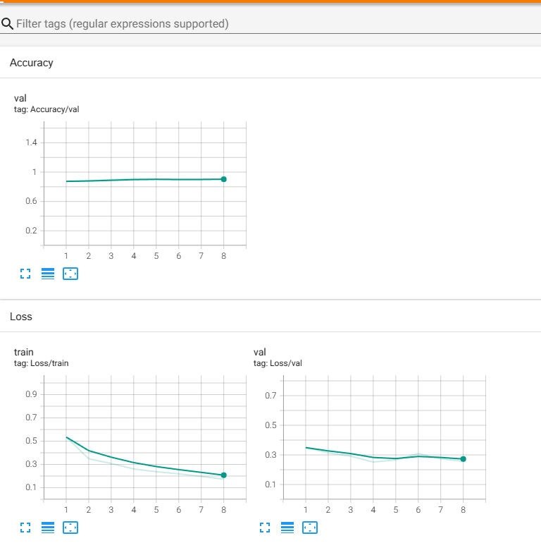
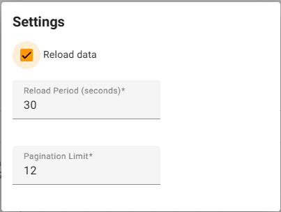

# 3.7 使用TensorBoard可视化训练过程

训练过程的可视化在深度学习模型训练中扮演着重要的角色。学习的过程是一个优化的过程，我们需要找到最优的点作为训练过程的输出产物。一般来说，我们会结合训练集的损失函数和验证集的损失函数，绘制两条损失函数的曲线来确定训练的终点，找到对应的模型用于测试。那么除了使用print，logger这些简单的记录工具记录训练中每个epoch的loss值，我们能否实时观察损失函数曲线的变化，及时捕捉模型的变化呢？

此外，我们也希望可视化其他内容，如输入数据（尤其是图片）、模型结构、参数分布等，这些对于我们在debug中查找问题来源非常重要（比如输入数据和我们想象的是否一致）。

在这一节，我们将介绍TensorBoard，并用它来完成训练的可视化。TensorBoard由TensorFlow团队开发，最早和TensorFlow配合使用，后来广泛应用于各种深度学习框架的可视化中来，它能够满足上面提到的各种需求。本节我们探索TensorBoard的强大功能，希望帮助读者“从入门到精通”。

经过本节的学习，你将收获：

- 了解TensorBoard可视化的基本逻辑
- 掌握利用TensorBoard实现训练过程可视化
- 掌握利用TensorBoard完成其他内容的可视化


## 3.7.1 TensorBoard的配置与启动

我们可以将TensorBoard看做一个记录员，它可以记录我们指定的数据，包括模型每一层的feature map，权重，以及训练loss等等。TensorBoard将记录下来的内容保存在一个用户指定的文件夹里，程序不断运行中TensorBoard会不断记录。记录下的内容可以通过网页的形式加以可视化。

在使用TensorBoard前，我们需要先指定一个文件夹（默认是./runs/路径下）供TensorBoard保存记录下来的数据。然后调用tensorboard中的SummaryWriter作为上述“记录员”

```python
from torch.utils.tensorboard import SummaryWriter

# Writer will output to ./runs/ directory by default
writer = SummaryWriter()
```

上面的操作实例化SummaryWritter为变量writer，并指定writer的输出目录为当前目录下的"runs"目录。也就是说，之后tensorboard记录下来的内容都会保存在runs。

这里聪明的你可能发现了，我们是否可以手动往runs文件夹里添加数据用于可视化，或者把runs文件夹里的数据放到其他机器上可视化呢？答案是可以的。只要数据被记录，我们就可以将这个数据分享给其他人，其他人在安装了tensorboard的情况下就会看到你分享的数据。而启动tensorboard的服务也很简单，我们只需要在命令行中输入

```bash
# pip install tensorboard
tensorboard --logdir=/path/to/logs/ --port=xxxx # xxxx是指定端口号，如果不指定特殊端口号，会在6006端口
```

其中“path/to/logs/"是指定的保存tensorboard记录结果的文件路径（等价于上面的“./runs"，port是外部访问TensorBoard的端口号，可以通过访问ip:port访问tensorboard，这一操作和jupyter notebook的使用类似。如果不是在服务器远程使用的话则不需要配置port。

有时，为了tensorboard能够不断地在后台运行，我们也可以使用nohup命令或者tmux工具来运行tensorboard。大家可以自行搜索，这里不展开讨论了。下面，我们将模拟深度学习模型训练过程，来介绍如何利用TensorBoard可视化其中的各个部分。

## 3.7.2 TensorBoard模型结构可视化

以 **3.3节** 中定义的ResNet18为例，只需在模型定义后，进行如下修改：
```python
model = resnet18(pretrained=True)
model.conv1 = nn.Conv2d(1, 64, kernel_size=7, stride=2, padding=3, bias=False)
num_ftrs = model.fc.in_features
model.fc = nn.Linear(num_ftrs, 10)

from torch.utils.tensorboard import SummaryWriter
writer = SummaryWriter('./runs')

writer.add_graph(model, input_to_model = torch.rand(1, 1, 224, 224))
writer.close()
```
展示结果如下（其中框内部分初始会显示为`ResNet`，需要双击后才会展开）：
<div align=center></div>

## 3.7.3 TensorBoard图像可视化

当我们做图像相关的任务时，可以方便地将所处理的图片在tensorboard中进行可视化展示。

- 对于单张图片的显示使用add_image
- 对于多张图片的显示使用add_images
- 有时需要使用torchvision.utils.make_grid将多张图片拼成一张图片后，用writer.add_image显示

这里我们依旧以**3.3节**数据集为例，在Dataloader之后添加如下代码：

```python

from torch.utils.tensorboard import SummaryWriter
images, labels = next(iter(train_loader)) # 获取一个step的图像和标签
# 仅查看一张图片
writer = SummaryWriter('./runs')
writer.add_image('images[0]', images[0][0].unsqueeze(0))
writer.close()
 
# 将多张图片拼接成一张图片，中间用黑色网格分割
# create grid of images
writer = SummaryWriter('./runs')
img_grid = torchvision.utils.make_grid(images)
writer.add_image('image_grid', img_grid)
writer.close()
 
# 将多张图片直接写入
writer = SummaryWriter('./runs')
writer.add_images("images",images,global_step = 0)
writer.close()
```

依次运行上面三组可视化（注意不要同时在notebook的一个单元格内运行），得到的可视化结果如下（最后运行的结果在最上面）：

<div align=center></div>

<div align=center></div>

<div align=center></div>

另外注意上方menu部分，刚刚只有“GRAPHS"栏对应模型的可视化，现在则多出了”IMAGES“栏对应图像的可视化。左侧的滑动按钮可以调整图像的亮度和对比度。

此外，除了可视化原始图像，TensorBoard提供的可视化方案自然也适用于我们在Python中用matplotlib等工具绘制的其他图像，用于展示分析结果等内容。

## 3.7.4 TensorBoard连续变量可视化

TensorBoard可以用来可视化连续变量（或时序变量）的变化过程，通过add_scalar实现。

```python
writer = SummaryWriter('./runs')
for i in range(500):
    x = i
    y = x**2
    writer.add_scalar("x", x, i) #日志中记录x在第step i 的值
    writer.add_scalar("y", y, i) #日志中记录y在第step i 的值
writer.close()
```

可视化结果如下：

<div align=center></div>

如果想在同一张图中显示多个曲线，则需要分别建立存放子路径（使用SummaryWriter指定路径即可自动创建，但需要在tensorboard运行目录下），同时在add_scalar中修改曲线的标签使其一致即可：

```python
writer1 = SummaryWriter('./runs/x')
writer2 = SummaryWriter('./runs/y')
for i in range(500):
    x = i
    y = x*2
    writer1.add_scalar("same", x, i) #日志中记录x在第step i 的值
    writer2.add_scalar("same", y, i) #日志中记录y在第step i 的值
writer1.close()
writer2.close()
```

<div align=center></div>

这部分功能非常适合损失函数的可视化，可以帮助我们更加直观地了解模型的训练情况，从而确定最佳的checkpoint。左侧的Smoothing滑动按钮可以调整曲线的平滑度，当损失函数震荡较大时，将Smoothing调大有助于观察loss的整体变化趋势。我们只需要在每一轮的结束后添加`writer.add_scalar`即可。

```python
writer = SummaryWriter('./runs')
def train(epoch, writer):
    model.train()
    train_loss = 0
    for data, label in train_loader:
        data, label = data.to(device), label.to(device)
        optimizer.zero_grad()
        output = model(data)
        loss = criterion(output, label)
        loss.backward()
        optimizer.step()
        train_loss += loss.item() * data.size(0)
    
    train_loss = train_loss / len(train_loader.dataset)
    print('Epoch: {} \tTraining Loss: {:.6f}'.format(epoch, train_loss))

    # 将训练损失写入 TensorBoard
    writer.add_scalar('Loss/train', train_loss, epoch)

def val(epoch, writer):
    model.eval()
    val_loss = 0
    gt_labels = []
    pred_labels = []
    with torch.no_grad():
        for data, label in test_loader:
            data, label = data.to(device), label.to(device)
            output = model(data)
            preds = torch.argmax(output, 1)
            gt_labels.append(label.cpu().data.numpy())
            pred_labels.append(preds.cpu().data.numpy())
            loss = criterion(output, label)
            val_loss += loss.item() * data.size(0)
    
    val_loss = val_loss / len(test_loader.dataset)
    gt_labels, pred_labels = np.concatenate(gt_labels), np.concatenate(pred_labels)
    acc = np.sum(gt_labels == pred_labels) / len(pred_labels)
    print('Epoch: {} \tValidation Loss: {:.6f}, Accuracy: {:6f}'.format(epoch, val_loss, acc))

    # 将验证损失和准确度写入 TensorBoard
    writer.add_scalar('Loss/val', val_loss, epoch)
    writer.add_scalar('Accuracy/val', acc, epoch)
```
开始训练后，可以在tensorboard中看到损失函数的变化趋势。其中深色为平滑值，浅色为真实值。
<div align=center></div>
<div align=center></div>
注意：可以在右上角的设置中打开自动刷新的设置

<div align=center></div>

## 3.7.5 TensorBoard参数分布可视化

当我们需要对参数（或向量）的变化，或者对其分布进行研究时，可以方便地用TensorBoard来进行可视化，通过add_histogram实现。下面给出一个例子：

```python
import torch
import numpy as np

# 创建正态分布的张量模拟参数矩阵
def norm(mean, std):
    t = std * torch.randn((100, 20)) + mean
    return t
 
writer = SummaryWriter('./pytorch_tb/')
for step, mean in enumerate(range(-10, 10, 1)):
    w = norm(mean, 1)
    writer.add_histogram("w", w, step)
    writer.flush()
writer.close()
```

结果如下：

<div align=center></div>

## 3.7.6 服务器端使用TensorBoard
一般情况下，我们会连接远程的服务器来对模型进行训练，但由于服务器端是没有浏览器的（纯命令模式），因此，我们需要进行相应的配置，才可以在本地浏览器，使用tensorboard查看服务器运行的训练过程。
本文提供以下几种方式进行，其中前两种方法都是建立SSH隧道，实现远程端口到本机端口的转发，最后一种方法适用于没有下载Xshell等SSH连接工具的用户

- MobaXterm
	1. 在MobaXterm点击Tunneling
	2. 选择New SSH tunnel，我们会出现以下界面。

    <div align=center></div>
	
	3. 对新建的SSH通道做以下设置，第一栏我们选择`Local port forwarding`，`< Remote Server>`我们填写**localhost**，`< Remote port>`填写6006，tensorboard默认会在6006端口进行显示，我们也可以根据 **tensorboard --logdir=/path/to/logs/ --port=xxxx**的命令中的port进行修改，`< SSH server>` 填写我们连接服务器的ip地址，`<SSH login>`填写我们连接的服务器的用户名，`<SSH port>`填写端口号（通常为22），`< forwarded port>`填写的是本地的一个端口号，以便我们后面可以对其进行访问。
	4. 设定好之后，点击Save，然后Start。在启动tensorboard，这样我们就可以在本地的浏览器输入`http://localhost:6006/`对其进行访问了
- Xshell 
	1. Xshell的连接方法与MobaXterm的连接方式本质上是一样的，具体操作如下：
	2. 连接上服务器后，打开当前会话属性，会出现下图，我们选择隧道，点击添加
	<div align=center></div>
	
	3. 按照下方图进行选择，其中目标主机代表的是服务器，源主机代表的是本地，端口的选择根据实际情况而定。
	<div align="center">
	  
	</div>
	
	4. 启动tensorboard，在本地127.0.0.1:6006 或者 localhost:6006进行访问。
- SSH
	1. 该方法是将服务器的6006端口重定向到自己机器上来，我们可以在本地的终端里输入以下代码：其中16006代表映射到本地的端口，6006代表的是服务器上的端口。
	```shell
      ssh -L 16006:127.0.0.1:6006 username@remote_server_ip
	```
	2. 在服务上使用默认的6006端口正常启动tensorboard
	```shell
	tensorboard --logdir=xxx --port=6006
	```
	3. 在本地的浏览器输入地址
	```shell
	127.0.0.1:16006 或者 localhost:16006
	```
## 3.7.7 总结

总的来说，TensorBoard是一个功能强大的工具，它提供了广泛的可视化和监控功能，不仅仅局限于本节介绍的内容。通过TensorBoard，我们可以对模型训练过程进行全面的可视化和监控。

使用TensorBoard的核心步骤是创建一个`SummaryWriter`对象，并使用其提供的`add_XXX()`函数来将想要可视化的数据写入。这些数据可以包括训练过程中的损失函数值、准确率、梯度信息等。它的逻辑相当简单，它的基本原理是进行文件的读写操作。只要我们将想要可视化的数据写入到TensorBoard指定的文件中，然后它就会读取这些数据并进行可视化展示。这种机制使得我们能够方便地观察和分析模型训练过程中的各种指标和信息。

通过TensorBoard，我们可以实时监控模型的性能，了解训练过程中的趋势和变化。它还提供了交互式的图形界面，可以对训练过程进行细致的分析和调试。这使得我们能够更好地理解和优化模型，提升训练效果。

总的来说，TensorBoard是一个非常有用的工具，它通过可视化和监控功能，帮助我们更好地理解和分析模型训练过程。它的简单逻辑和丰富功能使得我们能够更高效地进行深度学习实验和研究。


## 参考资料

1. [PyTorch tensorboard](https://pytorch.org/docs/stable/tensorboard.html)
1. [Tensorboard可视化](https://blog.csdn.net/Python_Ai_Road/article/details/107704530)