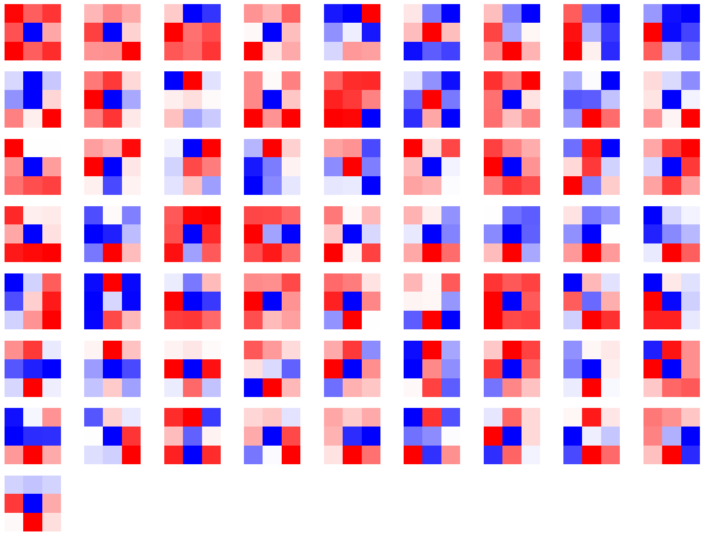

# 3.8 使用attention map进行可视化
卷积神经网络（CNN）是深度学习中非常重要的模型结构，它广泛地用于图像处理，极大地提升了模型表现，推动了计算机视觉的发展和进步。但CNN是一个“黑盒模型”，人们并不知道CNN是如何获得较好表现的，由此带来了深度学习的可解释性问题。如果能理解CNN工作的方式，人们不仅能够解释所获得的结果，提升模型的鲁棒性，而且还能有针对性地改进CNN的结构以获得进一步的效果提升。

理解CNN的重要一步是可视化，包括可视化特征是如何提取的、提取到的特征的形式以及模型在输入数据上的关注点等。本节我们就从上述三个方面出发，介绍如何在PyTorch的框架下完成CNN模型的可视化。

经过本节的学习，你将收获：

- 可视化CNN卷积核的方法
- 可视化CNN特征图的方法
- 可视化CNN显著图（class activation map）的方法


## 3.8.1 CNN卷积核可视化

卷积核在CNN中负责提取特征，可视化卷积核能够帮助人们理解CNN各个层在提取什么样的特征，进而理解模型的工作原理。例如在Zeiler和Fergus 2013年的[paper](https://arxiv.org/pdf/1311.2901.pdf)中就研究了CNN各个层的卷积核的不同，他们发现靠近输入的层提取的特征是相对简单的结构，而靠近输出的层提取的特征就和图中的实体形状相近了，如下图所示：


在PyTorch中可视化卷积核也非常方便，核心在于特定层的卷积核即特定层的模型权重，可视化卷积核就等价于可视化对应的权重矩阵。下面给出在PyTorch中可视化卷积核的实现方案，以ResNet为例。

首先加载模型，并确定模型的层信息：

```python
model = resnet18(pretrained=True)
model.conv1 = nn.Conv2d(1, 64, kernel_size=7, stride=2, padding=3, bias=False)
num_ftrs = model.fc.in_features
model.fc = nn.Linear(num_ftrs, 10)
print(dict(model.named_modules()))
```

```python
{'': ResNet(
   (conv1): Conv2d(1, 64, kernel_size=(7, 7), stride=(2, 2), padding=(3, 3), bias=False)
   (bn1): BatchNorm2d(64, eps=1e-05, momentum=0.1, affine=True, track_running_stats=True)
   (maxpool): MaxPool2d(kernel_size=3, stride=2, padding=1, dilation=1, ceil_mode=False)
   (relu): ReLU(inplace=True)
   (layer1): Sequential(
     (0): BasicBlock(
       (conv1): Conv2d(64, 64, kernel_size=(3, 3), stride=(1, 1), padding=(1, 1), bias=False)
       (bn1): BatchNorm2d(64, eps=1e-05, momentum=0.1, affine=True, track_running_stats=True)
       (conv2): Conv2d(64, 64, kernel_size=(3, 3), stride=(1, 1), padding=(1, 1), bias=False)
       (bn2): BatchNorm2d(64, eps=1e-05, momentum=0.1, affine=True, track_running_stats=True)
       (relu): ReLU(inplace=True)
     )
  ... ... ... ... ... ... ... ... ... ... ... ... ... ... ... ... ... ... ... ... ... ... .. ...
  ... ... ... ... ... ... ... ... ... ... ... ... ... ... ... ... ... ... ... ... ... ... .. ...
 'layer4.0.conv1': Conv2d(256, 512, kernel_size=(3, 3), stride=(2, 2), padding=(1, 1), bias=False),
 'layer4.0.bn1': BatchNorm2d(512, eps=1e-05, momentum=0.1, affine=True, track_running_stats=True),
 'layer4.0.conv2': Conv2d(512, 512, kernel_size=(3, 3), stride=(1, 1), padding=(1, 1), bias=False),
 'layer4.0.bn2': BatchNorm2d(512, eps=1e-05, momentum=0.1, affine=True, track_running_stats=True),
 'layer4.0.relu': ReLU(inplace=True),
 'layer4.0.downsample': Sequential(
   (0): Conv2d(256, 512, kernel_size=(1, 1), stride=(2, 2), bias=False)
   (1): BatchNorm2d(512, eps=1e-05, momentum=0.1, affine=True, track_running_stats=True)
 ),
 'layer4.0.downsample.0': Conv2d(256, 512, kernel_size=(1, 1), stride=(2, 2), bias=False),
 'layer4.0.downsample.1': BatchNorm2d(512, eps=1e-05, momentum=0.1, affine=True, track_running_stats=True),
 'layer4.1': BasicBlock(
   (conv1): Conv2d(512, 512, kernel_size=(3, 3), stride=(1, 1), padding=(1, 1), bias=False)
   (bn1): BatchNorm2d(512, eps=1e-05, momentum=0.1, affine=True, track_running_stats=True)
   (conv2): Conv2d(512, 512, kernel_size=(3, 3), stride=(1, 1), padding=(1, 1), bias=False)
   (bn2): BatchNorm2d(512, eps=1e-05, momentum=0.1, affine=True, track_running_stats=True)
   (relu): ReLU(inplace=True)
 ),
 'layer4.1.conv1': Conv2d(512, 512, kernel_size=(3, 3), stride=(1, 1), padding=(1, 1), bias=False),
 'layer4.1.bn1': BatchNorm2d(512, eps=1e-05, momentum=0.1, affine=True, track_running_stats=True),
 'layer4.1.conv2': Conv2d(512, 512, kernel_size=(3, 3), stride=(1, 1), padding=(1, 1), bias=False),
 'layer4.1.bn2': BatchNorm2d(512, eps=1e-05, momentum=0.1, affine=True, track_running_stats=True),
 'layer4.1.relu': ReLU(inplace=True),
 'avgpool': AdaptiveAvgPool2d(output_size=(1, 1)),
 'fc': Linear(in_features=512, out_features=10, bias=True)}
```

卷积核对应的应为卷积层（Conv2d），这里以`layer1.0.conv1`为例，可视化对应的参数：

```python
conv1 = dict(model.named_modules())['layer1.0.conv1']
kernel_set = conv1.weight.detach()
num = len(conv1.weight.detach())
print(kernel_set.shape)
for i in range(0,num):
    i_kernel = kernel_set[i]
    plt.figure(figsize=(20, 17))
    if (len(i_kernel)) > 1:
        for idx, filer in enumerate(i_kernel):
            plt.subplot(9, 9, idx+1) 
            plt.axis('off')
            plt.imshow(filer[ :, :].cpu().detach(),cmap='bwr')
```

```
torch.Size([64, 64, 3, 3])
```

其中部分卷积核可视化效果如下图所示：



## 3.8.2 特征图可视化方法

与卷积核相对应，输入的原始图像经过每次卷积层得到的数据称为特征图，可视化卷积核是为了看模型提取哪些特征，可视化特征图则是为了看模型提取到的特征是什么样子的。

获取特征图的方法有很多种，可以从输入开始，逐层做前向传播，直到想要的特征图处将其返回。尽管这种方法可行，但是有些麻烦了。在PyTorch中，提供了一个专用的接口使得网络在前向传播过程中能够获取到特征图，这个接口的名称非常形象，叫做hook。可以想象这样的场景，数据通过网络向前传播，网络某一层我们预先设置了一个钩子，数据传播过后钩子上会留下数据在这一层的样子，读取钩子的信息就是这一层的特征图。具体实现如下：

```python
class Hook(object):
    def __init__(self):
        self.module_name = []
        self.features_in_hook = []
        self.features_out_hook = []

    def __call__(self,module, fea_in, fea_out):
        print("hooker working", self)
        self.module_name.append(module.__class__)
        self.features_in_hook.append(fea_in)
        self.features_out_hook.append(fea_out)
        return None
    

def plot_feature(model, idx, inputs):
    hh = Hook()
    dict(model.named_modules())[idx].register_forward_hook(hh)
    
    model.eval()
    _ = model(inputs)
    print(hh.module_name)
    print((hh.features_in_hook[0][0].shape))
    print((hh.features_out_hook[0].shape))
    
    out1 = hh.features_out_hook[0]

    total_ft  = out1.shape[1]
    first_item = out1[0].cpu().clone()    

    plt.figure(figsize=(20, 17))
    

    for ftidx in range(total_ft):
        if ftidx > 99:
            break
        ft = first_item[ftidx]
        plt.subplot(10, 10, ftidx+1) 
        
        plt.axis('off')
        plt.imshow(ft[ :, :].detach())
```

这里我们首先实现了一个hook类，之后在plot_feature函数中，将该hook类的对象注册到要进行可视化的网络的某层中。model在进行前向传播的时候会调用hook的__call__函数，我们也就是在那里存储了当前层的输入和输出。这里的features_out_hook 是一个list，每次前向传播一次，都是调用一次，也就是features_out_hook  长度会增加1。

使用以下代码进行测试
```python
plot_feature(model,'layer4.1.conv2',torch.rand(1, 1, 224, 224).to(device))
```


## 3.8.3 CNN class activation map可视化方法

class activation map （CAM）的作用是判断哪些变量对模型来说是重要的，在CNN可视化的场景下，即判断图像中哪些像素点对预测结果是重要的。除了确定重要的像素点，人们也会对重要区域的梯度感兴趣，因此在CAM的基础上也进一步改进得到了Grad-CAM（以及诸多变种）。CAM和Grad-CAM的示例如下图所示：


相比可视化卷积核与可视化特征图，CAM系列可视化更为直观，能够一目了然地确定重要区域，进而进行可解释性分析或模型优化改进。CAM系列操作的实现可以通过开源工具包pytorch-grad-cam来实现。

- 安装

```bash
pip install grad-cam
```

- 以`3.3节`中的数据集为例

```python
images, labels = next(iter(train_loader))
plt.imshow(images[0][0].squeeze(0,1),cmap='gray')
```


```python
from pytorch_grad_cam import GradCAM,ScoreCAM,GradCAMPlusPlus,AblationCAM,XGradCAM,EigenCAM,FullGrad
from pytorch_grad_cam.utils.model_targets import ClassifierOutputTarget
from pytorch_grad_cam.utils.image import show_cam_on_image

model.eval()
rgb_img = transforms.ToPILImage()(images[0])  # 将图像转换为3通道RGB图像

transform = transforms.Compose([
    transforms.ToTensor(),
])

img_tensor = transform(rgb_img).unsqueeze(0).to(device) # 转换为tensor格式

target_layers = [model.layer2[0].conv1]  # 指定目标层
cam = GradCAM(model=model, target_layers=target_layers)

preds = model(img_tensor)
# 为GradCAM创建目标
# 用你感兴趣的类别的实际索引替换category
category = labels[0].item()  # 使用图像的标签作为类别索引
targets = [ClassifierOutputTarget(category)]
# 获取GradCAM热图
grayscale_cam = cam(input_tensor=img_tensor, targets=targets)
grayscale_cam = grayscale_cam[0, :]

plt.figure(figsize=(5, 5))
plt.imshow(np.array(rgb_img)/ 255.0, cmap='gray')  # 绘制原始图像
plt.imshow(grayscale_cam, cmap='jet', alpha=0.5)  # 在原始图像上绘制特征图，使用半透明的效果
plt.axis('off')
plt.show()
```


## 3.8.4 使用FlashTorch快速实现CNN可视化

聪明的你可能要问了，已经202x年了，难道还要我们手把手去写各种CNN可视化的代码吗？答案当然是否定的。随着PyTorch社区的努力，目前已经有不少开源工具能够帮助我们快速实现CNN可视化。这里我们介绍其中的一个——[FlashTorch](https://github.com/MisaOgura/flashtorch)。

（注：使用中发现该package对环境有要求，如果下方代码运行报错，请参考作者给出的配置或者Colab运行环境：https://github.com/MisaOgura/flashtorch/issues/39）

- 安装

```bash
pip install flashtorch
pip install 'importlib_resources<6.0'
```

- 可视化梯度

```python
import matplotlib.pyplot as plt
import torchvision.models as models
from flashtorch.utils import apply_transforms, load_image
from flashtorch.saliency import Backprop

backprop = Backprop(model)
img = images[0] / 255.0
owl = apply_transforms(img)

target_class = labels[0].item() 
backprop.visualize(owl, target_class, guided=True, use_gpu=True)
plt.show()
```
因为我们采用的是灰度图，所以需要修改部分源码：
```python
# 将\flashtorch\utils\__init__.py 中 67 68行修改为
means = [0.485]
stds = [0.229]
```
如果使用中出现以下报错
```python
RuntimeError: Output 0 of UnbindBackward0 is a view and is being modified inplace. This view is the output of a function that returns multiple views. Such functions do not allow the output views to be modified inplace. You should replace the inplace operation by an out-of-place one.
```
需要修改
```python
# flashtorch\utils\__init__.py 中 119行 将 channel.mul_(std).add_(mean) 修改为
channel = channel * std + mean
```
运行结果


- 可视化卷积核

```python
import torchvision.models as models
from flashtorch.activmax import GradientAscent
import matplotlib.pyplot as plt
g_ascent = GradientAscent(model.to('cpu'))

# 指定层和滤波器信息
layer4_2_1 = model.layer4[1].conv1
layer4_2_filters = [45, 271, 363, 489] # 显示其中四个的卷积核信息

g_ascent.visualize(layer4_2_!, layer4_2_filters, title="ResNet18: layer4_2")
plt.show()
```


## 参考资料

1. https://andrewhuman.github.io/cnn-hidden-layout_search  
2. https://cloud.tencent.com/developer/article/1747222
3. https://github.com/jacobgil/pytorch-grad-cam  
4. https://github.com/MisaOgura/flashtorch  

