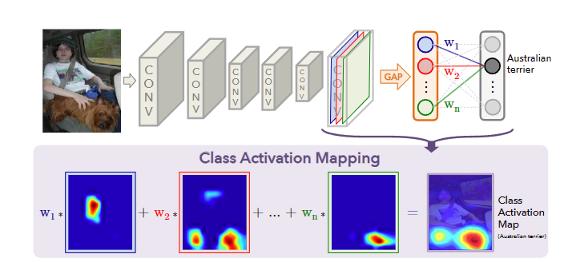
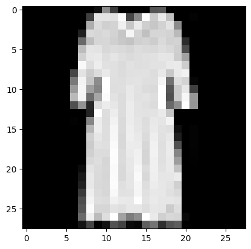
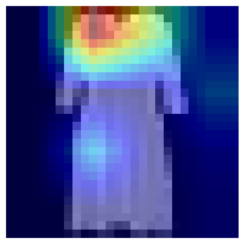
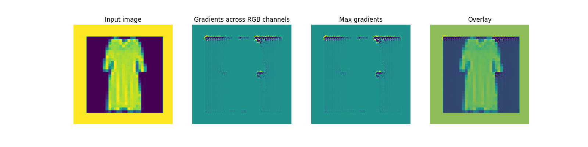
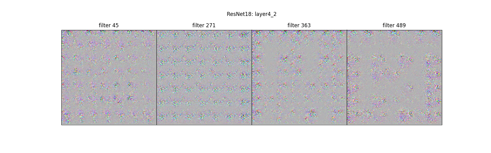

# 3.8 使用attention map进行可视化
卷积神经网络（CNN）是深度学习中非常重要的模型结构，它广泛地用于图像处理，极大地提升了模型表现，推动了计算机视觉的发展和进步。但CNN是一个“黑盒模型”，人们并不知道CNN是如何获得较好表现的，由此带来了深度学习的可解释性问题。如果能理解CNN工作的方式，人们不仅能够解释所获得的结果，提升模型的鲁棒性，而且还能有针对性地改进CNN的结构以获得进一步的效果提升。

理解CNN的重要一步是可视化，包括可视化特征是如何提取的、提取到的特征的形式以及模型在输入数据上的关注点等。本节我们就从上述三个方面出发，介绍如何在PyTorch的框架下完成CNN模型的可视化。

经过本节的学习，你将收获：

- 如何获取特征图


## 3.8.1 CNN class activation map可视化方法

class activation map （CAM）的作用是判断哪些变量对模型来说是重要的，在CNN可视化的场景下，即判断图像中哪些像素点对预测结果是重要的。除了确定重要的像素点，人们也会对重要区域的梯度感兴趣，因此在CAM的基础上也进一步改进得到了Grad-CAM（以及诸多变种）。CAM和Grad-CAM的示例如下图所示：

<div align=center></div>

相比可视化卷积核与可视化特征图，CAM系列可视化更为直观，能够一目了然地确定重要区域，进而进行可解释性分析或模型优化改进。

### 原理

CAM的核心思想是引入全局平均池化层。在最后一层卷积与线性层中间添加一层全局平均池化层GAP，以此得到每个通道的特征表达。再将GAP层与线性层相连，得到每个特征通道和不同类别间对应的权重。最后将权重与原始卷积层加权乘积并进行上采样得到与原始图像相同的大小的类别激活图。

<div align=center></div>

CAM系列操作的实现可以通过开源工具包pytorch-grad-cam来实现。

- 安装

```bash
pip install grad-cam
```

- 以`3.3节`中的数据集为例

```python
images, labels = next(iter(train_loader))
plt.imshow(images[0][0].squeeze(0,1),cmap='gray')
```

<div align=center></div>

```python
from pytorch_grad_cam import GradCAM,ScoreCAM,GradCAMPlusPlus,AblationCAM,XGradCAM,EigenCAM,FullGrad
from pytorch_grad_cam.utils.model_targets import ClassifierOutputTarget
from pytorch_grad_cam.utils.image import show_cam_on_image

model.eval()
rgb_img = transforms.ToPILImage()(images[0])  # 将图像转换为3通道RGB图像

transform = transforms.Compose([
    transforms.ToTensor(),
])

img_tensor = transform(rgb_img).unsqueeze(0).to(device) # 转换为tensor格式

target_layers = [model.layer2[0].conv1]  # 指定目标层
cam = GradCAM(model=model, target_layers=target_layers)

preds = model(img_tensor)
# 为GradCAM创建目标
# 用你感兴趣的类别的实际索引替换category
category = labels[0].item()  # 使用图像的标签作为类别索引
targets = [ClassifierOutputTarget(category)]
# 获取GradCAM热图
grayscale_cam = cam(input_tensor=img_tensor, targets=targets)
grayscale_cam = grayscale_cam[0, :]

plt.figure(figsize=(5, 5))
plt.imshow(np.array(rgb_img)/ 255.0, cmap='gray')  # 绘制原始图像
plt.imshow(grayscale_cam, cmap='jet', alpha=0.5)  # 在原始图像上绘制特征图，使用半透明的效果
plt.axis('off')
plt.show()
```

<div align=center></div>

## 3.8.2 使用FlashTorch快速实现CNN可视化

聪明的你可能要问了，已经202x年了，难道还要我们手把手去写各种CNN可视化的代码吗？答案当然是否定的。随着PyTorch社区的努力，目前已经有不少开源工具能够帮助我们快速实现CNN可视化。这里我们介绍其中的一个——[FlashTorch](https://github.com/MisaOgura/flashtorch)。

（注：使用中发现该package对环境有要求，如果下方代码运行报错，请参考作者给出的配置或者Colab运行环境：https://github.com/MisaOgura/flashtorch/issues/39）

- 安装

```bash
pip install flashtorch
pip install 'importlib_resources<6.0'
```

- 可视化梯度

```python
import matplotlib.pyplot as plt
import torchvision.models as models
from flashtorch.utils import apply_transforms, load_image
from flashtorch.saliency import Backprop

backprop = Backprop(model)
img = images[0] / 255.0
owl = apply_transforms(img)

target_class = labels[0].item() 
backprop.visualize(owl, target_class, guided=True, use_gpu=True)
plt.show()
```
因为我们采用的是灰度图，所以需要修改部分源码：
```python
# 将\flashtorch\utils\__init__.py 中 67 68行修改为
means = [0.485]
stds = [0.229]
```
如果使用中出现以下报错
```python
RuntimeError: Output 0 of UnbindBackward0 is a view and is being modified inplace. This view is the output of a function that returns multiple views. Such functions do not allow the output views to be modified inplace. You should replace the inplace operation by an out-of-place one.
```
需要修改
```python
# flashtorch\utils\__init__.py 中 119行 将 channel.mul_(std).add_(mean) 修改为
channel = channel * std + mean
```
运行结果



- 可视化卷积核

```python
import torchvision.models as models
from flashtorch.activmax import GradientAscent
import matplotlib.pyplot as plt
g_ascent = GradientAscent(model.to('cpu'))

# 指定层和滤波器信息
layer4_2_1 = model.layer4[1].conv1
layer4_2_filters = [45, 271, 363, 489] # 显示其中四个的卷积核信息

g_ascent.visualize(layer4_2_!, layer4_2_filters, title="ResNet18: layer4_2")
plt.show()
```




## 参考资料

1. [cnn可视化与理解](https://andrewhuman.github.io/cnn-hidden-layout_search)  
2. [基于pytorch可视化alexnet卷积核和特征图](https://cloud.tencent.com/developer/article/1747222)
3. [pytorch-grad-cam](https://github.com/jacobgil/pytorch-grad-cam)  
4. [flashtorch](https://github.com/MisaOgura/flashtorch)  

