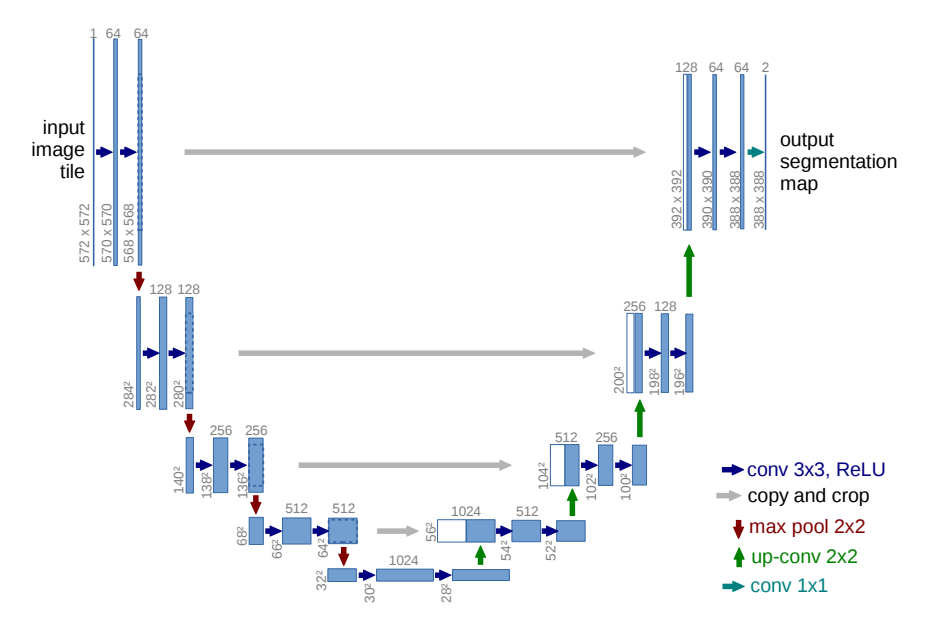

# 3.9 U-Net简介
在前面的章节中，我们学习了ResNet，一个解决深度神经网络中梯度消失和梯度爆炸问题的经典模型。在本章中，我们将介绍另一个重要的神经网络架构，U-Net。U-Net主要用于语义分割任务，如医学图像分割、图像分割等领域，其独特的结构使其在这些任务中表现出色。

通过本文你将学习到：

- U-Net的基本结构
- U-Net的应用领域
- U-Net的实现细节
  
## 3.2.1 U-Net的基本结构
U-Net是一种编码-解码结构的神经网络，其主要特点是将输入图像通过编码器进行多层次的特征提取，然后通过解码器进行逐层上采样和特征融合，最终生成与输入图像相同分辨率的分割结果。

U-Net的核心结构包含两个部分：

- 编码器（Encoder）： 编码器由一系列卷积层和池化层组成，用于逐渐减小输入图像的分辨率并提取高层次的语义信息。

- 解码器（Decoder）： 解码器由一系列上采样层和跳跃连接（skip connections）组成，用于逐渐恢复特征图的分辨率，并结合来自编码器不同层级的特征信息。

跳跃连接（Skip Connections）是指将编码器的某一层的特征图直接连接到解码器对应层的特征图上。这种连接方式有助于保留细节信息，减轻了信息传递过程中的信息损失。

如上图，U-Net网络结构是对称的，形似英文字母 U 所以被称为U-Net。其中蓝色箭头表示 3x3 卷积，用于特征提取；灰色箭头表示 skip-connection，用于特征融合；红色箭头表示池化 pooling，用于降低维度；绿色箭头表示上采样 upsample，用于恢复维度；青色箭头表示 1x1 卷积，用于输出结果。其中灰色箭头copy and crop中的copy就是concatenate而crop是为了让两者的长宽一致。U-Net的这种结构使得网络在学习分割任务时能够更好地保留图像的细节信息，同时具有较强的推理能力。

## 3.2.2 编码器（Encoder）

编码器负责将输入数据转换为潜在表示或特征向量。它通过一系列的卷积层和池化层逐渐减小输入数据的空间维度，并提取高层次的抽象特征。其目标是将输入数据映射到一个潜在空间，包含输入数据的重要信息。

在U-Net中，编码器由卷积操作和下采样操作组成，也就是上图中的左半部分。其中的卷积结构统一为 3x3 的卷积核、0 填充以及步长为1。因为没有设置填充，所以每经过一次卷积运算，特征图的尺寸会减少。

## 3.2.3 解码器（Decoder）

解码器负责将编码器生成的潜在表示还原为原始输入数据或任务特定的输出。解码器通过一系列的上采样层和反卷积层逐渐恢复潜在表示的空间维度，并结合来自编码器的不同层级的特征信息。

在U-Net中，解码器的作用是将经过编码得到的特征图逐步恢复到原始尺寸，该过程中关键的步骤为上采样（upsampling） 与 跳跃连接（skip connections）。

- 上采样用于将编码阶段压缩的特征图逐步恢复到原始分辨率。常见的上采样操作包括反卷积（transpose convolution）和插值等。这一步的目标是恢复图像的空间维度，使得网络能够更准确地还原原始输入的细节和结构

- 跳跃连接通过直接将编码阶段的某一层的特征图与解码阶段相对应层的特征图相连接。这样的连接方式允许信息在编码和解码之间直接传递，有助于保留更多的细节和语境信息。

上采样阶段通常使用反卷积操作，而不是直接的双线性插值。尽管反卷积操作可能增加一些计算负担，但相较于简单的插值，它更能有效地恢复特征图的细节。当模型处于过拟合的状态时，反卷积的应用可能产生相反的效果。因此，在实际应用中，需根据具体情况综合考虑选择适当的上采样方式。

跳跃连接的操作在 U-Net 中发挥着至关重要的作用，巧妙地解决了由下采样操作引起的细节丢失问题。跳跃连接通过其独特的设计，有效帮助网络更好地完成对目标的精确定位。

相较于简单的加法操作，跳跃连接采用了拼接（concatenate）操作。虽然这会带来一些额外的计算负担，但它能够保留更多的空间信息。通过这种方式，网络可以充分利用卷积层提取特征的能力，以学习和融合不同层级的特征，从而更有效地捕捉目标的细节和结构。

## 总结
U-Net以编码-解码结构和跳跃连接的设计在语义分割任务中取得了显著的成功。在U-Net的整体架构中，编码器负责特征提取和降维，而解码器则负责逐步还原特征图的分辨率。跳跃连接通过直接连接编码器和解码器的相应层级，有力地解决了由下采样操作引起的细节丢失问题。这种结构使得U-Net在医学图像分割、图像分割等领域取得了卓越的性能。
## 参考资料
[U-Net: Convolutional Networks for Biomedical Image Segmentation](https://arxiv.org/abs/1505.04597)

