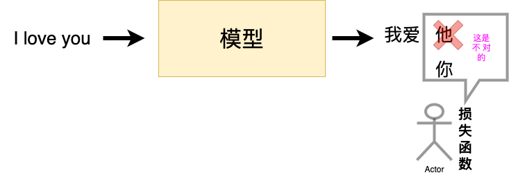
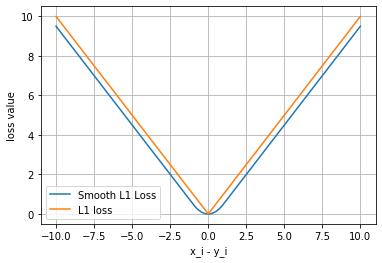

# 3.6 损失函数

在深度学习广为使用的今天，我们可以在脑海里清晰的知道，一个模型想要达到很好的效果需要**学习**，也就是我们常说的训练。一个好的训练离不开优质的负反馈，这里的损失函数就是模型的负反馈。



所以在PyTorch中，损失函数是必不可少的。它是数据输入到模型当中，产生的结果与真实标签的评价指标，我们的模型可以按照损失函数的目标来做出改进。

下面我们将开始探索PyTorch的所拥有的损失函数。这里将列出PyTorch中常用的损失函数（一般通过torch.nn调用），并详细介绍每个损失函数的功能介绍、数学公式和调用代码。当然，PyTorch的损失函数还远不止这些，在解决实际问题的过程中需要进一步探索、借鉴现有工作，或者设计自己的损失函数。

经过本节的学习，你将收获：

- 在深度学习中常见的损失函数及其定义方式
- PyTorch中损失函数的调用


## 3.5.1 二分类交叉熵损失函数

```python
torch.nn.BCELoss(weight=None, size_average=None, reduce=None, reduction='mean')
```

**功能**：计算二分类任务时的交叉熵（Cross Entropy）函数。在二分类中，label是{0,1}。对于进入交叉熵函数的input为概率分布的形式。一般来说，input为sigmoid激活层的输出，或者softmax的输出。

**主要参数**：

`weight`:每个类别的loss设置权值

`size_average`:数据为bool，为True时，返回的loss为平均值；为False时，返回的各样本的loss之和。

`reduce`:数据类型为bool，为True时，loss的返回是标量。

计算公式如下：
$
\ell(x, y)=\left\{\begin{array}{ll}
\operatorname{mean}(L), & \text { if reduction }=\text { 'mean' } \\
\operatorname{sum}(L), & \text { if reduction }=\text { 'sum' }
\end{array}\right.
$


```python
m = nn.Sigmoid()
loss = nn.BCELoss()
input = torch.randn(3, requires_grad=True)
target = torch.empty(3).random_(2)
output = loss(m(input), target)
output.backward()
```


```python
print('BCELoss损失函数的计算结果为',output)
```

    BCELoss损失函数的计算结果为 tensor(0.5732, grad_fn=<BinaryCrossEntropyBackward>)


## 3.5.2 交叉熵损失函数

```python
torch.nn.CrossEntropyLoss(weight=None, size_average=None, ignore_index=-100, reduce=None, reduction='mean')
```

**功能**：计算交叉熵函数

**主要参数**：  

`weight`:每个类别的loss设置权值。

`size_average`:数据为bool，为True时，返回的loss为平均值；为False时，返回的各样本的loss之和。

`ignore_index`:忽略某个类的损失函数。

`reduce`:数据类型为bool，为True时，loss的返回是标量。

计算公式如下：
$
\operatorname{loss}(x, \text { class })=-\log \left(\frac{\exp (x[\text { class }])}{\sum_{j} \exp (x[j])}\right)=-x[\text { class }]+\log \left(\sum_{j} \exp (x[j])\right)
$


```python
loss = nn.CrossEntropyLoss()
input = torch.randn(3, 5, requires_grad=True)
target = torch.empty(3, dtype=torch.long).random_(5)
output = loss(input, target)
output.backward()
```


```python
print(output)
```

    tensor(2.0115, grad_fn=<NllLossBackward>)

## 3.5.3 L1损失函数

```python
torch.nn.L1Loss(size_average=None, reduce=None, reduction='mean')
```

**功能：** 计算输出`y`和真实标签`target`之间的差值的绝对值。

我们需要知道的是，`reduction`参数决定了计算模式。有三种计算模式可选：none：逐个元素计算。
sum：所有元素求和，返回标量。
mean：加权平均，返回标量。 
如果选择`none`，那么返回的结果是和输入元素相同尺寸的。默认计算方式是求平均。

**计算公式如下：**
$
L_{n} = |x_{n}-y_{n}|
$


```python
loss = nn.L1Loss()
input = torch.randn(3, 5, requires_grad=True)
target = torch.randn(3, 5)
output = loss(input, target)
output.backward()
```


```python
print('L1损失函数的计算结果为',output)
```

    L1损失函数的计算结果为 tensor(1.5729, grad_fn=<L1LossBackward>)


## 3.5.4 MSE损失函数
```python
torch.nn.MSELoss(size_average=None, reduce=None, reduction='mean')
```
**功能：** 计算输出`y`和真实标签`target`之差的平方。

和`L1Loss`一样，`MSELoss`损失函数中，`reduction`参数决定了计算模式。有三种计算模式可选：none：逐个元素计算。
sum：所有元素求和，返回标量。默认计算方式是求平均。

**计算公式如下：**

$
l_{n}=\left(x_{n}-y_{n}\right)^{2}
$

```python
loss = nn.MSELoss()
input = torch.randn(3, 5, requires_grad=True)
target = torch.randn(3, 5)
output = loss(input, target)
output.backward()
```


```python
print('MSE损失函数的计算结果为',output)
```

    MSE损失函数的计算结果为 tensor(1.6968, grad_fn=<MseLossBackward>)


## 3.5.5 平滑L1 (Smooth L1)损失函数
```python
torch.nn.SmoothL1Loss(size_average=None, reduce=None, reduction='mean', beta=1.0)
```
**功能：** L1的平滑输出，其功能是减轻离群点带来的影响

`reduction`参数决定了计算模式。有三种计算模式可选：none：逐个元素计算。
sum：所有元素求和，返回标量。默认计算方式是求平均。

**提醒：** 之后的损失函数中，关于`reduction` 这个参数依旧会存在。所以，之后就不再单独说明。

**计算公式如下：**
$
\operatorname{loss}(x, y)=\frac{1}{n} \sum_{i=1}^{n} z_{i}
$
其中，
$
z_{i}=\left\{\begin{array}{ll}
0.5\left(x_{i}-y_{i}\right)^{2}, & \text { if }\left|x_{i}-y_{i}\right|<1 \\
\left|x_{i}-y_{i}\right|-0.5, & \text { otherwise }
\end{array}\right.
$

```python
loss = nn.SmoothL1Loss()
input = torch.randn(3, 5, requires_grad=True)
target = torch.randn(3, 5)
output = loss(input, target)
output.backward()
```


```python
print('SmoothL1Loss损失函数的计算结果为',output)
```

    SmoothL1Loss损失函数的计算结果为 tensor(0.7808, grad_fn=<SmoothL1LossBackward>)

**平滑L1与L1的对比**

这里我们通过可视化两种损失函数曲线来对比平滑L1和L1两种损失函数的区别。


```python
inputs = torch.linspace(-10, 10, steps=5000)
target = torch.zeros_like(inputs)

loss_f_smooth = nn.SmoothL1Loss(reduction='none')
loss_smooth = loss_f_smooth(inputs, target)
loss_f_l1 = nn.L1Loss(reduction='none')
loss_l1 = loss_f_l1(inputs,target)

plt.plot(inputs.numpy(), loss_smooth.numpy(), label='Smooth L1 Loss')
plt.plot(inputs.numpy(), loss_l1, label='L1 loss')
plt.xlabel('x_i - y_i')
plt.ylabel('loss value')
plt.legend()
plt.grid()
plt.show()
```





可以看出，对于`smoothL1`来说，在 0 这个尖端处，过渡更为平滑。

## 3.5.6 目标泊松分布的负对数似然损失
```python
torch.nn.PoissonNLLLoss(log_input=True, full=False, size_average=None, eps=1e-08, reduce=None, reduction='mean')
```
**功能：** 泊松分布的负对数似然损失函数

**主要参数：**

`log_input`：输入是否为对数形式，决定计算公式。

`full`：计算所有 loss，默认为 False。

`eps`：修正项，避免 input 为 0 时，log(input) 为 nan 的情况。

**数学公式：**

- 当参数`log_input=True`：
$
\operatorname{loss}\left(x_{n}, y_{n}\right)=e^{x_{n}}-x_{n} \cdot y_{n}
$


- 当参数`log_input=False`：

    $
    \operatorname{loss}\left(x_{n}, y_{n}\right)=x_{n}-y_{n} \cdot \log \left(x_{n}+\text { eps }\right)
    $
    


```python
loss = nn.PoissonNLLLoss()
log_input = torch.randn(5, 2, requires_grad=True)
target = torch.randn(5, 2)
output = loss(log_input, target)
output.backward()
```

```python
print('PoissonNLLLoss损失函数的计算结果为',output)
```

```
PoissonNLLLoss损失函数的计算结果为 tensor(0.7358, grad_fn=<MeanBackward0>)
```

## 3.5.7 KL散度
```python
torch.nn.KLDivLoss(size_average=None, reduce=None, reduction='mean', log_target=False)
```
**功能：** 计算KL散度，也就是计算相对熵。用于连续分布的距离度量，并且对离散采用的连续输出空间分布进行回归通常很有用。

**主要参数:** 

`reduction`：计算模式，可为 `none`/`sum`/`mean`/`batchmean`。

    none：逐个元素计算。
    
    sum：所有元素求和，返回标量。
    
    mean：加权平均，返回标量。
    
    batchmean：batchsize 维度求平均值。

**计算公式：**

$
\begin{aligned}
D_{\mathrm{KL}}(P, Q)=\mathrm{E}_{X \sim P}\left[\log \frac{P(X)}{Q(X)}\right] &=\mathrm{E}_{X \sim P}[\log P(X)-\log Q(X)] \\
&=\sum_{i=1}^{n} P\left(x_{i}\right)\left(\log P\left(x_{i}\right)-\log Q\left(x_{i}\right)\right)
\end{aligned}
$


```python
inputs = torch.tensor([[0.5, 0.3, 0.2], [0.2, 0.3, 0.5]])
target = torch.tensor([[0.9, 0.05, 0.05], [0.1, 0.7, 0.2]], dtype=torch.float)
loss = nn.KLDivLoss()
output = loss(inputs,target)

print('KLDivLoss损失函数的计算结果为',output)
```

    KLDivLoss损失函数的计算结果为 tensor(-0.3335)


## 3.5.8 MarginRankingLoss
```python
torch.nn.MarginRankingLoss(margin=0.0, size_average=None, reduce=None, reduction='mean')
```
**功能：** 计算两个向量之间的相似度，用于排序任务。该方法用于计算两组数据之间的差异。

**主要参数:** 

`margin`：边界值，$x_{1}$ 与$x_{2}$ 之间的差异值。

`reduction`：计算模式，可为 none/sum/mean。

**计算公式：**

$
\operatorname{loss}(x 1, x 2, y)=\max (0,-y *(x 1-x 2)+\operatorname{margin})
$


```python
loss = nn.MarginRankingLoss()
input1 = torch.randn(3, requires_grad=True)
input2 = torch.randn(3, requires_grad=True)
target = torch.randn(3).sign()
output = loss(input1, input2, target)
output.backward()

print('MarginRankingLoss损失函数的计算结果为',output)
```

    MarginRankingLoss损失函数的计算结果为 tensor(0.7740, grad_fn=<MeanBackward0>)


## 3.5.9 多标签边界损失函数
```python
torch.nn.MultiLabelMarginLoss(size_average=None, reduce=None, reduction='mean')
```

**功能：** 对于多标签分类问题计算损失函数。

**主要参数:** 


`reduction`：计算模式，可为 none/sum/mean。

**计算公式：**
$
\operatorname{loss}(x, y)=\sum_{i j} \frac{\max (0,1-x[y[j]]-x[i])}{x \cdot \operatorname{size}(0)}
$

$
\begin{array}{l}
\text { 其中, } i=0, \ldots, x \cdot \operatorname{size}(0), j=0, \ldots, y \cdot \operatorname{size}(0), \text { 对于所有的 } i \text { 和 } j \text {, 都有 } y[j] \geq 0 \text { 并且 }\\
i \neq y[j]
\end{array}
$


```python
loss = nn.MultiLabelMarginLoss()
x = torch.FloatTensor([[0.9, 0.2, 0.4, 0.8]])
# for target y, only consider labels 3 and 0, not after label -1
y = torch.LongTensor([[3, 0, -1, 1]])# 真实的分类是，第3类和第0类
output = loss(x, y)

print('MultiLabelMarginLoss损失函数的计算结果为',output)
```

    MultiLabelMarginLoss损失函数的计算结果为 tensor(0.4500)


## 3.5.10 二分类损失函数
```python
torch.nn.SoftMarginLoss(size_average=None, reduce=None, reduction='mean')torch.nn.(size_average=None, reduce=None, reduction='mean')
```
**功能：** 计算二分类的 logistic 损失。

**主要参数:** 


`reduction`：计算模式，可为 none/sum/mean。

**计算公式：**

$
\operatorname{loss}(x, y)=\sum_{i} \frac{\log (1+\exp (-y[i] \cdot x[i]))}{x \cdot \operatorname{nelement}()}
$

$
\
\text { 其中, } x . \text { nelement() 为输入 } x \text { 中的样本个数。注意这里 } y \text { 也有 } 1 \text { 和 }-1 \text { 两种模式。 }
\
$


```python
inputs = torch.tensor([[0.3, 0.7], [0.5, 0.5]])  # 两个样本，两个神经元
target = torch.tensor([[-1, 1], [1, -1]], dtype=torch.float)  # 该 loss 为逐个神经元计算，需要为每个神经元单独设置标签

loss_f = nn.SoftMarginLoss()
output = loss_f(inputs, target)

print('SoftMarginLoss损失函数的计算结果为',output)
```

    SoftMarginLoss损失函数的计算结果为 tensor(0.6764)


## 3.5.11 多分类的折页损失
```python
torch.nn.MultiMarginLoss(p=1, margin=1.0, weight=None, size_average=None, reduce=None, reduction='mean')
```
**功能：** 计算多分类的折页损失

**主要参数:** 


`reduction`：计算模式，可为 none/sum/mean。

`p：`可选 1 或 2。

`weight`：各类别的 loss 设置权值。

`margin`：边界值


**计算公式：**

$
\operatorname{loss}(x, y)=\frac{\sum_{i} \max (0, \operatorname{margin}-x[y]+x[i])^{p}}{x \cdot \operatorname{size}(0)}
$

$
\begin{array}{l}
\text { 其中, } x \in\{0, \ldots, x \cdot \operatorname{size}(0)-1\}, y \in\{0, \ldots, y \cdot \operatorname{size}(0)-1\} \text {, 并且对于所有的 } i \text { 和 } j \text {, }\\
\text { 都有 } 0 \leq y[j] \leq x \cdot \operatorname{size}(0)-1, \text { 以及 } i \neq y[j] \text { 。 }
\end{array}
$


```python
inputs = torch.tensor([[0.3, 0.7], [0.5, 0.5]]) 
target = torch.tensor([0, 1], dtype=torch.long) 

loss_f = nn.MultiMarginLoss()
output = loss_f(inputs, target)

print('MultiMarginLoss损失函数的计算结果为',output)
```

    MultiMarginLoss损失函数的计算结果为 tensor(0.6000)


## 3.5.12 三元组损失

```python
torch.nn.TripletMarginLoss(margin=1.0, p=2.0, eps=1e-06, swap=False, size_average=None, reduce=None, reduction='mean')
```
**功能：** 计算三元组损失。

**三元组:** 这是一种数据的存储或者使用格式。<实体1，关系，实体2>。在项目中，也可以表示为< `anchor`, `positive examples` , `negative examples`>

在这个损失函数中，我们希望去`anchor`的距离更接近`positive examples`，而远离`negative examples `

**主要参数:** 


`reduction`：计算模式，可为 none/sum/mean。

`p：`可选 1 或 2。


`margin`：边界值


**计算公式：**

$
L(a, p, n)=\max \left\{d\left(a_{i}, p_{i}\right)-d\left(a_{i}, n_{i}\right)+\operatorname{margin}, 0\right\}
$

$
\text { 其中, } d\left(x_{i}, y_{i}\right)=\left\|\mathbf{x}_{i}-\mathbf{y}_{i}\right\|_{\text {・ }}
$

```python
triplet_loss = nn.TripletMarginLoss(margin=1.0, p=2)
anchor = torch.randn(100, 128, requires_grad=True)
positive = torch.randn(100, 128, requires_grad=True)
negative = torch.randn(100, 128, requires_grad=True)
output = triplet_loss(anchor, positive, negative)
output.backward()
print('TripletMarginLoss损失函数的计算结果为',output)
```

    TripletMarginLoss损失函数的计算结果为 tensor(1.1667, grad_fn=<MeanBackward0>)


## 3.5.13 HingEmbeddingLoss
```python
torch.nn.HingeEmbeddingLoss(margin=1.0, size_average=None, reduce=None, reduction='mean')
```
**功能：** 对输出的embedding结果做Hing损失计算

**主要参数:** 


`reduction`：计算模式，可为 none/sum/mean。


`margin`：边界值


**计算公式：**

$
l_{n}=\left\{\begin{array}{ll}
x_{n}, & \text { if } y_{n}=1 \\
\max \left\{0, \Delta-x_{n}\right\}, & \text { if } y_{n}=-1
\end{array}\right.
$
**注意事项：** 输入x应为两个输入之差的绝对值。

可以这样理解，让个输出的是正例yn=1,那么loss就是x，如果输出的是负例y=-1，那么输出的loss就是要做一个比较。


```python
loss_f = nn.HingeEmbeddingLoss()
inputs = torch.tensor([[1., 0.8, 0.5]])
target = torch.tensor([[1, 1, -1]])
output = loss_f(inputs,target)

print('HingEmbeddingLoss损失函数的计算结果为',output)
```

    HingEmbeddingLoss损失函数的计算结果为 tensor(0.7667)


## 3.5.14 余弦相似度
```python
torch.nn.CosineEmbeddingLoss(margin=0.0, size_average=None, reduce=None, reduction='mean')
```
**功能：** 对两个向量做余弦相似度

**主要参数:** 


`reduction`：计算模式，可为 none/sum/mean。


`margin`：可取值[-1,1] ，推荐为[0,0.5] 。


**计算公式：**

$
\operatorname{loss}(x, y)=\left\{\begin{array}{ll}
1-\cos \left(x_{1}, x_{2}\right), & \text { if } y=1 \\
\max \left\{0, \cos \left(x_{1}, x_{2}\right)-\text { margin }\right\}, & \text { if } y=-1
\end{array}\right.
$
其中,
$
\cos (\theta)=\frac{A \cdot B}{\|A\|\|B\|}=\frac{\sum_{i=1}^{n} A_{i} \times B_{i}}{\sqrt{\sum_{i=1}^{n}\left(A_{i}\right)^{2}} \times \sqrt{\sum_{i=1}^{n}\left(B_{i}\right)^{2}}}
$


这个损失函数应该是最广为人知的。对于两个向量，做余弦相似度。将余弦相似度作为一个距离的计算方式，如果两个向量的距离近，则损失函数值小，反之亦然。


```python
loss_f = nn.CosineEmbeddingLoss()
inputs_1 = torch.tensor([[0.3, 0.5, 0.7], [0.3, 0.5, 0.7]])
inputs_2 = torch.tensor([[0.1, 0.3, 0.5], [0.1, 0.3, 0.5]])
target = torch.tensor([1, -1], dtype=torch.float)
output = loss_f(inputs_1,inputs_2,target)

print('CosineEmbeddingLoss损失函数的计算结果为',output)
```

    CosineEmbeddingLoss损失函数的计算结果为 tensor(0.5000)


## 3.5.15 CTC损失函数
```python
torch.nn.CTCLoss(blank=0, reduction='mean', zero_infinity=False)
```
**功能：** 用于解决时序类数据的分类

计算连续时间序列和目标序列之间的损失。CTCLoss对输入和目标的可能排列的概率进行求和，产生一个损失值，这个损失值对每个输入节点来说是可分的。输入与目标的对齐方式被假定为 "多对一"，这就限制了目标序列的长度，使其必须是≤输入长度。

**主要参数:** 


`reduction`：计算模式，可为 none/sum/mean。


`blank`：blank label。


`zero_infinity`：无穷大的值或梯度值为 


```python
# Target are to be padded
T = 50      # Input sequence length
C = 20      # Number of classes (including blank)
N = 16      # Batch size
S = 30      # Target sequence length of longest target in batch (padding length)
S_min = 10  # Minimum target length, for demonstration purposes

# Initialize random batch of input vectors, for *size = (T,N,C)
input = torch.randn(T, N, C).log_softmax(2).detach().requires_grad_()

# Initialize random batch of targets (0 = blank, 1:C = classes)
target = torch.randint(low=1, high=C, size=(N, S), dtype=torch.long)

input_lengths = torch.full(size=(N,), fill_value=T, dtype=torch.long)
target_lengths = torch.randint(low=S_min, high=S, size=(N,), dtype=torch.long)
ctc_loss = nn.CTCLoss()
loss = ctc_loss(input, target, input_lengths, target_lengths)
loss.backward()


# Target are to be un-padded
T = 50      # Input sequence length
C = 20      # Number of classes (including blank)
N = 16      # Batch size

# Initialize random batch of input vectors, for *size = (T,N,C)
input = torch.randn(T, N, C).log_softmax(2).detach().requires_grad_()
input_lengths = torch.full(size=(N,), fill_value=T, dtype=torch.long)

# Initialize random batch of targets (0 = blank, 1:C = classes)
target_lengths = torch.randint(low=1, high=T, size=(N,), dtype=torch.long)
target = torch.randint(low=1, high=C, size=(sum(target_lengths),), dtype=torch.long)
ctc_loss = nn.CTCLoss()
loss = ctc_loss(input, target, input_lengths, target_lengths)
loss.backward()

print('CTCLoss损失函数的计算结果为',loss)
```

    CTCLoss损失函数的计算结果为 tensor(16.0885, grad_fn=<MeanBackward0>)

