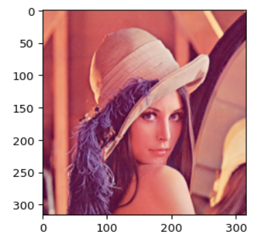
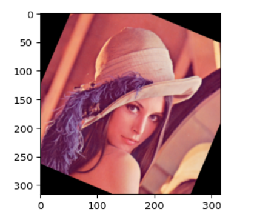
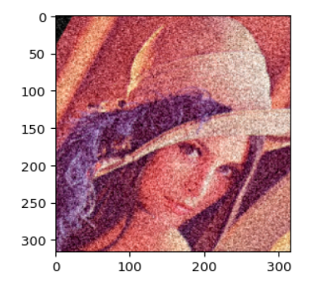
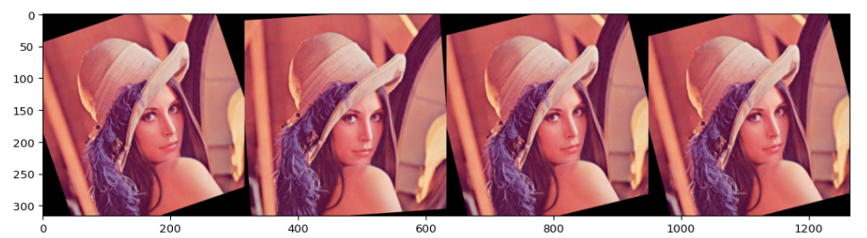
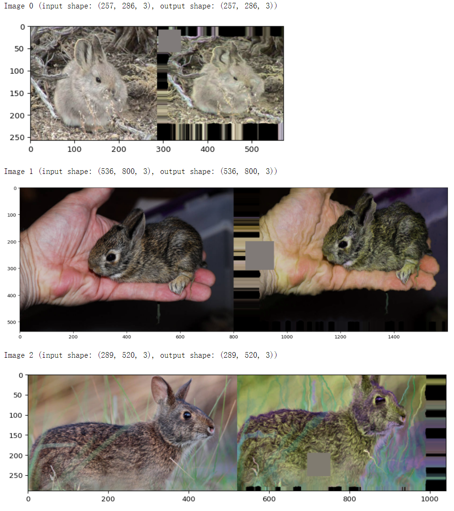

# 6.5 数据增强-imgaug
在机器学习/深度学习中，我们经常会遇到模型过拟合的问题，为了解决过拟合问题，我们可以通过加入正则项或者减少模型学习参数来解决，但是最简单的避免过拟合的方法是增加数据，但是在许多场景我们无法获得大量数据，例如医学图像分析。数据增强技术的存在是为了解决这个问题，这是针对有限数据问题的解决方案。数据增强一套技术，可提高训练数据集的大小和质量，以便我们可以使用它们来构建更好的深度学习模型。
在计算视觉领域，生成增强图像相对容易。即使引入噪声或裁剪图像的一部分，模型仍可以对图像进行分类，数据增强有一系列简单有效的方法可供选择，有一些机器学习库来进行计算视觉领域的数据增强，比如：imgaug [官网](https://github.com/aleju/imgaug)它封装了很多数据增强算法，给开发者提供了方便。通过本章内容，您将学会以下内容：
- imgaug的简介和安装
- 使用imgaug对数据进行增强

## 6.5.1 imgaug简介和安装
### 6.5.1.1 imgaug简介
`imgaug`是计算机视觉任务中常用的一个数据增强的包，相比于`torchvision.transforms`，它提供了更多的数据增强方法，因此在各种竞赛中，人们广泛使用`imgaug`来对数据进行增强操作。除此之外，imgaug官方还提供了许多例程让我们学习，本章内容仅是简介，希望起到抛砖引玉的功能。
1. Github地址：[imgaug](https://github.com/aleju/imgaug)
2. Readthedocs：[imgaug](https://imgaug.readthedocs.io/en/latest/source/examples_basics.html)
3. 官方提供notebook例程：[notebook](https://github.com/aleju/imgaug-doc/tree/master/notebooks)
### 6.5.1.2 imgaug的安装
imgaug的安装方法和其他的Python包类似，我们可以通过以下两种方式进行安装
#### conda
```shell
conda config --add channels conda-forge
conda install imgaug
```
#### pip
```shell
#  install imgaug either via pypi

pip install imgaug

#  install the latest version directly from github

pip install git+https://github.com/aleju/imgaug.git
```
## 6.5.2 imgaug的使用
imgaug仅仅提供了图像增强的一些方法，但是并未提供图像的IO操作，因此我们需要使用一些库来对图像进行导入，建议使用imageio进行读入，如果使用的是opencv进行文件读取的时候，需要进行手动改变通道，将读取的BGR图像转换为RGB图像。除此以外，当我们用PIL.Image进行读取时，因为读取的图片没有shape的属性，所以我们需要将读取到的img转换为np.array()的形式再进行处理。因此官方的例程中也是使用imageio进行图片读取。
### 单张图片处理
在该单元，我们仅以几种数据增强操作为例，主要目的是教会大家如何使用imgaug来对数据进行增强操作。
```python
import imageio
import imgaug as ia
%matplotlib inline

# 图片的读取
img = imageio.imread("./Lenna.jpg")

# 使用Image进行读取
# img = Image.open("./Lenna.jpg")
# image = np.array(img)
# ia.imshow(image)

# 可视化图片
ia.imshow(img)
```


现在我们已经得到了需要处理的图片，`imgaug`包含了许多从`Augmenter`继承的数据增强的操作。在这里我们以`Affine`为例子。
```python
from imgaug import augmenters as iaa

# 设置随机数种子
ia.seed(4)

# 实例化方法
rotate = iaa.Affine(rotate=(-4,45))
img_aug = rotate(image=img)
ia.imshow(img_aug)
```


这是对一张图片进行一种操作方式，但实际情况下，我们可能对一张图片做多种数据增强处理。这种情况下，我们就需要利用`imgaug.augmenters.Sequential()`来构造我们数据增强的pipline，该方法与`torchvison.transforms.Compose()`相类似。
```python
iaa.Sequential(children=None, # Augmenter集合
               random_order=False, # 是否对每个batch使用不同顺序的Augmenter list
               name=None,
               deterministic=False,
               random_state=None)
```

```python
# 构建处理序列
aug_seq = iaa.Sequential([
    iaa.Affine(rotate=(-25,25)),
    iaa.AdditiveGaussianNoise(scale=(10,60)),
    iaa.Crop(percent=(0,0.2))
])
# 对图片进行处理，image不可以省略，也不能写成images
image_aug = aug_seq(image=img)
ia.imshow(image_aug)
```


总的来说，对单张图片处理的方式基本相同，我们可以根据实际需求，选择合适的数据增强方法来对数据进行处理。
### 对批次图片进行处理
在实际使用中，我们通常需要处理更多份的图像数据。此时，可以将图形数据按照NHWC的形式或者由列表组成的HWC的形式对批量的图像进行处理。主要分为以下两部分，对批次的图片以同一种方式处理和对批次的图片进行分部分处理。
#### 对批次的图片以同一种方式处理
对一批次的图片进行处理时，我们只需要将待处理的图片放在一个`list`中，并将函数的image改为images即可进行数据增强操作，具体实际操作如下：
```python
images = [img,img,img,img,]
images_aug = rotate(images=images)
ia.imshow(np.hstack(images_aug))
```
我们就可以得到如下的展示效果：


在上述的例子中，我们仅仅对图片进行了仿射变换，同样的，我们也可以对批次的图片使用多种增强方法，与单张图片的方法类似，我们同样需要借助`Sequential`来构造数据增强的pipline。
```python
aug_seq = iaa.Sequential([
    iaa.Affine(rotate=(-25, 25)),
    iaa.AdditiveGaussianNoise(scale=(10, 60)),
    iaa.Crop(percent=(0, 0.2))
])

# 传入时需要指明是images参数
images_aug = aug_seq.augment_images(images = images)
#images_aug = aug_seq(images = images) 
ia.imshow(np.hstack(images_aug))
```
#### 对批次的图片分部分处理
imgaug相较于其他的数据增强的库，有一个很有意思的特性，即就是我们可以通过`imgaug.augmenters.Sometimes()`对batch中的一部分图片应用一部分Augmenters,剩下的图片应用另外的Augmenters。
```python
iaa.Sometimes(p=0.5,  # 代表划分比例
              then_list=None,  # Augmenter集合。p概率的图片进行变换的Augmenters。
              else_list=None,  #1-p概率的图片会被进行变换的Augmenters。注意变换的图片应用的Augmenter只能是then_list或者else_list中的一个。
              name=None,
              deterministic=False,
              random_state=None)
```

### 对不同大小的图片进行处理
上面提到的图片都是基于相同的图像。以下的示例具有不同图像大小的情况，我们从维基百科加载三张图片，将它们作为一个批次进行扩充，然后一张一张地显示每张图片。具体的操作跟单张的图片都是十分相似，因此不做过多赘述。
```python
# 构建pipline
seq = iaa.Sequential([
    iaa.CropAndPad(percent=(-0.2, 0.2), pad_mode="edge"),  # crop and pad images
    iaa.AddToHueAndSaturation((-60, 60)),  # change their color
    iaa.ElasticTransformation(alpha=90, sigma=9),  # water-like effect
    iaa.Cutout()  # replace one squared area within the image by a constant intensity value
], random_order=True)

# 加载不同大小的图片
images_different_sizes = [
    imageio.imread("https://upload.wikimedia.org/wikipedia/commons/e/ed/BRACHYLAGUS_IDAHOENSIS.jpg"),
    imageio.imread("https://upload.wikimedia.org/wikipedia/commons/c/c9/Southern_swamp_rabbit_baby.jpg"),
    imageio.imread("https://upload.wikimedia.org/wikipedia/commons/9/9f/Lower_Keys_marsh_rabbit.jpg")
]

# 对图片进行增强
images_aug = seq(images=images_different_sizes)

# 可视化结果
print("Image 0 (input shape: %s, output shape: %s)" % (images_different_sizes[0].shape, images_aug[0].shape))
ia.imshow(np.hstack([images_different_sizes[0], images_aug[0]]))

print("Image 1 (input shape: %s, output shape: %s)" % (images_different_sizes[1].shape, images_aug[1].shape))
ia.imshow(np.hstack([images_different_sizes[1], images_aug[1]]))

print("Image 2 (input shape: %s, output shape: %s)" % (images_different_sizes[2].shape, images_aug[2].shape))
ia.imshow(np.hstack([images_different_sizes[2], images_aug[2]]))
```

## 6.5.3 imgaug在PyTorch的应用
关于PyTorch中如何使用imgaug每一个人的模板是不一样的，我在这里也仅仅给出imgaug的issue里面提出的一种解决方案，大家可以根据自己的实际需求进行改变。
具体链接：[how to use imgaug with pytorch](https://github.com/aleju/imgaug/issues/406)
```python
import numpy as np
from imgaug import augmenters as iaa
from torch.utils.data import DataLoader, Dataset
from torchvision import transforms

# 构建pipline
tfs = transforms.Compose([
    iaa.Sequential([
        iaa.flip.Fliplr(p=0.5),
        iaa.flip.Flipud(p=0.5),
        iaa.GaussianBlur(sigma=(0.0, 0.1)),
        iaa.MultiplyBrightness(mul=(0.65, 1.35)),
    ]).augment_image,
    # 不要忘记了使用ToTensor()
    transforms.ToTensor()
])

# 自定义数据集
class CustomDataset(Dataset):
    def __init__(self, n_images, n_classes, transform=None):
		# 图片的读取，建议使用imageio
        self.images = np.random.randint(0, 255,
                                        (n_images, 224, 224, 3),
                                        dtype=np.uint8)
        self.targets = np.random.randn(n_images, n_classes)
        self.transform = transform

    def __getitem__(self, item):
        image = self.images[item]
        target = self.targets[item]

        if self.transform:
            image = self.transform(image)

        return image, target

    def __len__(self):
        return len(self.images)


def worker_init_fn(worker_id):
    imgaug.seed(np.random.get_state()[1][0] + worker_id)


custom_ds = CustomDataset(n_images=50, n_classes=10, transform=tfs)
custom_dl = DataLoader(custom_ds, batch_size=64,
                       num_workers=4, pin_memory=True, 
                       worker_init_fn=worker_init_fn)

```
关于num_workers在Windows系统上只能设置成0，但是当我们使用Linux远程服务器时，可能使用不同的num_workers的数量，这是我们就需要注意worker_init_fn()函数的作用了。它保证了我们使用的数据增强在num_workers>0时是对数据的增强是随机的。
## 6.5.4 总结
数据扩充是我们需要掌握的基本技能，除了imgaug以外，我们还可以去学习其他的数据增强库，包括但不局限于Albumentations，Augmentor。除去imgaug以外，我还强烈建议大家学下Albumentations，因为Albumentations跟imgaug都有着丰富的教程资源，大家可以有需求访问[Albumentations教程](https://albumentations.ai/docs/examples/pytorch_classification/)。

## 参考资料
1. [kaggle-data-augmentation-packages-overview](https://www.kaggle.com/code/aleksandradeis/data-augmentation-packages-overview/notebook)
2. [how to use imgaug with pytorch](https://github.com/aleju/imgaug/issues/406)
3. [Kaggle知识点：数据扩增方法](https://mp.weixin.qq.com/s/tdNlCxmz_s1Wwls2qoQXDQ)
4. [PyTorch Classification Model Based On Imgaug.](https://www.kaggle.com/code/jmcslk/pytorch-classification-model-based-on-imgaug/notebook)
5. [Tutorial Notebooks](https://github.com/aleju/imgaug-doc/tree/master/notebooks)