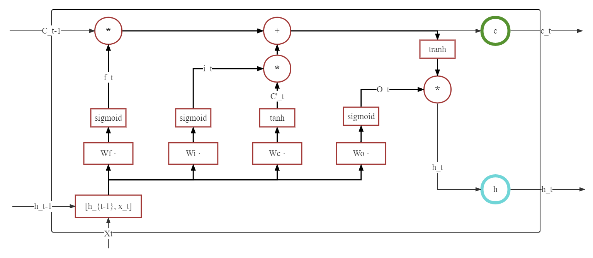
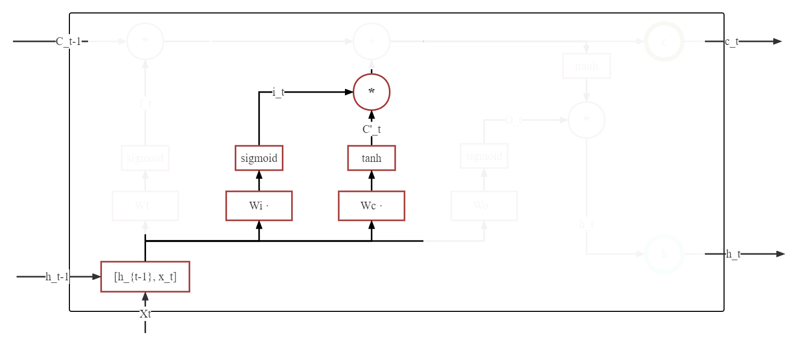
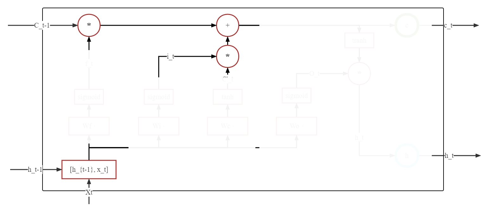
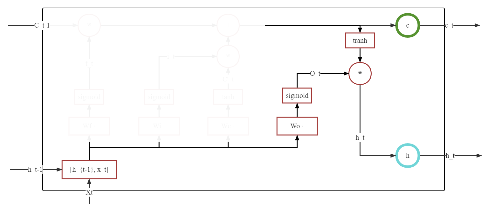

# 文章结构

在[RNN详解及其实战](./RNN%E8%AF%A6%E8%A7%A3%E5%8F%8A%E5%85%B6%E5%AE%9E%E7%8E%B0.md)中，我们简单讨论了为什么需要RNN这类模型、RNN的具体思路、RNN的简单实现等问题。同时，在文章结尾部分我们提到了RNN存在的梯度消失问题，及之后的一个解决方案：**LSTM**。因此，本篇文章主要结构如下：

1. LSTM 理解及简单实现
2. LSTM 实战
3. 经典 RNN 与 LSTM 对比
4. 关于梯度消失

# LSTM 理解

其实，我们将 LSTM 与 RNN 说成两个并不可取， LSTM 依然归属于 RNN 之下，相比于使用线性回归方式来处理序列问题， LSTM 其实是设计了一个模块来取代线性回归算法。

LSTM(Long Short-Term Memory)，翻译过来是长短期记忆法，其核心思想可以说非常的简单：既然 RNN 只能保存短期的记忆，那我增加一个长期记忆，不就可以解决这个问题了名？因此，LSTM提出了长期记忆和短期记忆，通过调整长期记忆和短期记忆之间的比例，来维持长期记忆的可靠，降低 RNN 的梯度消失问题。可以看到下方结构图中，模型输入由两个升级到三个，分别是当前节点状态 $\mathbf{X}_{t}$，长期记忆：$\mathbf{C}_{t-1}$，短期记忆 $\mathbf{H}_{t-1}$。输出状态依然是两个：节点当前状态 $\mathbf{C}_{t}$，和节点当前隐藏状态 $\mathbf{H}_{t}$。



那么问题来了， LSTM 是如何实现对长短记忆的控制呢？
这就不得不提众人所知的三个门：
 - 遗忘门：控制保留多少上一时刻的单元节点到当前节点
 - 记忆门：控制将当前时刻的多少信息记忆到节点中
 - 输出门：控制输出多少信息给当前输出


我们在分析三个门之前，我们先了解 **门** 这一概念。
## 门

从简化图中可以看到， **门**的感觉类似于电路中的一个开关，当开关按下，信息通过，而开关抬起，信息不再通过。实际也如此类似，**门**是一个全连接层，输入为一个向量，输出为一个位于 [0,1] 之间的值。
我们来设计一个非常简单的遗忘门：每次学习状态之后，都遗忘一定的已学习内容，注意，这里的遗忘门与 LSTM 的遗忘门无关，单纯理解 **门** 这一概念。

```python
# 一个线性层 用来计算遗忘多少
gate_linear = nn.Linear(hidden_size, 1)
# 一个线性层 用来学习
study_linear = nn.Linear(hidden_size, hidden_size)
# 此刻 h_t 是上一时刻状态
# 输出为 0 - 1 的值
gate = gate_linear(h_t)
# h_t 经过 study_linear 进行学习
_h_t = study_linear(h_t)
# 在输出结果之前，经过 gate 导致内容受损，遗忘了一定的学习内容
h_t = gate * （_h_t）
```
可以看到，如果 $gate$ 值为 0，则历史信息均会被遗忘，而如果值为1，则历史信息则会被完全保留，而 `gate_linear` 网络中的超参数会不断的学习，因此一个可以学习的开关门就出现了。

但是，$gate$ 作为一个浮点型的数据，对于 临时结果矩阵变量 $\_h\_t$ 而言，其遗忘控制是全局的，也就是，当 $gate$ 为 0 时， 其最终结果 $h\_t$ 为全 0 矩阵。因此我们应该注意： LSTM 中并不采用这样的大闸门，而是采用对每个变量进行分别控制的小水龙头(神经网络激活函数 `nn.Sigmode` )

而在 LSTM 中，门主要使用 $Sigmod$ 神经网络(**再次注意，并非是激活函数，而是 Sigmod 神经网络**)来完成。

下方是一个示例代码：
```python
hidden_size = 5
sigmoid = nn.Sigmoid()
# 隐藏状态 为了方便计算，假定全 1
hidden_emb = torch.ones(hidden_size, hidden_size)
# 中间某一层神经网络
model = nn.Linear(hidden_size，hidden_size)
# 获取该层输出,此时尚未被门限制
mid_out = model(hidden_emb)
# 获取一个门 -- 注意：并非一定由该变量所控制
# 比如：也可以由上一时刻的隐藏状态控制
# 代码为： gate = sigmoid(hidden_emb)
gate = sigmoid(mid_out) 
# 得到最终输出
final_out = gate * mid_out
```

在有了对门的基础知识后，接下来对遗忘门、记忆门、输出门进行分别分析。

## 遗忘门

遗忘门涉及部分如下图所示：
 

其中，下方蓝色表示三个门共用的输入部分，均为 \[$\mathbf{h}_{t-1}$,$\mathbf{X}_{t}$],需要注意，这里由于三个门之间并不共享权重参数，因此公示虽然接近，但是一共计算了三次，遗忘门被标记为 $f_t$, 列出遗忘门公式为：
$$
f_t = \sigma(\mathbf{W_f} * [\mathbf{h}_{t-1},\mathbf{X}_{t}]  + \mathbf{b_f})
$$
输出结果为取值范围为 [ 0, 1 ] 的矩阵，主要功能是控制与之相乘的矩阵的**遗忘程度**。
将 $f_t$ 与输入的上一长期状态 $C_{t-1}$ 相乘：
$$
C_t' = f_t * C_{t-1}
$$

一部分的 $C_{t-1}$ 就这样被遗忘了。

## 记忆门

记忆门涉及部分如下所示：


从图中可以看到，记忆门中相乘的两个部分均由 $\mathbf{h}_{t-1}$ 与 $\mathbf{X}_{t}$ 得到，
其中，左侧控制记忆多少的部分，与遗忘门公式基本一致：
$$
i_t = \sigma(\mathbf{W_i} * [\mathbf{h}_{t-1},\mathbf{X}_{t}]  + \mathbf{b_i})
$$
与遗忘门相通，输出结果为取值范围为 [ 0, 1 ] 的矩阵，主要功能是控制与之相乘的矩阵的**记忆程度**。
而右侧，则更换了激活函数，由 $sigmoid$ 变成了 $tanh$：
$$
\tilde{C_t} = \tanh(\mathbf{W_c} * [\mathbf{h}_{t-1},\mathbf{X}_{t}]  + \mathbf{b_c})
$$
该公式负责的部分可以看做负责**短期隐藏状态**的更新，取值范围为 [ -1, 1 ]。

最终记忆门更新公式如下:
$$
\tilde{C_t'}=  i_t * \tilde{C_t}
$$

我们可以说  $\tilde{C_t'}$ 是保留了一定内容的短期状态

## 状态更新



在通过遗忘门获取到了被遗忘一定内容的长期状态 $C_t'$ 和 保留了一定内容的短期状态 $\tilde{C_t'}$ 之后，可以通过加法直接结合

$$
C_t =  C_t' + \tilde{C_t'}
$$

## 输出门



输出门是三个门中最后一个门，当数据到达这里的时候，我们主要控制将长期状态中的内容 $C_t$ 保存一定内容到 $h_t$ 中，这里不再赘述
$$
o_t = \sigma(\mathbf{W_o} * [\mathbf{h}_{t-1},\mathbf{X}_{t}]  + \mathbf{b_o})
$$

$$
h_t = o_t * \tanh(C_t)
$$


## 模型总结

可以看到，所有公式的核心部分都是如此的相似：
$$
\mathbf{W_c} * [\mathbf{h}_{t-1},\mathbf{X}_{t}]  + \mathbf{b_c}
$$
而这部分其实又只是简单的线性函数，所以 LSTM 比 RNN 高级的地方其实并不在于某一条公式，而是它调整了数据之间的流动，按照一定的比例进行融合，弱化了长距离下的梯度消失问题。

最后总的来看，LSTM 其实就是一个升级版本的的 RNN，他额外初始化了一个状态 $C$， 用来保存长期的记忆，控制远距离上的参数权重。而输出也基本类似于此。


# LSTM 实战

## 实验说明

完整代码实现可以点击[这里](../../notebook/第十章%20常见网络代码的解读/LSTM实战.ipynb)下载。在完整代码中，我们共计使用了三个模型并对比了他们的效果，三个模型分别是：由我完全使用 `nn.Linear` 实现的 LSTM 模型、 使用 `nn.LSTM` 为基础的 LSTM 模型和使用 `nn.RNN` 为基础实现的 RNN 模型。

实验数据集采用 [IMDB 数据集](http://ai.stanford.edu/~amaas/data/sentiment/)。主要由电影评论构成，长度不均，**但是长度在 1000 左右的数据属于常见数据**。数据集样本均衡，数共计 50000 个样本，训练和测试各有 25000 个样本，同时训练和测试的正负比例均为 1:1。

根据我们对 RNN 的了解，这样的长度是很难学习到有效的知识的，所以很适合比较 RNN 与 LSTM 之间的区别。

为了方便代码复现，在实现中借助了 `torchtext` 来完成数据下载及加载。

为了证明模型真的有学习到一定的内容，所以对比实验中部分参数可能存在部分区别，可以在本地调整到同一参数进行细致的对比实验。


## 模型实现

我们在这里分析一下由我实现的 LSTM 模型，并以此了解 LSTM 模型。(ps:个人能力有限,没能实现 `num_layers` 和 `Bi-LSTM` 两个特点，此外可能实现存在其他问题，欢迎给予反馈)
```python
# 定义基础模型
class LSTM(nn.Module):
    def __init__(self, input_size, hidden_size, num_classes):
        """
        args:
            input_size: 输入大小
            hidden_size: 隐藏层大小
            num_classes: 最后输出的类别，在这个示例中，输出应该是 0 或者 1
        """
        super(LSTM, self).__init__()
        self.input_size = input_size
        self.hidden_size = hidden_size
        self.num_layers = num_layers
        self.fc_i = nn.Linear(input_size + hidden_size, hidden_size)
        self.fc_f = nn.Linear(input_size + hidden_size, hidden_size)
        self.fc_g = nn.Linear(input_size + hidden_size, hidden_size)
        self.fc_o = nn.Linear(input_size + hidden_size, hidden_size)
        self.sigmoid = nn.Sigmoid()
        self.tanh = nn.Tanh()
        self.fc_out = nn.Linear(hidden_size, num_classes)
    def forward(self, x):
        # 初始化隐藏状态 -- 短期记忆
        h_t = torch.zeros(x.size(0), x.size(1), self.hidden_size).to(x.device)
        # 初始化隐藏状态 -- 长期记忆
        c_t = torch.zeros(x.size(0), x.size(1), self.hidden_size).to(x.device)
        # 输入与短期记忆相拼接
        combined = torch.cat((x, h_t), dim=2)
        # 记忆门 -- 输出矩阵内容为 0-1 之间的数字
        i_t = self.sigmoid(self.fc_i(combined))
        # 遗忘门 -- 输出矩阵内容为 0-1 之间的数字
        f_t = self.sigmoid(self.fc_f(combined))
        #
        g_t = self.tanh(self.fc_g(combined))
        #  输出门 -- 输出矩阵内容为 0-1 之间的数字
        o_t = self.sigmoid(self.fc_o(combined))
        # 长期状态 =  遗忘门 * 上一时刻的长期状态 + 记忆门* 当前记忆状态
        c_t = f_t * c_t + i_t * g_t
        # 隐藏状态 = 输出门 * 长期状态
        h_t = o_t * self.tanh(c_t)
        # 降维操作 
        h_t = F.avg_pool2d(h_t, (h_t.shape[1],1)).squeeze()
        # 
        out = self.fc_out(h_t)
        return out 
```


## 超参数及参数说明

### MyLSTM 与 nn.LSTM

名称 | 值
-- | --
learning_rate | 0.001
batch_size | 32
epoch | 6(3)
input_size | 64
hidden_size | 128
num_classes | 2

此时：
MyLSTM 参数量: 99074
nn.LSTM 参数量: 99328

由于我实现的 MyLSTM 与 nn.LSTM 有 254 的参数差，我本人并没能分析出来差别。 `nn.LSTM` 在实验时大概率比我的 MyLSTM 迭代更快，所以容易较早的过拟合，所以将其训练 epoch 砍半，也就是说 MyLSTM 使用 6 epoch 进行训练，而 `nn.LSTM` 使用 3 epoch 进行训练。两者可以达到基本相近的效果

另外在代码实现中 `nn.LSTM` 后面加了一个 `nn.Linear` 来实现二分类，参数量为 258， 所以 MyLSTM 和 LSTM 相差参数总量为 512。

### nn.RNN

名称 | 值
-- | --
learning_rate | **0.0001**
batch_size | 32
epoch | **12-18**
input_size | 64
hidden_size | 128
num_classes | 2

此时：
nn.RNN 参数量: 25090

由于实验样本长度在 1000 上下， RNN 显示出来了极大的不稳定性，其中， 相较于 LSTM 更容易梯度爆炸、训练 epoch 更多、学习率需要调低等等问题，尽管如此依然不能保证稳定的良好结果。

举例来说，某学生学习阅读理解，要求根据文章内容回答文章的情感倾向，但是学生只喜欢看最后一句话，每次都根据最后一句话来回答问题，那么他基本上是等于瞎猜的，只能学到一点浅薄的知识。

## 实验结果

MyLSTM | nn.LSTM | nn.RNN
-- | -- | --
0.86 | 0.80 | 0.67


# 关于梯度问题

- RNN问题中，**总的梯度是不会消失的**。即便梯度越传越弱，那也是远处的梯度逐渐消失，而近距离的梯度不会消失，因此，梯度总和不会消失。RNN 梯度消失的真正含义是：梯度被近距离梯度所主导，导致模型难以学到远距离的依赖关系。

- LSTM 上有多条信息流路径，其中，**元素相加的路径的梯度流是最稳定的**，而其他路径上与基本的 RNN 相类似，依然存在反复相乘问题。

- LSTM 刚刚提出时不存在遗忘门。这时候历史数据可以在这条路径上无损的传递，可以将其视为一条 **高速公路**，类似于 ResNet 中的残差连接。

- 但是其他路径上， LSTM 与 RNN 并无太多区别，依然会爆炸或者消失。由于**总的远距离梯度 = 各个路径的远距离梯度之和**，因此只要有一条路的远距离梯度没有消失，总的远距离梯度就不会消失。可以说，LSTM 通过这一条路拯救了总的远距离梯度。

- 同样，**总的远距离梯度 = 各个路径的远距离梯度之和**，虽然高速路上的梯度流比较稳定，但是其他路上依然存在梯度消失和梯度爆炸问题。因此，总的远距离梯度 = 正常梯度 + 爆炸梯度 = 爆炸梯度，因此 LSTM 依然存在梯度爆炸问题。 但是由于 LSTM 的道路相比经典 RNN 来说非常崎岖， 存在多次激活函数，因此 LSTM 发生梯度爆炸的概率要小得多。实践中通常通过梯度剪裁来优化问题。


