# Swin Transformer解读

<p>
<font size=3><b>[Swin-T] Swin Transformer: Hierarchical Vision Transformer using Shifted Windows</b></font>
<br>
<font size=2>Ze Liu, Yutong Lin, Yue Cao, Han Hu, Yixuan Wei, Zheng Zhang, Stephen Lin, Baining Guo.</font>
<br>
<font size=2>ICCV 2021.</font>
<a href='https://arxiv.org/pdf/2103.14030.pdf'>[paper]</a> <a href='https://github.com/microsoft/Swin-Transformer'>[code]</a> 
<br>
<font size=3>解读者：沈豪，复旦大学博士，Datawhale成员</font>
<br>
</p>

## 前言

《[Swin Transformer: Hierarchical Vision Transformer using Shifted Windows](https://arxiv.org/abs/2103.14030)》作为2021 ICCV最佳论文，屠榜了各大CV任务，性能优于DeiT、ViT和EfficientNet等主干网络，已经替代经典的CNN架构，成为了**计算机视觉领域通用的backbone**。它基于了ViT模型的思想，创新性的引入了**滑动窗口机制**，让模型能够学习到跨窗口的信息，同时也。同时通过**下采样层**，使得模型能够处理超分辨率的图片，节省计算量以及能够关注全局和局部的信息。而本文将从原理和代码角度详细解析Swin Transformer的架构。

目前将 Transformer 从自然语言处理领域应用到计算机视觉领域主要有两大挑战：

- 视觉实体的方差较大，例如同一个物体，拍摄角度不同，转化为二进制后的图片就会具有很大的差异。同时在不同场景下视觉 Transformer 性能未必很好。
- 图像分辨率高，像素点多，如果采用ViT模型，自注意力的计算量会与像素的平方成正比。

针对上述两个问题，论文中提出了一种基于**滑动窗口机制，具有层级设计（下采样层）** 的 Swin Transformer。

其中**滑窗操作**包括**不重叠的 local window，和重叠的 cross-window**。将注意力计算限制在一个窗口（window size固定）中，**一方面能引入 CNN 卷积操作的局部性，另一方面能大幅度节省计算量**，它只和窗口数量成线性关系。通过**下采样**的层级设计，能够逐渐增大感受野，从而使得注意力机制也能够注意到**全局**的特征。

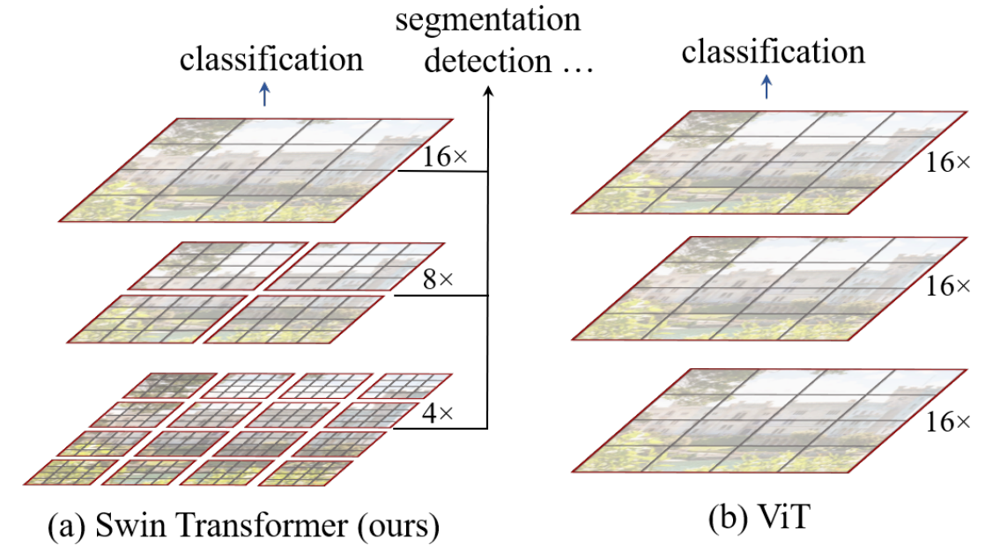

在论文的最后，作者也通过大量的实验证明Swin Transformer相较于以前的SOTA模型均有提高，尤其是在ADE20K数据和COCO数据集上的表现。也证明了Swin Transformer可以作为一种通用骨干网络被使用。

## 模型结构

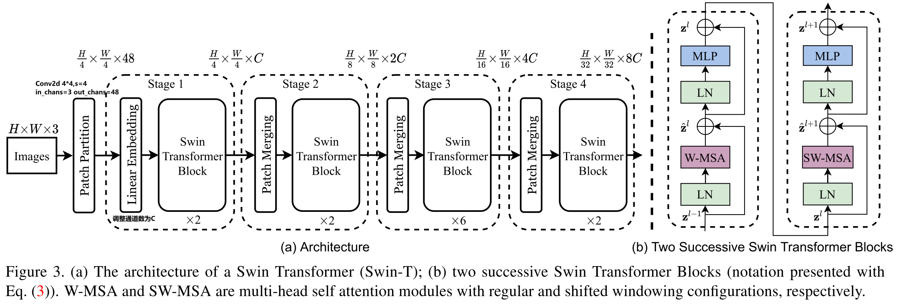

整个模型采取层次化的设计，一共包含 4 个 Stage，除第一个 stage 外，每个 stage 都会先通过 **Patch Merging** 层缩小输入特征图的分辨率，进行**下采样操作**，像 CNN 一样逐层扩大感受野，以便获取到全局的信息。

以论文的角度：

- 在输入开始的时候，做了一个`Patch Partition`，即ViT中`Patch Embedding`操作，通过 **Patch_size** 为4的卷积层将图片切成一个个 **Patch** ，并嵌入到`Embedding`，将 **embedding_size** 转变为48（可以将 CV 中图片的**通道数**理解为NLP中token的**词嵌入长度**）。
- 随后在第一个Stage中，通过`Linear Embedding`调整通道数为C。
- 在每个 Stage 里（除第一个 Stage ），均由`Patch Merging`和多个`Swin Transformer Block`组成。
- 其中`Patch Merging`模块主要在每个 Stage 一开始降低图片分辨率，进行下采样的操作。
- 而`Swin Transformer Block`具体结构如右图所示，主要是`LayerNorm`，`Window Attention` ，`Shifted Window Attention`和`MLP`组成 。

从代码的角度：

在微软亚洲研究院提供的代码中，是将`Patch Merging`作为每个 Stage  最后结束的操作，输入先进行`Swin Transformer Block`操作，再下采样。而**最后一个 Stage 不需要进行下采样操作**，之间通过后续的全连接层与 **target label** 计算损失。

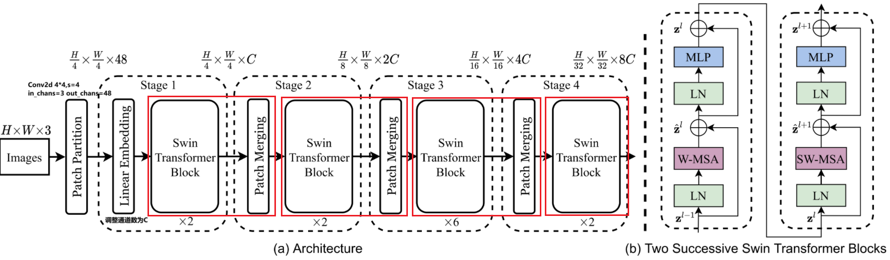

```python
# window_size=7 
# input_batch_image.shape=[128,3,224,224]
class SwinTransformer(nn.Module):
    def __init__(...):
        super().__init__()
        ...
        # absolute position embedding
        if self.ape:
            self.absolute_pos_embed = nn.Parameter(torch.zeros(1, num_patches, embed_dim))

        self.pos_drop = nn.Dropout(p=drop_rate)

        # build layers
        self.layers = nn.ModuleList()
        for i_layer in range(self.num_layers):
            layer = BasicLayer(...)
            self.layers.append(layer)

        self.norm = norm_layer(self.num_features)
        self.avgpool = nn.AdaptiveAvgPool1d(1)
        self.head = nn.Linear(self.num_features, num_classes) if num_classes > 0 else nn.Identity()

    def forward_features(self, x):
        x = self.patch_embed(x) # Patch Partition
        if self.ape:
            x = x + self.absolute_pos_embed
        x = self.pos_drop(x)

        for layer in self.layers:
            x = layer(x)

        x = self.norm(x)  # Batch_size Windows_num Channels
        x = self.avgpool(x.transpose(1, 2))  # Batch_size Channels 1
        x = torch.flatten(x, 1)
        return x

    def forward(self, x):
        x = self.forward_features(x)
        x = self.head(x) # self.head => Linear(in=Channels,out=Classification_num)
        return x
```

其中有几个地方处理方法与 ViT 不同：

- ViT 在输入会给 embedding 进行位置编码。而 Swin-T 这里则是作为一个**可选项**（`self.ape`），Swin-T 是在计算 Attention 的时候做了一个**相对位置编码**，我认为这是这篇论文设计最巧妙的地方。
- ViT 会单独加上一个可学习参数，作为分类的 token。而 Swin-T 则是**直接做平均**（avgpool），输出分类，有点类似 CNN 最后的全局平均池化层。


## Patch Embedding

在输入进 Block 前，我们需要将图片切成一个个 patch，然后嵌入向量。

具体做法是对原始图片裁成一个个 `window_size * window_size` 的窗口大小，然后进行嵌入。

这里可以通过二维卷积层，**将 stride，kernel_size 设置为 window_size 大小**。设定输出通道来确定嵌入向量的大小。最后将 H,W 维度展开，并移动到第一维度。

> 论文中输出通道设置为48，但是代码中为96，以下我们均以代码为准。
>
> Batch_size=128

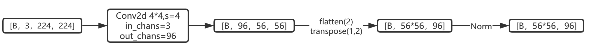

```python
import torch
import torch.nn as nn

class PatchEmbed(nn.Module):
    def __init__(self, img_size=224, patch_size=4, in_chans=3, embed_dim=96, norm_layer=None):
        super().__init__()
        img_size = to_2tuple(img_size) # -> (img_size, img_size)
        patch_size = to_2tuple(patch_size) # -> (patch_size, patch_size)
        patches_resolution = [img_size[0] // patch_size[0], img_size[1] // patch_size[1]]
        self.img_size = img_size
        self.patch_size = patch_size
        self.patches_resolution = patches_resolution
        self.num_patches = patches_resolution[0] * patches_resolution[1]

        self.in_chans = in_chans
        self.embed_dim = embed_dim

        self.proj = nn.Conv2d(in_chans, embed_dim, kernel_size=patch_size, stride=patch_size)
        if norm_layer is not None:
            self.norm = norm_layer(embed_dim)
        else:
            self.norm = None

    def forward(self, x):
        # 假设采取默认参数，论文中embedding_size是96，但是代码中为48.我们以代码为准
        x = self.proj(x) # 出来的是(N, 96, 224/4, 224/4) 
        x = torch.flatten(x, 2) # 把HW维展开，(N, 96, 56*56)
        x = torch.transpose(x, 1, 2)  # 把通道维放到最后 (N, 56*56, 96)
        if self.norm is not None:
            x = self.norm(x)
        return x
```

## Patch Merging

该模块的作用是在每个 Stage 开始前做降采样，用于缩小分辨率，调整通道数进而形成层次化的设计，同时也能节省一定运算量。

> 在 CNN 中，则是在每个 Stage 开始前用`stride=2`的卷积/池化层来降低分辨率。

每次降采样是两倍，因此**在行方向和列方向上，间隔 2 选取元素**。

然后拼接在一起作为一整个张量，最后展开。**此时通道维度会变成原先的 4 倍**（因为 H,W 各缩小 2 倍），此时再通过一个**全连接层再调整通道维度为原来的两倍**。

下面是一个示意图（输入张量 N=1, H=W=8, C=1，不包含最后的全连接层调整）

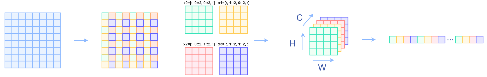

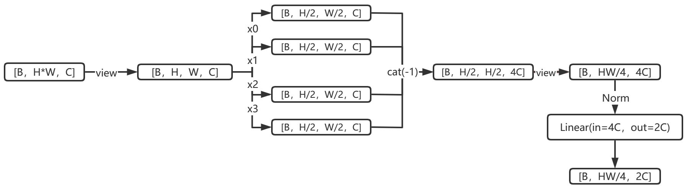

```python
class PatchMerging(nn.Module):
    def __init__(self, input_resolution, dim, norm_layer=nn.LayerNorm):
        super().__init__()
        self.input_resolution = input_resolution
        self.dim = dim
        self.reduction = nn.Linear(4 * dim, 2 * dim, bias=False)
        self.norm = norm_layer(4 * dim)

    def forward(self, x):
        """
        x: B, H*W, C
        """
        H, W = self.input_resolution
        B, L, C = x.shape
        assert L == H * W, "input feature has wrong size"
        assert H % 2 == 0 and W % 2 == 0, f"x size ({H}*{W}) are not even."

        x = x.view(B, H, W, C)

        x0 = x[:, 0::2, 0::2, :]  # B H/2 W/2 C
        x1 = x[:, 1::2, 0::2, :]  # B H/2 W/2 C
        x2 = x[:, 0::2, 1::2, :]  # B H/2 W/2 C
        x3 = x[:, 1::2, 1::2, :]  # B H/2 W/2 C
        x = torch.cat([x0, x1, x2, x3], -1)  # B H/2 W/2 4*C
        x = x.view(B, -1, 4 * C)  # B H/2*W/2 4*C

        x = self.norm(x)
        x = self.reduction(x)

        return x
```

## Window Partition/Reverse

`window partition`函数是用于对张量划分窗口，指定窗口大小。将原本的张量从 `N H W C`, 划分成 `num_windows*B, window_size, window_size, C`，其中 `num_windows = H*W / window_size*window_size`，即窗口的个数。而`window reverse`函数则是对应的逆过程。这两个函数会在后面的`Window Attention`用到。

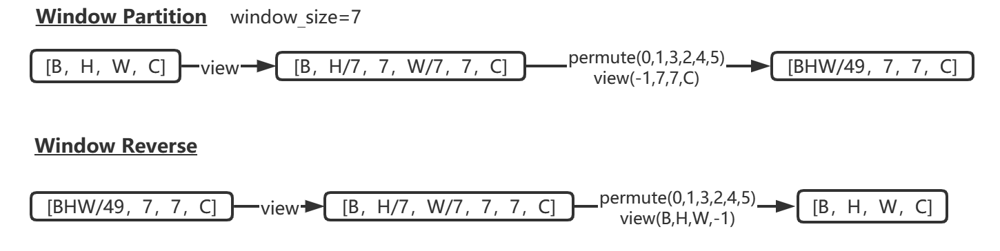

```python
def window_partition(x, window_size):
    B, H, W, C = x.shape
    x = x.view(B, H // window_size, window_size, W // window_size, window_size, C)
    windows = x.permute(0, 1, 3, 2, 4, 5).contiguous().view(-1, window_size, window_size, C)
    return windows

def window_reverse(windows, window_size, H, W):
    B = int(windows.shape[0] / (H * W / window_size / window_size))
    x = windows.view(B, H // window_size, W // window_size, window_size, window_size, -1)
    x = x.permute(0, 1, 3, 2, 4, 5).contiguous().view(B, H, W, -1)
    return x
```

## Window Attention

传统的 Transformer 都是**基于全局来计算注意力的**，因此计算复杂度十分高。而 Swin Transformer 则将**注意力的计算限制在每个窗口内**，进而减少了计算量。我们先简单看下公式

$$
Attention(Q,K,V)=Softmax(\frac{{QK}^T}{\sqrt d}+B)V
$$
主要区别是在原始计算 Attention 的公式中的 Q,K 时**加入了相对位置编码**。

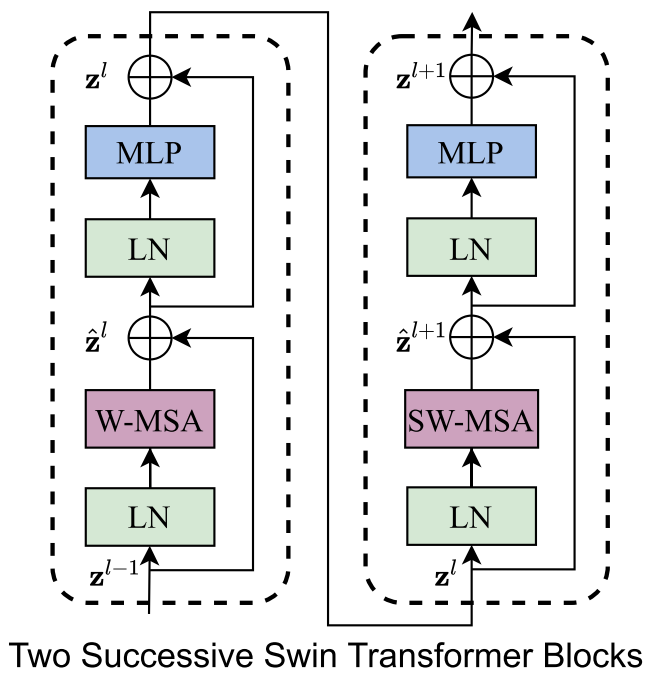

```python
class WindowAttention(nn.Module):
    r""" Window based multi-head self attention (W-MSA) module with relative position bias.
    It supports both of shifted and non-shifted window.

    Args:
        dim (int): Number of input channels.
        window_size (tuple[int]): The height and width of the window.
        num_heads (int): Number of attention heads.
        qkv_bias (bool, optional):  If True, add a learnable bias to query, key, value. Default: True
        qk_scale (float | None, optional): Override default qk scale of head_dim ** -0.5 if set
        attn_drop (float, optional): Dropout ratio of attention weight. Default: 0.0
        proj_drop (float, optional): Dropout ratio of output. Default: 0.0
    """

    def __init__(self, dim, window_size, num_heads, qkv_bias=True, qk_scale=None, attn_drop=0., proj_drop=0.):

        super().__init__()
        self.dim = dim
        self.window_size = window_size  # Wh, Ww
        self.num_heads = num_heads # nH
        head_dim = dim // num_heads # 每个注意力头对应的通道数
        self.scale = qk_scale or head_dim ** -0.5

        # define a parameter table of relative position bias
        self.relative_position_bias_table = nn.Parameter(
            torch.zeros((2 * window_size[0] - 1) * (2 * window_size[1] - 1), num_heads))  # 设置一个形状为（2*(Wh-1) * 2*(Ww-1), nH）的可学习变量，用于后续的位置编码

        self.qkv = nn.Linear(dim, dim * 3, bias=qkv_bias)
        self.attn_drop = nn.Dropout(attn_drop)
        self.proj = nn.Linear(dim, dim)
        self.proj_drop = nn.Dropout(proj_drop)

        trunc_normal_(self.relative_position_bias_table, std=.02)
        self.softmax = nn.Softmax(dim=-1)
        # 相关位置编码...
```

### 相关位置编码的直观理解

> Q,K,V.shape=[numWindwos\*B, num_heads, window_size\*window_size, head_dim]
>
> - window_size*window_size 即 NLP 中`token`的个数
> - $head\_dim=\frac{Embedding\_dim}{num\_heads}$ 即 NLP 中`token`的词嵌入向量的维度
>
> ${QK}^T$计算出来的`Attention`张量的形状为`[numWindows*B, num_heads, Q_tokens, K_tokens]`
>
> - 其中Q_tokens=K_tokens=window_size*window_size

以`window_size=2`为例：


因此：${QK}^T=\left[\begin{array}{cccc}a_{11} & a_{12} & a_{13} & a_{14} \\ a_{21} & a_{22} & a_{23} & a_{24} \\ a_{31} & a_{32} & a_{33} & a_{34} \\ a_{41} & a_{42} & a_{43} & a_{44}\end{array}\right]$

- **第 $i$ 行表示第 $i$ 个 token 的`query`对所有token的`key`的attention。**
- 对于 Attention 张量来说，**以不同元素为原点，其他元素的坐标也是不同的**，


所以${QK}^T的相对位置索引=\left[\begin{array}{cccc}(0,0) & (0,-1) & (-1,0) & (-1,-1) \\ (0,1) & (0,0) & (-1,1) & (-1,0) \\ (1,0) & (1,-1) & (0,0) & (0,-1) \\ (1,1) & (1,0) & (0,1) & (0,0)\end{array}\right]$

由于最终我们希望使用一维的位置坐标 `x+y` 代替二维的位置坐标` (x,y)`，为了避免 (1,2) (2,1) 两个坐标转为一维时均为3，我们之后对相对位置索引进行了一些**线性变换**，使得能通过**一维**的位置坐标**唯一映射**到一个**二维**的位置坐标，详细可以通过代码部分进行理解。

### 相关位置编码的代码详解

首先我们利用`torch.arange`和`torch.meshgrid`函数生成对应的坐标，这里我们以`windowsize=2`为例子

```python
coords_h = torch.arange(self.window_size[0])
coords_w = torch.arange(self.window_size[1])
coords = torch.meshgrid([coords_h, coords_w]) # -> 2*(wh, ww)
"""
  (tensor([[0, 0],
           [1, 1]]), 
   tensor([[0, 1],
           [0, 1]]))
"""
```

然后堆叠起来，展开为一个二维向量

```python
coords = torch.stack(coords)  # 2, Wh, Ww
coords_flatten = torch.flatten(coords, 1)  # 2, Wh*Ww
"""
tensor([[0, 0, 1, 1],
        [0, 1, 0, 1]])
"""
```

利用广播机制，分别在第一维，第二维，插入一个维度，进行广播相减，得到 `2, wh*ww, wh*ww`的张量

```python
relative_coords_first = coords_flatten[:, :, None]  # 2, wh*ww, 1
relative_coords_second = coords_flatten[:, None, :] # 2, 1, wh*ww
relative_coords = relative_coords_first - relative_coords_second # 最终得到 2, wh*ww, wh*ww 形状的张量
```


因为采取的是相减，所以得到的索引是从负数开始的，**我们加上偏移量，让其从 0 开始**。

```python
relative_coords = relative_coords.permute(1, 2, 0).contiguous() # Wh*Ww, Wh*Ww, 2
relative_coords[:, :, 0] += self.window_size[0] - 1
relative_coords[:, :, 1] += self.window_size[1] - 1
```

后续我们需要将其展开成一维偏移量。而对于 (1，2）和（2，1）这两个坐标。在二维上是不同的，**但是通过将 x,y 坐标相加转换为一维偏移的时候，他的偏移量是相等的**。

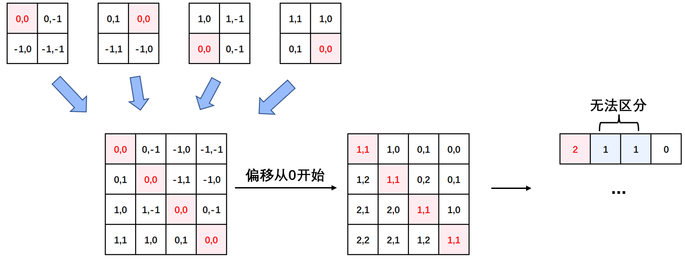	

所以最后我们对其中做了个乘法操作，以进行区分

```python
relative_coords[:, :, 0] *= 2 * self.window_size[1] - 1
```


然后再最后一维上进行求和，展开成一个一维坐标，并注册为一个不参与网络学习的变量

```python
relative_position_index = relative_coords.sum(-1)  # Wh*Ww, Wh*Ww
self.register_buffer("relative_position_index", relative_position_index)
```

之前计算的是相对位置索引，并不是相对位置偏置参数。真正使用到的可训练参数$\hat B$是保存在`relative position bias table`表里的，这个表的长度是等于 **(2M−1) × (2M−1)** (在二维位置坐标中线性变化乘以2M-1导致)的。那么上述公式中的相对位置偏执参数B是根据上面的相对位置索引表根据查`relative position bias table`表得到的。

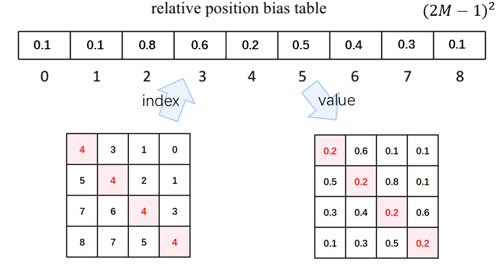

接着我们看前向代码

```python
def forward(self, x, mask=None):
    """
    Args:
        x: input features with shape of (num_windows*B, N, C)
        mask: (0/-inf) mask with shape of (num_windows, Wh*Ww, Wh*Ww) or None
    """
    B_, N, C = x.shape

    qkv = self.qkv(x).reshape(B_, N, 3, self.num_heads, C // self.num_heads).permute(2, 0, 3, 1, 4)
    q, k, v = qkv[0], qkv[1], qkv[2]  # make torchscript happy (cannot use tensor as tuple)

    q = q * self.scale
    attn = (q @ k.transpose(-2, -1))

    relative_position_bias = self.relative_position_bias_table[self.relative_position_index.view(-1)].view(self.window_size[0] * self.window_size[1], self.window_size[0] * self.window_size[1], -1)  # Wh*Ww,Wh*Ww,nH
    relative_position_bias = relative_position_bias.permute(2, 0, 1).contiguous()  # nH, Wh*Ww, Wh*Ww
    attn = attn + relative_position_bias.unsqueeze(0) # (1, num_heads, windowsize, windowsize)

    if mask is not None: # 下文会分析到
        ...
    else:
        attn = self.softmax(attn)

    attn = self.attn_drop(attn)

    x = (attn @ v).transpose(1, 2).reshape(B_, N, C)
    x = self.proj(x)
    x = self.proj_drop(x)
    return x
```

- 首先输入张量形状为 `[numWindows*B, window_size * window_size, C]`
- 然后经过`self.qkv`这个全连接层后，进行 reshape，调整轴的顺序，得到形状为`[3, numWindows*B, num_heads, window_size*window_size, c//num_heads]`，并分配给`q,k,v`。
- 根据公式，我们对`q`乘以一个`scale`缩放系数，然后与`k`（为了满足矩阵乘要求，需要将最后两个维度调换）进行相乘。得到形状为`[numWindows*B, num_heads, window_size*window_size, window_size*window_size]`的`attn`张量
- 之前我们针对位置编码设置了个形状为`(2*window_size-1*2*window_size-1, numHeads)`的可学习变量。我们用计算得到的相对编码位置索引`self.relative_position_index.vew(-1)`选取，得到形状为`(window_size*window_size, window_size*window_size, numHeads)`的编码，再permute(2,0,1)后加到`attn`张量上
- 暂不考虑 mask 的情况，剩下就是跟 transformer 一样的 softmax，dropout，与`V`矩阵乘，再经过一层全连接层和 dropout

## Shifted Window Attention

前面的 Window Attention 是在每个窗口下计算注意力的，为了更好的和其他 window 进行信息交互，Swin Transformer 还引入了 shifted window 操作。

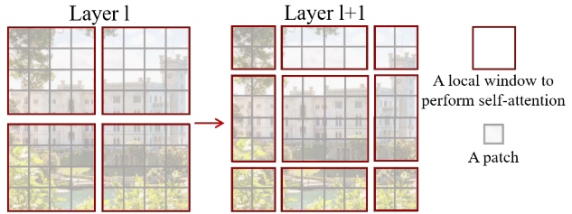

左边是没有重叠的 Window Attention，而右边则是将窗口进行移位的 Shift Window Attention。可以看到移位后的窗口包含了原本相邻窗口的元素。但这也引入了一个新问题，即 **window 的个数翻倍了**，由原本四个窗口变成了 9 个窗口。在实际代码里，我们是**通过对特征图移位，并给 Attention 设置 mask 来间接实现的**。能在**保持原有的 window 个数下**，最后的计算结果等价。 

<p align=center>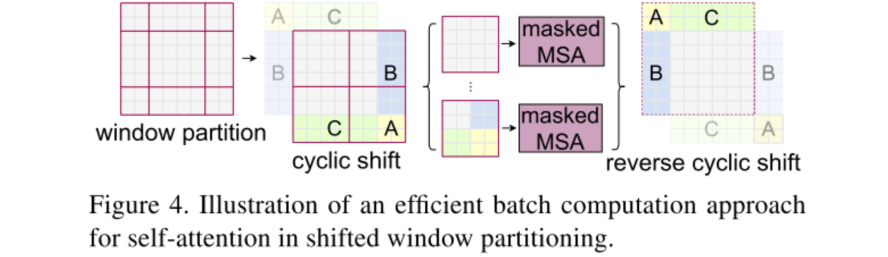</p>

### 特征图移位操作 

代码里对特征图移位是通过`torch.roll`来实现的，下面是示意图

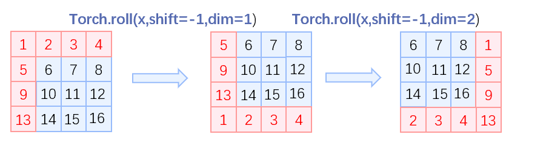

> 如果需要`reverse cyclic shift`的话只需把参数`shifts`设置为对应的正数值。

### Attention Mask

这是 Swin Transformer 的精华，通过设置合理的 mask，让`Shifted Window Attention`在与`Window Attention`相同的窗口个数下，达到等价的计算结果。

首先我们对 Shift Window 后的每个窗口都给上 index，并且做一个`roll`操作（window_size=2, shift_size=1）

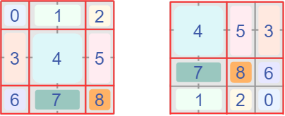


我们希望在计算 Attention 的时候，**让具有相同 index QK 进行计算，而忽略不同 index QK 计算结果**。最后正确的结果如下图所示

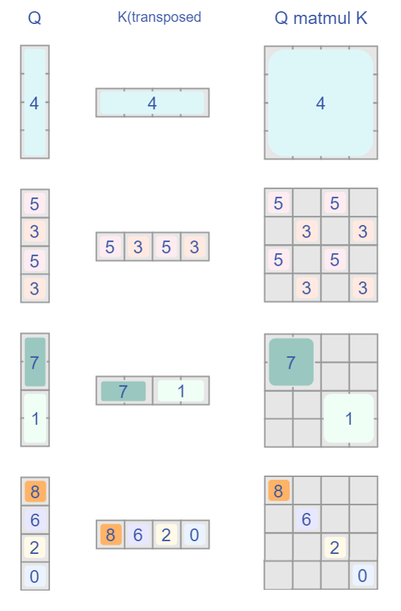

而要想在原始四个窗口下得到正确的结果，我们就必须给 Attention 的结果加入一个 mask（如上图最右边所示）相关代码如下：

```python
if self.shift_size > 0:
    # calculate attention mask for SW-MSA
    H, W = self.input_resolution
    img_mask = torch.zeros((1, H, W, 1))  # 1 H W 1
    h_slices = (slice(0, -self.window_size),
                slice(-self.window_size, -self.shift_size),
                slice(-self.shift_size, None))
    w_slices = (slice(0, -self.window_size),
                slice(-self.window_size, -self.shift_size),
                slice(-self.shift_size, None))
    cnt = 0
    for h in h_slices:
        for w in w_slices:
            img_mask[:, h, w, :] = cnt
            cnt += 1

    mask_windows = window_partition(img_mask, self.window_size)  # nW, window_size, window_size, 1
    mask_windows = mask_windows.view(-1, self.window_size * self.window_size)
    attn_mask = mask_windows.unsqueeze(1) - mask_windows.unsqueeze(2)
    attn_mask = attn_mask.masked_fill(attn_mask != 0, float(-100.0)).masked_fill(attn_mask == 0, float(0.0))
else:
	attn_mask = None
```

以上图的设置，我们用这段代码会得到这样的一个 mask

```
tensor([[[[[   0.,    0.,    0.,    0.],
           [   0.,    0.,    0.,    0.],
           [   0.,    0.,    0.,    0.],
           [   0.,    0.,    0.,    0.]]],


         [[[   0., -100.,    0., -100.],
           [-100.,    0., -100.,    0.],
           [   0., -100.,    0., -100.],
           [-100.,    0., -100.,    0.]]],


         [[[   0.,    0., -100., -100.],
           [   0.,    0., -100., -100.],
           [-100., -100.,    0.,    0.],
           [-100., -100.,    0.,    0.]]],


         [[[   0., -100., -100., -100.],
           [-100.,    0., -100., -100.],
           [-100., -100.,    0., -100.],
           [-100., -100., -100.,    0.]]]]])
```

在之前的 window attention 模块的前向代码里，包含这么一段

```python
if mask is not None:
    nW = mask.shape[0] # 一张图被分为多少个windows eg:[4,49,49]
    attn = attn.view(B_ // nW, nW, self.num_heads, N, N) + mask.unsqueeze(1).unsqueeze(0) # torch.Size([128, 4, 12, 49, 49]) torch.Size([1, 4, 1, 49, 49])
    attn = attn.view(-1, self.num_heads, N, N)
    attn = self.softmax(attn)
else:
    attn = self.softmax(attn)
```

将 mask 加到 attention 的计算结果，并进行 softmax。mask 的值设置为 - 100，softmax 后就会忽略掉对应的值。关于Mask，我们发现在官方代码库中的issue38也进行了讨论:-->[The Question about the mask of window attention #38](https://github.com/microsoft/Swin-Transformer/issues/38#issuecomment-823806591)

## W-MSA和MSA的复杂度对比

在原论文中，作者提出的基于**滑动窗口操作**的 `W-MSA` 能大幅度减少计算量。那么两者的计算量和算法复杂度大概是如何的呢，论文中给出了一下两个公式进行对比。
$$
\begin{aligned}
&\Omega(M S A)=4 h w C^{2}+2(h w)^{2} C \\
&\Omega(W-M S A)=4 h w C^{2}+2 M^{2} h w C
\end{aligned}
$$

- **h**：feature map的高度
- **w**：feature map的宽度
- **C**：feature map的通道数（也可以称为embedding size的大小）
- **M**：window_size的大小

### MSA模块的计算量

首先对于`feature map`中每一个`token`（一共有 $hw$ 个token，通道数为C），记作$X^{h w \times C}$，需要通过三次线性变换 $W_q,W_k,W_v$ ，产生对应的`q,k,v`向量，记作 $Q^{h w \times C},K^{h w \times C},V^{h w \times C}$ （通道数为C）。
$$
X^{h w \times C} \cdot W_{q}^{C \times C}=Q^{h w \times C} \\
X^{h w \times C} \cdot W_{k}^{C \times C}=K^{h w \times C} \\
X^{h w \times C} \cdot W_{v}^{C \times C}=V^{h w \times C} \\
$$
根据矩阵运算的计算量公式可以得到运算量为 $3hwC \times C$ ，即为 $3hwC^2$ 。
$$
Q^{h w \times C} \cdot K^T=A^{h w \times hw} \\
\Lambda^{h w \times h w}=Softmax(\frac{A^{h w \times hw}}{\sqrt(d)}+B) \\
\Lambda^{h w \times h w} \cdot V^{h w \times C}=Y^{h w \times C}
$$
忽略除以$\sqrt d$ 以及softmax的计算量，根据根据矩阵运算的计算量公式可得 $hwC \times hw + hw^2 \times C$  ，即为 $2(hw^2)C$ 。
$$
Y^{h w \times C} \cdot W_O^{C \times C}=O^{h w \times C}
$$
最终再通过一个Linear层输出，计算量为 $hwC^2$ 。因此整体的计算量为 $4 h w C^{2}+2(h w)^{2} C$​ 。

### W-MSA模块的计算量

对于W-MSA模块，首先会将`feature map`根据`window_size`分成 $\frac{hw}{M^2}$ 的窗口，每个窗口的宽高均为$M$，然后在每个窗口进行MSA的运算。因此，可以利用上面MSA的计算量公式，将 $h=M，w=M$ 带入，可以得到一个窗口的计算量为 $4 M^2 C^{2}+2M^{4} C$  。

又因为有 $\frac{hw}{M^2}$ 个窗口，则：
$$
\frac{hw}{M^2} \times\left(4M^2 C^2+2M^{4} C\right)=4 h w C^{2}+2 M^{2} h w C
$$
假设`feature map`的$h=w=112，M=7，C=128$，采用W-MSA模块会比MSA模块节省约40124743680 FLOPs：
$$
2(h w)^{2} C-2 M^{2} h w C=2 \times 112^{4} \times 128-2 \times 7^{2} \times 112^{2} \times 128=40124743680
$$

## 整体流程图

<p align=center>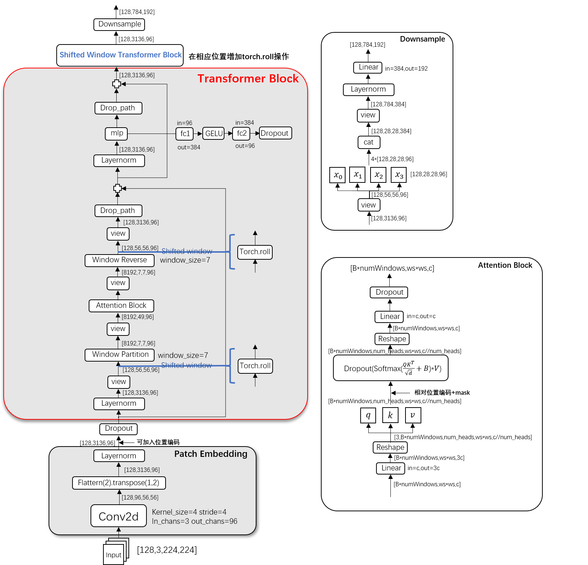</p>

<p align=center>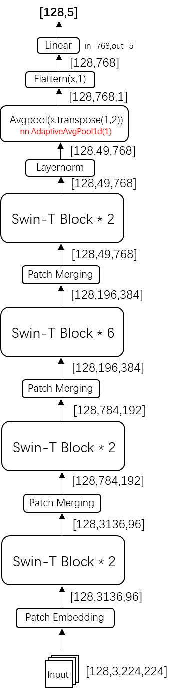</p>

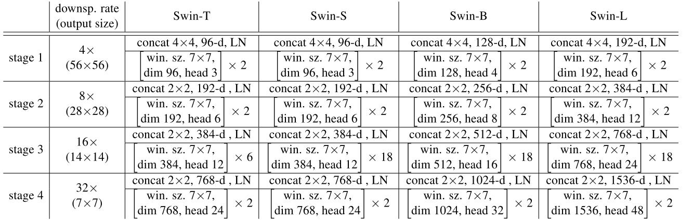

> 参考博客：
>
> https://zhuanlan.zhihu.com/p/367111046

> 联系方式：
>
> - 个人知乎：https://www.zhihu.com/people/shenhao-63
>
> - Github：https://github.com/shenhao-stu

