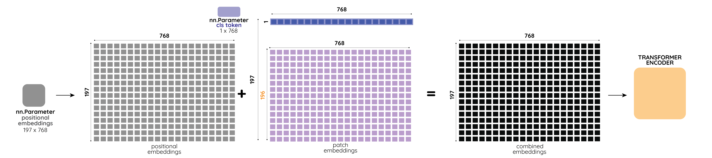

# ViT解读

<p>
<font size=3><b>[ViT] An Image is Worth 16x16 Words: Transformers for Image Recognition at Scale.</b></font>
<br>
<font size=2>Alexey Dosovitskiy, Lucas Beyer, Alexander Kolesnikov, Dirk Weissenborn, Xiaohua Zhai, Thomas Unterthiner, Mostafa Dehghani, Matthias Minderer, Georg Heigold, Sylvain Gelly, Jakob Uszkoreit, Neil Houlsby.</font>
<br>
<font size=2>ICLR 2021.</font>
<a href='https://arxiv.org/pdf/2010.11929v2.pdf'>[paper]</a> <a href='https://github.com/lucidrains/vit-pytorch/blob/main/vit_pytorch/vit.py'>[code]</a> 
<br>
<font size=3>解读者：牛志康，西安电子科技大学本科生，Datawhale成员；小饭同学，香港城市大学研究生
</font>
<br>
</p>

## 前言

Transformer 已经成为自然语言处理任务的一种基础网络，但它在计算机视觉中的应用仍然有限。因为 Transformer 对序列进行建模，如果我们将图像种的每一个像素都作为序列中的元素，因为序列的大小与图片的大小呈平方关系，将导致计算量大大增加。现有的工作要么是将注意力与卷积网络结合使用，要么用注意力机制替换 CNN 的某些组件或者降低图片的序列长度。这些改进都是基于 convolutional neural network (CNN) 卷积神经网络构建的，于是人们就在希望有一种完全基于 Transformer 的骨干网络，可以拥有 Transformer 全局建模的特性也可以不过多修改原始 Transformer 的结构。基于这种 motivation，才出现了 Vision Transformer (ViT) 这篇优秀的工作。

本文将从原理和代码实现上进行讲解，结合本课程需求，我们将着重讲解代码的实现，论文中更多的细节还请各位同学详细阅读原论文或关注 Whalepaper 后续的论文精读。


## ViT 的整体流程

如下图所示，ViT 的主要思想是将图片分成一个一个的小 `patch`，将每一个 `patch` 作为序列的元素输入 Transformer 中进行计算。


其具体流程如下：
1. **切分和映射**：对一张标准图像，我们首先将图片切分成一个一个小的 `patch`，然后将它们的维度拉平 `Flatten` 为一维的向量，最后我们将这些向量通过线性映射 `Linear Project` $\mathbf{E}$ 到维度为 $D$ 的空间。
2. **分类表征和位置信息**：**分类表征**：为了实现图像分类，我们在得到的向量中需要加入一个 `classs token`  $\mathbf{x}_\text{class}$ 作为分类表征（如上图中标注 $*$的粉色向量所示）。**位置信息**：图像和文本一样也需要注意顺序问题，因此作者通过 `Position Embedding` $\mathbf{E}_{pos}$ 加入位置编码信息（如上图中标注 $0-9$ 的紫色向量所示）。
3. **Transformer Encoder**：然后我们将经过上面操作的 `token` 送入 `Transformer Encoder`。这里的 `Transformer Encoder` 和 `Transformer (Attention is All You Need)` 文章中实现基本一致，主要是通过多头注意力机制，对 `patch` 之间进行全局的信息提取。
4. **输出与分类**：对于分类任务，我们只需要获得 `class token` 经过 `Transformer Encoder` 得到的输出，加一个 `MLP Head` 进行分类学习。

我们论文代码的讲解也将按照上面的流程，对重要模块进行讲解，我们所展示的ViT代码示例来源于[rwightman/timm](https://github.com/rwightman/pytorch-image-models/blob/master/timm/models/vision_transformer.py)并进行了部分简化，在此感谢每一位开源贡献者所作出的贡献。

## 切分和映射 Patch Embedding + Linear Projection

对一张标准图像 $\mathbf{x}$，其分辨率为 $H \times W \times C$。为了方便讨论，我们取 ViT 的标准输入 $H \times W \times C = 224 \times 224 \times 3$ 进行一些具体维度的讲解。通过切分操作，我们将整个图片分成多个 `patch` $\mathbf{x}_p$，其大小为 $$P \times P \times C = 16 \times 16 \times 3 = 768。$$ 这样，一共可以得到 `Patch` 的数量为 $$N={(H \times W)}/{(P \times P)} = {(224 \times 224)}/{(16 \times 16)} = {(224 / 16)}\times {(224 / 16)} = 14 \times 14 = 196。$$ 所以，我们将一张 $224 \times 224 \times 3$ 的标准图片， 通过转换得到了 $196$ 个 `patch`，每个 `patch` 的维度是 $768$。

对得到的 `patch` 通过 $\mathbf{E} \in {\mathbb{R}^{768 \times D}}$ 进行线性映射到维度 $D$，我们将映射后的 `patch` 叫做 `token`，以便于和原本 Transformer 的术语进行统一（代码中默认的 $D$ 仍然为 $768$。我们认为，为了不损失信息，这里 $D$ 满足大于等于 $768$ 即可）。对应文中公式，上述操作可以表示为：
$$
\begin{align}
[\mathbf{x}_p^1\mathbf{E}; \mathbf{x}_p^2\mathbf{E}; \cdots; \mathbf{x}_p^N\mathbf{E}], \quad \mathbf{E}\in\mathbb{R}^{(P^2\cdot C)\times D}。
\end{align}
$$

以上是按照原论文对**切分和映射**的讲解，在实际的代码实现过程中，切分和映射实际上是通过一个二维卷积 `nn.Conv2d()` 一步完成的。为了实现一步操作，作者将卷积核的大小 `kernal_size` 直接设置为了 `patch_size`，即 $P=16$。然后，将卷积核的步长 `stride` 也设置为了同样的 `patch_size`，这样就实现了不重复的切割图片。而卷积的特征输入和输出维度，分别设为了 $C=3$ 和 $D=768$，对应下方代码的 `in_c` 和 `embed_dim`。
```python
self.proj = nn.Conv2d(in_c, embed_dim, kernel_size=patch_size, stride=patch_size)
```
一张 $1 \times 3 \times 224 \times 224$ 的图像（其中 $1$ 是 `batch_size` 的维度），经过上述卷积操作得到 $1 \times 768 \times 14 \times 14$ 的张量。（代码中将 $14 \times 14 = 196$ 当作 `grid` 的个数，即 `grid_size=(14, 14)`）然后，对其进行拉平 `flatten(2)` 得到 $1 \times 768 \times 196$ 的张量。因为 Transformer 需要将序列维度调整到前面，我们再通过 `transpose(1, 2)` 调整特征和序列维度，最终得到的张量大小为 $1 \times 196 \times 768$。切分、映射、拉平和维度调整统统经过下面一步操作得到：
```python
x = self.proj(x).flatten(2).transpose(1, 2)
```

在代码中，这些操作全部被写在名为 `PatchEmbed` 的模块中，其具体的实现如下所示：

```python
class PatchEmbed(nn.Module):
    """
    Image --> Patch Embedding --> Linear Proj --> Pos Embedding
    Image size -> [224,224,3]
    Patch size -> 16*16
    Patch num -> (224^2)/(16^2)=196
    Patch dim -> 16*16*3 =768
    Patch Embedding: [224,224,3] -> [196,768]
    Linear Proj: [196,768] -> [196,768]
 	Positional Embedding: [197,768] -> [196,768]
    """
    def __init__(self, img_size=224, patch_size=16, in_c=3, embed_dim=768, norm_layer=None):
        """
        Args:
            img_size: 默认参数224
            patch_size: 默认参数是16
            in_c: 输入的通道数
            embed_dim: 16*16*3 = 768
            norm_layer: 是否使用norm层，默认为否
        """
        super().__init__()
        img_size = (img_size, img_size) # -> img_size = (224,224)
        patch_size = (patch_size, patch_size) # -> patch_size = (16,16)
        self.img_size = img_size # -> (224,224)
        self.patch_size = patch_size # -> (16,16)
        self.grid_size = (img_size[0] // patch_size[0], img_size[1] // patch_size[1]) # -> grid_size = (14,14)
        self.num_patches = self.grid_size[0] * self.grid_size[1] # -> num_patches = 196
        # Patch+linear proj的这个操作 [224,224,3] --> [14,14,768]
        self.proj = nn.Conv2d(in_c, embed_dim, kernel_size=patch_size, stride=patch_size)
        # 判断是否有norm_layer层，要是没有不改变输入
        self.norm = norm_layer(embed_dim) if norm_layer else nn.Identity()

    def forward(self, x):
        # 计算各个维度的大小
        B, C, H, W = x.shape
        assert H == self.img_size[0] and W == self.img_size[1], \
            f"Input image size ({H}*{W}) doesn't match model ({self.img_size[0]}*{self.img_size[1]})."
        
        # flatten: [B, C, H, W] -> [B, C, HW], flatten(2)代表的是从2位置开始展开
        # eg: [1,3,224,224] --> [1,768,14,14] -flatten->[1,768,196]
        # transpose: [B, C, HW] -> [B, HW, C]
        # eg: [1,768,196] -transpose-> [1,196,768]
        x = self.proj(x).flatten(2).transpose(1, 2)
        x = self.norm(x)
        return x
```
**在默认情况下，这一步是不进行 ``layer_norm`` 操作的，即它被设置为 ``nn.Identity()``。对于 ``layer_norm``，我们会在下面进行详细的讲解。

## 分类表征和位置信息 Class Token + Postional Embedding
如下图所示，左侧灰色部分为加入分类表征，中间紫色部分为加入位置信息。


**分类表征：Class Token**
为了实现图像分类，我们在切分和映射后的向量 $[\mathbf{x}_p^1\mathbf{E}; \mathbf{x}_p^2\mathbf{E}; \cdots; \mathbf{x}_p^N\mathbf{E}]$ 中加入一个 `class token`  $\mathbf{x}_\text{class} \in \mathbb{R}^{D}$ 作为分类表征（如上图中最左侧深灰色框所示）。将这个表征放置在序列的第一个位置上，我们就得到一个维度为 $(196+1) \times 768$ 的新张量：
$$
\begin{align}
[\mathbf{x}_{\text{class}}; \mathbf{x}_p^1\mathbf{E}; \mathbf{x}_p^2\mathbf{E}; \cdots; \mathbf{x}_p^N\mathbf{E}] 
\end{align}
$$
对于具体的代码实现，我们通过 `nn.Parameter(torch.zeros(1, 1, 768))` 实例化一个可学习的 `cls_token`，然后将这个 `cls_token` 按照 `batch_size = x.shape[0]` 进行复制，最后将其和之前经过切分和映射的 `x` 并在一起 ` torch.cat((cls_token, x), dim=1)`。其完整代码，如下所示：
```python
cls_token = nn.Parameter(torch.zeros(1, 1, 768)) # -> cls token
nn.init.trunc_normal_(self.cls_token, std=0.02) # 初始化
cls_token = cls_token.expand(x.shape[0], -1, -1) # (1,1,768) -> (128,1,768)
x = torch.cat((cls_token, x), dim=1)  # [128, 197, 768]
```

**其实也可以不加入这个 `cls token`，我们可以对输出 `token` 做 `GAP(Global Average Pooling)`，然后对 `GAP` 的结果进行分类。

**位置信息：Postional Embedding**
图像和文本一样也需要注意顺序问题，因此作者通过 `Position Embedding` $\mathbf{E}_{\text{pos}}\in\mathbb{R}^{(N + 1)\times D}$ 加入位置编码信息。这个 `Position Embedding` 和上面得到的分类表征张量，直接相加：
$$
\begin{align}
\mathbf{z}_0 &= [\mathbf{x}_{\text{class}}; \mathbf{x}_p^1\mathbf{E}; \mathbf{x}_p^2\mathbf{E}; \cdots; \mathbf{x}_p^N\mathbf{E};] + \mathbf{E}_{\text{pos}}, & \mathbf{E}&\in\mathbb{R}^{(P^2\cdot C)\times D}, \mathbf{E}_{\text{pos}}\in\mathbb{R}^{(N + 1)\times D}
\end{align}
$$

与 Transformer 使用余弦位置编码不同的是，ViT 通过`nn.Parameter()`实现了一个可以学习的位置编码。
```python
num_patches = 196
pos_embed = nn.Parameter(torch.zeros(1, num_patches + 1, 768))
x = x + pos_embed
```
**这里 `pos_embed` 在 `batch_size` 的维度进行了 boardcast，所以所有的样本都是同样的 `pos_embed`。


## Transformer Encoder
下一步，我们只需要将序列 $\mathbf{z}_0$ 输入 Transformer Encoder 即可。如下图所示，每个 Transformer Encoder 由 Multi-head Attention、MLP、Norm (Layer Norm,LN) 并外加 shortcut 连接实现。
$$
\begin{align}
\mathbf{z}'_l &= \text{MSA}(\text{LN}(\mathbf{z}_{l-1})) + \mathbf{z}_{l-1}, & l &=1\dots L, \\
\mathbf{z}_l &= \text{MLP}(\text{LN}(\mathbf{z}'_l)) + \mathbf{z}'_l,  & l &=1\dots L, \\
\mathbf{y} &= \text{LN}(\mathbf{z}_L^0)
\end{align}
$$
<center>
<figure>

</figure>
</center>
下面我们将对这些模块逐一进行讲解。


### Multi-head Attention
Multi-head Attention 或者叫做 Multi-head Self-Attention (MSA) 是由多个 Self-attention (SA) 模块组成，它们的框图可由下面所示，其中左侧为 SA，右侧为 MSA。
<center>
<figure>

·
·
·
·
·
·

</figure>
</center>

对于一个标准的 SA 模块，我们通过对输入张量 $\mathbf{z}$ 进行一个映射 $\mathbf{W_{SA}}$ 得到 $Q, K, V$
$$
[Q, K, V] = \mathbf{z} \mathbf{W}_{\text{SA}}.
$$
对于 MSA，我们需要对其输入再次进行切分为 $k$ 个部分 （$k=$``self.num_heads``），而每个部分的维度为原本维度的 $k$ 分之一，即 ``C // self.num_heads``。然后，将维度进行调整，即 `q, k, v` 到第 1 个维度， 批大小 `batch_size` 为第 2 个维度，头的数量数量 `num_heads` 为第 3 个维度，切分块的数量 `num_patches` 和每个头的特征维度 `embed_dim_per_head` 为最后两个维度。这种维度调整，将方便提取 ``q, k, v``，以及后面的注意力计算。上述步骤在代码中对应：
```python
self.qkv = nn.Linear(dim, dim * 3, bias=qkv_bias)
qkv = self.qkv(x).reshape(B, N, 3, self.num_heads, C // self.num_heads).permute(2, 0, 3, 1, 4)
q, k, v = qkv[0], qkv[1], qkv[2]  # seperate q, k, v
```

现在，如果我们将每一个 ``head``，看作一个独立的计算单元。我们可以对每一个``head`` 进行标准的 SA 计算
$$
Attention(Q, K, V) = softmax(\frac{Q K^T}{\sqrt {D_k}}) \cdot V
$$
然后，这些 ``head`` 会被拼接在一起，计算最终的输出：
$$
\mathrm{MultiHead}(Q, K, V) = \mathrm{Concat}(\mathrm{head_1}, ...,
\mathrm{head_h})W^O    \\
    \text{where}~\mathrm{head_i} = \mathrm{Attention}(QW^Q_i, KW^K_i, VW^V_i)
$$

其中 $W^O$ 代表的是线性变换层，$head_i$ 代表的是每个 `head` 的输出，其中 $W^Q_i$，$W^K_i$, $W^V_i$，等价于每个 `head` 的线性映射权重（如上面计算 `qkv`所讲，实际代码实现中，我们会先一起计算 `qkv`，再进行 `head` 的切分）。如果按照默认实现，一般切分为 $k=8$ 个头，其中 $D_k=D/k = 768/8=96$，是为了归一化点乘的结果。

在代码实现的时候，作者充分考虑了多头的并行计算。通过点乘的形式对所有的 ``head`` 一起计算相关性 ``(q @ k.transpose(-2, -1))``，然后经过 `softmax` 得到权重 ``attn`` （这些权重的维度为 ``[batch_size, num_heads, num_patches + 1, num_patches + 1]``）。
之后将这些权重 ``attn`` 和 `v` （其维度为 ``[batch_size, num_heads, num_patches+1, embed_dim_per_head]``） 进行点乘，得到注意力的输出结果。这里在点乘的时候，我们只需要看 ``attn`` 和 ``v``的最后两个维度，分别为``[num_patches + 1, num_patches + 1]`` 和 ``[num_patches+1, embed_dim_per_head]``，维持其他维度不变，我们可以得到输出的结果维度为 ``[batch_size, num_heads, num_patches + 1, embed_dim_per_head]``。
最后，我们通过将特征维度和多头维度交换 ``transpose(1, 2)`` 和 重组第2个及后面所有的维度 ``reshape(B, N, C)``，就可以得到维度为 `[batch_size, num_patches + 1, total_embed_dim]` 和上面公式相同的并行多头计算结果。其完整实现如下所示
```python
class Attention(nn.Module):
    def __init__(self,
                 dim,   # 输入token的dim
                 num_heads=8, # attention head的个数
                 qkv_bias=False, # 是否使用qkv bias
                 qk_scale=None,
                 attn_drop_ratio=0.,
                 proj_drop_ratio=0.):
        super(Attention, self).__init__()
        self.num_heads = num_heads
        # 计算每一个head处理的维度head_dim = dim // num_heads --> 768/8 = 96
        head_dim = dim // num_heads
        self.scale = qk_scale or head_dim ** -0.5 # 根下dk操作
        # 使用nn.Linear生成w_q,w_k,w_v，因为本质上每一个变换矩阵都是线性变换，
        self.qkv = nn.Linear(dim, dim * 3, bias=qkv_bias)
        self.attn_drop = nn.Dropout(attn_drop_ratio)
        self.proj = nn.Linear(dim, dim)
        self.proj_drop = nn.Dropout(proj_drop_ratio)

    def forward(self, x):
        # [batch_size, num_patches + 1, total_embed_dim]
        # total_embed_dim不是一开始展开的那个维度，是经过了一个线性变换层得到的
        B, N, C = x.shape

        # [batch_size, num_patches+1, total_embed_dim] -qkv()-> [batch_size, num_patches + 1, 3 * total_embed_dim]
        # reshape: -> [batch_size, num_patches + 1, 3, num_heads, embed_dim_per_head]
        # permute: -> [3, batch_size, num_heads, num_patches + 1, embed_dim_per_head]
        qkv = self.qkv(x).reshape(B, N, 3, self.num_heads, C // self.num_heads).permute(2, 0, 3, 1, 4)
        # q,k,v = [batch_size, num_heads, num_patches + 1, embed_dim_per_head]
        q, k, v = qkv[0], qkv[1], qkv[2]  # make torchscript happy (cannot use tensor as tuple)

        # transpose(-2,-1)在最后两个维度进行操作，输入的形状[batch_size,num_heads,num_patches+1,embed_dim_per_head]
        # transpose: -> [batch_size, num_heads, embed_dim_per_head, num_patches + 1]
        # @: multiply -> [batch_size, num_heads, num_patches + 1, num_patches + 1]
        attn = (q @ k.transpose(-2, -1)) * self.scale
        attn = attn.softmax(dim=-1)
        attn = self.attn_drop(attn)

        # @: multiply -> [batch_size, num_heads, num_patches + 1, embed_dim_per_head]
        # transpose: -> [batch_size, num_patches + 1, num_heads, embed_dim_per_head]
        # reshape: -> [batch_size, num_patches + 1, total_embed_dim]
        x = (attn @ v).transpose(1, 2).reshape(B, N, C)
        x = self.proj(x)
        x = self.proj_drop(x)
        return x
```

### MLP
MLP层类似于原始Transformer中的Feed Forward Network。
> In ViT, only MLP layers are local and translationally equivariant, while the self-attention layers are global.

为了理解这句话，即 MLP 只对局部信息进行操作，我们需要强调 `nn.Linear()` 操作只对输入张量的最后一个维度进行操作。那么，对于输入维度为 `[batch_size, num_patches + 1, total_embed_dim]`，学习到的线性层对于所有 `patch` 都是一样的。所以，它是一个局部信息的建模。对于 Attention，因为它是在不同的 `patch` 层面或者不同的序列层面进行建模，所以是全局信息建模。因此，作者使用了 MLP 和 Attention 一起进行局部和全局信息的提取。

```python
class Mlp(nn.Module):
    """
    in_features --> hidden_features --> out_features
    论文实现时：in_features.shape = out_features.shape
    """
    def __init__(self, in_features, hidden_features=None, out_features=None, act_layer=nn.GELU, drop=0.):
        super().__init__()
        # 用or实现了或操作，当hidden_features/out_features为默认值None时
        # 此时out_features/hidden_features=None or in_features = in_features
        # 当对out_features或hidden_features进行输入时，or操作将会默认选择or前面的
        # 此时out_features/hidden_features = out_features/hidden_features
        out_features = out_features or in_features
        hidden_features = hidden_features or in_features
        self.fc1 = nn.Linear(in_features, hidden_features)
        self.act = act_layer()
        self.fc2 = nn.Linear(hidden_features, out_features)
        self.drop = nn.Dropout(drop)

    def forward(self, x):
        # in_features --> hidden_features --> out_features
        x = self.fc1(x)
        x = self.act(x)
        x = self.drop(x)
        x = self.fc2(x)
        x = self.drop(x)
        return x
```

### Layer Norm
Normalization 有很多种，但是它们都有一个共同的目的，那就是把输入转化成均值为 0 方差为 1 的数据（或者某个学习到的均值和方差）。我们在把数据送入激活函数之前进行 Normalization（归一化），因为我们不希望输入数据落在激活函数的饱和区。

Batch Norm 的作用是在对这批样本的同一维度特征做归一化，而 Layer Norm 的作用是对**单个样本的所有维度特征做归一化**。举一个简单的例子，对于通过编码的句子“我爱学习”，Batch Norm 是对这四个字进行归一化，而 Layer Norm 是对每个字本身的特征进行归一化。

对于 Layer Norm，其公式如下所示
$$L N\left(x_i\right)=\alpha \times \frac{x_i-u_L}{\sqrt{\sigma_L^2+\epsilon}}+\beta$$
可以通过 `nn.LayerNorm` 进行实现。


### Transformer Encoder 完整代码
整合上面 Multi-head Attention、MLP、Norm (Layer Norm,LN) 并外加 shortcut 连接代码，我们可以得到 Transformer Encoder 的完整代码。
```python
class Block(nn.Module):
    """
    每一个Encoder Block的构成
    每个Encode Block的流程：norm1 --> Multi-Head Attention --> norm2 --> MLP
    """
    def __init__(self,
                 dim, # 输入mlp的维度
                 num_heads, # Multi-Head-Attention的头个数
                 mlp_ratio=4., # hidden_features / in_features = mlp_ratio
                 qkv_bias=False, # q,k,v的生成是否使用bias
                 qk_scale=None,
                 drop_ratio=0., # dropout的比例
                 attn_drop_ratio=0., # 注意力dropout的比例
                 drop_path_ratio=0.,
                 act_layer=nn.GELU, # 激活函数默认使用GELU
                 norm_layer=nn.LayerNorm): # Norm默认使用LayerNorm
        super(Block, self).__init__()
        # 第一层normalization
        self.norm1 = norm_layer(dim)
        # self.attention层的实现
        self.attn = Attention(dim, num_heads=num_heads, qkv_bias=qkv_bias, qk_scale=qk_scale,attn_drop_ratio=attn_drop_ratio, proj_drop_ratio=drop_ratio)
        self.drop_path = DropPath(drop_path_ratio) if drop_path_ratio > 0. else nn.Identity()
        # 第二层normalization
        self.norm2 = norm_layer(dim)
        mlp_hidden_dim = int(dim * mlp_ratio) # hidden_dim = dim * mlp_ratio
        # mlp实现
        self.mlp = Mlp(in_features=dim, hidden_features=mlp_hidden_dim, act_layer=act_layer, drop=drop_ratio)

    def forward(self, x):
        # 实现了两个残差连接
        x = x + self.drop_path(self.attn(self.norm1(x)))
        x = x + self.drop_path(self.mlp(self.norm2(x)))
        return x
```


## ViT 完整代码
对输入图像，进行切分和影射、加入分类表征和位置信息、经过 Transformer Encoder、然后添加一个分类头进行输出，我们就完成了 ViT 所有的代码。

完整的 ViT 主要模块流程，见下方 `VisionTransformer`。

```python
class VisionTransformer(nn.Module):
    def __init__(self,
                 img_size=224,
                 patch_size=16,
                 in_c=3,
                 num_classes=1000,
                 embed_dim=768,
                 depth=12,
                 num_heads=12,
                 mlp_ratio=4.0,
                 qkv_bias=True,
                 qk_scale=None,
                 representation_size=None,
                 distilled=False,
                 drop_ratio=0.,
                 attn_drop_ratio=0.,
                 drop_path_ratio=0.,
                 embed_layer=PatchEmbed,
                 norm_layer=None,
                 act_layer=None):
        """
        Args:
            img_size (int, tuple): input image size
            patch_size (int, tuple): patch size
            in_c (int): number of input channels
            num_classes (int): number of classes for classification head
            embed_dim (int): embedding dimension
            depth (int): depth of transformer
            num_heads (int): number of attention heads
            mlp_ratio (int): ratio of mlp hidden dim to embedding dim
            qkv_bias (bool): enable bias for qkv if True
            qk_scale (float): override default qk scale of head_dim ** -0.5 if set
            representation_size (Optional[int]): enable and set representation layer (pre-logits) to this value if set
            distilled (bool): model includes a distillation token and head as in DeiT models
            drop_ratio (float): dropout rate
            attn_drop_ratio (float): attention dropout rate
            drop_path_ratio (float): stochastic depth rate
            embed_layer (nn.Module): patch embedding layer
            norm_layer: (nn.Module): normalization layer
        """
        super(VisionTransformer, self).__init__()
        self.num_classes = num_classes
        # 每个patch的图像维度 = embed_dim
        self.num_features = self.embed_dim = embed_dim  # num_features for consistency with other models
        # token的个数为1
        self.num_tokens = 2 if distilled else 1
        # 设置激活函数和norm函数
        norm_layer = norm_layer or partial(nn.LayerNorm, eps=1e-6)
        act_layer = act_layer or nn.GELU
        # 对应的将图片打成patch的操作
        self.patch_embed = embed_layer(img_size=img_size, patch_size=patch_size, in_c=in_c, embed_dim=embed_dim)
        num_patches = self.patch_embed.num_patches
        # 设置分类的cls_token
        self.cls_token = nn.Parameter(torch.zeros(1, 1, embed_dim))
        # distilled 是Deit中的 这里为None
        self.dist_token = nn.Parameter(torch.zeros(1, 1, embed_dim)) if distilled else None
        # pos_embedding 为一个可以学习的参数
        self.pos_embed = nn.Parameter(torch.zeros(1, num_patches + self.num_tokens, embed_dim))
        self.pos_drop = nn.Dropout(p=drop_ratio)

        dpr = [x.item() for x in torch.linspace(0, drop_path_ratio, depth)]  # stochastic depth decay rule
        # 使用nn.Sequential进行构建，ViT中深度为12
        self.blocks = nn.Sequential(*[
            Block(dim=embed_dim, num_heads=num_heads, mlp_ratio=mlp_ratio, qkv_bias=qkv_bias, qk_scale=qk_scale,
                  drop_ratio=drop_ratio, attn_drop_ratio=attn_drop_ratio, drop_path_ratio=dpr[i],
                  norm_layer=norm_layer, act_layer=act_layer)
            for i in range(depth)
        ])
        self.norm = norm_layer(embed_dim)

        # Representation layer
        if representation_size and not distilled:
            self.has_logits = True
            self.num_features = representation_size
            self.pre_logits = nn.Sequential(OrderedDict([
                ("fc", nn.Linear(embed_dim, representation_size)),
                ("act", nn.Tanh())
            ]))
        else:
            self.has_logits = False
            self.pre_logits = nn.Identity()

        # Classifier head(s)
        self.head = nn.Linear(self.num_features, num_classes) if num_classes > 0 else nn.Identity()
        self.head_dist = None
        if distilled:
            self.head_dist = nn.Linear(self.embed_dim, self.num_classes) if num_classes > 0 else nn.Identity()

        # Weight init
        nn.init.trunc_normal_(self.pos_embed, std=0.02)
        if self.dist_token is not None:
            nn.init.trunc_normal_(self.dist_token, std=0.02)

        nn.init.trunc_normal_(self.cls_token, std=0.02)
        self.apply(_init_vit_weights)

    def forward_features(self, x):
        # [B, C, H, W] -> [B, num_patches, embed_dim]
        x = self.patch_embed(x)  # [B, 196, 768]
        # [1, 1, 768] -> [B, 1, 768]
        cls_token = self.cls_token.expand(x.shape[0], -1, -1)
        if self.dist_token is None:
            x = torch.cat((cls_token, x), dim=1)  # [B, 197, 768]
        else:
            x = torch.cat((cls_token, self.dist_token.expand(x.shape[0], -1, -1), x), dim=1)

        x = self.pos_drop(x + self.pos_embed)
        x = self.blocks(x)
        x = self.norm(x)
        if self.dist_token is None:
            return self.pre_logits(x[:, 0])
        else:
            return x[:, 0], x[:, 1]

    def forward(self, x):
        x = self.forward_features(x)
        if self.head_dist is not None:
            x, x_dist = self.head(x[0]), self.head_dist(x[1])
            if self.training and not torch.jit.is_scripting():
                # during inference, return the average of both classifier predictions
                return x, x_dist
            else:
                return (x + x_dist) / 2
        else:
            x = self.head(x)
        return x


def _init_vit_weights(m):
    """
    ViT weight initialization
    :param m: module
    """
    if isinstance(m, nn.Linear):
        nn.init.trunc_normal_(m.weight, std=.01)
        if m.bias is not None:
            nn.init.zeros_(m.bias)
    elif isinstance(m, nn.Conv2d):
        nn.init.kaiming_normal_(m.weight, mode="fan_out")
        if m.bias is not None:
            nn.init.zeros_(m.bias)
    elif isinstance(m, nn.LayerNorm):
        nn.init.zeros_(m.bias)
        nn.init.ones_(m.weight)
```

> 参考：
>
> An Image is Worth 16x16 Words: Transformers for Image Recognition at Scale https://arxiv.org/pdf/2010.11929.pdf
> Attention Is All You Need https://arxiv.org/abs/1706.03762

