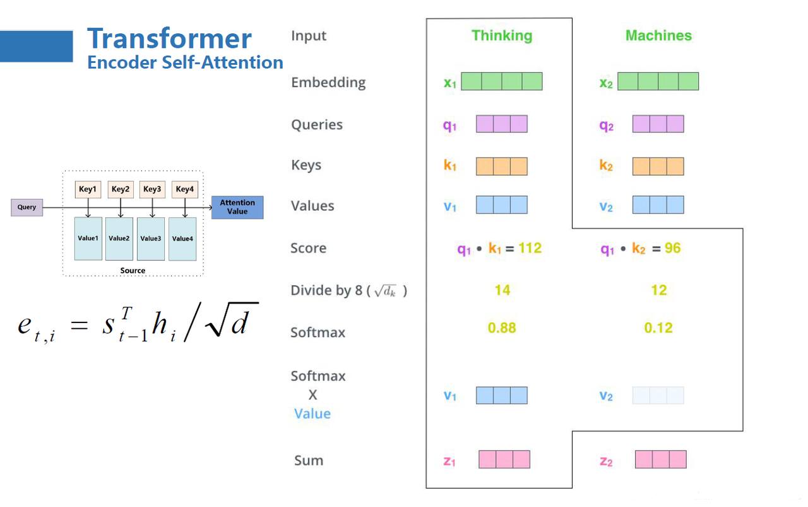

# Transformer 解读

<p>
<font size=3><b>[Transformer] Attention Is All You Need</b></font>
<br>
<font size=2>Ashish Vaswani，Noam Shazeer，Niki Parmar，Jakob Uszkoreit，Llion Jones，Aidan N. Gomez，Łukasz Kaiser，Illia Polosukhin.</font>
<br>
<font size=2>NIPS 2017.</font>
<a href='https://arxiv.org/pdf/1706.03762.pdf'>[paper]</a> <a href='https://github.com/tensorflow/tensor2tensor'>[tensorflow]</a> <a href='https://github.com/harvardnlp/annotated-transformer'>[pytorch]</a> 
<br>
<font size=3>解读者：邹雨衡，对外经济贸易大学本科生，牛志康，西安电子科技大学本科生</font>
<br>
</p>

## 前言

​Attention （注意力）机制及其变体已经成为自然语言处理任务的一种基本网络架构，甚至在一定程度上取代了 RNN （循环神经网络）的主流地位，2018年取得了自然语言处理多项任务效果大幅提升的 BERT 模型便是基于 attention 机制搭建。但自2014年 attention 机制被提出至2017年，虽然被广泛应用到深度学习的各领域中，attention 机制更多的是作为 CNN（卷积神经网络）、RNN 的组件存在，自然语言处理的各种任务仍然是以 RNN 及其变体如 LSTM（长短期记忆递归神经网络）为主。

​但是 RNN、LSTM 虽然在处理自然语言处理的序列建模任务中得天独厚，却也有着难以忽视的缺陷：

​1. RNN 为单向依序计算，序列需要依次输入、串行计算，限制了计算机的并行计算能力，导致时间成本过高。

​2. RNN 难以捕捉长期依赖问题，即对于极长序列，RNN 难以捕捉远距离输入之间的关系。虽然 LSTM 通过门机制对此进行了一定优化，但 RNN 对长期依赖问题的捕捉能力依旧是不如人意的。

​针对上述两个问题，2017年，Vaswani 等人发表了论文《Attention Is All You Need》，抛弃了传统的 CNN、RNN 架构，提出了一种全新的完全基于 attention 机制的模型——Transformer，解决了上述问题，在较小的时间成本下取得了多个任务的 the-state-of-art 效果，并为自然语言处理任务提供了新的思路。自此，attention 机制进入自然语言处理任务的主流架构，众多性能卓越的预训练模型都基于 Transformer 架构提出，例如 BERT、OpenAI GPT 等。

​本文将从模型原理及代码实现上讲解该模型，并着重介绍代码实现。需要注意的是，由于 Transformer 源代码使用 TensorFlow 搭建，此处选择了哈佛大学 harvardnlp 团队基于 Pytorch 框架开发的 [Annotated Transformer](https://github.com/harvardnlp/annotated-transformer) 代码进行讲解，以帮助大家了解 Transformer 的实现细节。

## 整体架构

​	Transformer 是针对自然语言处理的 Seq2Seq（序列到序列）任务开发的，整体上沿用了 Seq2Seq 模型的 Encoder-Decoder（编码器-解码器）结构，整体架构如下：

<div align=center></div>

​	Transformer 由一个 Encoder，一个 Decoder 外加一个 Softmax 分类器与两层编码层构成。上图中左侧方框为 Encoder，右侧方框为 Decoder。

​	由于是一个 Seq2Seq 任务，在训练时，Transformer 的训练语料为若干个句对，具体子任务可以是机器翻译、阅读理解、机器对话等。在原论文中是训练了一个英语与德语的机器翻译任务。在训练时，句对会被划分为输入语料和输出语料，输入语料将从左侧通过编码层进入 Encoder，输出语料将从右侧通过编码层进入 Decoder。Encoder 的主要任务是对输入语料进行编码再输出给 Decoder，Decoder 再根据输出语料的历史信息与 Encoder 的输出进行计算，输出结果再经过一个线性层和 Softmax 分类器即可输出预测的结果概率，整体逻辑如下图：

<div align=center></div>

​	模型整体实现为一个 Encoder-Decoder架构：

```python
class EncoderDecoder(nn.Module):
    """
    A standard Encoder-Decoder architecture. Base for this and many
    other models.
    """

    def __init__(self, encoder, decoder, src_embed, tgt_embed, generator):
        super(EncoderDecoder, self).__init__()
        self.encoder = encoder
        # 编码器
        self.decoder = decoder
        # 解码器
        self.src_embed = src_embed
        # 输入语料的编码函数
        self.tgt_embed = tgt_embed
        # 输出语料的编码函数
        self.generator = generator
        # 线性层+softmax分类层，输出分类概率，即架构图中的最高层

    def forward(self, src, tgt, src_mask, tgt_mask):
        # 前向计算函数
        "Take in and process masked src and target sequences."
        return self.decode(self.encode(src, src_mask), src_mask, tgt, tgt_mask)

    def encode(self, src, src_mask):
        # src 为输入语料
        # src_mask 为输入语料的遮蔽符号
        return self.encoder(self.src_embed(src), src_mask)
        # 先编码输入语料，再和遮蔽符号一起传入编码器中

    def decode(self, memory, src_mask, tgt, tgt_mask):
        return self.decoder(self.tgt_embed(tgt), memory, src_mask, tgt_mask)
        # 解码函数类似编码函数,memory为记忆，其实就是编码器的输出
```

​	在该代码中实现的前向计算函数即先通过 Encoder 编码，再输出给 Decoder 解码。最终的线性分类并未在该类中实现。

​	接下来将逐个介绍 Transformer 的实现细节和原理。

## Attention

​Attention 机制是 Transformer 的核心之一，要详细介绍Attention 机制的思想与操作需要较多的篇幅与笔墨，此处我们仅简要概述 attention 机制的思想和大致计算方法，更多细节请大家具体查阅相关资料，例如：[Understanding Attention In Deep Learning (NLP)](https://towardsdatascience.com/attaining-attention-in-deep-learning-a712f93bdb1e)、[Attention? Attention!](https://lilianweng.github.io/posts/2018-06-24-attention/)等。在下文中，我们将从何为Attention、self-attention 和 Multi-Head attention 三个方面逐步介绍 Transformer 中使用的Attention 机制。

### 何为 Attention

​Attention 机制最先源于计算机视觉领域，其核心思想为当我们关注一张图片，我们往往无需看清楚全部内容而仅将注意力集中在重点部分即可。而在自然语言处理领域，我们往往也可以通过将重点注意力集中在一个或几个 token，从而取得更高效高质的计算效果。

​Attention 机制的特点是通过计算 **Query** (查询值)与**Key**(键值)的相关性为真值加权求和，从而拟合序列中每个词同其他词的相关关系。其大致计算过程为：

<div align=center></div>

1. 通过输入与参数矩阵，得到查询值$q$，键值$k$，真值$v$。可以理解为，$q$ 是计算注意力的另一个句子（或词组），$v$ 为待计算句子，$k$ 为待计算句子中每个词（即 $v$ 的每个词）的对应键。其中，$v$ 与 $k$ 的矩阵维度是相同的，$q$的矩阵维度则可以不同，只需要满足 $q$ 能和$k^T$满足矩阵相乘的条件即可。
2. 对 $q$ 的每个元素 $q_i$ ,对 $q_i$ 与 $k$ 做点积并进行 softmax，得到一组向量，该向量揭示了 $q_i$ 对整个句子每一个位置的注意力大小。
3. 以上一步输出向量作为权重，对 $v$ 进行加权求和，将 $q$ 的所有元素得到的加权求和结果拼接得到最后输出。

​其中，q，k，v 分别是由输入与三个参数矩阵做积得到的：

<div align=center></div>

​在实际训练过程中，为提高并行计算速度，直接使用 $q$、$k$、$v$ 拼接而成的矩阵进行一次计算即可。

​具体到 Transformer 模型中，计算公式如下：
$$
Attention(Q,K,V) = softmax(\frac{QK^T}{\sqrt{d_k}})V
$$
​其中，$d_k$ 为键向量$k$的维度，除以根号$d_k$主要作用是在训练过程中获得一个稳定的梯度。计算示例如下图：

<div align=center></div>

​	Attention 机制的基本实现代码如下：

```python
def attention(query, key, value, mask=None, dropout=None):
    "Compute 'Scaled Dot Product Attention'"
    d_k = query.size(-1) # 获取键向量的维度，键向量的维度和值向量的维度相同，即经过注意力计算的输出维度
    scores = torch.matmul(query, key.transpose(-2, -1)) / math.sqrt(d_k)
    # 计算Q与K的内积并除以根号dk
    # transpose 即对 K 进行了转置，使用-2和-1是因为在后续多头注意力计算中输入向量会达到四维，计算后两个维度即可
    if mask is not None:
        scores = scores.masked_fill(mask == 0, -1e9)
        # masker_fill为遮蔽，即基于一个布尔值的参数矩阵对矩阵进行遮蔽
        # 此处同上面的subsequent_mask函数结合，此处的mask即为该函数的输出
    p_attn = scores.softmax(dim=-1)
    if dropout is not None:
        p_attn = dropout(p_attn)
        # 采样
    # 注意最后计算加权值是不需要转置的，上述计算返回的维度为 length*length，值参数为length*dk，直接内积即可
    return torch.matmul(p_attn, value), p_attn
    # 根据计算结果对value进行加权求和
```

### Self-Attention

​从上对 Attention 机制原理的叙述中我们可以发现，Attention 机制的本质是对两段序列的元素依次进行相似度计算，寻找出一个序列的每个元素对另一个序列的每个元素的相关度，然后基于相关度进行加权，即分配注意力。而这两段序列即是我们计算过程中 $Q$、$K$、$V$ 的来源。

​在经典的 Attention 机制中，$Q$ 往往来自于一个序列，$K$ 与 $V$ 来自于另一个序列，都通过参数矩阵计算得到，从而可以拟合这两个序列之间的关系。例如在 Transformer 的 Decoder 结构中，$Q$ 来自于 Encoder 的输出，$K$ 与 $V$ 来自于 Decoder 的输入，从而拟合了编码信息与历史信息之间的关系，便于综合这两种信息实现未来的预测。

​但在 Transformer 的 Encoder 结构中，使用的是 Attention 机制的变种—— self-attention （自注意力）机制。所谓自注意力，即是计算本身序列中每个元素都其他元素的注意力分布，即在计算过程中，$Q$、$K$、$V$ 都由同一个输入通过不同的参数矩阵计算得到。在 Encoder 中，$Q$、$K$、$V$ 分别是输入对参数矩阵 $W_q$、$W_k$、$W_v$ 做积得到，从而拟合输入语句中每一个 token 对其他所有 token 的关系。

​例如，通过 Encoder 中的 self-attention 层，可以拟合下面语句中 it 对其他 token 的注意力分布如图：

<div align=center></div>

​在代码中的实现，self-attention 机制其实是通过给 $Q$、$K$、$V$ 的输入传入同一个参数实现的：

```python
x = self.sublayer[0](x, lambda x: self.self_attn(x, x, x, mask))
# 传入自注意力层作为sublayer,输出自注意力层计算并进行残差连接后的结果
```

​上述代码是 Encoder 层的部分实现，self_attn 即是注意力层，传入的三个参数都是 $x$，分别是 $Q$、$K$、$V$ 的计算输入，从而 $Q$、$K$、$$ 均来源于同一个输入，则实现了自注意力的拟合。

### Multi-Head Attention

​Attention 机制可以实现并行化与长期依赖关系拟合，但一次注意力计算只能拟合一种相关关系，单一的 Attention 机制很难全面拟合语句序列里的相关关系。因此 Transformer 使用了 Multi-Head attention 机制，即同时对一个语料进行多次注意力计算，每次注意力计算都能拟合不同的关系，将最后的多次结果拼接起来作为最后的输出，即可更全面深入地拟合语言信息。

<div align=center></div>

​	在原论文中，作者也通过实验证实，多头注意力计算中，每个不同的注意力头能够拟合语句中的不同信息，如下图：

<div align=center>	</div>

​上层与下层分别是两个注意力头对同一段语句序列进行自注意力计算的结果，可以看到，对于不同的注意力头，能够拟合不同层次的相关信息。通过多个注意力头同时计算，能够更全面地拟合语句关系。

​Multi-Head attention 的整体计算流程如下：

<div align=center></div>

所谓的多头注意力机制其实就是将原始的输入序列进行多组的自注意力处理；然后再将每一组得到的自注意力结果拼接起来，再通过一个线性层进行处理，得到最终的输出。我们用公式可以表示为：
$$
\mathrm{MultiHead}(Q, K, V) = \mathrm{Concat}(\mathrm{head_1}, ...,
\mathrm{head_h})W^O    \\
    \text{where}~\mathrm{head_i} = \mathrm{Attention}(QW^Q_i, KW^K_i, VW^V_i)
$$

其最直观的代码实现并不复杂，即 n 个头就有 n 组3个参数矩阵，每一组进行同样的注意力计算，但由于是不同的参数矩阵从而通过反向传播实现了不同的注意力结果，然后将 n 个结果拼接起来输出即可。

但上述实现复杂度较高，我们可以通过矩阵运算巧妙地实现并行的多头计算，整体计算流程如下（注：由于此处使用了矩阵运算来实现多头并行，内部逻辑相对复杂，读者可以酌情阅读）：

```python
class MultiHeadedAttention(nn.Module):
    # 多头注意力操作
    def __init__(self, h, d_model, dropout=0.1):
        "Take in model size and number of heads."
        super(MultiHeadedAttention, self).__init__()
        assert d_model % h == 0
        # 这里的 d_model 即为该层最后输出结果的维度，由于最后输出结果是 n 个头的输出结果拼接起来的，因此该维度应当能够整除头数
        # 断言，控制h总是整除于d_model，如果输入参数不满足将报错
        # 这里假设 d_v = d_k，其实是为了方便最后线性层的处理，如果不使用这个假设，把最后一个全连接层抽出来单独初始化即可
        self.d_k = d_model // h
        # 每个头要输出的维度
        self.h = h
        # 头数
        self.linears = clones(nn.Linear(d_model, d_model), 4)
        # 注意，这里初始化了4个线性层，前三个分别是三个参数矩阵每个头拼接起来的结果，最后一个是全连接层，这样操作的前提是上述假设
        # 这里通过三个组合矩阵来代替了n个参数矩阵的组合，其逻辑在于矩阵内积再拼接其实等同于拼接矩阵再内积，不理解的读者可以自行模拟一下，每一个线性层其实相当于n个参数矩阵的拼接
        self.attn = None
        self.dropout = nn.Dropout(p=dropout)

    def forward(self, query, key, value, mask=None):
        "Implements Figure 2"
        if mask is not None:
            # Same mask applied to all h heads.
            mask = mask.unsqueeze(1)
        # 批次大小
        nbatches = query.size(0)

        # 1) 每一个输入通过线性层即参数矩阵得到映射后的结果
        # 这里输入经过线性层之后维度为 nbatches*length*d_model，因为要进入注意力计算，需要把不同头的输入拆开，即将输出展开为 nbatches*length*n_head*d_k，然后将length和n_head维度互换，因为在注意力计算中我们是取了后两个维度参与计算
        query, key, value = [
            lin(x).view(nbatches, -1, self.h, self.d_k).transpose(1, 2)
            for lin, x in zip(self.linears, (query, key, value))
        ]
        # 为什么要先按n_batches*-1*n_head*d_k展开再互换1、2维度而不是直接按注意力输入展开，是因为view的展开方式是直接把输入全部排开，然后按要求构造，可以发现只有上述操作能够实现我们将每个头对应部分取出来的目标

        # 2) 进行注意力计算
        x, self.attn = attention(
            query, key, value, mask=mask, dropout=self.dropout
        )
        # x 为加权求和结果，attn为计算的注意力分数

        # 3) 将注意力计算结果拼接，然后通过最后的全连接层
        # 注意力输出维度为n_batches*n_head*length*d_k，我们需要的输入为n_batches*length*d_model，所以直接针对上述转换操作逆操作即可
        x = (
            x.transpose(1, 2)
            .contiguous()
            .view(nbatches, -1, self.h * self.d_k)
        )
        # contiguous 函数用于重新开辟一块新内存存储，因为Pytorch设置先transpose再view会报错，因为view直接基于底层存储得到，然而transpose并不会改变底层存储，因此需要额外存储

        del query
        del key
        del value
        # 最后经过全连接层即可
        return self.linears[-1](x)
```

​在 Pytorch 中，其实提供了 Multi-Head Attention 机制的 API，可以通过下列代码直接构造并使用一个多头注意力层：

```python
multihead_attn = nn.MultiheadAttention(embed_dim , num_heads)
# 构造一个多头注意力层
# embed_dim :输出词向量长度；num_heads :头数
# 可选参数：
# drop_out: 在采样层中drop_out的概率，默认为0；bias：线性层是否计算偏置
# add_bias_kv：是否将偏置添加到 K 和 V 中；add_zero_attn：是否为 K 和 V 再添加一串为0的序列
# kdim：K 的总共feature数；vdim：V 的总共feature数；batch_first：是否将输入调整为(batch,seq,feature)
attn_output, attn_output_weights = multihead_attn(query, key, value)
# 前向计算
# 输出：
# attn_output：形如(N,L,E)的计算结果，N为批次大小，L为目标序列长度，E为embed_dim
# attn_output_weights：注意力计算分数，仅当need_weights=True时返回
# query、key、value 分别是注意力计算的三个输入矩阵
```

## Encoder 

<div align=center></div>

​如图所示，Encoder 由 N 个（论文中取 N = 6）EncoderLayer 组成，每个 EncoderLayer 又由两个 sublayer （子层）组成。在下文的代码中，每一个 layer 是一个 EncoderLayer，代码在最后又额外加入了一个标准化层进行标准化操作：

```python
class Encoder(nn.Module):
    "Core encoder is a stack of N layers"
    # 编码器其实是由N层自注意力层+标准化层构成的

    def __init__(self, layer, N):
        super(Encoder, self).__init__()
        self.layers = clones(layer, N)
        # clones 函数为作者定义的，实现将 layer 层复制 N 次的功能
        self.norm = LayerNorm(layer.size)
        # 标准化层，参数为特征数

    def forward(self, x, mask):
        "Pass the input (and mask) through each layer in turn."
        for layer in self.layers:
            x = layer(x, mask)
        return self.norm(x)
```

​1. 第一部分为一个多头自注意力层。Transformer 的最大特点即是抛弃了传统的 CNN、RNN 架构，完全使用 attention 机制搭建。在 EncoderLayer 中，使用了 Multi-Head self-attention（多头自注意力）层，编码输入语料的相关关系。通过 attention 机制，实现了模型的并行化与长期依赖关系的拟合。关于 Multi-Head self-attention 将在之后的板块详述其特点与实现。在通过一个多头自注意力层后，输出经过标准化层进入下一个 sublayer。

```python
class EncoderLayer(nn.Module):
    "Encoder is made up of self-attn and feed forward (defined below)"

    def __init__(self, size, self_attn, feed_forward, dropout):
        super(EncoderLayer, self).__init__()
        self.self_attn = self_attn
        # 自注意力层
        self.feed_forward = feed_forward
        # 前馈神经网络层
        self.sublayer = clones(SublayerConnection(size, dropout), 2)
        # 残差连接层，将在之后定义
        # 两层分别用于连接自注意力层和前馈神经网络层
        self.size = size

    def forward(self, x, mask):
        "Follow Figure 1 (left) for connections."
        x = self.sublayer[0](x, lambda x: self.self_attn(x, x, x, mask))
        # 传入自注意力层作为sublayer,输出自注意力层计算并进行残差连接后的结果
        return self.sublayer[1](x, self.feed_forward)
```

​2. 第二部分为一个全连接神经网络，论文中称为“position-wise fully connected feed-forward network”，实际是一个线性层+激活函数+ dropout + 线性层的全连接网络。

```python
class PositionwiseFeedForward(nn.Module):
    # 即架构图中的FeedForward

    def __init__(self, d_model, d_ff, dropout=0.1):
        super(PositionwiseFeedForward, self).__init__()
        self.w_1 = nn.Linear(d_model, d_ff)
        self.w_2 = nn.Linear(d_ff, d_model)
        self.dropout = nn.Dropout(dropout)

    def forward(self, x):
        return self.w_2(self.dropout(self.w_1(x).relu()))
        # 实则是一个线性层+激活函数+采样+一个线性层
```

## Decoder

<div align=center></div>

​Decoder 与 Encoder 的组成非常类似，同样是由N个DecoderLayer组成，DecoderLayer 与 EncoderLayer 的区别在于：

​1. EncoderLayer由两个sublayer组成，分别是一个多头自注意力层与一个全连接网络层。DecoderLayer 则在 EncoderLayer 的两个 sublayer 的基础上增加了一个带掩码的多头注意力层。如图，最下方的多头自注意力层同 EncoderLayer结构相同，中间则是增加的一个多头注意力层，将使用 Encoder 的输出和下方多头自注意力层的输出作为输入进行注意力计算。最上方的全连接网络也同 EncoderLayer 相同。

​2. EncoderLayer 的输入仅来自于编码之后的输入语料（或上一个 EncoderLayer 的输出），DecoderLayer 的输入除来自于编码之后的输出语料外，还包括 Encoder 的输出。

​DecoderLayer 的实现如下代码：

```python
class DecoderLayer(nn.Module):
    "Decoder is made of self-attn, src-attn, and feed forward (defined below)"

    def __init__(self, size, self_attn, src_attn, feed_forward, dropout):
        super(DecoderLayer, self).__init__()
        self.size = size
        self.self_attn = self_attn
        self.src_attn = src_attn
        # 语料注意力，即图中Decoder的第二个注意力网络，拟合编码器输出和上一个子层输出的注意力
        self.feed_forward = feed_forward
        self.sublayer = clones(SublayerConnection(size, dropout), 3)
        # 因为解码器有三个子层，所以需要三个残差连接层

    def forward(self, x, memory, src_mask, tgt_mask):
        "Follow Figure 1 (right) for connections."
        m = memory
        x = self.sublayer[0](x, lambda x: self.self_attn(x, x, x, tgt_mask))
        x = self.sublayer[1](x, lambda x: self.src_attn(x, m, m, src_mask))
        # 由此可见解码器中两个注意力子层的区别
        # 第一个注意力子层同编码器中相同，是自注意力层，传入的三个参数均通过输入语料x得到
        # 第二个注意力子层为注意力层，传入的三个参数分别由输入语料x与记忆（即编码器输出）m得到
        return self.sublayer[2](x, self.feed_forward)
```

​	注意此处为了计算输出语料与输入语料的注意力，在前向计算时，第二个注意力子层将传入 memory，也就是 Encoder 的输出。Decoder 的整体实现同 Encoder 类似，此处就不再赘述。

## 残差连接

​为了避免模型退化，Transformer 采用了残差连接的思想来连接每一个子层。残差连接，即下一层的输入不仅是上一层的输出，还包括上一层的输入。残差连接允许最底层信息直接传到最高层，让高层专注于残差的学习。

​例如，在 Encoder 中，在第一个子层，输入进入多头自注意力层的同时会直接传递到该层的输出，然后该层的输出会与原输入相加，再进行标准化。在第二个子层也是一样。即：
$$
\rm output = LayerNorm(x + Sublayer(x))
$$
​LayerNorm 为该层的标准化操作，Sublayer 为该子层的操作（多头注意力计算或全连接计算）。源码通过构造一个 SublayerConnection 类来实现残差连接：

```python
class SublayerConnection(nn.Module):
    """
    A residual connection followed by a layer norm.
    Note for code simplicity the norm is first as opposed to last.
    """

    def __init__(self, size, dropout):
        super(SublayerConnection, self).__init__()
        self.norm = LayerNorm(size)
        self.dropout = nn.Dropout(dropout)
        # 采样层

    def forward(self, x, sublayer):
        "Apply residual connection to any sublayer with the same size."
        return x + self.dropout(sublayer(self.norm(x)))
        # 残差连接，在该层实现了norm和add
```

​回到 EncoderLayer 的定义，我们可以看到作者在该层实现了两个 SublayerConnection 对象，分别实现自注意力层到全连接层、全连接层到输出的残差连接：

```python
class EncoderLayer(nn.Module):
    "Encoder is made up of self-attn and feed forward (defined below)"

    def __init__(self, size, self_attn, feed_forward, dropout):
        super(EncoderLayer, self).__init__()
        self.self_attn = self_attn
        self.feed_forward = feed_forward
        self.sublayer = clones(SublayerConnection(size, dropout), 2)
        # 残差连接层
        # 两层分别用于连接自注意力层和前馈神经网络层
        self.size = size

    def forward(self, x, mask):
        "Follow Figure 1 (left) for connections."
        x = self.sublayer[0](x, lambda x: self.self_attn(x, x, x, mask))
        # 传入自注意力层作为sublayer,输出自注意力层计算并进行残差连接后的结果
        return self.sublayer[1](x, self.feed_forward)
```

​DecoderLayer 中也同样实现了该对象，不过由于有三个 sublayer，所以实现了三个 SublayerConnection 对象。

## Mask

​Transformer 是一个自回归模型，类似于语言模型，其将利用历史信息依序对输出进行预测。例如，如果语料的句对为：1. \<BOS> 我爱你 \<EOS>；2. \<BOS> I like you \<EOS>。则 Encoder 获取的输入将会是句 1 整体，并输出句 1 的编码信息，但 Decoder 的输入并不一开始就是句 2 整体，而是先输入起始符\<BOS>，Decoder 根据\<BOS> 与 Encoder 的输出预测 I，再输入\<BOS> I，Decoder 根据输入和 Encoder 的输出预测 like。因此，自回归模型需要对输入进行 mask（遮蔽），以保证模型不会使用未来信息预测当下。

​关于自回归模型与自编码模型的细节，感兴趣的读者可以下来查阅更多资料，在此提供部分链接供读者参考。博客：[自回归语言模型 VS 自编码语言模型](https://zhuanlan.zhihu.com/p/163455527)、[预训练语言模型整理](https://www.cnblogs.com/sandwichnlp/p/11947627.html#预训练任务简介)；论文：[基于语言模型的预训练技术研究综述](http://jcip.cipsc.org.cn/CN/abstract/abstract3187.shtml)等。

​因此，在 Transformer 中，我们需要建立一个 mask 函数，可以根据当下预测的时间阶段对输入语料进行 mask，被 mask 的信息就不会被模型得知，从而保证了模型只使用历史信息进行预测。mask 的实现方法如下：

```python
def subsequent_mask(size):
    "Mask out subsequent positions."
    attn_shape = (1, size, size)
    # 注意力语料的形状
    subsequent_mask = torch.triu(torch.ones(attn_shape), diagonal=1).type(
        torch.uint8
    )
    # triu返回一个上三角矩阵，diagonal=1控制不保留主对角线
    '''
    一个例子：
    a = [[1,2,3],
         [4,5,6],
         [7,8,9]
    ]
    triu(a, diagonal=1)返回：
    [[0,2,3],
     [0,0,6],
     [0,0,0]]
     可见通过生成这样一个上三角矩阵，再取其中为0的位置，可以实现我们所需的未来信息遮蔽
    '''
    return subsequent_mask == 0
```

## 位置编码

​Attention 机制可以实现良好的并行计算，但同时，其注意力计算的方式也导致序列中相对位置的丢失。在 RNN、LSTM 中，输入序列会沿着语句本身的顺序被依次递归处理，因此输入序列的顺序提供了极其重要的信息，这也和自然语言的本身特性非常吻合。但从上文对 Attention 机制的分析我们可以发现，在 Attention 机制的计算过程中，对于序列中的每一个 token，其他各个位置对其来说都是平等的，即“我喜欢你”和“你喜欢我”在 Attention 机制看来是完全相同的，但无疑这是 Attention 机制存在的一个巨大问题。因此，为使用序列顺序信息，保留序列中的相对位置信息，Transformer 采用了位置编码机制，该机制也在之后被多种模型沿用。

​位置编码，即根据序列中 token 的相对位置对其进行编码，再将位置编码加入词向量编码中。位置编码的方式有很多，Transformer 使用了正余弦函数来进行位置编码，其编码方式为：
$$
PE(pos, 2i) = sin(pos/10000^{2i/d_{model}})\\
PE(pos, 2i+1) = cos(pos/10000^{2i/d_{model}})
$$
​上式中，pos 为 token 在句子中的位置，2i 和 2i+1 则是指示了 token 是奇数位置还是偶数位置，从上式中我们可以看出对于奇数位置的 token 和偶数位置的 token，Transformer 采用了不同的函数进行编码。我们以一个简单的例子来说明位置编码的计算过程：假如我们输入的是一个长度为 4 的句子"I like to code"，我们可以得到下面的词向量矩阵$\rm x$，其中每一行代表的就是一个词向量，$\rm x_0=[0.1,0.2,0.3,0.4]$对应的就是“I”的词向量，它的pos就是为0，以此类推，第二行代表的是“like”的词向量，它的pos就是1：
$$
\rm x = \begin{bmatrix} 0.1 & 0.2 & 0.3 & 0.4 \\ 0.2 & 0.3 & 0.4 & 0.5 \\ 0.3 & 0.4 & 0.5 & 0.6 \\ 0.4 & 0.5 & 0.6 & 0.7 \end{bmatrix}
$$
​则经过位置编码后的词向量为：
$$
\rm x_{PE} = \begin{bmatrix} 0.1 & 0.2 & 0.3 & 0.4 \\ 0.2 & 0.3 & 0.4 & 0.5 \\ 0.3 & 0.4 & 0.5 & 0.6 \\ 0.4 & 0.5 & 0.6 & 0.7 \end{bmatrix} + \begin{bmatrix} \sin(\frac{0}{10000^0}) & \cos(\frac{0}{10000^0}) & \sin(\frac{0}{10000^{2/4}}) & \cos(\frac{0}{10000^{2/4}}) \\ \sin(\frac{1}{10000^0}) & \cos(\frac{1}{10000^0}) & \sin(\frac{1}{10000^{2/4}}) & \cos(\frac{1}{10000^{2/4}}) \\ \sin(\frac{2}{10000^0}) & \cos(\frac{2}{10000^0}) & \sin(\frac{2}{10000^{2/4}}) & \cos(\frac{2}{10000^{2/4}}) \\ \sin(\frac{3}{10000^0}) & \cos(\frac{3}{10000^0}) & \sin(\frac{3}{10000^{2/4}}) & \cos(\frac{3}{10000^{2/4}}) \end{bmatrix} = \begin{bmatrix} 0.1 & 1.2 & 0.3 & 1.4 \\ 1.041 & 0.84 & 0.41 & 1.49 \\ 1.209 & -0.016 & 0.52 & 1.59 \\ 0.541 & -0.489 & 0.895 & 1.655 \end{bmatrix}
$$
我们可以使用如下的代码来获取上述例子的位置编码：
```python
import numpy as np
import matplotlib.pyplot as plt
def PositionEncoding(seq_len, d_model, n=10000):
    P = np.zeros((seq_len, d_model))
    for k in range(seq_len):
        for i in np.arange(int(d_model/2)):
            denominator = np.power(n, 2*i/d_model)
            P[k, 2*i] = np.sin(k/denominator)
            P[k, 2*i+1] = np.cos(k/denominator)
    return P

P = PositionEncoding(seq_len=4, d_model=4, n=100)
print(P)
```
```python
[[ 0.          1.          0.          1.        ]
 [ 0.84147098  0.54030231  0.09983342  0.99500417]
 [ 0.90929743 -0.41614684  0.19866933  0.98006658]
 [ 0.14112001 -0.9899925   0.29552021  0.95533649]]
```
这样的位置编码主要有两个好处：

1. 使 PE 能够适应比训练集里面所有句子更长的句子，假设训练集里面最长的句子是有 20 个单词，突然来了一个长度为 21 的句子，则使用公式计算的方法可以计算出第 21 位的 Embedding。
2. 可以让模型容易地计算出相对位置，对于固定长度的间距 k，PE(pos+k) 可以用 PE(pos) 计算得到。因为 Sin(A+B) = Sin(A)Cos(B) + Cos(A)Sin(B), Cos(A+B) = Cos(A)Cos(B) - Sin(A)Sin(B)。

​关于位置编码，有许多学者从数学的角度证明了该编码方式相对于其他更简单、直观的编码方式的优越性与必要性，由于本文重点在于代码的解析，此处不再赘述，感兴趣的读者可以查阅相关资料，如博客：[Transformer Architecture: The Positional Encoding](https://kazemnejad.com/blog/transformer_architecture_positional_encoding/)、[A Gentle Introduction to Positional Encoding in Transformer Models](https://machinelearningmastery.com/a-gentle-introduction-to-positional-encoding-in-transformer-models-part-1/) 等。

​编码结果示例如下：

<div align=center></div>

​位置编码的实现如下：

```python
class PositionalEncoding(nn.Module):

    def __init__(self, d_model, dropout, max_len=5000):
        super(PositionalEncoding, self).__init__()
        self.dropout = nn.Dropout(p=dropout)

        # Compute the positional encodings once in log space.
        pe = torch.zeros(max_len, d_model)
        # 位置矩阵，初始化为0
        position = torch.arange(0, max_len).unsqueeze(1)
        # 公式中的POS
        div_term = torch.exp(
            torch.arange(0, d_model, 2) * -(math.log(10000.0) / d_model)
        )
        # 此处对公式中的指数计算取了个对数
        pe[:, 0::2] = torch.sin(position * div_term)
        pe[:, 1::2] = torch.cos(position * div_term)
        # 基于公式计算位置编码
        pe = pe.unsqueeze(0)
        self.register_buffer("pe", pe)
        # 定义一组训练中不会改变的参数pe

    def forward(self, x):
        x = x + self.pe[:, : x.size(1)].requires_grad_(False)
        # 向词向量中加入位置编码
        return self.dropout(x)
```

## 最终建模

​在完成上述实现后，再将其各个组件组合起来即可，此处使用一个函数建立完整模型：

```python
def make_model(
    src_vocab, tgt_vocab, N=6, d_model=512, d_ff=2048, h=8, dropout=0.1
):
    "Helper: Construct a model from hyperparameters."
    c = copy.deepcopy
    attn = MultiHeadedAttention(h, d_model)
    # 多头注意力层
    ff = PositionwiseFeedForward(d_model, d_ff, dropout)
    # 前馈神经网络层
    position = PositionalEncoding(d_model, dropout)
    # 位置编码层
    model = EncoderDecoder(
        Encoder(EncoderLayer(d_model, c(attn), c(ff), dropout), N),
        # 编码器
        Decoder(DecoderLayer(d_model, c(attn), c(attn), c(ff), dropout), N),
        # 解码器，第一个attn为自注意力层，第二个attn为加入编码器输出的注意力层
        nn.Sequential(Embeddings(d_model, src_vocab), c(position)),
        # 输入语料编码层
        nn.Sequential(Embeddings(d_model, tgt_vocab), c(position)),
        # 输出语料编码层
        Generator(d_model, tgt_vocab),
        # 分类层
    )

    # This was important from their code.
    # Initialize parameters with Glorot / fan_avg.
    for p in model.parameters():
        if p.dim() > 1:
            nn.init.xavier_uniform_(p)
            # 初始化参数
    return model
```

## 训练

​基于 Pytorch 实现的 Transformer 的训练大致沿用了 Pytorch 的框架，整体流程同使用 Pytorch 建立深度学习模型的流程大致相同，只不过实现了一些更底层的细节自定义。

### Traning Loop

​作者并没有直接使用 Pytorch 提供的训练函数，而是自定义了一个用于记录训练过程的类：

```python
class TrainState:
    """Track number of steps, examples, and tokens processed"""

    step: int = 0  # Steps in the current epoch
    accum_step: int = 0  # Number of gradient accumulation steps
    samples: int = 0  # total # of examples used
    tokens: int = 0  # total # of tokens processed
```

​	接着，基于该类的实现定义了运行函数：

```python
def run_epoch(
    data_iter,# 数据集
    model,# 模型
    loss_compute,# 损失计算函数
    optimizer,# 优化器
    scheduler,# 调度器
    mode="train",# 模式，训练或测试
    accum_iter=1,# 进行优化的轮数
    train_state=TrainState(),
):
    """Train a single epoch"""
    start = time.time()
    total_tokens = 0
    total_loss = 0
    tokens = 0
    n_accum = 0
    for i, batch in enumerate(data_iter):
        out = model.forward(
            batch.src, batch.tgt, batch.src_mask, batch.tgt_mask
        )# 模型的前向计算
        loss, loss_node = loss_compute(out, batch.tgt_y, batch.ntokens)
        # 计算当下的模型损失
        # loss_node = loss_node / accum_iter
        if mode == "train" or mode == "train+log":
            loss_node.backward()
            # 返乡传播
            train_state.step += 1
            train_state.samples += batch.src.shape[0]
            train_state.tokens += batch.ntokens
            if i % accum_iter == 0:
                # 每隔 accum_iter 轮优化一次
                optimizer.step()
                optimizer.zero_grad(set_to_none=True)
                n_accum += 1
                train_state.accum_step += 1
            scheduler.step()

        total_loss += loss
        total_tokens += batch.ntokens
        tokens += batch.ntokens
        if i % 40 == 1 and (mode == "train" or mode == "train+log"):
            lr = optimizer.param_groups[0]["lr"]
            elapsed = time.time() - start
            print(
                (
                    "Epoch Step: %6d | Accumulation Step: %3d | Loss: %6.2f "
                    + "| Tokens / Sec: %7.1f | Learning Rate: %6.1e"
                )
                % (i, n_accum, loss / batch.ntokens, tokens / elapsed, lr)
            )
            start = time.time()
            tokens = 0
        del loss
        del loss_node
    return total_loss / total_tokens, train_state
```

### 优化器

​在 Transformer 中，使用了 Adam 优化器，该优化器学习率的计算基于下式：
$$
\rm learning rate=d^{-0.5}_{model} * min(step\_num^{-0.5}, step\_num * warmup\_steps^{-1.5})
$$
​为何选择该优化器，以及该优化器有什么优势，感兴趣的读者可以查阅相关资料如：[【Adam】优化算法浅析](https://zhuanlan.zhihu.com/p/90169812)来深入探究其内部数学原理，此处不再赘述。基于上式，其优化器实现如下：

```python
def rate(step, model_size, factor, warmup):
    """
    we have to default the step to 1 for LambdaLR function
    to avoid zero raising to negative power.
    """
    if step == 0:
        step = 1
    return factor * (
        model_size ** (-0.5) * min(step ** (-0.5), step * warmup ** (-1.5))
    )
```

​Pytorch 也提供了各种优化器的调用 API，也包括 Adam，在实际使用中可以直接调用。

### 正则化

​在训练过程中，作者使用了标签平滑来实现正则化，从而提高模型预测的准确率。具体的，使用了 KL 散度来计算标签平滑，此处同样不再赘述标签平滑、KL 散度的原理，感兴趣的读者可以参阅下列博客：[【正则化】Label Smoothing详解](https://blog.csdn.net/Roaddd/article/details/114761023)、[Kullback-Leibler(KL)散度介绍](https://zhuanlan.zhihu.com/p/100676922)。标签平滑的代码实现如下：

```python
class LabelSmoothing(nn.Module):
    "Implement label smoothing."

    def __init__(self, size, padding_idx, smoothing=0.0):
        super(LabelSmoothing, self).__init__()
        self.criterion = nn.KLDivLoss(reduction="sum")# 使用 KL 散度计算
        self.padding_idx = padding_idx # 遮掩部分index
        self.confidence = 1.0 - smoothing
        self.smoothing = smoothing
        self.size = size
        self.true_dist = None

    def forward(self, x, target):
        assert x.size(1) == self.size
        true_dist = x.data.clone()
        true_dist.fill_(self.smoothing / (self.size - 2))
        true_dist.scatter_(1, target.data.unsqueeze(1), self.confidence)
        true_dist[:, self.padding_idx] = 0
        mask = torch.nonzero(target.data == self.padding_idx)
        if mask.dim() > 0:
            true_dist.index_fill_(0, mask.squeeze(), 0.0)
        self.true_dist = true_dist
        return self.criterion(x, true_dist.clone().detach())
```

## 总结

### 优点

​Transformer 作为 NLP 发展史上里程碑的模型，是具有较大创新性和指导性的。其创造性地抛弃了沿用了几十年的 CNN、RNN 架构，完全使用 Attention 机制来搭建网络并取得了良好的效果，帮助 Attention 机制站上了时代的舞台。而论及模型本身，Attention 机制的使用使其能够有效捕捉长距离相关性，解决了 NLP 领域棘手的长距依赖问题，同时，抛弃了 RNN 架构使其能够充分实现并行化，提升了模型计算能力。

### 缺点

​不可否认，Transformer 也存在诸多缺陷。最明显的一点是，提出该模型的论文名为《Attention Is All You Need》，但事实上我们真的仅仅只需要 Attention 吗？粗暴的抛弃 CNN 与 RNN 虽然非常炫技，但也使模型丧失了捕捉局部特征的能力，RNN + CNN + Attention 也许能够带来更好的效果。其次，Attention 机制失去了位置信息，虽然 Transformer 使用了 Positional Encoding 来补充位置信息，但只是权宜之计，没有改变其结构上的固有缺陷。最后，Attention 机制的参数量庞大，训练的门槛与成本也有了一定提高。因此，正是在 Transformer 提出之后，如 BERT、XLNet 等基于 Transformer 结构的强大、昂贵的预训练模型也逐步登上时代的舞台。

## 参考材料：

1. [Attention Is All You Need](https://arxiv.org/abs/1706.03762)
2. https://lilianweng.github.io/posts/2018-06-24-attention/
3. https://zhuanlan.zhihu.com/p/48508221

