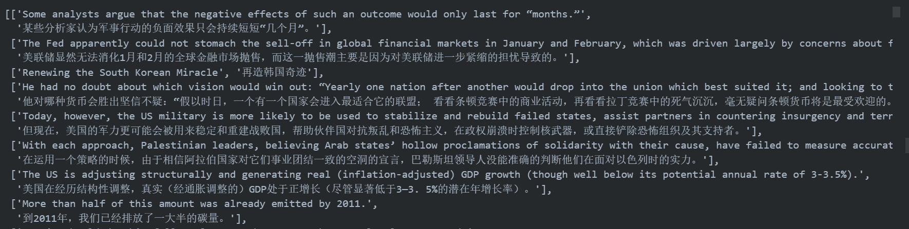
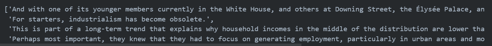
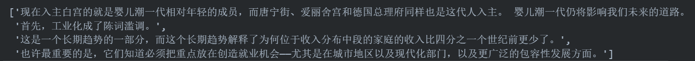
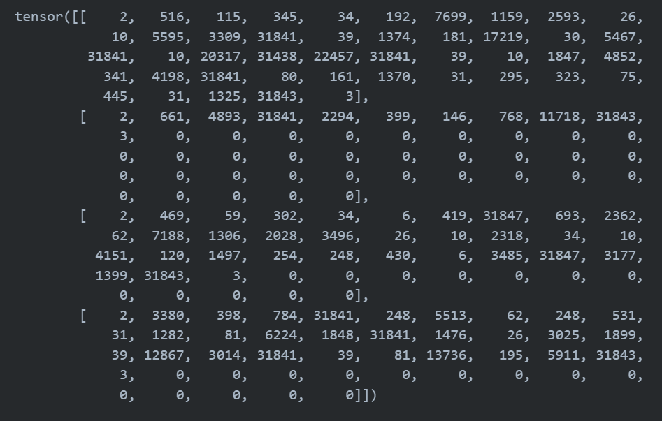
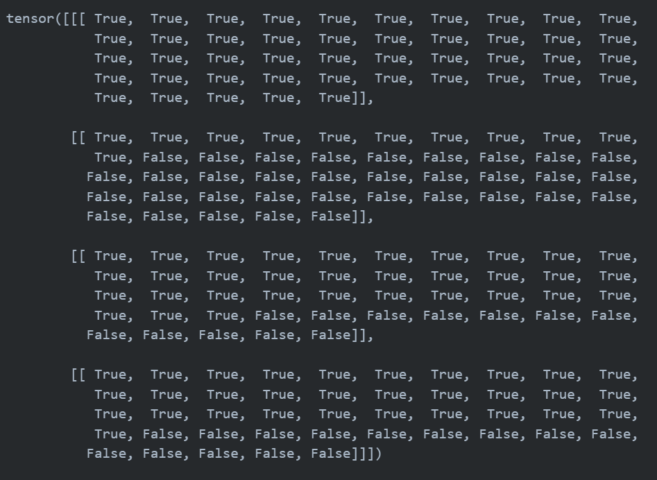
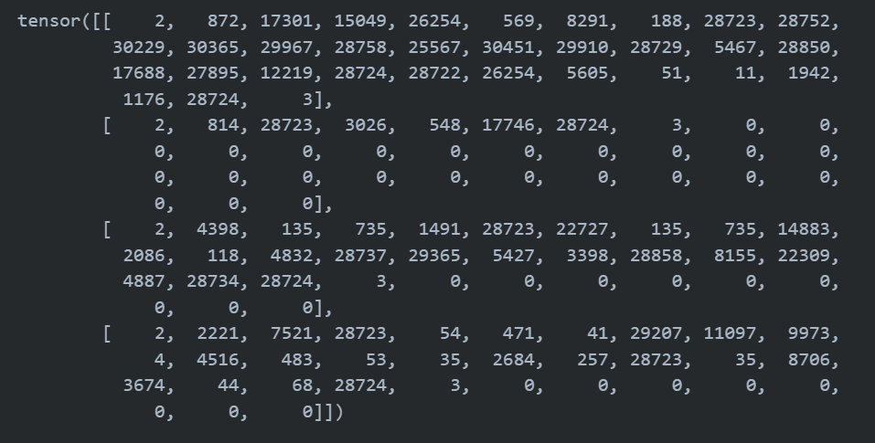
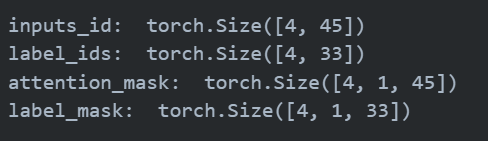

# Transformer 实战机器翻译

## 一、引言

自然语言处理与图像具有显著差异，自然语言处理任务也具有其独特性。相对于 CNN（卷积神经网络）在 CV 中的霸主地位，在很长一段时间里，RNN（循环神经网络）、LSTM（长短期记忆递归神经网络）占据了 NLP 的主流地位。作为针对序列建模的模型，RNN、LSTM 在以序列为主要呈现形式的 NLP 任务上展现出远超 CNN 的卓越性能。​但是 RNN、LSTM 虽然在处理自然语言处理的序列建模任务中得天独厚，却也有着难以忽视的缺陷：

​1. RNN 为单向依序计算，序列需要依次输入、串行计算，限制了计算机的并行计算能力，导致时间成本过高。

​2. RNN 难以捕捉长期依赖问题，即对于极长序列，RNN 难以捕捉远距离输入之间的关系。虽然 LSTM 通过门机制对此进行了一定优化，但 RNN 对长期依赖问题的捕捉能力依旧是不如人意的。

​针对上述两个问题，2017年，Vaswani 等人发表了论文《Attention Is All You Need》，抛弃了传统的 CNN、RNN 架构，提出了一种全新的完全基于 attention 机制的模型——Transformer，解决了上述问题，在较小的时间成本下取得了多个任务的 the-state-of-art 效果，并为自然语言处理任务提供了新的思路。自此，attention 机制进入自然语言处理任务的主流架构，在 Transformer 的基础上，诞生了预训练-微调范式的多种经典模型如 Bert、GPT、T5 等。当然，同样是在 Transformer 的肩膀上，引入了 RLHF 机制、实现了大量参数建模的 ChatGPT 则带领 NLP 进入了全新的大模型时代。但不管是预训练-微调范式的主流模型 Bert，还是大模型时代的主流模型 ChatGPT、LLaMA，Transformer 都是其最坚实的基座。

本文将从该论文出发，结合 Transformer 的具体代码实现，基于经典 NLP 任务——机器翻译，来深入讲解如何使用 Pytorch 搭建 Transformer 模型并解决机器翻译任务。

本文的参考论文为：[Attention Is All You Need](https://arxiv.org/pdf/1706.03762.pdf)

本文参考的代码实现仓库包括：[NanoGPT](https://github.com/karpathy/nanoGPT)、[ChineseNMT](https://github.com/hemingkx/ChineseNMT)、[transformer-translator-pytorch](https://github.com/devjwsong/transformer-translator-pytorch)

## 二、Transformer 模型架构

### 2.1 Seq2Seq 模型

Seq2Seq，即序列到序列，是一种经典 NLP 任务。具体而言，是指模型输入的是一个自然语言序列 $input = (x_1, x_2, x_3...x_n)$，输出的是一个可能不等长的自然语言序列 $output = (y_1, y_2, y_3...y_m)$。事实上，Seq2Seq 是 NLP 最经典的任务，几乎所有的 NLP 任务都可以视为 Seq2Seq 任务。例如文本分类任务，可以视为输出长度为 1 的目标序列（如在上式中 $m$ = 1）；词性标注任务，可以视为输出与输入序列等长的目标序列（如在上式中 $m$ = $n$）。

机器翻译任务即是一个经典的 Seq2Seq 任务，例如，我们的输入可能是“今天天气真好”，输出是“Today is a good day.”。

Transformer 是一个经典的 Seq2Seq 模型，即模型的输入为文本序列，输出为另一个文本序列。Transformer 的整体模型结构如下图：

<div align=center></div>

如图，​Transformer 整体由一个 Encoder，一个 Decoder 外加一个 Softmax 分类器与两层编码层构成。上图中左侧方框为 Encoder，右侧方框为 Decoder。

​作为一个 Seq2Seq 模型，在训练时，Transformer 的训练语料为若干个句对，具体子任务可以是机器翻译、阅读理解、机器对话等。此处我们以德语到英语的机器翻译任务为例。在训练时，句对会被划分为输入语料和输出语料，输入语料将从左侧通过编码层进入 Encoder，输出语料将从右侧通过编码层进入 Decoder。Encoder 的主要任务是对输入语料进行编码再输出给 Decoder，Decoder 再根据输出语料的历史信息与 Encoder 的输出进行计算，输出结果再经过一个线性层和 Softmax 分类器即可输出预测的结果概率，整体逻辑如下图：

<div align=center></div>

接下来我们将从 Attention 机制出发，自底向上逐层解析 Transformer 的模型原理，并基于 Pytorch 框架进行模型实现，并最后搭建一个 Transformer 模型。

### 2.2 Attention 机制

​Attention 机制是 Transformer 的核心之一，此处我们简要概述 attention 机制的思想和大致计算方法，如想要探究更多细节请大家具体查阅相关资料，例如：[Understanding Attention In Deep Learning (NLP)](https://towardsdatascience.com/attaining-attention-in-deep-learning-a712f93bdb1e)、[Attention? Attention!](https://lilianweng.github.io/posts/2018-06-24-attention/)等。在下文中，我们将从何为 Attention、self-attention 和 Multi-Head Attention 三个方面逐步介绍 Transformer 中使用的 Attention 机制，并手动实现 Transformer 中 Multi-Head Attention 层。

#### 2.2.1 何为 Attention

​Attention 机制最先源于计算机视觉领域，其核心思想为当我们关注一张图片，我们往往无需看清楚全部内容而仅将注意力集中在重点部分即可。而在自然语言处理领域，我们往往也可以通过将重点注意力集中在一个或几个 token，从而取得更高效高质的计算效果。

Attention 机制有三个核心变量：**Query**（查询值）、**Key**（键值）和 **Value**（真值）。我们可以通过一个案例来理解每一个变量所代表的含义。例如，当我们有一篇新闻报道，我们想要找到这个报道的时间，那么，我们的 Query 可以是类似于“时间”、“日期”一类的向量（为了便于理解，此处使用文本来表示，但其实际是稠密的向量），Key 和 Value 会是整个文本，通过对 Query 和 Key 进行运算我们可以得到一个权重，这个权重其实反映了从 Query 出发，对文本每一个 token 应该分布的注意力相对大小。通过把权重和 Value 进行运算，得到的最后结果就是从 Query 出发计算整个文本注意力得到的结果。

​具体而言，Attention 机制的特点是通过计算 **Query** 与**Key**的相关性为真值加权求和，从而拟合序列中每个词同其他词的相关关系。
其大致计算过程为：

<div align=center></div>

1. 通过输入与参数矩阵，得到查询值$q$，键值$k$，真值$v$。可以理解为，$q$ 是计算注意力的另一个句子（或词组），$v$ 为待计算句子，$k$ 为待计算句子中每个词（即 $v$ 的每个词）的对应键。其中，$v$ 与 $k$ 的矩阵维度是相同的，$q$的矩阵维度则可以不同，只需要满足 $q$ 能和$k^T$满足矩阵相乘的条件即可。
2. 对 $q$ 的每个元素 $q_i$ ,对 $q_i$ 与 $k$ 做点积并进行 softmax，得到一组向量，该向量揭示了 $q_i$ 对整个句子每一个位置的注意力大小。
3. 以上一步输出向量作为权重，对 $v$ 进行加权求和，将 $q$ 的所有元素得到的加权求和结果拼接得到最后输出。

​其中，q，k，v 分别是由输入与三个参数矩阵做积得到的：

<div align=center></div>

​在实际训练过程中，为提高并行计算速度，直接使用 $q$、$k$、$v$ 拼接而成的矩阵进行一次计算即可。

​具体到 Transformer 模型中，计算公式如下：
$$
Attention(Q,K,V) = softmax(\frac{QK^T}{\sqrt{d_k}})V
$$
​其中，$d_k$ 为键向量$k$的维度，除以根号$d_k$主要作用是在训练过程中获得一个稳定的梯度。计算示例如下图：

<div align=center></div>

​	Attention 的基本计算过程代码实现如下：

```python
'''注意力计算函数'''
from torch.nn import functional as F

def attention(q, k, v):
    # 此处我们假设 q、k、v 维度都为 (B, T, n_embed)，分别为 batch_size、序列长度、隐藏层维度
    # 计算 QK^T / sqrt(d_k)，维度为 (B, T, n_embed) x (B, n_embed, T) -> (B, T, T)
    att = (q @ k.transpose(-2, -1)) * (1.0 / math.sqrt(k.size(-1)))
    # 计算 softmax，维度为 (B, T, T)
    att = F.softmax(att, dim=-1)
    # V * Score，维度为(B, T, T) x (B, T, n_embed) -> (B, T, n_embed)
    y = att @ v 
    return y
```

#### 2.2.2 Mask

由于​Transformer 是一个自回归模型，类似于语言模型，其将利用历史信息依序对输出进行预测。例如，如果语料的句对为：
    
    input： \<BOS> 我爱你 \<EOS>；
    output： \<BOS> I like you \<EOS>。

则 Encoder 获取的输入将会是句 input 整体，并输出句 input 的编码信息，但 Decoder 的输入并不一开始就是句 output 整体，而是先输入起始符\<BOS>，Decoder 根据\<BOS> 与 Encoder 的输出预测 I，再输入\<BOS> I，Decoder 根据输入和 Encoder 的输出预测 like。因此，自回归模型需要对输入进行 mask（遮蔽），以保证模型不会使用未来信息预测当下。

​关于自回归模型与自编码模型的细节，感兴趣的读者可以下来查阅更多资料，在此提供部分链接供读者参考。博客：[自回归语言模型 VS 自编码语言模型](https://zhuanlan.zhihu.com/p/163455527)、[预训练语言模型整理](https://www.cnblogs.com/sandwichnlp/p/11947627.html#预训练任务简介)；论文：[基于语言模型的预训练技术研究综述](http://jcip.cipsc.org.cn/CN/abstract/abstract3187.shtml)等。

因此，我们后续会分别对 Encoder 的 Attention 和 Decoder 的 Attention 进行不同的计算，具体而言，对 Decoder 的 Mask Attention，我们会传入一个 Mask 矩阵，这个 Mask 矩阵一般为和输入同等长度的下三角矩阵，例如，对于上文的 output 句，生成的掩码效果可能是：

    <BOS>
    <BOS> I
    <BOS> I like
    <BOS> I like you
    <BoS> I like you </EOS>

即当输入维度为 （B, T, n_embed），我们的 Mask 矩阵维度一般为 (1, T, T)（通过广播实现同一个 batch 中不同样本的计算），通过下三角掩码来遮蔽历史信息。在 Encoder 的 Attention 中，Attention 是全部可见的，但是我们同样需要传入一个掩码，在 Encoder 中的掩码是遮蔽了 \<PAD\> 符号，因为在处理批量数据时会将他们补齐到同一长度，我们需要忽略 \<PAD\> 符号的注意力，否则会将该符号纳入语义计算；在 Decoder 的 Attention 中，我们会生成如上所述的下三角掩码，从而保证每一个 token 只能使用自己之前 token 的注意力信息。

在具体实现中，我们会在 DataLoader 中生成对 \<PAD\> 的 Mask 矩阵，并传入 Attention 计算。同时，我们通过以下代码生成 Causal LM 的 Mask 矩阵：

```python
# 此处使用 register_buffer 注册一个 bias 属性
# bias 是一个上三角矩阵，维度为 1 x block_size x block_size，block_size 为序列最大长度
self.register_buffer("bias", torch.tril(torch.ones(config.block_size, config.block_size))
                                        .view(1, config.block_size, config.block_size))
```

在考虑两种 Mask 矩阵（用于遮蔽 \<PAD\> 的 Mask 矩阵 和用在 Decoder 中遮蔽历史信息的 Mask 矩阵）后，我们可以将 attention 的计算修改为下列形式（注意，此处传入的 attn_mask 对 Encoder 是仅用作遮蔽 \<PAD\> 的矩阵，对 Decoder 是遮蔽矩阵和上文生成的下三角矩阵做布尔运算得到的统一 Mask 矩阵）：

```python
'''注意力计算函数'''
import math
from torch.nn import functional as F
import torch

def attention(q, k, v, dropout_module = None, is_causal=False, dropout=0.0, mask=None):
    # 计算 QK^T / sqrt(d_k)，维度为 (B, nh, T, hs) x (B, nh, hs, T) -> (B, nh, T, T)
    att = (q @ k.transpose(-2, -1)) * (1.0 / math.sqrt(k.size(-1)))
    # 如果是解码器的 Casual LM，需要 mask 掉右上角的元素
    mask.unsqueeze_(1)
    if is_causal:
        # 生成一个下三角矩阵
        casual_mask = torch.tril(torch.ones(k.size(-2), k.size(-2)).view(1, 1, k.size(-2), k.size(-2)))
        # casual_mask 和原先的 attention_mask 做位运算
        mask = mask & casual_mask
    # 进行 Mask
    att = att.masked_fill(mask == False, float('-inf'))
    # 计算 softmax，维度为 (B, nh, T, T)
    att = F.softmax(att, dim=-1)
    # Attention Dropout
    if dropout_module is not None:
        att = dropout_module(dropout)
    # V * Score，维度为(B, nh, T, T) x (B, nh, T, hs) -> (B, nh, T, hs)
    y = att @ v 
    return y
```


#### 2.2.3 Self-Attention

​从上对 Attention 机制原理的叙述中我们可以发现，Attention 机制的本质是对两段序列的元素依次进行相似度计算，寻找出一个序列的每个元素对另一个序列的每个元素的相关度，然后基于相关度进行加权，即分配注意力。而这两段序列即是我们计算过程中 $Q$、$K$、$V$ 的来源。

​在经典的 Attention 机制中，$Q$ 往往来自于一个序列，$K$ 与 $V$ 来自于另一个序列，都通过参数矩阵计算得到，从而可以拟合这两个序列之间的关系。例如在 Transformer 的 Decoder 结构中，$Q$ 来自于 Encoder 的输出，$K$ 与 $V$ 来自于 Decoder 的输入，从而拟合了编码信息与历史信息之间的关系，便于综合这两种信息实现未来的预测。

​但在 Transformer 的 Encoder 结构中，使用的是 Attention 机制的变种 —— self-attention （自注意力）机制。所谓自注意力，即是计算本身序列中每个元素都其他元素的注意力分布，即在计算过程中，$Q$、$K$、$V$ 都由同一个输入通过不同的参数矩阵计算得到。在 Encoder 中，$Q$、$K$、$V$ 分别是输入对参数矩阵 $W_q$、$W_k$、$W_v$ 做积得到，从而拟合输入语句中每一个 token 对其他所有 token 的关系。

​例如，通过 Encoder 中的 self-attention 层，可以拟合下面语句中 it 对其他 token 的注意力分布如图：

<div align=center></div>

​在代码中的实现，self-attention 机制其实是通过给 $Q$、$K$、$V$ 的输入传入同一个参数实现的：

```python
# attn 为一个注意力计算层
self.attn(x, x, x, attn_mask)
```

​上述代码是 Encoder 层的部分实现，self.attn 即是注意力层，传入的三个参数都是 $x$，分别是 $Q$、$K$、$V$ 的计算输入，从而 $Q$、$K$、$$ 均来源于同一个输入，则实现了自注意力的拟合。

#### 2.2.4 Multi-Head Attention

​Attention 机制可以实现并行化与长期依赖关系拟合，但一次注意力计算只能拟合一种相关关系，单一的 Attention 机制很难全面拟合语句序列里的相关关系。因此 Transformer 使用了 Multi-Head attention 机制，即同时对一个语料进行多次注意力计算，每次注意力计算都能拟合不同的关系，将最后的多次结果拼接起来作为最后的输出，即可更全面深入地拟合语言信息。

<div align=center></div>

在原论文中，作者也通过实验证实，多头注意力计算中，每个不同的注意力头能够拟合语句中的不同信息，如下图：

<div align=center>	</div>

​上层与下层分别是两个注意力头对同一段语句序列进行自注意力计算的结果，可以看到，对于不同的注意力头，能够拟合不同层次的相关信息。通过多个注意力头同时计算，能够更全面地拟合语句关系。

​Multi-Head attention 的整体计算流程如下：

<div align=center></div>

所谓的多头注意力机制其实就是将原始的输入序列进行多组的自注意力处理；然后再将每一组得到的自注意力结果拼接起来，再通过一个线性层进行处理，得到最终的输出。我们用公式可以表示为：

$$
\mathrm{MultiHead}(Q, K, V) = \mathrm{Concat}(\mathrm{head_1}, ...,
\mathrm{head_h})W^O    \\
    \text{where}~\mathrm{head_i} = \mathrm{Attention}(QW^Q_i, KW^K_i, VW^V_i)
$$

其最直观的代码实现并不复杂，即 n 个头就有 n 组3个参数矩阵，每一组进行同样的注意力计算，但由于是不同的参数矩阵从而通过反向传播实现了不同的注意力结果，然后将 n 个结果拼接起来输出即可。

但上述实现复杂度较高，我们可以通过矩阵运算巧妙地实现并行的多头计算，其核心逻辑在于使用三个组合矩阵来代替了n个参数矩阵的组合。此处我们手动实现一个 MultiHeadAttention 层（注意，我们加入了 Mask 矩阵和 Dropout 操作）：

```python
import torch.nn as nn
import torch


'''多头注意力计算模块'''
class MultiHeadAttention(nn.Module):

    def __init__(self, config, is_causal=False):
        # 构造函数
        # config: 配置对象
        super().__init__()
        # 隐藏层维度必须是头数的整数倍
        assert config.n_embd % config.n_head == 0
        # Wq, Wk, Wv 参数矩阵，每个参数矩阵为 n_embd x n_embd
        self.c_attns = nn.ModuleList([nn.Linear(config.n_embd, config.n_embd, bias=config.bias) for _ in range(3)])
        # 输出的线性层，维度为 n_embd x n_embd
        self.c_proj = nn.Linear(config.n_embd, config.n_embd, bias=config.bias)
        # 注意力的 dropout
        self.attn_dropout = nn.Dropout(config.dropout)
        # 残差连接的 dropout
        self.resid_dropout = nn.Dropout(config.dropout)
        # 头数
        self.n_head = config.n_head
        # 隐藏层维度
        self.n_embd = config.n_embd
        # Dropout 概率
        self.dropout = config.dropout
        # 是否是解码器的 Casual LM
        self.is_causal = is_causal
        # 判断是否使用 Flash Attention，Pytorch 2.0 支持，即判断 torch.nn.functional.scaled_dot_product_attention 是否存在
        # self.flash = hasattr(torch.nn.functional, 'scaled_dot_product_attention')
        self.flash = False
        
        # 如果不使用 Flash Attention，打印一个警告
        if not self.flash:
            print("WARNING: using slow attention. Flash Attention requires PyTorch >= 2.0")
            # 如果自己实现 MHSA，需要一个 causal mask，确保 attention 只能作用在输入序列的左边
            # 此处使用 register_buffer 注册一个 bias 属性
            # bias 是一个上三角矩阵，维度为 1 x 1 x block_size x block_size，block_size 为序列最大长度
            self.register_buffer("bias", torch.tril(torch.ones(config.block_size, config.block_size))
                                        .view(1, 1, config.block_size, config.block_size))

    def forward(self, query, key, value, attention_mask=None):
        # 输入为 query、key、value，维度为 (B, T, n_embed)
        # attention_mask 为注意力 mask，维度为 (B, 1, T)
        # print("query",query.size())
        B, _, C = key.size() # batch size, sequence length, embedding dimensionality (n_embd)
        # 计算 Q、K、V，输入通过参数矩阵层，维度为 (B, T, n_embed) x (n_embed, n_embed) -> (B, T, n_embed)
        q, k, v  = [self.c_attns[i](x) for i, x in zip(range(3), (query, key, value))]
        # 将 Q、K、V 拆分成多头，维度为 (B, T, n_head, C // n_head)，然后交换维度，变成 (B, n_head, T, C // n_head)
        k = k.view(B, -1, self.n_head, C // self.n_head).transpose(1, 2)
        q = q.view(B, -1, self.n_head, C // self.n_head).transpose(1, 2)
        v = v.view(B, -1, self.n_head, C // self.n_head).transpose(1, 2)

        # 注意力计算 
        if self.flash:
            # 直接使用 Flash Attention，其处理的是可变序列，不进行 PAD
            # 但我们在使用数据时进行了 PAD，所以会出现问题，目前暂时不考虑 PAD 带来的语义歧义
            y = torch.nn.functional.scaled_dot_product_attention(q, k, v, attn_mask=None, dropout_p=self.dropout if self.training else 0, is_causal=self.is_causal)
        else:
            # 手动实现注意力计算
            # 计算 QK^T / sqrt(d_k)，维度为 (B, nh, T, hs) x (B, nh, hs, T) -> (B, nh, T, T)
            att = (q @ k.transpose(-2, -1)) * (1.0 / math.sqrt(k.size(-1)))
            if attention_mask is not None:
                # 给 attention_mask 增加一个维度
                mask = attention_mask.clone()
                mask.unsqueeze_(1)
            # 如果是解码器的 Casual LM，需要 mask 掉右上角的元素
            if self.is_causal:
                # 先对初始化的下三角矩阵做截断并转化为Bool矩阵
                casual_mask = self.bias[:,:,:k.size(-2),:k.size(-2)] == 1
                # print(casual_mask.size())
                # print(mask.size())
                # casual_mask 和原先的 attention_mask 做位运算
                if attention_mask is not None:
                    mask = mask & casual_mask
                else:
                    mask = casual_mask
            if attention_mask is None and not self.is_causal:
                # 不进行 Mask
                pass
            else:
                att = att.masked_fill(mask == False, float('-inf'))
            # 计算 softmax，维度为 (B, nh, T, T)
            att = F.softmax(att, dim=-1)
            # Attention Dropout
            att = self.attn_dropout(att)
            # V * Score，维度为(B, nh, T, T) x (B, nh, T, hs) -> (B, nh, T, hs)
            y = att @ v 
        # 将多头的结果拼接起来, 先交换维度为 (B, T, n_head, C // n_head)，再拼接成 (B, T, n_head * C // n_head)
        # 使用 contigonous() 函数保证内存是连续的，否则会报错
        # print(self.is_causal)
        # print(y.size())
        # print(B, T, C)
        y = y.transpose(1, 2).contiguous().view(B, -1, C)

        # 经过输出层计算，维度为 (B, T, C)，再经过线性层残差连接
        y = self.resid_dropout(self.c_proj(y))
        return y
```

### 2.3 全连接网络（FNN）

如图，每一个 Encoder 块内部其实是一个多头自注意力层再加一个全连接层，在 Transformer 中，一个全连接网络一般包括两个线性层，线性层之间使用 ReLU 函数作为激活函数。此处我们实现一个 FNN 层：

```python
'''全连接模块'''
class MLP(nn.Module):

    def __init__(self, config):
        super().__init__()
        # Transformer 的全连接模块有两个线性层，中间加了一个 RELU 激活函数
        # 此处我们将隐藏层维度设为输出层的四倍，也可以设置成其他维度
        self.c_fc    = nn.Linear(config.n_embd, 4 * config.n_embd, bias=config.bias)
        self.relu    = nn.ReLU()
        self.c_proj  = nn.Linear(4 * config.n_embd, config.n_embd, bias=config.bias)
        self.dropout = nn.Dropout(config.dropout)

    def forward(self, x):
        x = self.c_fc(x)
        x = self.relu(x)
        x = self.c_proj(x)
        x = self.dropout(x)
        return x
```

### 2.4 Layer Norm

Layer Norm 是 Transformer 的一个重要组成部分，模型在每一层网络计算之前都进行了 Layer Norm 操作。注意，在论文原图中，是先进行注意力计算和全连接计算再进行 Layer Norm 操作，这样也称为 Post Norm；但是在事实上实现 Transformer 模型时，作者其实将 Layer Norm 放在了注意力计算和全连接计算之前，从而将输入规范化到同一区间，减少模型训练的波动，称为 Pre Norm 操作。目前，Pre Norm 是较为常用的策略。

由于 Pytorch 中自带的 Layer Norm 层必须存在偏置，我们此处手动实现一个 Layer Norm 层：

```python
'''层规范化模块'''

class LayerNorm(nn.Module):
    # 在 Pytorch 的 LayerNorm 基础上添加了偏置，因为 Pytorch 的 LayerNorm 不支持偏置为 None

    def __init__(self, ndim, bias):
        super().__init__()
        # 初始化参数和偏置
        self.weight = nn.Parameter(torch.ones(ndim))
        self.bias = nn.Parameter(torch.zeros(ndim)) if bias else None

    def forward(self, input):
        # 直接调用 Pytorch 的 LayerNorm
        return F.layer_norm(input, self.weight.shape, self.weight, self.bias, 1e-5)
```

### 2.5 残差连接

由于 Transformer 模型结构较复杂、层数较深，​为了避免模型退化，Transformer 采用了残差连接的思想来连接每一个子层。残差连接，即下一层的输入不仅是上一层的输出，还包括上一层的输入。残差连接允许最底层信息直接传到最高层，让高层专注于残差的学习。

​例如，在 Encoder 中，在第一个子层，输入进入多头自注意力层的同时会直接传递到该层的输出，然后该层的输出会与原输入相加，再进行标准化。在第二个子层也是一样。即：
$$
\rm x = x + MultiHeadSelfAttention(LayerNorm(x))
\rm output = x + FNN(LayerNorm(x))
$$

我们在代码实现中，通过在 Encoder Layer 的 forward 计算中加上原值来实现残差连接：

```python
def forward(self, x):
    # 此处通过加x实现了残差连接
    x = self.ln_1(x)
    # Encoder 使用 Self Attention，所以 Q、K、V 都是 x
    x = x + self.attn(x, x, x)
    x = x + self.mlp(self.ln_2(x))
    return x
```

在上文代码中，self.ln_1 和 self.ln_2 都是 LayerNorm 层，self.attn 是注意力层，而 self.mlp 是全连接层。

### 2.6 Encoder

在实现上述组件之后，我们可以搭建起 Transformer 的 Encoder。Encoder 由 N 个 Encoder Layer 组成，每一个 Encoder Layer 包括一个注意力层和一个全连接层。因此，我们可以首先实现一个 Encoder Layer：

```python
'''Encoder Layer'''
class EncoderLayer(nn.Module):

    def __init__(self, config):
        super().__init__()
        # 一个 Layer 中有两个 LayerNorm，分别在 Attention 之前和 MLP 之前
        self.ln_1 = LayerNorm(config.n_embd, bias=config.bias)
        # Encoder 不需要掩码，传入 is_causal=False
        self.attn = MultiHeadAttention(config, is_causal=False)
        self.ln_2 = LayerNorm(config.n_embd, bias=config.bias)
        self.mlp = MLP(config)

    def forward(self, x, attn_mask=None):
        # 此处前面加了 x 实则是实现了残差连接
        x = self.ln_1(x)
        # Encoder 使用 Self Attention，所以 Q、K、V 都是 x
        # print("x",x.size())
        x = x + self.attn(x, x, x, attention_mask=attn_mask)
        x = x + self.mlp(self.ln_2(x))
        return x
```

然后我们搭建一个 Encoder，由 N 个 Encoder Layer 组成，在最后会加入一个 Layer Norm 实现规范化：

```python
'''Encoder'''
class Encoder(nn.Module):

    def __init__(self, config):
        super(Encoder, self).__init__() 
        # 一个 Encoder 由 N 个 Encoder Layer 组成
        self.layers = nn.ModuleList([EncoderLayer(config) for _ in range(config.n_layer)])
        self.norm = LayerNorm(config.n_embd, bias=config.bias)

    def forward(self, x, attn_mask=None):
        "分别通过 N 层 Encoder Layer"
        for layer in self.layers:
            x = layer(x, attn_mask=attn_mask)
        return self.norm(x)
```

### 2.7 Decoder

类似的，我们也可以先搭建 Decoder Layer，再将 N 个 Decoder Layer 组装为 Decoder。但是和 Encoder 不同的是，Decoder 由两个注意力层和一个全连接层组成。第一个注意力层是一个掩码自注意力层，即使用 Mask 的注意力计算，保证每一个 token 只能使用该 token 之前的注意力分数；第二个注意力层是一个多头注意力层，该层将使用第一个注意力层的输出作为 query，使用 Encoder 的输出作为 key 和 value，来计算注意力分数。最后，再经过全连接层：

```python
'''Decoder Layer'''
class DecoderLayer(nn.Module):

    def __init__(self, config):
        super().__init__()
        # 一个 Layer 中有三个 LayerNorm，分别在 Mask Attention 之前、Self Attention 之前和 MLP 之前
        self.ln_1 = LayerNorm(config.n_embd, bias=config.bias)
        # Decoder 的第一个部分是 Mask Attention，传入 is_causal=True
        self.m_attn = MultiHeadAttention(config, is_causal=True)
        self.ln_2 = LayerNorm(config.n_embd, bias=config.bias)
        # Decoder 的第二个部分是 类似于 Encoder 的 Attention，传入 is_causal=False
        self.attn = MultiHeadAttention(config, is_causal=False)
        self.ln_3 = LayerNorm(config.n_embd, bias=config.bias)
        # 第三个部分是 MLP
        self.mlp = MLP(config)

    def forward(self, x, enc_out, attn_mask=None, label_mask=None):
        # 此处前面加了 x 实则是实现了残差连接
        x = self.ln_1(x)
        # 第一部分是一个 Mask Self Attention，Q、K、V 都是 x
        x = x + self.m_attn(x, x, x, attention_mask=label_mask)
        x = self.ln_2(x)
        # 第二部分是一个类似于 Encoder 的 Attention，Q 是 x，K、V 是 Encoder 的输出
        x = x + self.attn(x, enc_out, enc_out, attention_mask=attn_mask)
        x = self.ln_3(x)
        x = x + self.mlp(x)
        return x
```

同样，我们通过搭建 Decoder_layer 来构造一个 Decoder：

```python
'''Decoder'''
class Decoder(nn.Module):

    def __init__(self, config):
        super(Decoder, self).__init__() 
        # 一个 Decoder 由 N 个 Decoder Layer 组成
        self.layers = nn.ModuleList([DecoderLayer(config) for _ in range(config.n_layer)])
        self.norm = LayerNorm(config.n_embd, bias=config.bias)

    def forward(self, x, enc_out, attn_mask=None, label_mask=None):
        # 分别为 labels、encoder输出、encoder 的 mask 和 label 的 mask
        for layer in self.layers:
            x = layer(x, enc_out, attn_mask=attn_mask, label_mask=label_mask)
        return self.norm(x)
```

### 2.8 Position Encoding

​Attention 机制可以实现良好的并行计算，但同时，其注意力计算的方式也导致序列中相对位置的丢失。在 RNN、LSTM 中，输入序列会沿着语句本身的顺序被依次递归处理，因此输入序列的顺序提供了极其重要的信息，这也和自然语言的本身特性非常吻合。但从上文对 Attention 机制的分析我们可以发现，在 Attention 机制的计算过程中，对于序列中的每一个 token，其他各个位置对其来说都是平等的，即“我喜欢你”和“你喜欢我”在 Attention 机制看来是完全相同的，但无疑这是 Attention 机制存在的一个巨大问题。因此，为使用序列顺序信息，保留序列中的相对位置信息，Transformer 采用了位置编码机制，该机制也在之后被多种模型沿用。

​位置编码，即根据序列中 token 的相对位置对其进行编码，再将位置编码加入词向量编码中。位置编码的方式有很多，Transformer 使用了正余弦函数来进行位置编码，其编码方式为：

$$
PE(pos, 2i) = sin(pos/10000^{2i/d_{model}})\\
PE(pos, 2i+1) = cos(pos/10000^{2i/d_{model}})
$$

​上式中，pos 为 token 在句子中的位置，2i 和 2i+1 则是指示了 token 是奇数位置还是偶数位置，从上式中我们可以看出对于奇数位置的 token 和偶数位置的 token，Transformer 采用了不同的函数进行编码。我们以一个简单的例子来说明位置编码的计算过程：假如我们输入的是一个长度为 4 的句子"I like to code"，我们可以得到下面的词向量矩阵$\rm x$，其中每一行代表的就是一个词向量，$\rm x_0=[0.1,0.2,0.3,0.4]$对应的就是“I”的词向量，它的pos就是为0，以此类推，第二行代表的是“like”的词向量，它的pos就是1：
$$
\rm x = \begin{bmatrix} 0.1 & 0.2 & 0.3 & 0.4 \\ 0.2 & 0.3 & 0.4 & 0.5 \\ 0.3 & 0.4 & 0.5 & 0.6 \\ 0.4 & 0.5 & 0.6 & 0.7 \end{bmatrix}
$$
​则经过位置编码后的词向量为：
$$
\rm x_{PE} = \begin{bmatrix} 0.1 & 0.2 & 0.3 & 0.4 \\ 0.2 & 0.3 & 0.4 & 0.5 \\ 0.3 & 0.4 & 0.5 & 0.6 \\ 0.4 & 0.5 & 0.6 & 0.7 \end{bmatrix} + \begin{bmatrix} \sin(\frac{0}{10000^0}) & \cos(\frac{0}{10000^0}) & \sin(\frac{0}{10000^{2/4}}) & \cos(\frac{0}{10000^{2/4}}) \\ \sin(\frac{1}{10000^0}) & \cos(\frac{1}{10000^0}) & \sin(\frac{1}{10000^{2/4}}) & \cos(\frac{1}{10000^{2/4}}) \\ \sin(\frac{2}{10000^0}) & \cos(\frac{2}{10000^0}) & \sin(\frac{2}{10000^{2/4}}) & \cos(\frac{2}{10000^{2/4}}) \\ \sin(\frac{3}{10000^0}) & \cos(\frac{3}{10000^0}) & \sin(\frac{3}{10000^{2/4}}) & \cos(\frac{3}{10000^{2/4}}) \end{bmatrix} = \begin{bmatrix} 0.1 & 1.2 & 0.3 & 1.4 \\ 1.041 & 0.84 & 0.41 & 1.49 \\ 1.209 & -0.016 & 0.52 & 1.59 \\ 0.541 & -0.489 & 0.895 & 1.655 \end{bmatrix}
$$
我们可以使用如下的代码来获取上述例子的位置编码：
```python
import numpy as np
import matplotlib.pyplot as plt
def PositionEncoding(seq_len, d_model, n=10000):
    P = np.zeros((seq_len, d_model))
    for k in range(seq_len):
        for i in np.arange(int(d_model/2)):
            denominator = np.power(n, 2*i/d_model)
            P[k, 2*i] = np.sin(k/denominator)
            P[k, 2*i+1] = np.cos(k/denominator)
    return P

P = PositionEncoding(seq_len=4, d_model=4, n=100)
print(P)
```
```python
[[ 0.          1.          0.          1.        ]
 [ 0.84147098  0.54030231  0.09983342  0.99500417]
 [ 0.90929743 -0.41614684  0.19866933  0.98006658]
 [ 0.14112001 -0.9899925   0.29552021  0.95533649]]
```
这样的位置编码主要有两个好处：

1. 使 PE 能够适应比训练集里面所有句子更长的句子，假设训练集里面最长的句子是有 20 个单词，突然来了一个长度为 21 的句子，则使用公式计算的方法可以计算出第 21 位的 Embedding。
2. 可以让模型容易地计算出相对位置，对于固定长度的间距 k，PE(pos+k) 可以用 PE(pos) 计算得到。因为 Sin(A+B) = Sin(A)Cos(B) + Cos(A)Sin(B), Cos(A+B) = Cos(A)Cos(B) - Sin(A)Sin(B)。

​关于位置编码，有许多学者从数学的角度证明了该编码方式相对于其他更简单、直观的编码方式的优越性与必要性，由于本文重点在于代码的解析，此处不再赘述，感兴趣的读者可以查阅相关资料，如博客：[Transformer Architecture: The Positional Encoding](https://kazemnejad.com/blog/transformer_architecture_positional_encoding/)、[A Gentle Introduction to Positional Encoding in Transformer Models](https://machinelearningmastery.com/a-gentle-introduction-to-positional-encoding-in-transformer-models-part-1/) 等。

​编码结果示例如下：

<div align=center></div>

基于上述原理，我们实现一个​位置编码层：

```python
'''位置编码模块'''
class PositionalEncoding(nn.Module):
    # 在输入上加入了位置编码

    def __init__(self, config):
        super(PositionalEncoding, self).__init__()
        # Dropout 层
        self.dropout = nn.Dropout(p=config.dropout)

        # block size 是序列的最大长度
        pe = torch.zeros(config.block_size, config.n_embd)
        position = torch.arange(0, config.block_size).unsqueeze(1)
        div_term = torch.exp(
            torch.arange(0, config.n_embd, 2) * -(math.log(10000.0) / config.n_embd)
        )
        pe[:, 0::2] = torch.sin(position * div_term)
        pe[:, 1::2] = torch.cos(position * div_term)
        pe = pe.unsqueeze(0)
        self.register_buffer("pe", pe)

    def forward(self, x):
        x = x + self.pe[:, : x.size(1)].requires_grad_(False)
        return self.dropout(x)
```

### 2.9 整体模型

在实现上述组件之后，我们可以根据 Transformer 的模型结构将整个模型搭建起来了。Transformer 整体包括一个 Embedding 层，一个位置编码层，一个 Encoder（包括 N 个 Encoder Layer），一个 Decoder（包括 N 个 Decoder Layer），最后还有一个从隐藏层维度映射到词表大小的线性层。从最后线性层输出出来再计算 Softmax，即能得到该预测结果映射到词表上的概率值。

我们可以搭建这样一个 Transformer，并实现其部分方法：

```python
import inspect

'''整体模型'''
class Transformer(nn.Module):

    def __init__(self, config):
        super().__init__()
        # 必须输入词表大小和 block size
        assert config.vocab_size is not None
        assert config.block_size is not None
        self.config = config
        self.transformer = nn.ModuleDict(dict(
            wte = nn.Embedding(config.vocab_size, config.n_embd),
            wpe = PositionalEncoding(config),
            drop = nn.Dropout(config.dropout),
            encoder = Encoder(config),
            decoder = Decoder(config),
        ))
        # 最后的线性层，输入是 n_embd，输出是词表大小
        self.lm_head = nn.Linear(config.n_embd, config.vocab_size, bias=False)

        # 初始化所有的权重
        self.apply(self._init_weights)

        # 查看所有参数的数量
        print("number of parameters: %.2fM" % (self.get_num_params()/1e6,))

    '''统计所有参数的数量'''
    def get_num_params(self, non_embedding=False):
        # non_embedding: 是否统计 embedding 的参数
        n_params = sum(p.numel() for p in self.parameters())
        # 如果不统计 embedding 的参数，就减去
        if non_embedding:
            n_params -= self.transformer.wpe.weight.numel()
        return n_params

    '''初始化权重'''
    def _init_weights(self, module):
        # 线性层和 Embedding 层初始化为正则分布
        if isinstance(module, nn.Linear):
            torch.nn.init.normal_(module.weight, mean=0.0, std=0.02)
            if module.bias is not None:
                torch.nn.init.zeros_(module.bias)
        elif isinstance(module, nn.Embedding):
            torch.nn.init.normal_(module.weight, mean=0.0, std=0.02)
    
    '''前向计算函数'''
    def forward(self, idx, targets, attn_mask=None, label_mask=None):
        # 输入为 idx，维度为 (batch size, sequence length)；targets 为目标序列，用于计算 loss
        device = idx.device
        b, t = idx.size()
        assert t <= self.config.block_size, f"不能计算该序列，该序列长度为 {t}, 最大序列长度只有 {self.config.block_size}"

        # 通过 self.transformer
        # 首先将输入 idx 通过 Embedding 层，得到维度为 (batch size, sequence length, n_embd)
        print("idx",idx.size())
        # 通过 Embedding 层得到的维度是 (batch size, sequence length, vocab_size, n_embd)，因此我们去掉倒数第二个维度
        tok_emb = self.transformer.wte(idx)
        label_emb = self.transformer.wte(targets)
        print("tok_emb",tok_emb.size())
        # 然后通过位置编码
        pos_emb = self.transformer.wpe(tok_emb) 
        labels_pos_emb = self.transformer.wpe(label_emb)
        # 再进行 Dropout
        x = self.transformer.drop(pos_emb)
        # 然后通过 Encoder
        print("x after wpe:",x.size())
        enc_out = self.transformer.encoder(x, attn_mask=attn_mask)
        print("enc_out:",enc_out.size())
        # 再通过 Decoder
        x = self.transformer.decoder(labels_pos_emb, enc_out, attn_mask=attn_mask, label_mask=label_mask)
        print("x after decoder:",x.size())

        if targets is not None:
            # 训练阶段，如果我们给了 targets，就计算 loss
            # 先通过最后的 Linear 层，得到维度为 (batch size, sequence length, vocab size)
            logits = self.lm_head(x)
            print("logits: ", logits.size())
            print("targets: ", targets.size())
            # 再跟 targets 计算交叉熵
            loss = F.cross_entropy(logits.view(-1, logits.size(-1)), targets.view(-1), ignore_index=-1)
        else:
            # 推理阶段，我们只需要 logits，loss 为 None
            # 取 -1 是只取序列中的最后一个作为输出
            logits = self.lm_head(x[:, [-1], :]) # note: using list [-1] to preserve the time dim
            loss = None

        return logits, loss

    '''配置优化器'''
    def configure_optimizers(self, weight_decay, learning_rate, betas, device_type):
        # weight_decay: 权重衰减系数，learning_rate: 学习率，betas: AdamW 的 betas，device_type: 设备类型
        # 首先获取所有命名参数
        param_dict = {pn: p for pn, p in self.named_parameters()}
        # 过滤掉不需要更新的参数
        param_dict = {pn: p for pn, p in param_dict.items() if p.requires_grad}
        # 参数根据维度分为两组。
        # 维度大于等于2的参数（通常是权重）会应用权重衰减，而维度小于2的参数（通常是偏置和层归一化参数）不会应用权重衰减。
        decay_params = [p for n, p in param_dict.items() if p.dim() >= 2]
        nodecay_params = [p for n, p in param_dict.items() if p.dim() < 2]
        optim_groups = [
            {'params': decay_params, 'weight_decay': weight_decay},
            {'params': nodecay_params, 'weight_decay': 0.0}
        ]
        # 打印一下参数数量
        num_decay_params = sum(p.numel() for p in decay_params)
        num_nodecay_params = sum(p.numel() for p in nodecay_params)
        print(f"应用权重衰减的层数: {len(decay_params)}； 总参数量为：{num_decay_params:,}")
        print(f"不应用权重衰减的层数: {len(nodecay_params)}, 总参数量为：{num_nodecay_params:,}")
        # 检查 torch.optim.AdamW 是否支持融合版本（fused version），这是针对 CUDA 设备优化的版本。如果可用且 device_type 为 'cuda'，则使用融合版本。
        fused_available = 'fused' in inspect.signature(torch.optim.AdamW).parameters
        use_fused = fused_available and device_type == 'cuda'
        extra_args = dict(fused=True) if use_fused else dict()
        # 创建优化器
        optimizer = torch.optim.AdamW(optim_groups, lr=learning_rate, betas=betas, **extra_args)
        print(f"是否使用 fused AdamW: {use_fused}")

        return optimizer

    '''进行推理'''
    @torch.no_grad()
    def generate(self, idx, max_new_tokens, temperature=1.0, top_k=None):
        # 推理阶段，输入为 idx，维度为 (batch size, sequence length)，max_new_tokens 为最大生成的 token 数量即按序推理 max_new_tokens 次
        for _ in range(max_new_tokens):
            # 如果输入序列太长，我们需要将它截断到 block_size
            idx_cond = idx if idx.size(1) <= self.config.block_size else idx[:, -self.config.block_size:]
            # 前向计算，得到 logits，维度为 (batch size, sequence length, vocab size)
            logits, _ = self(idx_cond, idx_cond)
            # 使用最后一个 token 的 logits 作为当前输出，除以温度系数控制其多样性
            logits = logits[:, -1, :] / temperature
            # 如果使用 Top K 采样，将 logits 中除了 top_k 个元素的概率置为 0
            if top_k is not None:
                v, _ = torch.topk(logits, min(top_k, logits.size(-1)))
                logits[logits < v[:, [-1]]] = -float('Inf')
            # 对输出结果进行 Softmax
            probs = F.softmax(logits, dim=-1)
            # 对结果概率进行采样
            idx_next = torch.multinomial(probs, num_samples=1)
            # 将输出结果拼接到输入序列后面，作为下一次的输入
            idx = torch.cat((idx, idx_next), dim=1)
            # print("idx:", idx)

        return idx
```

在上述代码中，我们主要实现了模型的构造函数、前向计算函数和推理阶段的生成函数。构造函数根据传入的参数构造模型的每个层，前向计算函数主要根据模型结构依次在各层之间进行传递。前向计算通过最后一层，再与 label 计算交叉熵损失函数；在推理阶段，label 与 input 一致。推理阶段的生成函数核心在于需要依次生成，因为 Seq2Seq 任务，在生成时以 LM 的形式生成，如果要生成长度为 N 的目标序列，那么会连续推理 N 次，每次将推理得到的结果附加到输入中再进行下一次生成。

通过上述代码，我们即可实现一个 Transformer 模型。接下来，我们会结合具体的机器翻译数据集，讲解如何使用我们自定义的 Transformer 模型来实现训练和推理机器翻译任务。

## 三、机器翻译任务

机器翻译是 NLP 的经典任务，也是经典的 Seq2Seq 任务。机器翻译任务的输入一般是源语言，输出一般是目标语言，例如：

    input: Today is a nice day!
    output: 今天天气真好！

这就是一个典型的英翻中机器翻译任务。本章我们将结合上文我们自定义的 Transformer 模型，来实战机器翻译任务。

### 3.1 数据集

我们使用 [WMT 2018 中-英翻译数据集（新闻领域）](https://statmt.org/wmt18/translation-task.html)来作为实战数据集。我们已将数据集存储在同级目录的 data 目录下，数据集分别包括：train.json（训练集）、test.json（测试集）、dev.json（验证集）。我们可以直接使用第三方库 json 来读取数据集并进行观察：

<div align=center></div>


### 3.2 训练分词器

分词器，即 tokenizer，是 NLP 模型的一个重要组成部分。tokenizer 用于将自然语言文本拆分为 token，并转化为特定的序号，例如，对“今天天气很好”这句话，tokenizer 的处理结果可能是：

    input:今天天气很好
    切分成token：今天 天气 很 好
    转化为序号：1 2 3 4

很多模型都有开源的 tokenizer 可使用，此处我们尝试基于自己的语料，使用 Sentence piece 第三方库训练一个 tokenizer。

目前，主流的 tokenizer 一般基于 BPE（Byte Pair Encoding）。对于 BPE，可以简单理解为该类分词器会将一个字符切分开成为字节对，从而解决 OOV（Out of Vocabulary，词典未登录词，即未在词典中出现过的词如何表示）的问题。关于 BPE 的原理和基本算法，可以参考该博客：[理解NLP最重要的编码方式 — Byte Pair Encoding (BPE)，这一篇就够了](https://zhuanlan.zhihu.com/p/424631681)。

此处，我们直接使用 sentencepiece 来训练一个 tokenizer。首先，我们将数据集中的中英句对拆分开，分别形成中文语料库和英文语料库：

```python
import os

# 源数据路径
file_path = "data"
# 将三个数据集都纳入语料库
files = ['train', 'dev', 'test']
# 中文语料库的地址
ch_path = 'corpus.ch'
# 英文语料库的地址
en_path = 'corpus.en'
# 存储所有中文、英文语料的列表
ch_lines = []
en_lines = []

for file in files:
    # 分别加载每一个数据集
    corpus = json.load(open(os.path.join(file_path, file + '.json'), 'r'))
    # 加到列表中
    for item in corpus:
        ch_lines.append(item[1] + '\n')
        en_lines.append(item[0] + '\n')

# 分别写到两个语料库中
with open(os.path.join(file_path, ch_path), "w") as fch:
    fch.writelines(ch_lines)

with open(os.path.join(file_path, en_path), "w") as fen:
    fen.writelines(en_lines)

# lines of Chinese: 252777
print("lines of Chinese: ", len(ch_lines))
# lines of English: 252777
print("lines of English: ", len(en_lines))
print("-------- Get Corpus ! --------")
```

接着，我们使用 sentencepiece 工具，分别在中、英文语料库训练中、英文 tokenzier：

```python
import sentencepiece as spm

def train(input_file, vocab_size, model_name, model_type, character_coverage):
    # 使用 Sentence Piece 基于训练数据来训练一个分词器
    # args:
    # input_file: 训练使用的数据
    # vocab_size: 设定的词表大小
    # model_name: 模型命名
    # model_type: 模型类型，一般选择 bpe
    # character_coverage: 覆盖的字符范围，中文一类的表意文字一般0.995，英文一类的字母文字一般1
    # 采用命令行的形式实现
    input_argument = '--input=%s --model_prefix=%s --vocab_size=%s --model_type=%s --character_coverage=%s ' \
                     '--pad_id=0 --unk_id=1 --bos_id=2 --eos_id=3 '
    cmd = input_argument % (input_file, model_name, vocab_size, model_type, character_coverage)
    spm.SentencePieceTrainer.Train(cmd)


en_input = 'data/corpus.en'
en_vocab_size = 32000
en_model_name = 'eng'
en_model_type = 'bpe'
en_character_coverage = 1
train(en_input, en_vocab_size, en_model_name, en_model_type, en_character_coverage)

ch_input = 'data/corpus.ch'
ch_vocab_size = 32000
ch_model_name = 'chn'
ch_model_type = 'bpe'
ch_character_coverage = 0.9995
train(ch_input, ch_vocab_size, ch_model_name, ch_model_type, ch_character_coverage)
```

注意，上文的代码需要一定的训练时间，在 1/4 块 A100（80G）上约训练 30 min。

训练得到 tokenizer 后，我们分别定义两个函数来加载它们，后续将在数据加载中使用：

```python
# 加载训练好的分词器
import sentencepiece as spm

def chinese_tokenizer_load():
    sp_chn = spm.SentencePieceProcessor()
    sp_chn.Load('{}.model'.format("data/chn"))
    return sp_chn


def english_tokenizer_load():
    sp_eng = spm.SentencePieceProcessor()
    sp_eng.Load('{}.model'.format("data/eng"))
    return sp_eng
```

### 3.3 自定义 Dataset

接下来我们基于 Pytorch 的 Dataset 类自定义一个 Dataset 类，该类会调用我们上文训练出的 tokenizer 来对数据文本进行处理，定义特殊的标记（例如 \<PAD\>、\<BOS\> 等）。同时，我们会在自定义 Dataset 中定义一个排序函数，将数据按照文本长度来排序，从而尽可能让相同长度的文本放在一起，降低做遮蔽操作的时间消耗：

```python
from torch.utils.data import Dataset
import json
from torch.nn.utils.rnn import pad_sequence
import numpy as np

class MTDataset(Dataset):
    # 自定义机器翻译数据集
    def __init__(self, data_path):
        # 获取源数据
        self.out_en_sent, self.out_ch_sent = self.get_dataset(data_path, sort=True)
        # 加载 tokenizer
        self.sp_eng = english_tokenizer_load()
        self.sp_chn = chinese_tokenizer_load()
        # 定义特殊 token
        self.PAD = self.sp_eng.pad_id()  # 0
        self.BOS = self.sp_eng.bos_id()  # 2
        self.EOS = self.sp_eng.eos_id()  # 3

    @staticmethod
    def len_argsort(seq):
        """传入一系列句子数据(分好词的列表形式)，按照句子长度排序后，返回排序后原来各句子在数据中的索引下标"""
        return sorted(range(len(seq)), key=lambda x: len(seq[x]))

    def get_dataset(self, data_path, sort=False):
        """把中文和英文按照同样的顺序排序, 以英文句子长度排序的(句子下标)顺序为基准"""
        # 加载数据集
        dataset = json.load(open(data_path, 'r'))
        # 将中文和英文分别加载为两个列表
        out_en_sent = []
        out_ch_sent = []
        for idx, _ in enumerate(dataset):
            out_en_sent.append(dataset[idx][0])
            out_ch_sent.append(dataset[idx][1])
        # 如果要按长度排序
        if sort:
            sorted_index = self.len_argsort(out_en_sent)
            out_en_sent = [out_en_sent[i] for i in sorted_index]
            out_ch_sent = [out_ch_sent[i] for i in sorted_index]
        return out_en_sent, out_ch_sent

    def __getitem__(self, idx):
        # get 方法，返回一个句对
        eng_text = self.out_en_sent[idx]
        chn_text = self.out_ch_sent[idx]
        return [eng_text, chn_text]

    def __len__(self):
        return len(self.out_en_sent)
```

我们将可以直接基于上述自定义 Dataset 来加载一个 Pytorch 的 DataLoader，从而进行数据的加载。

### 3.4 处理变长序列的 collate_fn

collate_fn 是采样函数，用于定义如何从数据集中加载一批数据。在机器翻译任务中，我们需要在 collate_fn 函数中实现对变长序列的处理，并通过 tokenizer 进行分词，从而加载一批数据传入模型：

```python
# 我们实则将该函数定义在 MTDataset 的方法中
def collate_fn(self, batch):
    # 变长序列的 collate_fn 方法，需要进行 padding
    # 形成列表
    src_text = [x[0] for x in batch]
    tgt_text = [x[1] for x in batch]
    # 进行 tokenizer，然后加上 BOS 和 EOS
    src_tokens = [[self.BOS] + self.sp_eng.EncodeAsIds(sent) + [self.EOS] for sent in src_text]
    tgt_tokens = [[self.BOS] + self.sp_chn.EncodeAsIds(sent) + [self.EOS] for sent in tgt_text]
    # 进行 padding
    batch_input = pad_sequence([torch.LongTensor(np.array(l_)) for l_ in src_tokens],
                                batch_first=True, padding_value=self.PAD)
    batch_target = pad_sequence([torch.LongTensor(np.array(l_)) for l_ in tgt_tokens],
                                batch_first=True, padding_value=self.PAD)
    # 分别加载输入和输出的 attn_mask
    src_mask = (batch_input != self.PAD).unsqueeze(-2)
    label_mask = (batch_target != self.PAD).unsqueeze(-2)
    # 每批数据我们都会返回转化之后的输入和 label 的 id，以及输入和 label 的 attn_mask
    return {"input_ids": batch_input, "label_ids": batch_target, "attention_mask": src_mask, "label_mask": label_mask}
```

在完成上述函数后，我们可以在训练时实现一个 DataLoader：

```python
dataset = MTDataset("data/train.json")
dataloader = torch.utils.data.DataLoader(dataset, shuffle=True, batch_size=4, collate_fn=dataset.collate_fn)
```

这个 DataLoader 每一次迭代都会返回给一个 batch 的数据，我们可以将该 batch 的数据按照之前模型定义的方式来传入模型，从而实现模型的计算：

```python
for item in dataloader:
    inputs = item["input_ids"]
    attn_mask = item["attention_mask"]
    labels = item["label_ids"]
    label_mask = item["label_mask"]
    logits, _ = model(inputs, labels, attn_mask=attn_mask, label_mask=label_mask)
    print("result: ", logits)
    break
```

### 3.5 输入输出概览

我们可以简要观察一下我们训练时模型的输入输出，例如，在 batch_size 为 4 的情况下：

输入源文本：

<div align=center></div>

输出源文本：

<div align=center></div>

输入 index：

<div align=center></div>

输入的 Mask 矩阵：

<div align=center></div>

输出 labels：

<div align=center></div>

最后，我们展示一下一次获取的输入形状：

<div align=center></div>
