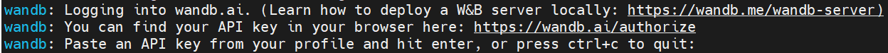

# 7.4 使用wandb可视化训练过程

在上一节中，我们使用了Tensorboard可视化训练过程，但是Tensorboard对数据的保存仅限于本地，也很难分析超参数不同对实验的影响。wandb的出现很好的解决了这些问题，因此在本章节中，我们将对wandb进行简要介绍。
wandb是Weights & Biases的缩写，它能够自动记录模型训练过程中的超参数和输出指标，然后可视化和比较结果，并快速与其他人共享结果。目前它能够和Jupyter、TensorFlow、Pytorch、Keras、Scikit、fast.ai、LightGBM、XGBoost一起结合使用。

经过本节的学习，你将收获：

- wandb的安装
- wandb的使用
- demo演示

## 7.4.1 wandb的安装

wandb的安装非常简单，我们只需要使用pip安装即可。

```python
pip install wandb
```
安装完成后，我们需要在[官网](https://wandb.ai/)注册一个账号并复制下自己的API keys，然后在本地使用下面的命令登录。

```python
wandb login
```
这时，我们会看到下面的界面，只需要粘贴你的API keys即可。


## 7.4.2 wandb的使用

wandb的使用也非常简单，只需要在代码中添加几行代码即可。

```python
import wandb
wandb.init(project='my-project', entity='my-name')
```

这里的project和entity是你在wandb上创建的项目名称和用户名，如果你还没有创建项目，可以参考[官方文档](https://docs.wandb.ai/quickstart)。

## 7.4.3 demo演示

下面我们使用一个CIFAR10的图像分类demo来演示wandb的使用。


```python

import random  # to set the python random seed
import numpy  # to set the numpy random seed
import torch
import torch.nn as nn
import torch.nn.functional as F
import torch.optim as optim
from torchvision import datasets, transforms
from torch.utils.data import DataLoader
from torchvision.models import resnet18
import warnings
warnings.filterwarnings('ignore')
```
使用wandb的第一步是初始化wandb，这里我们使用wandb.init()函数来初始化wandb，其中project是你在wandb上创建的项目名称，name是你的实验名称。
```python
# 初始化wandb
import wandb
wandb.init(project="thorough-pytorch",
           name="wandb_demo",)
```
使用wandb的第二步是设置超参数，这里我们使用wandb.config来设置超参数，这样我们就可以在wandb的界面上看到超参数的变化。wandb.config的使用方法和字典类似，我们可以使用config.key的方式来设置超参数。

```python
# 超参数设置
config = wandb.config  # config的初始化
config.batch_size = 64  
config.test_batch_size = 10 
config.epochs = 5  
config.lr = 0.01 
config.momentum = 0.1  
config.use_cuda = True  
config.seed = 2043  
config.log_interval = 10 

# 设置随机数
def set_seed(seed):
    random.seed(config.seed)      
    torch.manual_seed(config.seed) 
    numpy.random.seed(config.seed) 

```
第三步是构建训练和测试的pipeline，这里我们使用pytorch的CIFAR10数据集和resnet18来构建训练和测试的pipeline。
```python
def train(model, device, train_loader, optimizer):
    model.train()

    for batch_id, (data, target) in enumerate(train_loader):
        data, target = data.to(device), target.to(device)
        optimizer.zero_grad()
        output = model(data)
        criterion = nn.CrossEntropyLoss()
        loss = criterion(output, target)
        loss.backward()
        optimizer.step()

# wandb.log用来记录一些日志(accuracy,loss and epoch), 便于随时查看网路的性能
def test(model, device, test_loader, classes):
    model.eval()
    test_loss = 0
    correct = 0
    example_images = []

    with torch.no_grad():
        for data, target in test_loader:
            data, target = data.to(device), target.to(device)
            output = model(data)
            criterion = nn.CrossEntropyLoss()
            test_loss += criterion(output, target).item()
            pred = output.max(1, keepdim=True)[1]
            correct += pred.eq(target.view_as(pred)).sum().item()
            example_images.append(wandb.Image(
                data[0], caption="Pred:{} Truth:{}".format(classes[pred[0].item()], classes[target[0]])))

   # 使用wandb.log 记录你想记录的指标
    wandb.log({
        "Examples": example_images,
        "Test Accuracy": 100. * correct / len(test_loader.dataset),
        "Test Loss": test_loss
    })

wandb.watch_called = False 


def main():
    use_cuda = config.use_cuda and torch.cuda.is_available()
    device = torch.device("cuda:0" if use_cuda else "cpu")
    kwargs = {'num_workers': 1, 'pin_memory': True} if use_cuda else {}

    # 设置随机数
    set_seed(config.seed)
    torch.backends.cudnn.deterministic = True

    # 数据预处理
    transform = transforms.Compose([
        transforms.ToTensor(),
        transforms.Normalize((0.5, 0.5, 0.5), (0.5, 0.5, 0.5))
    ])

    # 加载数据
    train_loader = DataLoader(datasets.CIFAR10(
        root='dataset',
        train=True,
        download=True,
        transform=transform
    ), batch_size=config.batch_size, shuffle=True, **kwargs)

    test_loader = DataLoader(datasets.CIFAR10(
        root='dataset',
        train=False,
        download=True,
        transform=transform
    ), batch_size=config.batch_size, shuffle=False, **kwargs)

    classes = ('plane', 'car', 'bird', 'cat', 'deer', 'dog', 'frog', 'horse', 'ship', 'truck')

    model = resnet18(pretrained=True).to(device)
    optimizer = optim.SGD(model.parameters(), lr=config.lr, momentum=config.momentum)

    wandb.watch(model, log="all")
    for epoch in range(1, config.epochs + 1):
        train(model, device, train_loader, optimizer)
        test(model, device, test_loader, classes)

    # 本地和云端模型保存
    torch.save(model.state_dict(), 'model.pth')
    wandb.save('model.pth')


if __name__ == '__main__':
    main()

```
当我们运行完上面的代码后，我们就可以在wandb的界面上看到我们的训练结果了和系统的性能指标。同时，我们还可以在setting里面设置训练完给我们发送邮件，这样我们就可以在训练完之后及时的查看训练结果了。


我们可以发现，使用wandb可以很方便的记录我们的训练结果，除此之外，wandb还为我们提供了很多的功能，比如：模型的超参数搜索，模型的版本控制，模型的部署等等。这些功能都可以帮助我们更好的管理我们的模型，更好的进行模型的迭代和优化。这些功能我们在后面的更新中会进行介绍。