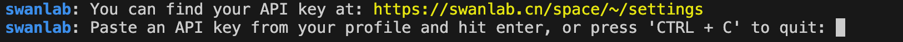
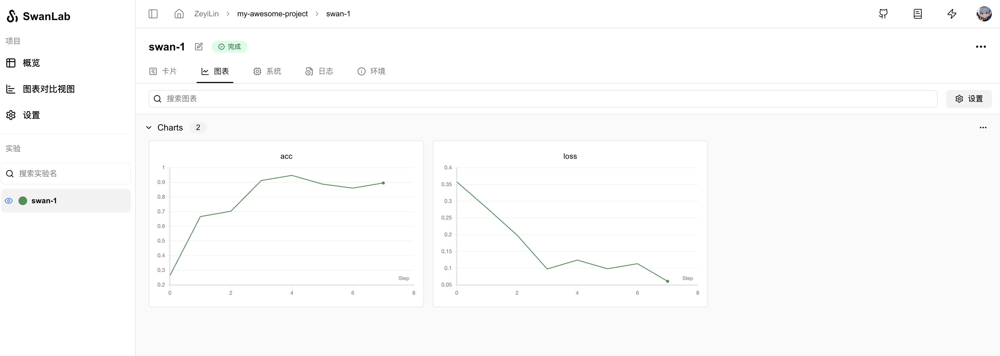
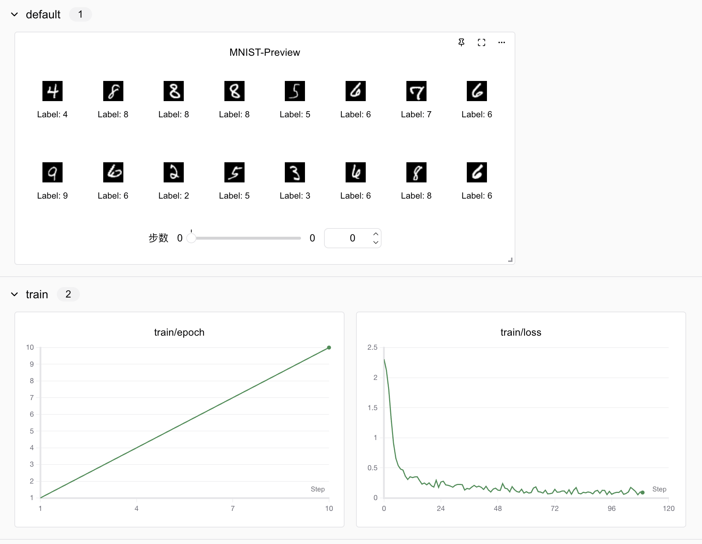
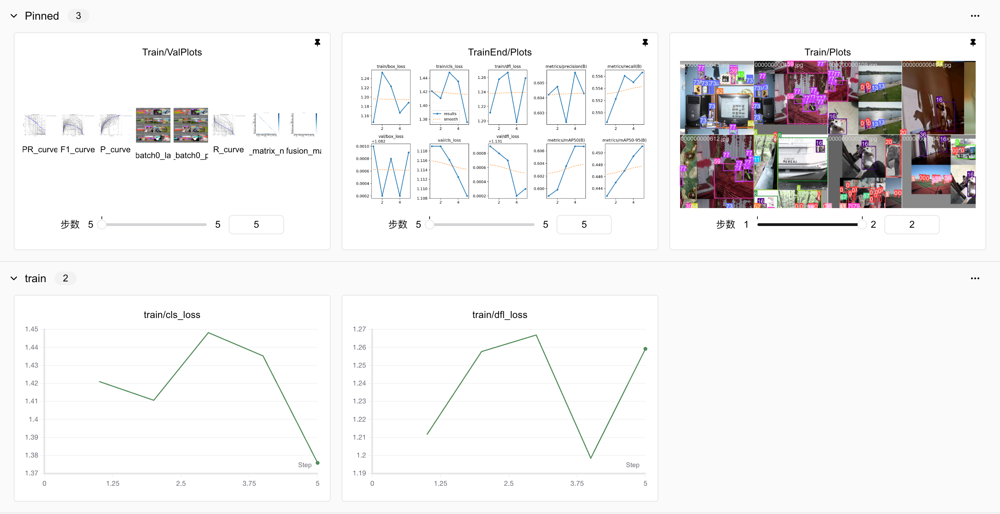
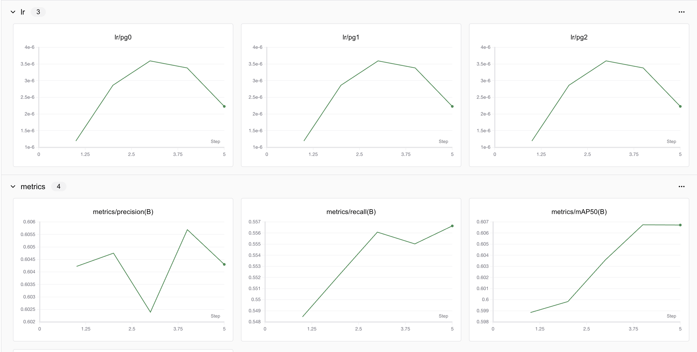
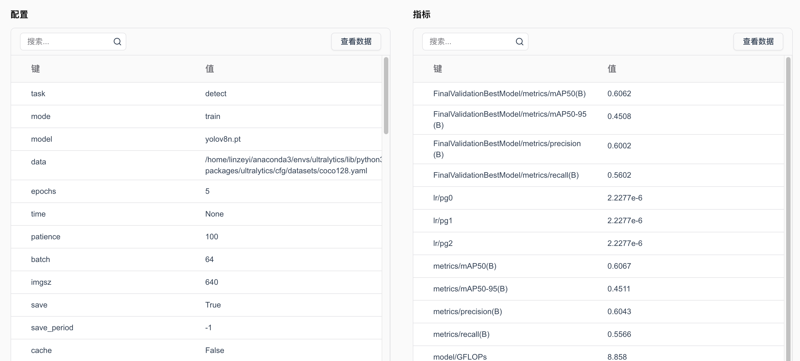

# 7.5 使用SwanLab可视化训练过程

在上一节中，我们使用了Wandb可视化训练过程，但是Wandb将数据存储在海外，在国内的网络环境下访问速度较慢，且容易断连。SwanLab是一个由中国团队开发的训练可视化平台，国内访问稳定流畅，在功能上支持自动记录模型训练过程中的超参数和输出指标，然后可视化和比较结果，并快速与其他人共享结果。目前它还支持监控昇腾NPU的训练情况，能够和PyTorch、Keras、MMDetection、LLaMA Factory、LightGBM、XGBoost等框架结合使用。

经过本节的学习，你将收获：

- SwanLab的安装
- SwanLab的基本使用
- SwanLab跟踪MNIST案例
- SwanLab跟踪YOLO案例

## 7.5.1 SwanLab的安装

SwanLab的安装非常简单，我们只需要使用pip安装即可。

```bash
pip install swanlab
```

安装完成后，我们需要在[官网](https://swanlab.cn/)注册一个账号并复制下自己的API keys，然后在本地使用下面的命令登录。

```bash
swanlab login
```

这时，我们会看到下面的界面，只需要粘贴你的API keys即可。



## 7.5.2 SwanLab的基本使用

SwanLab的使用也非常简单，只需要在代码中添加几行代码即可，大概分为两步。

**第一步，初始化项目：**

```python
import swanlab

swanlab.init(project="my-project", experiment_name="first_exp")
```

这里的project和experiment_name是你在swanlab上创建的项目名称和实验名。

项目和实验的关系有点类似PC中的文件夹和文件的关系，你的每次训练进程都是一个实验，而项目是实验的集合，用来进行多个实验之间的对比与管理。

**第二步，记录数据：**

```python
for i in range(10):
    swanlab.log({"loss": 1-0.1*i, "acc": 0.1*i})
```

这里的log是记录指标的函数，它接收一个字典，字典的key是指标的名称，value是指标的值。


**Hello World代码**

```python
import swanlab
import random

# 创建一个SwanLab项目
swanlab.init(
    # 设置项目名
    project="my-awesome-project",
    
    # 设置超参数
    config={
        "learning_rate": 0.02,
        "architecture": "CNN",
        "dataset": "CIFAR-100",
        "epochs": 10
    }
)

# 模拟一次训练
epochs = 10
offset = random.random() / 5
for epoch in range(2, epochs):
    acc = 1 - 2 ** -epoch - random.random() / epoch - offset
    loss = 2 ** -epoch + random.random() / epoch + offset

    # 记录训练指标
    swanlab.log({"acc": acc, "loss": loss})

# [可选] 完成训练，这在notebook环境中是必要的
swanlab.finish()
```

当我们运行完上面的代码后，就可以在swanlab的界面看到我们的训练结果了：




## 7.5.3 SwanLab跟踪MNIST案例

下面我们使用一个MNSIT手写体识别的demo来演示SwanLab的使用。 [预览链接](https://swanlab.cn/@ZeyiLin/MNIST-example/runs/4plp6w0qehoqpt0uq2tcy/chart)。


```python
import os
import torch
from torch import nn, optim, utils
import torch.nn.functional as F
import torchvision
from torchvision.datasets import MNIST
from torchvision.transforms import ToTensor
import swanlab

# CNN网络构建
class ConvNet(nn.Module):
    def __init__(self):
        super().__init__()
        # 1,28x28
        self.conv1 = nn.Conv2d(1, 10, 5)  # 10, 24x24
        self.conv2 = nn.Conv2d(10, 20, 3)  # 128, 10x10
        self.fc1 = nn.Linear(20 * 10 * 10, 500)
        self.fc2 = nn.Linear(500, 10)

    def forward(self, x):
        in_size = x.size(0)
        out = self.conv1(x)  # 24
        out = F.relu(out)
        out = F.max_pool2d(out, 2, 2)  # 12
        out = self.conv2(out)  # 10
        out = F.relu(out)
        out = out.view(in_size, -1)
        out = self.fc1(out)
        out = F.relu(out)
        out = self.fc2(out)
        out = F.log_softmax(out, dim=1)
        return out


# 捕获并可视化前20张图像
def log_images(loader, num_images=16):
    images_logged = 0
    logged_images = []
    for images, labels in loader:
        # images: batch of images, labels: batch of labels
        for i in range(images.shape[0]):
            if images_logged < num_images:
                # 使用swanlab.Image将图像转换为wandb可视化格式
                logged_images.append(swanlab.Image(images[i], caption=f"Label: {labels[i]}"))
                images_logged += 1
            else:
                break
        if images_logged >= num_images:
            break
    swanlab.log({"MNIST-Preview": logged_images})
    

def train(model, device, train_dataloader, optimizer, criterion, epoch, num_epochs):
    model.train()
    # 1. 循环调用train_dataloader，每次取出1个batch_size的图像和标签
    for iter, (inputs, labels) in enumerate(train_dataloader):
        inputs, labels = inputs.to(device), labels.to(device)
        optimizer.zero_grad()
        # 2. 传入到resnet18模型中得到预测结果
        outputs = model(inputs)
        # 3. 将结果和标签传入损失函数中计算交叉熵损失
        loss = criterion(outputs, labels)
        # 4. 根据损失计算反向传播
        loss.backward()
        # 5. 优化器执行模型参数更新
        optimizer.step()
        print('Epoch [{}/{}], Iteration [{}/{}], Loss: {:.4f}'.format(epoch, num_epochs, iter + 1, len(train_dataloader),
                                                                      loss.item()))
        # 6. 每20次迭代，用SwanLab记录一下loss的变化
        if iter % 20 == 0:
            swanlab.log({"train/loss": loss.item()})

def test(model, device, val_dataloader, epoch):
    model.eval()
    correct = 0
    total = 0
    with torch.no_grad():
        # 1. 循环调用val_dataloader，每次取出1个batch_size的图像和标签
        for inputs, labels in val_dataloader:
            inputs, labels = inputs.to(device), labels.to(device)
            # 2. 传入到resnet18模型中得到预测结果
            outputs = model(inputs)
            # 3. 获得预测的数字
            _, predicted = torch.max(outputs, 1)
            total += labels.size(0)
            # 4. 计算与标签一致的预测结果的数量
            correct += (predicted == labels).sum().item()
    
        # 5. 得到最终的测试准确率
        accuracy = correct / total
        # 6. 用SwanLab记录一下准确率的变化
        swanlab.log({"val/accuracy": accuracy}, step=epoch)
    

if __name__ == "__main__":

    #检测是否支持mps
    try:
        use_mps = torch.backends.mps.is_available()
    except AttributeError:
        use_mps = False

    #检测是否支持cuda
    if torch.cuda.is_available():
        device = "cuda"
    elif use_mps:
        device = "mps"
    else:
        device = "cpu"

    # 初始化swanlab
    run = swanlab.init(
        project="MNIST-example",
        experiment_name="PlainCNN",
        config={
            "model": "ResNet18",
            "optim": "Adam",
            "lr": 1e-4,
            "batch_size": 256,
            "num_epochs": 10,
            "device": device,
        },
    )

    # 设置MNIST训练集和验证集
    dataset = MNIST(os.getcwd(), train=True, download=True, transform=ToTensor())
    train_dataset, val_dataset = utils.data.random_split(dataset, [55000, 5000])

    train_dataloader = utils.data.DataLoader(train_dataset, batch_size=run.config.batch_size, shuffle=True)
    val_dataloader = utils.data.DataLoader(val_dataset, batch_size=8, shuffle=False)
    
    # （可选）看一下数据集的前16张图像
    log_images(train_dataloader, 16)

    # 初始化模型
    model = ConvNet()
    model.to(torch.device(device))

    # 打印模型
    print(model)

    # 定义损失函数和优化器
    criterion = nn.CrossEntropyLoss()
    optimizer = optim.Adam(model.parameters(), lr=run.config.lr)

    # 开始训练和测试循环
    for epoch in range(1, run.config.num_epochs+1):
        swanlab.log({"train/epoch": epoch}, step=epoch)
        train(model, device, train_dataloader, optimizer, criterion, epoch, run.config.num_epochs)
        if epoch % 2 == 0: 
            test(model, device, val_dataloader, epoch)

    # 保存模型
    # 如果不存在checkpoint文件夹，则自动创建一个
    if not os.path.exists("checkpoint"):
        os.makedirs("checkpoint")
    torch.save(model.state_dict(), 'checkpoint/latest_checkpoint.pth')
```

运行代码后，我们查看实验结果：




## 7.5.4 SwanLab跟踪YOLO案例

下面我们使用一个Ultralytics框架训练Yolo模型的demo来演示SwanLab的使用。 [预览链接](https://swanlab.cn/@ZeyiLin/ultratest/runs/yux7vclmsmmsar9ear7u5/chart)。

```python
from ultralytics import YOLO
from swanlab.integration.ultralytics import add_swanlab_callback


if __name__ == "__main__":
    model = YOLO("yolov8n.yaml")
    model.load()
    # 添加swanlab回调
    add_swanlab_callback(model)

    model.train(
        data="./coco128.yaml",
        epochs=3, 
        imgsz=320,
    )
```







我们可以发现，使用swanlab可以很方便地可视化训练过程和在线查看实验进展。更多功能请见[官方文档](https://docs.swanlab.cn/guide_cloud/general/what-is-swanlab.html)。

