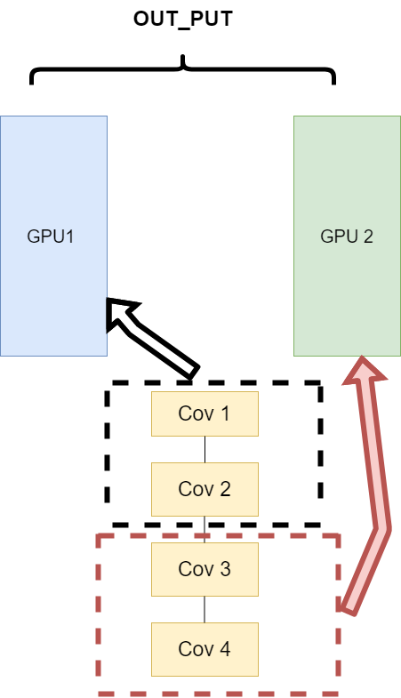

# 2.3 并行计算简介

在利用PyTorch做深度学习的过程中，可能会遇到数据量较大无法在单块GPU上完成，或者需要提升计算速度的场景，这时就需要用到并行计算。完成本节内容时，请你确保至少安装了一个NVIDIA GPU并安装了相关的驱动。

经过本节的学习，你将收获：

- 并行计算的简介
- CUDA简介
- 并行计算的三种实现方式
- 使用CUDA加速训练

## 2.3.1  为什么要做并行计算

深度学习的发展离不开算力的发展，GPU的出现让我们的模型可以训练的更快，更好。所以，如何充分利用GPU的性能来提高我们模型学习的效果，这一技能是我们必须要学习的。这一节，我们主要讲的就是PyTorch的并行计算。PyTorch可以在编写完模型之后，让多个GPU来参与训练，减少训练时间。你可以在命令行使用`nvidia-smi`命令来查看你的GPU信息和使用情况。

## 2.3.2  为什么需要CUDA

`CUDA`是NVIDIA提供的一种GPU并行计算框架。对于GPU本身的编程，使用的是`CUDA`语言来实现的。但是，在我们使用PyTorch编写深度学习代码时，使用的`CUDA`又是另一个意思。在PyTorch使用 `CUDA`表示要开始要求我们的模型或者数据开始使用GPU了。

在编写程序中，当我们使用了 `.cuda()` 时，其功能是让我们的模型或者数据从CPU迁移到GPU上（默认是0号GPU）当中，通过GPU开始计算。

注：
1. 我们使用GPU时使用的是`.cuda()`而不是使用`.gpu()`。这是因为当前GPU的编程接口采用CUDA，但是市面上的GPU并不是都支持CUDA，只有部分NVIDIA的GPU才支持，AMD的GPU编程接口采用的是OpenCL，在现阶段PyTorch并不支持。
2. 数据在GPU和CPU之间进行传递时会比较耗时，我们应当尽量避免数据的切换。
3. GPU运算很快，但是在使用简单的操作时，我们应该尽量使用CPU去完成。
4. 当我们的服务器上有多个GPU，我们应该指明我们使用的GPU是哪一块，如果我们不设置的话，tensor.cuda()方法会默认将tensor保存到第一块GPU上，等价于tensor.cuda(0)，这将有可能导致爆出`out of memory`的错误。我们可以通过以下两种方式继续设置。
   1.  ```python
        #设置在文件最开始部分
       import os
       os.environ["CUDA_VISIBLE_DEVICE"] = "2" # 设置默认的显卡
       ```
   2.  ```bash
        CUDA_VISBLE_DEVICE=0,1 python train.py # 使用0，1两块GPU
       ```


## 2.3.3  常见的并行的方法：

### 网络结构分布到不同的设备中(Network partitioning)

在刚开始做模型并行的时候，这个方案使用的比较多。其中主要的思路是，将一个模型的各个部分拆分，然后将不同的部分放入到GPU来做不同任务的计算。其架构如下：



这里遇到的问题就是，不同模型组件在不同的GPU上时，GPU之间的传输就很重要，对于GPU之间的通信是一个考验。但是GPU的通信在这种密集任务中很难办到，所以这个方式慢慢淡出了视野。

### 同一层的任务分布到不同数据中(Layer-wise partitioning)

第二种方式就是，同一层的模型做一个拆分，让不同的GPU去训练同一层模型的部分任务。其架构如下：


这样可以保证在不同组件之间传输的问题，但是在我们需要大量的训练，同步任务加重的情况下，会出现和第一种方式一样的问题。

### 不同的数据分布到不同的设备中，执行相同的任务(Data parallelism)

第三种方式有点不一样，它的逻辑是，我不再拆分模型，我训练的时候模型都是一整个模型。但是我将输入的数据拆分。所谓的拆分数据就是，同一个模型在不同GPU中训练一部分数据，然后再分别计算一部分数据之后，只需要将输出的数据做一个汇总，然后再反传。其架构如下：


这种方式可以解决之前模式遇到的通讯问题。现在的主流方式是**数据并行**的方式(Data parallelism)

## 2.3.4 使用CUDA加速训练

### 单卡训练
在PyTorch框架下，CUDA的使用变得非常简单，我们只需要显式的将数据和模型通过`.cuda()`方法转移到GPU上就可加速我们的训练。如下：

```python
model = Net()
model.cuda() # 模型显示转移到CUDA上

for image,label in dataloader:
    # 图像和标签显示转移到CUDA上
    image = image.cuda() 
    label = label.cuda()
```

### 多卡训练

PyTorch提供了两种多卡训练的方式，分别为`DataParallel`和`DistributedDataParallel`（以下我们分别简称为DP和DDP）。这两种方法中官方更推荐我们使用`DDP`，因为它的性能更好。但是`DDP`的使用比较复杂，而`DP`经需要改变几行代码既可以实现，所以我们这里先介绍`DP`，再介绍`DDP`。

#### 单机多卡DP


首先我们来看单机多卡DP，通常使用一种叫做数据并行 (Data parallelism) 的策略，即将计算任务划分成多个子任务并在多个GPU卡上同时执行这些子任务。主要使用到了`nn.DataParallel`函数，它的使用非常简单，一般我们只需要加几行代码即可实现

```python
model = Net()
model.cuda() # 模型显示转移到CUDA上

if torch.cuda.device_count() > 1: # 含有多张GPU的卡
	model = nn.DataParallel(model) # 单机多卡DP训练
```

除此之外，我们也可以指定GPU进行并行训练，一般有两种方式

- `nn.DataParallel`函数传入`device_ids`参数，可以指定了使用的GPU编号

  ```python
  model = nn.DataParallel(model, device_ids=[0,1]) # 使用第0和第1张卡进行并行训练
  ```

- 要**手动指定对程序可见的GPU设备**

  ```python
  os.environ["CUDA_VISIBLE_DEVICES"] = "1,2"
  ```

#### 多机多卡DDP


不过通过DP进行分布式多卡训练的方式容易造成负载不均衡，有可能第一块GPU显存占用更多，因为输出默认都会被gather到第一块GPU上。为此Pytorch也提供了`torch.nn.parallel.DistributedDataParallel`（DDP）方法来解决这个问题。

针对每个GPU，启动一个进程，然后这些进程在最开始的时候会保持一致（模型的初始化参数也一致，每个进程拥有自己的优化器），同时在更新模型的时候，梯度传播也是完全一致的，这样就可以保证任何一个GPU上面的模型参数就是完全一致的，所以这样就不会出现`DataParallel`那样显存不均衡的问题。不过相对应的，会比较麻烦，接下来介绍一下多机多卡DDP的使用方法。

开始之前需要先熟悉几个概念，这些还是有必要提一下的

- **进程组的相关概念**
  - **GROUP**：进程组，默认情况下，只有一个组，一个 job 即为一个组，也即一个 world。（当需要进行更加精细的通信时，可以通过 new_group 接口，使用 world 的子集，创建新组，用于集体通信等。）
  - **WORLD_SIZE**：表示全局进程个数。如果是多机多卡就表示机器数量，如果是单机多卡就表示 GPU 数量。
  - **RANK**：表示进程序号，用于进程间通讯，表征进程优先级。rank = 0 的主机为 master 节点。 如果是多机多卡就表示对应第几台机器，如果是单机多卡，由于一个进程内就只有一个 GPU，所以 rank 也就表示第几块 GPU。
  - **LOCAL_RANK**：表示进程内，GPU 编号，非显式参数，由 torch.distributed.launch 内部指定。例如，多机多卡中 rank = 3，local_rank = 0 表示第 3 个进程内的第 1 块 GPU。


- **DDP的基本用法 (代码编写流程)**

- - 在使用 `distributed` 包的任何其他函数之前，需要使用 `init_process_group` **初始化进程组**，同时初始化 `distributed` 包。
  - 使用 `torch.nn.parallel.DistributedDataParallel` 创建 **分布式模型** `DDP(model, device_ids=device_ids)`
  - 使用 `torch.utils.data.distributed.DistributedSampler` 创建 **DataLoader**
  - 使用启动工具 `torch.distributed.launch` 在每个主机上执行一次脚本，开始训练

- 首先是对代码进行修改，添加参数  --local_rank

- ```python
  import argparse
  parser = argparse.ArgumentParser()
  parser.add_argument("--local_rank", type=int) # 这个参数很重要
  args = parser.parse_args()
  ```

- 这里的local_rank参数，可以理解为`torch.distributed.launch`在给一个GPU创建进程的时候，给这个进程提供的GPU号，这个是程序自动给的，**不需要手动在命令行中指定这个参数。**

- ```python
  local_rank = int(os.environ["LOCAL_RANK"]) #也可以自动获取
  ```

- 然后在所有和GPU相关代码的前面添加如下代码，如果不写这句代码，所有的进程都默认在你使用`CUDA_VISIBLE_DEVICES`参数设定的0号GPU上面启动

- ```python
  torch.cuda.set_device(args.local_rank) # 调整计算的位置
  ```

- 设置GPU之间通信使用的后端和端口，也就是初始化进程组：

- ```python
  torch.distributed.init_process_group(backend='nccl') # 初始化进程组
  ```

- 之后，使用 `DistributedSampler` 对数据集进行划分。它能帮助我们将每个 batch 划分成几个 partition，在当前进程中只需要获取和 rank 对应的那个 partition 进行训练：

- ```python
  # 创建Dataloader
  train_sampler = torch.utils.data.distributed.DistributedSampler(train_dataset)
  train_loader = torch.utils.data.DataLoader(train_dataset, batch_size=16, sampler=train_sampler)
  ```

- 注意： testset不用sampler

- 然后使用`torch.nn.parallel.DistributedDataParallel`包装模型：

- ```python
  # DDP进行训练
  model = torch.nn.parallel.DistributedDataParallel(model, device_ids=[args.local_rank])
  ```

- **如何启动DDP**

  那么如何启动DDP，这不同于DP的方式，需要使用torch.distributed.launch启动器，对于单机多卡的情况：

  ```python
  CUDA_VISIBLE_DEVICES=0,1,2,3 python -m torch.distributed.launch --nproc_per_node=4 main.py
  # nproc_per_node: 这个参数是指你使用这台服务器上面的几张显卡
  ```

  > 有时候虽然说，可以简单使用DP，但是DDP的效率是比DP高的，所以很多时候单机多卡的情况，我们还是会去使用DDP

### DP 与 DDP 的区别

#### DP 的优势

如果有的话就是简单，一行代码搞定。

#### DDP的优势

**1. 每个进程对应一个独立的训练过程，且只对梯度等少量数据进行信息交换。**

**`DDP`** 在每次迭代中，每个进程具有自己的 `optimizer` ，并独立完成所有的优化步骤，进程内与一般的训练无异。在各进程梯度计算完成之后，各进程需要将**梯度**进行汇总平均，然后再由 `rank=0` 的进程，将其 `broadcast` 到所有进程。之后，各进程用该梯度来独立的更新参数。而 `DP`是**梯度汇总到主** `GPU`，**反向传播更新参数**，再广播参数给其他的 GPU。

**`DDP`** 中由于各进程中的模型，初始参数一致 (初始时刻进行一次 `broadcast`)，而每次用于更新参数的梯度也一致，因此，各进程的模型参数始终保持一致。

而在`DP` 中，全程维护一个 `optimizer`，对各 `GPU` 上梯度进行求和，而在主 `GPU` 进行参数更新，之后再将模型参数 `broadcast` 到其他 `GPU`。

相较于**`DP`**，**`DDP`**传输的数据量更少，因此速度更快，效率更高。

**2. 每个进程包含独立的解释器和 GIL。**

一般使用的 `Python` 解释器 `CPython`：是用 `C` 语言实现 `Pyhon`，是目前应用最广泛的解释器。全局锁使 `Python` 在多线程效能上表现不佳，全局解释器锁（`Global Interpreter Lock`）是 `Python` 用于同步线程的工具，使得任何时刻仅有一个线程在执行。

由于每个进程拥有独立的解释器和 `GIL`，消除了来自单个 `Python` 进程中的多个执行线程，模型副本或 `GPU` 的额外解释器开销和 `GIL-thrashing` ，因此可以减少解释器和 `GIL` 使用冲突。这对于严重依赖 `Python runtime` 的 `models` 而言，比如说包含 `RNN` 层或大量小组件的 `models` 而言，这尤为重要。


## 参考资料：

[Pytorch 并行训练（DP， DDP）的原理和应用](https://blog.csdn.net/kuweicai/article/details/120516410)

[Pytorch中单机多卡分布式训练](https://zhuanlan.zhihu.com/p/447563272)

[💥 Training Neural Nets on Larger Batches: Practical Tips for 1-GPU, Multi-GPU & Distributed setups](https://medium.com/huggingface/training-larger-batches-practical-tips-on-1-gpu-multi-gpu-distributed-setups-ec88c3e51255)

[DISTRIBUTEDDATAPARALLEL](https://pytorch.org/docs/stable/generated/torch.nn.parallel.DistributedDataParallel.html?highlight=distributeddataparallel#torch.nn.parallel.DistributedDataParallel)

