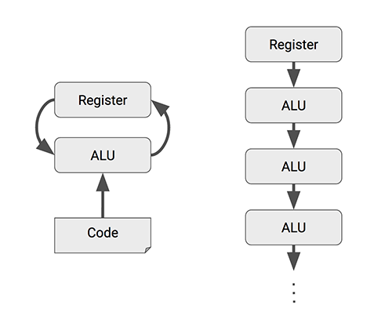
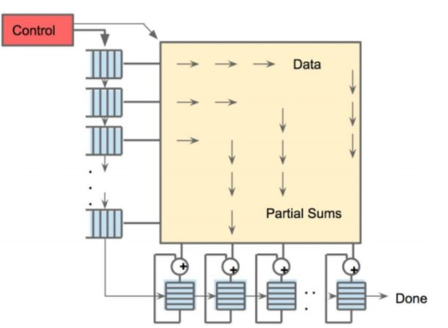
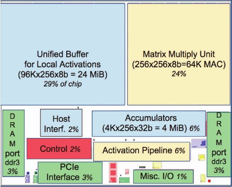
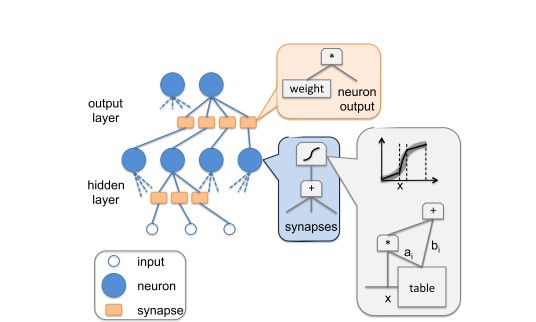
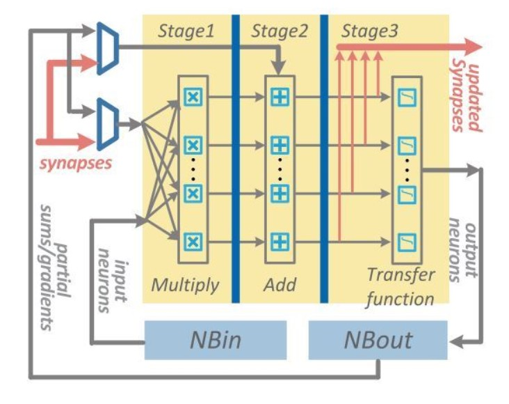
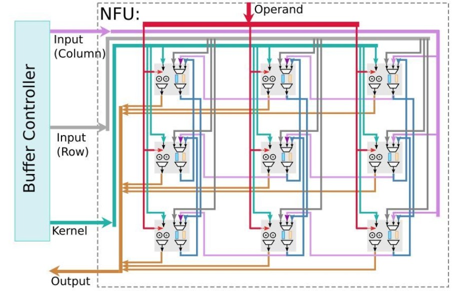
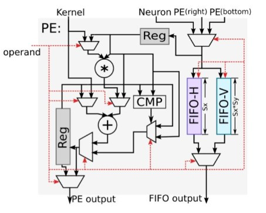

# AI硬件加速设备

在进行模型部署和训练时，我们有时会受限于CPU和GPU的性能。这时，专用的AI芯片就显得尤为重要。在正式开始本节内容之前，我们先了解一下什么是CPU和GPU。

CPU即Central Processing Unit，中文名为中央处理器，是我们电脑中的核心配件。它的功能主要是处理指令、执行操作、控制时间、处理数据。

在现代计算机体系结构中，CPU 对计算机的所有硬件资源（如存储器、输入输出单元） 进行控制调配、执行通用运算的核心硬件单元。CPU 是计算机的运算和控制核心。计算机系统中所有软件层的操作，最终都将通过指令集映射为CPU的操作。

GPU即Graphics Processing Unit，中文名为图形处理单元。在传统的冯·诺依曼结构中，CPU 每执行一条指令都需要从存储器中读取数据，根据指令对数据进行相应的操作。从这个特点可以看出，CPU 的主要职责并不只是数据运算，还需要执行存储读取、指令分析、分支跳转等命令。深度学习算法通常需要进行海量的数据处理，用 CPU 执行算法时，CPU 将花费大量的时间在数据/指令的读取分析上，而 CPU的频率、内存的带宽等条件又不可能无限制提高，因此限制了处理器的性能。而 GPU 的控制相对简单，大部分的晶体管可以组成各类专用电路、多条流水线，使得 GPU 的计算速度远高于CPU；同时 GPU 拥有了更加强大的浮点运算能力，可以缓解深度学习算法的训练难题，释放人工智能的潜能。

需要注意的是，GPU没有独立工作的能力，必须由CPU进行控制调用才能工作，且GPU的功耗一般比较高。因此，随着人工智能的不断发展，高功耗低效率的GPU不再能满足AI训练的要求，为此，一大批功能相对单一，但速度更快的专用集成电路相继问世。接下来我们了解一下什么是专用集成电路：

专用集成电路（Application-Specific Integrated Circuit，ASIC）是专用定制芯片，即为实现特定要求而定制的芯片。定制的特性有助于提高 ASIC 的性能功耗比。ASIC的缺点是电路设计需要定制，相对开发周期长，功能难以扩展。但在功耗、可靠性、集成度等方面都有优势，尤其在要求高性能、低功耗的移动应用端体现明显。下文提到的谷歌的TPU，寒武纪的NPU都属于ASIC的范畴。

下面让我们进入本节的内容，经过本节的学习，你将收获：

- 什么是TPU
- 什么是NPU

## 2.4.1 TPU

TPU即Tensor Processing Unit，中文名为张量处理器。2006年，谷歌开始计划为神经网络构建一个专用的集成电路（ASIC）。随着计算需求和数据量的不断上涨，这个需求在2013年开始变得尤为紧迫。于是，谷歌在2015年6月的IO开发者大会上推出了为优化自身的TensorFlow框架而设计打造的一款计算神经网络专用芯片。它主要用于进行搜索，图像，语音等模型和技术的处理。

截至目前，谷歌已经发行了四代TPU芯片。

### 芯片架构设计

TPU的设计架构如下图

上图：In-datacenter performance analysis of a tensor processing unit，figure 1

由上图可见，整个TPU中最重要的计算单元是右上角黄色的矩阵乘单元“Matrix Multiply Unit”，它包含256x256个MAC部件，每一个能够执行有符号或者无符号的8位乘加操作。它的输入为权重数据队列FIFO和统一缓冲Unified Buffer，即图中指向它的两个蓝色部分。在计算结束后，16位结果被收集并传递到位于矩阵单元下方的4MiB 32位蓝色累加器Accumulators中，之后由黄色的激活单元在累加后执行非线性函数，并最终将数据返回给统一缓冲。

Matrix Multiply Unit矩阵处理器作为TPU的核心部分，它可以在单个时钟周期内处理数十万次矩阵（Matrix）运算。MMU有着与传统CPU、GPU截然不同的架构，称为脉动阵列（systolic array）。之所以叫“脉动”，是因为在这种结构中，数据一波一波地流过芯片，与心脏跳动供血的方式类似。而如下图所示，CPU和GPU在每次运算中都需要从多个寄存器（register）中进行存取，而TPU的脉动阵列将多个运算逻辑单元（ALU）串联在一起，复用从一个寄存器中读取的结果。每个ALU单元结构简单，一般只包含乘法器、加法器以及寄存器三部分，适合大量堆砌。

但是，在极大增加数据复用、降低内存带宽压力的同时，脉动阵列也有两个缺点，即数据重排和规模适配。第一，脉动矩阵主要实现向量/矩阵乘法。以CNN计算为例，CNN数据进入脉动阵列需要调整好形式，并且严格遵循时钟节拍和空间顺序输入。数据重排的额外操作增加了复杂性。第二，在数据流经整个阵列后，才能输出结果。当计算的向量中元素过少，脉动阵列规模过大时，不仅难以将阵列中的每个单元都利用起来，数据的导入和导出延时也随着尺寸扩大而增加，降低了计算效率。因此在确定脉动阵列的规模时，在考虑面积、能耗、峰值计算能力的同时，还要考虑典型应用下的效率。

### 技术特点

#### AI加速专用

TPU的架构属于Domain-specific Architecture，也就是特定领域架构。它的定位准确，架构简单，单线程控制，定制指令集使得它在深度学习运算方面效率极高，且容易扩展。相比之下，传统诸如CPU、GPU等通用处理器必须考虑灵活性和兼容性，有太重的包袱。但TPU这种特点也决定它只能被限制用于深度学习加速场景。

####  脉动阵列设计

TPU采用了与传统CPU和GPU截然不同的脉动阵列（systolic array）结构来加速AI运算，脉动阵列能够在一个时钟周期内处理数十万次矩阵运算，在每次运算过程中，TPU能够将多个运算逻辑单元（ALU）串联在一起，并复用从一个寄存器中取得的结果。这种设计，不仅能够将数据复用实现最大化，减少芯片在运算过程中的内存访问次数，提高AI计算效率，同时也降低了内存带宽压力，进而降低内存访问的能耗。

MMU的脉动阵列包含256 × 256 = 65,536个ALU，也就是说TPU每个周期可以处理65,536次8位整数的乘法和加法。

TPU以700兆赫兹的功率运行，也就是说，它每秒可以运行65,536 × 700,000,000 = 46 × 1012次乘法和加法运算，或每秒92万亿（92 × 1012）次矩阵单元中的运算。

上图：In-datacenter performance analysis of a tensor processing unit，figure 4

#### 确定性功能和大规模片上内存

如图是TPU的平面设计简图，黄色为MMU运算单元，蓝色是统一缓存和累加器等数据单元，绿色是I/O，红色是逻辑控制单元。

上图：In-datacenter performance analysis of a tensor processing unit，figure 2

传统GPU由于片上内存较少，因此在运行过程中需要不断地去访问片外动态随机存取存储器（DRAM），从而在一定程度上浪费了不必要的能耗。与CPU和GPU相比，TPU的控制单元更小，更容易设计，面积只占了整个冲模的2%，给片上存储器和运算单元留下了更大的空间。如上图所示的TPU一代架构中，总共设计了占总芯片面积35%的内存，其中包括24MB的局部内存、4MB的累加器内存，以及用于与主控处理器对接的内存。这一比例大大超出了GPU等通用处理器，节约了大量片外数据访存能耗，使得TPU计算的能效比大大提高。从TPU二代开始采用HBM片上高带宽内存，虽然和最新一代GPU片上内存技术相同，但是TPU芯片的面积要远远小于GPU。硅片越小，成本越低，良品率也越高。

另外，由于TPU是一个单用途芯片，不需要考虑缓存、分支预测、多道处理等问题。这就意味着TPU的功能是单一且确定的。因此，我们可以使用TPU轻易的预测运行一个神经网络需要多长时间，这样我们就能让芯片以吞吐量接近峰值的状态运行，同时严格控制延迟。

## 2.4.2 NPU

NPU即Neural-network Processing Unit，中文名为神经网络处理器，它采用“数据驱动并行计算”的架构，特别擅长处理视频、图像类的海量多媒体数据。

长期以来，应用需求一直牵动着嵌入式技术的发展方向。随着深度学习神经网络的兴起，人工智能、大数据时代的来临，CPU和GPU渐渐难以满足深度学习的需要，面对日渐旺盛的需求和广大的预期市场，设计一款专门用于神经网络深度学习的高效智能处理器显得十分必要，因此NPU应运而生。

从技术角度看，深度学习实际上是一类多层大规模人工神经网络。它模仿生物神经网络而构建，由若干人工神经元结点互联而成。神经元之间通过突触两两连接，突触记录了神经元间联系的权值强弱。由于深度学习的基本操作是神经元和突触的处理，神经网络中存储和处理是一体化的，都是通过突触权重来体现，而冯·诺伊曼结构中，存储和处理是分离的，分别由存储器和运算器来实现，二者之间存在巨大的差异。当用现有的基于冯·诺伊曼结构的经典计算机(如X86处理器和英伟达GPU)运行神经网络应用时，就不可避免地受到存储和处理分离式结构的制约，因而影响效率。因此，专门针对人工智能的专业芯片NPU更有研发的必要和需求。

在NPU的设计上，中国走在了世界前列。下面我们将以寒武纪的DianNao系列架构为例，来简要介绍NPU。

### DianNao

上图：DianNao: a small-footprint high-throughput accelerator for ubiquitous machine-learning，figure 9

基于神经网络的人工智能算法，是模拟人类大脑内部神经元的结构。上图中的neuron代表的就是单个神经元，synapse代表神经元的突触。这个模型的工作模式，就要结合高中生物课的知识了。

一个神经元，有许多突触，给别的神经元传递信息。同样，这个神经元，也会接收来自许多其他神经元的信息。这个神经元所有接受到的信息累加，会有一个强烈程度，在生物上是以化学成分的形式存在，当这些信息达到一定的强烈程度，就会使整个神经元处于兴奋状态（激活），否则就是不兴奋（不激活）。如果兴奋了，就给其他神经元传递信息，如果不兴奋，就不传递。这就是单独一个神经元的工作模式。那么有成千上万个这样的神经元组合起来，就是一个神经网络模型。

那么DianNao是如何模拟神经元进行工作的呢，我们可以看看它的内部结构图：

上图：DianNao: a small-footprint high-throughput accelerator for ubiquitous machine-learning，figure 11

如图所示，上图中浅蓝色的部分就是用硬件逻辑模拟的神经网络架构，称为NFU（Neural Functional Units）。它可以被细分为三个部分，即途中的NFU-1，NFU-2，和NFU-3。

NFU-1是乘法单元，它采用16bit定点数乘法器，1位符号位，5位整数位，10位小数位。该部分总计有256个乘法器。这些乘法器的计算是同时的，也就是说，在一个周期内可以执行256次乘法。

NFU-2是加法树，总计16个，每一个加法树都是8-4-2-1这样的组成结构，即就是每一个加法树中都有15个加法器。

NFU-3是非线性激活函数，该部分由分段线性近似实现非线性函数，根据前面两个单元计算得到的刺激量，从而判断是否需要激活操作。

当需要实现向量相乘和卷积运算时，使用NFU-1完成对应位置元素相乘，NFU-2完成相乘结果相加，最后由NFU-3完成激活函数映射。完成池化运算时，使用NFU-2完成多个元素取最大值或取平均值运算。由此分析，尽管该运算模块非常简单，也覆盖了神经网络所需要的大部分运算。

### DaDianNao

作为DianNao的多核升级版本，DaDianNao的运算单元NFU与DianNao基本相同，最大的区别是为了完成训练任务多加了几条数据通路，且配置更加灵活。NFU的尺寸为16x16，即16个输出神经元，每个输出神经元有16个输入（输入端需要一次提供256个数据）。同时，NFU可以可选的跳过一些步骤以达到灵活可配置的功能。DaDianNao的NFU结构如下所示：

上图：DaDianNao: A Machine-Learning Supercomputer，figure 6

### ShiDianNao

ShiDianNao是机器视觉专用加速器，集成了视频处理的部分，它也是DianNao系列中唯一一个考虑运算单元级数据重用的加速器，也是唯一使用二维运算阵列的加速器，其加速器的运算阵列结构如下所示：

上图：ShiDianNao: Shifting vision processing closer to the sensor，figure 5

ShiDianNao的运算阵列为2D格点结构，对于每一个运算单元（节点）而言，运算所使用的参数统一来源于Kernel，而参与运算的数据则可能来自于：数据缓存NBin，下方的节点，右侧的节点。

下图为每个运算单元的结构：

上图：ShiDianNao: Shifting vision processing closer to the sensor，figure 6

该计算节点的功能包括转发数据和进行计算：

转发数据：每个数据可来源于右侧节点，下方节点和NBin，根据控制信号选择其中一个存储到输入寄存器中，且根据控制信号可选的将其存储到FIFO-H和FIFO-V中。同时根据控制信号选择FIFO-H和FIFO-V中的信号从FIFO output端口输出

进行计算：根据控制信号进行计算，包括相加，累加，乘加和比较等，并将结果存储到输出寄存器中，并根据控制信号选择寄存器或计算结果输出到PE output端口。

对于计算功能，根据上文的结构图，可以发现，PE支持的运算有：kernel和输入数据相乘并与输出寄存器数据相加（乘加），输入数据与输出寄存器数据取最大或最小（应用于池化），kernel与输入数据相加（向量加法），输入数据与输出寄存器数据相加（累加）等。

### PuDianNao

作为DianNao系列的收山之作，PuDianNao的运算单元是电脑系列中唯一一个异构的，除了有MLU（机器学习单元）外，还有一个ALU用于处理通用运算和MLU无法处理的运算，其运算单元（上）和MLU（下）结构如下图所示：

上图：PuDianNao: A Polyvalent Machine Learning Accelerator，figure 11&12

该MLU共分为6层：

计数层/比较层：这一层的处理为两个数按位与或比较大小，结果将被累加，这一层可以单独输出且可以被bypass

加法层：这一层为两个输入对应相加，这一层可以单独输出且可以被bypass

乘法层：这一层为两个输入或上一层（加法层）结果对应位置相乘，可以单独输出

加法树层：将乘法层的结果累加

累加层：将上一层（加法树层）的结果累加，可以单独输出

特殊处理层：由一个分段线性逼近实现的非线性函数和k排序器（输出上一层输出中最小的输出）组成

该运算单元是DianNao系列中功能最多的单元，配置非常灵活。例如实现向量相乘（对应位置相乘后累加）时，弃用计数层，加法层，将数据从乘法层，加法树层和累加层流过即可实现。

PuDianNao支持7种机器学习算法：神经网络，线性模型，支持向量机，决策树，朴素贝叶斯，K临近和K类聚，所需要支持的运算较多，因此PuDianNao的运算分析主要集中在存储方面，其运算核心的设计中说明PuDianNao支持的运算主要有：向量点乘，距离计算，计数，排序和非线性函数。其他未覆盖的计算使用ALU实现。

## 参考资料：

[In-datacenter performance analysis of a tensor processing unit](https://ieeexplore.ieee.org/abstract/document/8192463)

[Neural Network Processor](https://www.freepatentsonline.com/y2017/0103313.html)

[DianNao: a small-footprint high-throughput accelerator for ubiquitous machine-learning](https://dl.acm.org/doi/abs/10.1145/2654822.2541967)

[DaDianNao: A Machine-Learning Supercomputer](https://ieeexplore.ieee.org/document/7011421)

[ShiDianNao: Shifting vision processing closer to the sensor](https://ieeexplore.ieee.org/document/7284058)

[PuDianNao: A Polyvalent Machine Learning Accelerator](https://dl.acm.org/doi/abs/10.1145/2775054.2694358)
