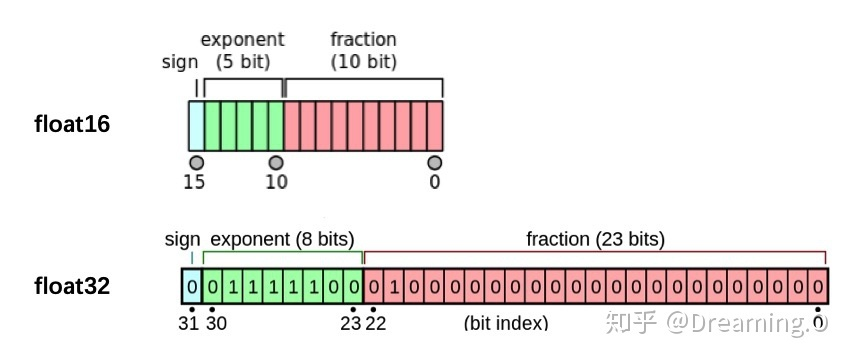

# 6.4 半精度训练

我们提到PyTorch时候，总会想到要用硬件设备GPU的支持。而GPU的性能主要分为两部分：算力和显存，前者决定了显卡计算的速度，后者则决定了显卡可以同时放入多少数据用于计算。在可以使用的显存数量一定的情况下，每次训练能够加载的数据更多（也就是batch size更大），则也可以提高训练效率。另外，有时候数据本身也比较大（比如3D图像、视频等），显存较小的情况下可能甚至batch size为1的情况都无法实现。因此，合理使用显存也就显得十分重要。

我们观察PyTorch默认的浮点数存储方式用的是`torch.float32`，小数点后位数更多固然能保证数据的精确性，但绝大多数场景其实并不需要这么精确，只保留一半的信息也不会影响结果，也就是使用`torch.float16`格式。由于数位减了一半，因此被称为“半精度”，具体如下图：



显然半精度能够减少显存占用，使得显卡可以同时加载更多数据进行计算。本节会介绍如何在PyTorch中设置使用半精度计算。

经过本节的学习，你将收获：

- 如何在PyTorch中设置半精度训练
- 使用半精度训练的注意事项


## 6.4.1 半精度训练的设置

在PyTorch中使用autocast配置半精度训练，同时需要在下面三处加以设置：

- **import autocast**

```python
from torch.cuda.amp import autocast
```

- **模型设置**

在模型定义中，使用python的装饰器方法，用autocast装饰模型中的forward函数。关于装饰器的使用，可以参考[这里](https://www.cnblogs.com/jfdwd/p/11253925.html)：

```python
@autocast()   
def forward(self, x):
    ...
    return x
```

- **训练过程**

在训练过程中，只需在将数据输入模型及其之后的部分放入“with autocast():“即可：

```python
 for x in train_loader:
	x = x.cuda()
	with autocast():
            output = model(x)
        ...
```

**注意：**

半精度训练主要适用于数据本身的size比较大（比如说3D图像、视频等）。当数据本身的size并不大时（比如手写数字MNIST数据集的图片尺寸只有28*28），使用半精度训练则可能不会带来显著的提升。

