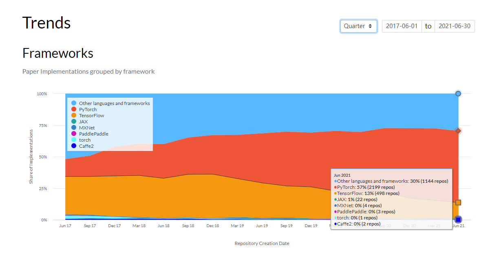

## PyTorch简介

### 1.1.1 PyTorch的介绍

PyTorch是由Facebook人工智能研究小组开发的一种基于Lua编写的Torch库的Python实现的深度学习库，目前被广泛应用于学术界和工业界，而随着Caffe2项目并入Pytorch， Pytorch开始影响到TensorFlow在深度学习应用框架领域的地位。总的来说，PyTorch是当前难得的简洁优雅且高效快速的框架。因此本课程我们选择了PyTorch来进行开源学习。

### 1.1.2 PyTorch的发展

**“All in Pytorch”**，对于PyTorch的发展我们只能用一句话来概况了，PyTorch自从提出就获得巨大的关注以及用户数量的剧增，而最直观的莫过于下面统计图所表现的的简明直了。

下图来自[Paper with code](https://paperswithcode.com/trends)网站，**颜色面积代表使用该框架的论文公开代码库的数量**，我们可以发现截至2021年6月，PyTorch的代码实现已经是TensorFlow实现的4倍，我们也可以看红色部分的PyTorch正在取代他的老大哥称霸学术圈，PyTorch会借助ONNX所带来的落地能力在工业界逐渐走向主导地位。

总的来说，我们必须承认到现在为止PyTorch还是有不如别的框架的地方，但是框架只是给我们提供了轮子，让我们造汽车更加方便，最重要的还是我们个人的科学素养的提升。

### 1.1.3 PyTorch的优势

##### PyTorch有着下面的优势：

+ **更加简洁**，相比于其他的框架，PyTorch的框架更加简洁，易于理解。PyTorch的设计追求最少的封装，避免重复造轮子。
+ **上手快**，掌握numpy和基本的深度学习知识就可以上手。
+ PyTorch有着**良好的文档和社区支持**，作者亲自维护的论坛供用户交流和求教问题。Facebook 人工智能研究院对PyTorch提供了强力支持，作为当今排名前三的深度学习研究机构，FAIR的支持足以确保PyTorch获得持续的开发更新。
+ **项目开源**，在Github上有越来越多的开源代码是使用PyTorch进行开发。
+ 可以**更好的调试代码**，PyTorch可以让我们逐行执行我们的脚本。这就像调试NumPy一样 – 我们可以轻松访问代码中的所有对象，并且可以使用打印语句（或其他标准的Python调试）来查看方法失败的位置。
+ 越来越完善的扩展库，活力旺盛，正处在**当打之年**。

